# PySpark 的大数据基础

> 原文：<https://medium.com/mlearning-ai/big-data-fundamentals-with-pyspark-939112ef2281?source=collection_archive---------1----------------------->

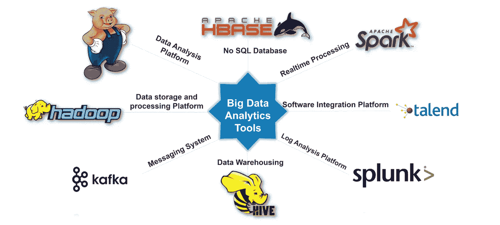

[https://www.edureka.co/blog/big-data-analytics/](https://www.edureka.co/blog/big-data-analytics/)

> 本文介绍了激动人心的大数据世界，以及处理大数据的各种概念和不同框架。您将理解为什么 Apache Spark 被认为是大数据的最佳框架

# **大数据概念和术语**

大数据到底是什么？这个术语指的是对传统数据处理软件来说过于复杂的数据集的研究和应用。

大数据有三个 v 用来描述其特征:**量**指数据的大小，**种类**指数据的不同来源和格式，**速度**指数据生成和可供处理的速度

*现在，我们来看看大数据的一些概念和术语*

> **集群计算**是将多台机器的资源汇集起来完成任务
> 
> **并行计算**是一种同时进行许多计算的计算类型
> 
> **分布式计算**涉及并行运行作业的节点或联网计算机
> 
> **批处理**是指将数据分成更小的块，并在单独的机器上运行每一块
> 
> **实时处理**要求信息被立即处理并准备就绪

# 大数据处理系统

**Hadoop/MapReduce :** 一个用于批量数据的开源可扩展框架。

Apache Spark: 它也是开源的，适合批处理和实时数据处理。这是一个用于大数据处理的快速通用框架。Apache Spark 提供 Scala、Java、Python 和 r 的高级 API。它在内存中运行大多数计算，从而为交互式数据挖掘等应用程序提供更好的性能。

它是 Hadoop MapReduce 的强大替代品，具有丰富的功能，如机器学习、实时流处理和图形计算。生态系统的中心是 Spark 核心，它包含 Spark 的基本功能。Spark 的其余库都是基于它构建的。

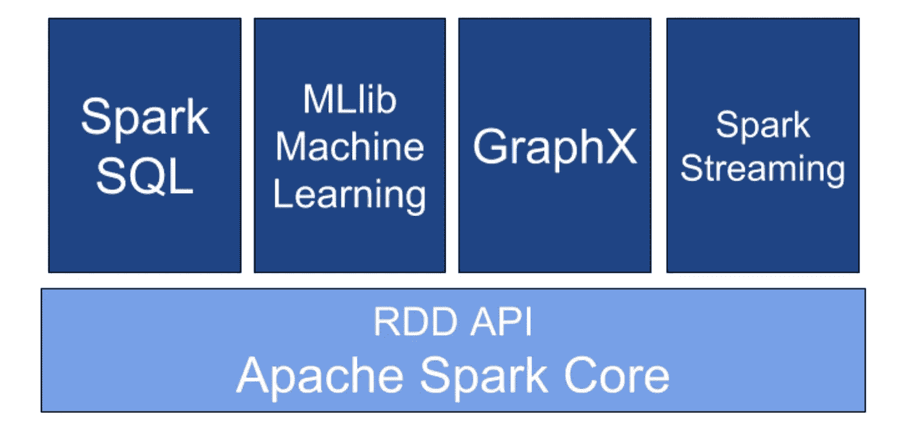

> 停车以两种模式运行。第一种是本地模式，您可以在一台机器上运行 Spark，比如您的笔记本电脑。这对于测试、调试和演示非常方便。第二种是集群模式，Spark 在集群上运行。集群模式主要用于生产。

# **Spark 的 Python 版本:PySpark**

Apache Spark 最初是用 Scala 编程语言编写的。为了用 Spark 支持 Python，PySpark 的计算能力与 Scala 相似。PySpark 中的 API 类似于 Pandas & Scikit-learn python 包。

Spark 附带了一个交互式 python shell，其中已经安装了 PySpark。在集群上运行作业之前，这对于快速交互式原型设计特别有帮助。与大多数其他 shell 不同，Spark shell 允许您与分布在许多机器上的磁盘或内存中的数据进行交互，Spark 负责自动分配这种处理。

Spark 提供了三种编程语言的外壳:Scala 的 spark-shell、Python 的 PySpark 和 R. PySpark 的 spark。与 Scala Shell 类似，Pyspark shell 已经得到了扩展，可以支持连接到集群。

在 PySpark Shell 中，SparkContext 表示 Spark 功能的入口点。PySpark 在 PySpark shell 中自动为您创建一个`SparkContext`(这样您就不必自己创建了)，并通过变量`sc`公开。您可以在 PySpark shell 中将 SparkContext 作为一个名为 sc 的变量来访问。就像你的车钥匙。没有钥匙你不能进入房子，同样，没有入口点，你不能运行任何 PySpark 作业。

现在，让我们来看看 SparkContext 的一些重要属性。

> **sc.version** 显示你当前运行的 spark 版本
> 
> **sc.pythonVer** 显示 Spark 目前使用的 Python 版本。
> 
> **sc.master** 显示集群的 URL 或以本地模式运行的“本地”字符串。

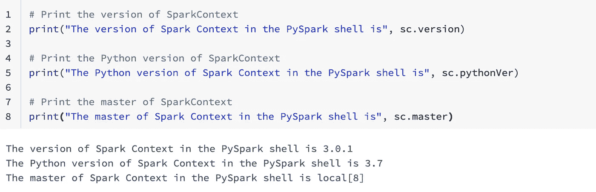

要展示 PySpark 的 shell 的强大功能，最简单的方法就是开始使用它。让我们以 PySpark shell 中包含从 1 到 100 的数字的简单列表为例。

这里要理解的最重要的事情是，我们没有创建任何 SparkContext 对象，因为 PySpark 自动创建名为`sc`的 SparkContext 对象，默认情况下在 PySpark shell 中。

**您可以使用 SparkContext 通过两种不同的方法将原始数据加载到 PySpark 中，我们将在后面讨论:**

1.  SparkContext 的并行化方法
2.  SparkContext 的 textFile 方法

# **在** Python 中使用 Lambda 函数

Python 支持匿名函数的创建。也就是说，函数在运行时不绑定到名称，而是使用一个名为 lambda 的结构。它与典型的函数概念(如映射和过滤函数)结合使用。和 def 一样，lambda 创建了一个函数，这个函数将在程序的后面被调用。让我们看看它的一些用途:

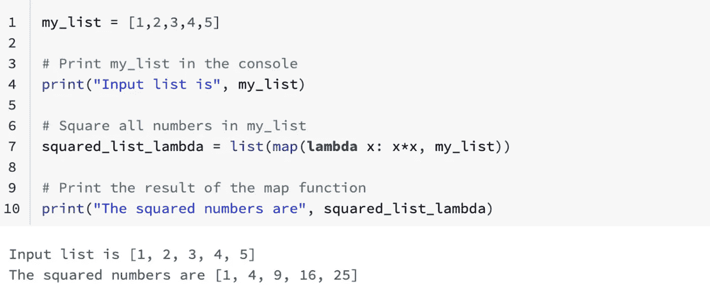

***在 python 中使用 Lambda 函数— map():*** *使用列表中的所有项目调用 map 函数，并返回一个新列表，其中包含该函数为每个项目返回的项目。*

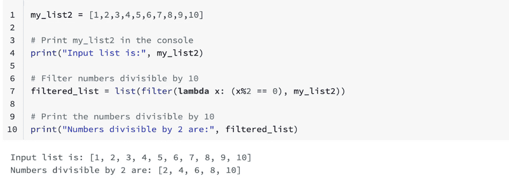

***使用 python 中的 Lambda 函数-filter():****对列表中的所有项目调用该函数，并返回一个新列表，其中包含该函数计算结果为真的项目。*

# PySpark RDD 简介

它只是一个分布在集群中的数据集合。RDD 是 PySpark 的基础和中枢数据类型。

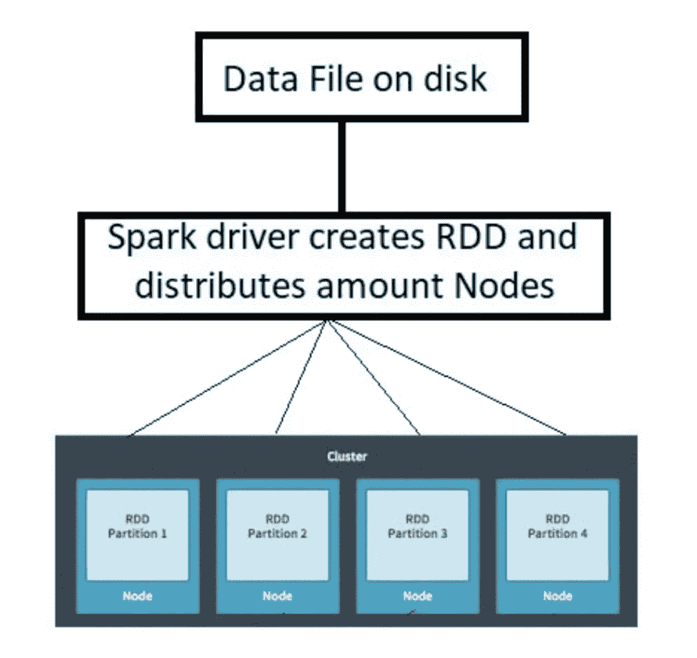

现在，让我们看看 RDD 的不同特征。RDD 这个名字抓住了 3 个重要特征:

> **弹性**，指承受故障并重新计算缺失或损坏的分区的能力。
> 
> **分布式**，即为了高效计算，将作业跨越集群中的多个节点。
> 
> **数据集**，是已分区数据的集合，例如数组、表、元组或其他对象。

有三种不同的方法来创建 rdd，其中您已经看到了两种方法，这两种方法在前面已经提到过。

**SparkContext 的并行化方法:**

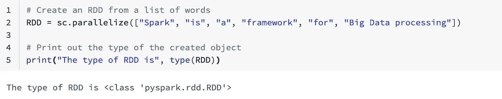

**来自外部数据集(** SparkContext 的 textFile 方法 **):**

存储在 HDFS 的文件或亚马逊 S3 桶中的对象，或者本地存储的文本文件中的行，并将其传递给 SparkContext 的 text file 方法。

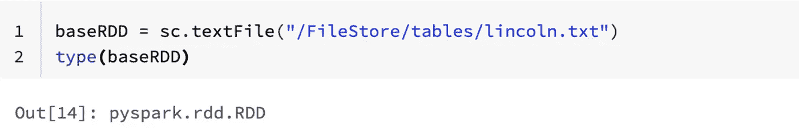

**来自现有 rdd**(突变 rdd)**:**

这种转变是从已经存在的 RDD 创造一个 RDD 的方式。

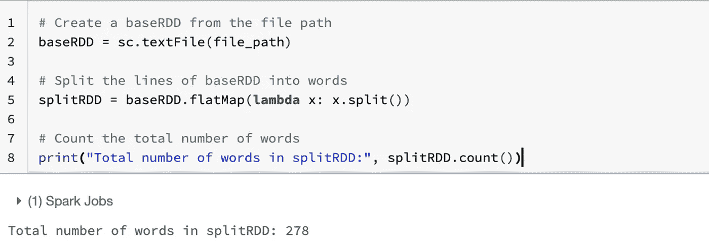

# PySpark 中的分区

数据分区是 Spark 中的一个重要概念，理解 Spark 如何处理分区可以控制并行性。Spark 中的分区是大数据集的划分，每个部分都存储在集群中的多个位置。默认情况下，Spark 在创建 RDD 时会根据可用资源、外部数据集等因素对数据进行分区，但是，可以通过传递第二个名为 minPartitions 的参数来控制这种行为，该参数定义了为 RDD 创建的最小分区数。

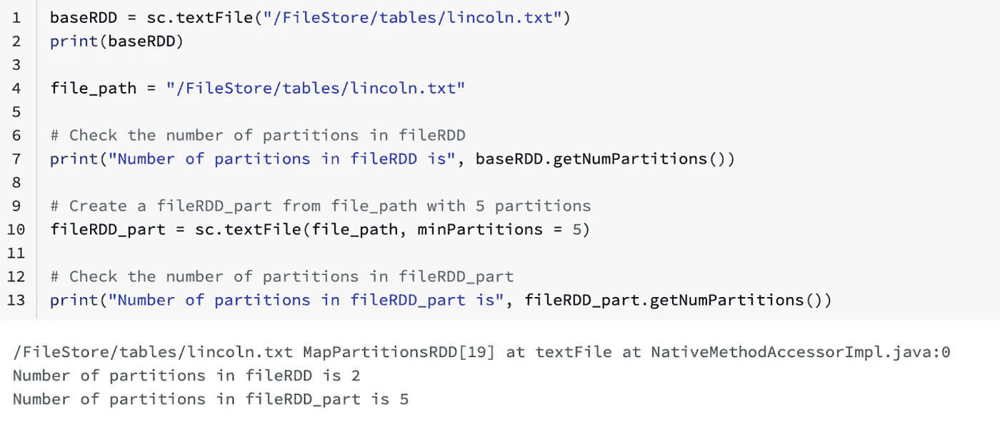

# **py spark rdd 简介**

PySpark 中有各种支持 rdd 的操作。PySpark 中的 rdd 支持两种不同类型的操作——转换和操作。

> 转换是对返回新 RDD 的 rdd 的操作。
> 
> 动作是对 RDD 进行某种计算的操作。

**惰性评估:**帮助 rdd 容错和优化资源使用的最重要功能。Spark 从您在 RDD 上执行的所有操作创建一个图形，并且只有当在 RDD 上执行某个操作时，图形才会开始执行。

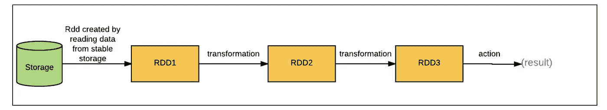

## **rdd 上的转换:**

****地图()*** *接受一个函数并将其应用于 RDD 的每个元素。**

*****filter()****接受一个函数并返回一个 RDD，该只包含通过条件的元素。***

******flat map()****类似于映射转换，只是它为源 RDD 中的每个元素返回多个值。****

**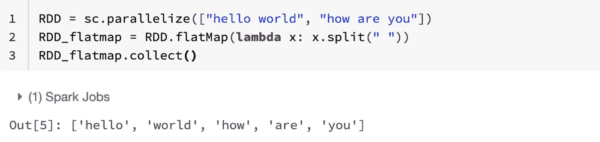**

******union()****返回一个 RDD 与另一个 RDD 的联合。****

****

## **RDDs 上的行动**:****

******collect()****动作从 RDD 返回完整的元素列表。****

****

******take()****动作从 RDD 中打印出 N 个元素。****

******count()****动作返回 RDD 中的行/元素总数****

**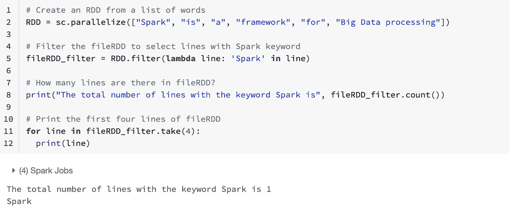**

******first()****动作返回 RDD* 中的第一个元素***

**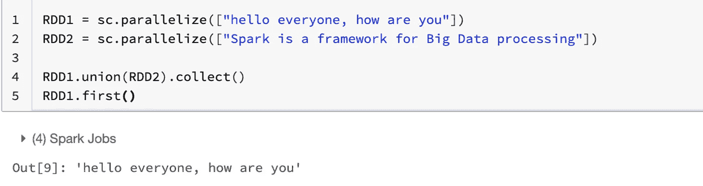**

# **PySpark 中对 rdd 的介绍**

**真实世界的数据集通常是键/值对。每一行都是映射到一个或多个值的键。为了处理这类数据集，PySpark 提供了一种特殊的数据结构，称为 pair RDDs。在对 rdd 中，键指的是标识符，而值指的是数据。**

****创建 rdd 对的两种最常见方式如下:****

> **创建对 rdd 的第一步是将数据转换成键/值形式。**
> 
> **接下来，我们使用 map 函数创建一个对 RDD，该函数返回带有键/值对的元组，键是名称，年龄是值。**

## **对 rdd 的转换:**

****reduceByKey 运行多个并行操作，对数据集中的每个键执行一个操作，返回由每个键和该键的缩减值组成的新 RDD。****

**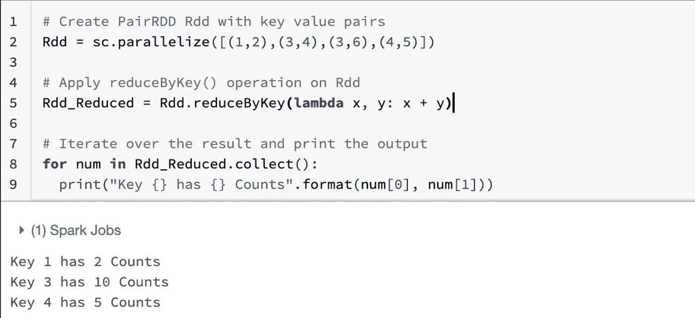**

*****sortByKey:****我们可以对 RDD 对进行排序，只要在 Key 中定义了一个排序，并返回一个按 key 升序或降序排序的 RDD。***

**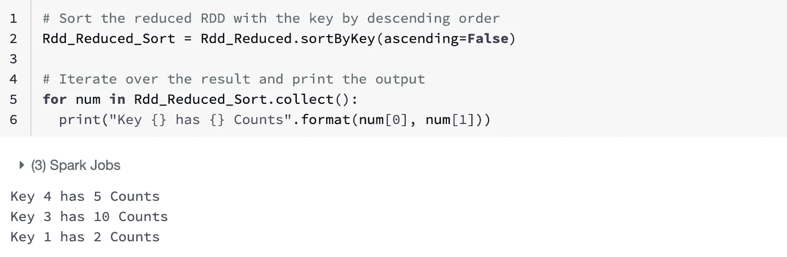**

*****group by key:****它将 RDD 对中具有相同关键字的所有值分组***

**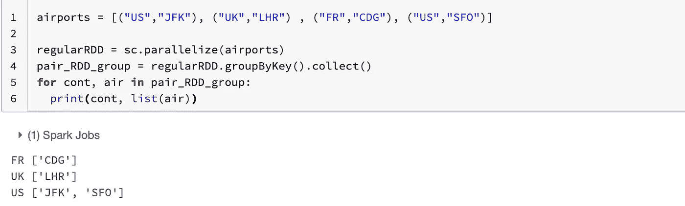**

*****join 转换:*** *应用 join 转换通过根据相同的键对元素进行分组，将两个对 rdd 合并在一起。***

**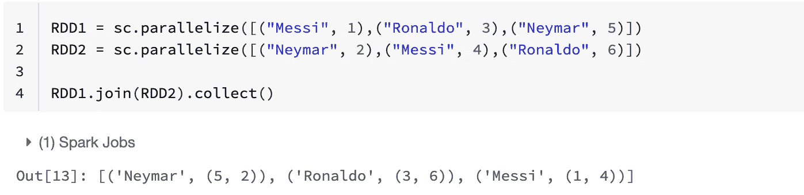**

## ****对 rdd 对的高级操作:****

**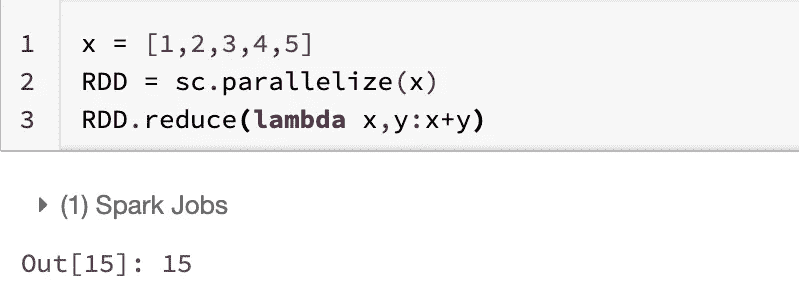**

*****Reduce()*** *对 RDD 的两个同类型元素进行运算，返回一个同类型的新元素。该函数应该是可交换的和可结合的，这样它就可以被正确地并行计算。***

## ***在许多情况下，不建议对 rdd 运行收集操作，因为数据非常庞大。在这些情况下，通常将数据写出到分布式存储系统。***

**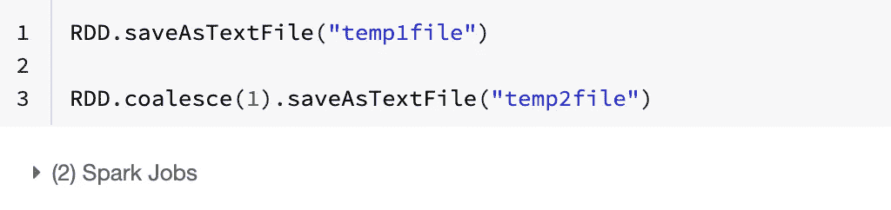**

*****【saveAsTextFile()****默认情况下将 RDD 与每个分区保存为一个目录下的单独文件。但是，您可以对其进行更改，以返回一个新的 RDD，使用 coalesce 方法将其缩减为一个分区。***

**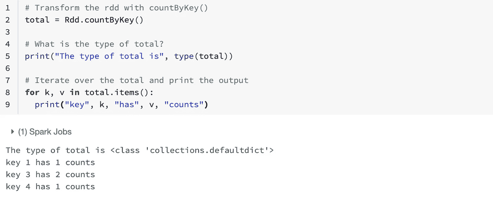**

*****【countByKey()****仅在类型为(Key，Value)的 rdd 上可用。通过 countByKey 操作，我们可以计算每个键的元素数量。需要注意的一点是，countByKey 应该只用于大小足够小以适合内存的数据集。***

**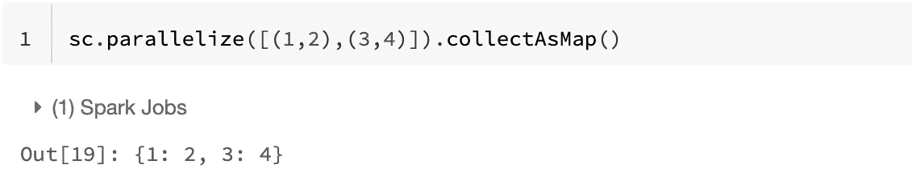**

*****【collectAsMap()****将 RDD 中的键值对作为字典返回给。与 SparkContext 的并行化方法一样，collectAsMap 将 RDD 中的键值对生成为一个字典，可用于下游分析。与 countByKey 类似，只有当结果数据预计很小时，才应该使用此操作，因为所有数据都被加载到内存中。***

****因此，我们已经用 PySpark 概述了大数据基础知识，并在此过程中学习了一些用于 RDD 变换和操作的有用语法。还有一篇文章介绍了 SQL、数据帧和使用 MLib 的机器学习。要了解它，可以点击这个** [**链接**](https://datasciencelogs.medium.com/pyspark-sql-and-dataframes-4c821615eafe) **。****

**保持联系，享受阅读！**