# 大数据回归—完整的管道—第 1/2 部分

> 原文：<https://medium.com/mlearning-ai/big-data-regression-complete-pipeline-part-1-2-b54c9aa27e80?source=collection_archive---------3----------------------->


# TL；速度三角形定位法(dead reckoning)

这篇由两部分组成的文章全面介绍了一个真实的回归大数据问题，包括代码和详细的分析。第 1 部分(本文)主要关注 EDA 和浅层学习建模，而第 2 部分主要关注深度学习建模。

# **议程**

1.  问题和数据集描述
2.  探索性数据分析
3.  用浅层技术建模

# 1.问题和数据集描述

为了尊重客户隐私，将原始问题一般化。500 个不同的传感器以 1Hz 的速率(每秒)对给定场景进行采样，并引用 2 个数字标签(想象它们是产量、质量等。).所要求的结果是基于感觉数据预测这两个标签。

**数据集描述**:

*   *var0* ➔时间戳
*   *var1* … *var501* ➔感官样本(用缺失值估算)
*   *结果 502* ，*结果 502* ➔标签(待定)
*   大约 300 万行，从 2021 年 9 月 1 日到 2021 年 10 月 4 日(大约 1 个月)

数据存储在一个巨大的(~7GB) CSV 文件中，并应用 [Dask](https://docs.dask.org) 以高效的方式加载数据:

```
import dask.dataframe as dddata_df = dd.read_csv(path.join(base_path, 'raw_data.csv'))
data_df = data_df.drop('Unnamed: 0', axis=1)display(data_df.head())
```

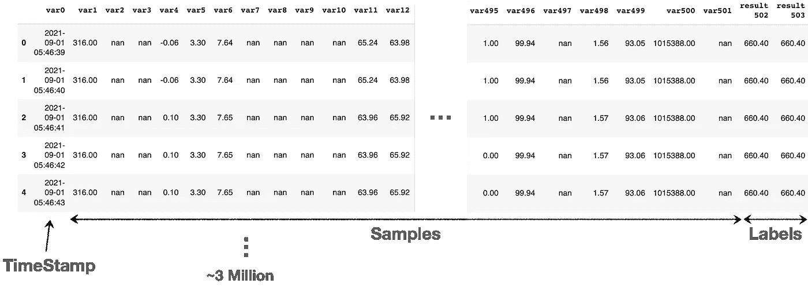

Dataset overview — ~3 million rows, each comprises 1 timestamp, 500 samples and 2 labels

注意，用 [Pandas](https://pandas.pydata.org) 读取和操作数据在大多数机器上是不可能的，因为数据集不适合内存。

以下是本部分提供的以下代码所需的所有初步导入:

```
!pip install sweetviz dask[dataframe] dask-ml dask_xgboost lazypredict==0.2.9import pickle
import numpy as np
import pandas as pd
from os import path
import seaborn as sns
import sweetviz as sv
from glob import glob
import dask.dataframe as dd
import matplotlib.pyplot as plt
from sklearn.utils import shuffle
from dask.distributed import Client
from sklearn.metrics import r2_score
from sklearn.pipeline import Pipeline
from dask.diagnostics import ProgressBar
from dask_ml.xgboost import XGBRegressor
from dask_ml.decomposition import IncrementalPCA
from dask_ml.preprocessing import StandardScaler
from lazypredict.Supervised import LazyRegressor
from sklearn.model_selection import train_test_split
from dask_ml.model_selection import train_test_split as dd_train_test_split
```

# 2.探索性数据分析

## 2.1.数据类型

通过应用 dask 的 *describe* 方法探索每个列数据类型:

```
display(data_df.describe())
```

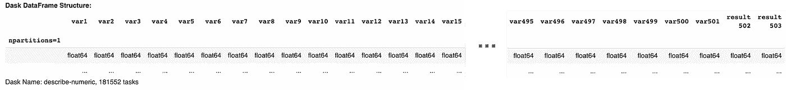

EDA — Data-type check

可以观察到，所有的列都是“float64”类型。

## 2.2.样品数量

通过计算 Dask 的数据帧形状，探索样本量:

```
with ProgressBar():
    print("Data contains %d samples" % data_df.shape[0].compute())
```

运行上面的代码返回了 2923189 个样本的报告，这实际上与 1 个月的 1Hz 速率采样(~ 31x24x60x60)相匹配。

## 2.3.标签检查

绘制两个标签，在此称为'*结果 502* 和'*结果 503* ':

```
results_list = ['var0', "result 502", "result 503"]with ProgressBar():
   results_df = data_df[results_list].compute().set_index('var0')fig, axes = plt.subplots(2, 1, figsize=(20,12))
results2_df = results_df.iloc[:int(1e5),:]
results_df.plot(title='Labels (raw) - full', grid=True, ax=axes[0])
results2_df.plot(title='Labels (raw) - zoom', grid=True, ax=axes[1])
plt.show()
```

对数据运行上面的代码，最终会得到下图:

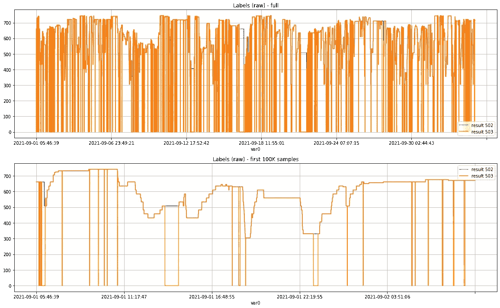

EDA — Labels inspection, zoom-out (top) and zoom-in (bottom, first 100K samples)

可以观察到，这两个标签相关，而“*结果 503* ”似乎以不连续的方式起作用，即周期性地下降到零。该观察结果表明，根据➔的“结果 503 ”状态，是否可以将数据(样本)分为两组，这可能值得检查。参见第 2.6 节。

## 2.4.样品检验

检查缺失值的数量(无、NaN、NaT):

```
missing_values = data_df.isnull().sum()
percent_missing = ((missing_values / data_df.index.size) * 100)with ProgressBar():
   percent_missing_s = percent_missing.compute()print('Missing Values mean: %.2f%%' % percent_missing_s.mean())title_str = 'Missing Values [%]'
percent_missing_s.plot(title=title_str, grid=True, figsize=(20,5))
```

对数据运行上面的代码，结果如下图所示:

*缺失值均值:15.71%*

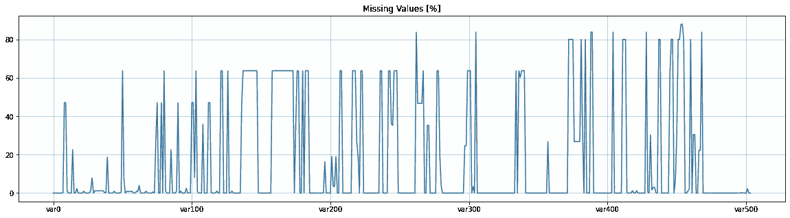

EDA — Missing values among the samples, in percentage [%]

下面是几个代表性样本(代码+数字)的“放大”，以便更好地理解缺失值行为:

```
with ProgressBar():
   few_features_list = ['var100', 'var200', 'var300', 'var400', 'var500']
   few_features_df = data_df[['var0'] + few_features_list]
   few_features_df = few_features_df.compute().set_index('var0')fig, axes = plt.subplots(5, 1, figsize=(20,25))
for k, features in enumerate(few_features_df.iteritems()):
   title_str = '%s (raw)' % features[0]
   features[1].plot(title=title_str, grid=True, ax=axes[k])
plt.show()
```

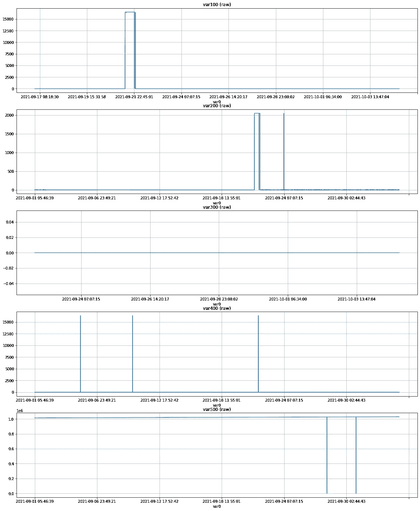

EDA — Few representative samples, for exploring the missing-values behavior

可以观察到，缺失值代表相应信号中的大液滴段，这意味着应考虑零填充策略。原因是“缺失数据”可以被视为“关闭时间”,因此零填充似乎是一个合适的选择。

注意，有时采用不同的策略是有意义的，比如用 previous、mean、median 等填充。在某些情况下，删除缺少值的要素可能是有意义的。在应用这种策略时，下面的代码可能会有用(删除丢失值超过 50%的列):

```
columns_to_drop = percent_missing_s[percent_missing_s >= 50].indexdata_cleaned_df = data_df.drop(list(columns_to_drop), axis=1)print('Columns number reduced from %d to %d after clean-up' % \
      (len(data_df.columns), len(data_cleaned_df.columns)))
```

## 2.5.相关分析

[皮尔逊相关](https://en.wikipedia.org/wiki/Pearson_correlation_coefficient)(“r”)系数根据协方差衡量两个连续变量之间的统计关系(又名关联)。它的范围在-1 和+1 之间，量化了两个变量之间线性关联的方向和强度。
[伊文思(1996)](https://doi.org/10.2466%2Fpms.1996.82.3.988) 建议如下，为绝对值:

*   0.0 <= r < 0.2 ➔ “very weak”
*   0.2 <= r < 0.4 ➔ “weak”
*   0.4 <= r < 0.6 ➔ “moderate”
*   0.6 <= r < 0.8 ➔ “strong”
*   0.8 <= r < 1.0 ➔ “very strong”

Following is the **相关矩阵**(代码+数字)，由 Dask 的 *corr* 方法生成，用 matplotlib 的 *matshow* 方法绘制:

```
with ProgressBar():
   corr_pearson_df = data_df.corr(method='pearson').compute()matfig = plt.figure(figsize=(10,10))
plt.matshow(corr_pearson_df.corr(), fignum=matfig.number)
plt.show()
```

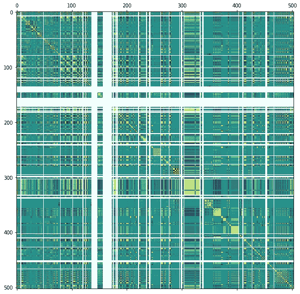

EDA — Correlation Matrix, a yellow shade implies on a relatively high correlation

可以观察到，在相关矩阵中几乎没有黄色斑点。这意味着样本之间的相互关联，以及将它们组合成联合特征和/或考虑降维技术(例如 PCA、t-SNE 等)的可能性。)关于利用样本➔之间的互信息，参见第 3.1 节。

接下来，有趣的是关注最后 2 行/列，它们代表了样本和标签之间的相关性:

```
CORRELATION_THR = 0.4correlation_dict = {}fig, axes = plt.subplots(2, 1, figsize=(20,10))for k, label_type in enumerate(('502', '503')): corr_s = corr_pearson_df.loc['result %s' % label_type]
   corr_s = correlation_s.drop(['result 502', 'result 503']) print('\nSignificant Feature for results %s (>%.1f):' % \
         (label_type, CORRELATION_THR))
   print(corr_s[corr_s > CORRELATION_THR].index.values) title_str = 'Result %s - Pearson Correlation' % label_type
   corr_s.plot(ax=axes[k], grid=True, title=title_str) correlation_dict[label_type] = corr_splt.show()
```

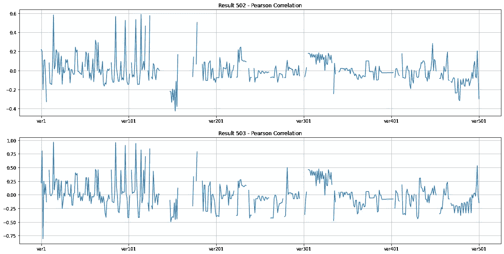

EDA — Correlation between the samples and the 2 labels

可以观察到，在几个样品中，两种标记都具有“中等”相关性并超过(0.4+)，这是令人鼓舞的。

以下代码计算并存储高度相关的要素:

```
fig, axes = plt.subplots(2, 1, figsize=(20,15))high_correlated_dict = {}for k, label_type in enumerate(('502', '503')): corr_s = correlation_dict[label_type]
   columns_to_keep = ['var0', 'result 502', 'result 503'] + \
                     corr_s[corr_s > CORRELATION_THR].index.tolist() with ProgressBar():
      df = data_df[columns_to_keep].compute().set_index('var0') print('\nHigh Correlated features %s:' % str(df.shape))      
   display(df.head()) title_str = 'High Correlated Features (result %s)' % label_type
   plot_df = corr_pearson_df.loc[df.columns]['result %s'%label_type]
   plot_df = plot_df.drop(['result 502', 'result 503'])
   plot_df.plot(kind='bar', title=title_str, grid=True, ax=axes[k])
   high_correlated_dict[label_type] = dfplt.show()
```

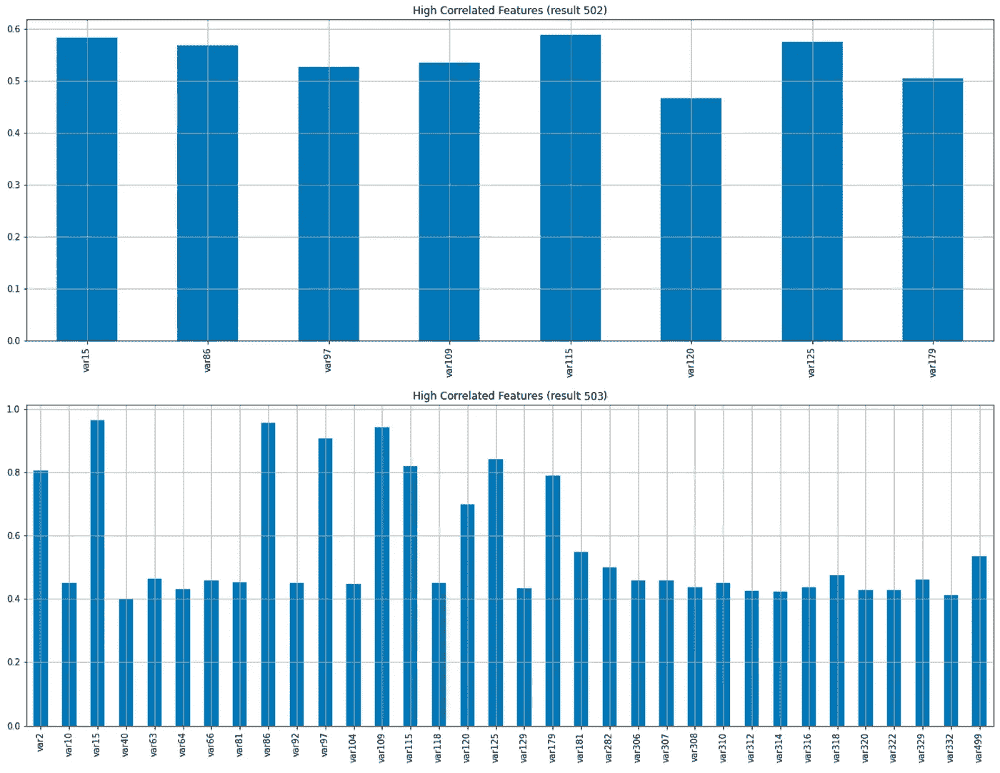

EDA — High Correlated Features

第一标签(“结果 502”)以 8 个高度相关的样本结束，而第二标签(“结果 503”)以 34 个高度相关的样本结束。

这是一个重要的收获，因为在建模阶段坚持使用这些高度相关的样本可能是有益的，主要是在浅层学习阶段，其中特征提取通常是以线性方式完成的，没有内在的组合。

## 2.6.活动与非活动

本节利用了前面几节的内容。根据'*结果 503* '状态，即“活动”或“非活动”,检查第 2.3 节中的 2 个标签表明数据(样本)或许可以分为 2 组。此外，第 2.5 节暗示只有一小部分样本与标签相关，因此关注这些特征可能是有益的(计算方面和存储方面，主要用于大数据分析)。

以下代码应用 [SweetViz](https://pypi.org/project/sweetviz/) 的 *compare_intra* 函数来实现该分析。该函数采用一个布尔序列作为参数之一，并采用一个显式的“name”元组来命名(true，false)结果数据集。请注意，在内部，这将创建 2 个单独的数据帧来表示每个结果组，即“活动”和“非活动”。

```
for k, label_type in enumerate(('502', '503')):

   html_log = 'report_%s.html' % label_type feature_config = sv.FeatureConfig(
      force_num=high_correlated_df.columns.tolist()
   ) report = sv.compare_intra(high_correlated_df,
                             high_correlated_df['result 503'] == 0,
                             ['Stop', 'Active'],
                             'result %s' % label_type,
                             feature_config,
                             pairwise_analysis='auto') report.show_html(html_log)
```

运行上面的代码最终得到 2 个 HTML 报告，每个标签一个(“502”和“503”)。每个报告都提供了对每个样本的深入了解，以及强大的成对分析视图(充当关联矩阵)。

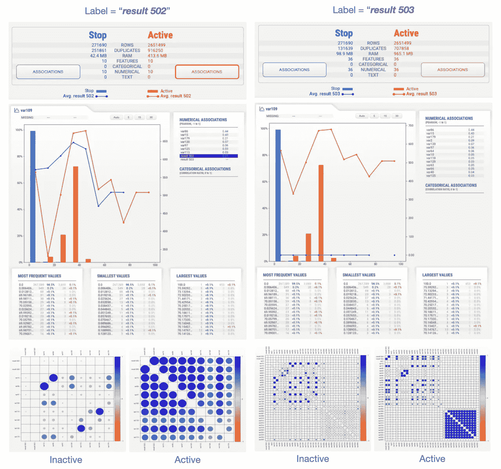

EDA — SweetViz compare_intra analysis for “Active” vs “InActive” (aka “Stop”) groups, per each label

上图来自两个 HTML 报告。左侧是指“*结果 502* 报告，右侧是指“*结果 503* 报告。顶行提供了两组之间的高级统计比较。中间部分关注一个相关性最高的样本(" *var109"* )，底部部分介绍每组的成对相关矩阵。请注意，SweetViz *compare_intra* 在处理大量特征时表现不佳，因此将其应用于选定的子集(例如最相关的子集)非常重要。

## 2.7.降维

因此，主成分分析(PCA)被用于开发最大方差，保留最少的成分。Dask 增量 PCA 用于处理内存受限条件下的大量数据。

```
lr = Pipeline(steps=[
     ('scale', StandardScaler()),
     ('pca', IncrementalPCA()),
])dropped_list = ['var0', 'result 502', 'result 503']
data_filt_df = data_df.drop(dropped_list, axis=1).fillna(0)X_arr = data_filt_df.to_dask_array(lengths=True).astype(float)lr_fitted = lr.fit(X_arr)pca = lr_fitted['pca']print('PCA explained variance (%d components):' % pca_components_num)print(pca.explained_variance_ratio_)
print(pca.singular_values_)explained_variance = 0.9cumsum_var = pca.explained_variance_ratio_.cumsum() > explained_varianceidx = cumsum_var.argmax()print('Number of components needed for having at least %.2f is equal to %d' % (explained_variance, idx))pd.Series(pca.explained_variance_ratio_.cumsum()).plot(title='PCA explained variance (n=%d)' % pca_components_num, grid=True, figsize=(20,5))
```

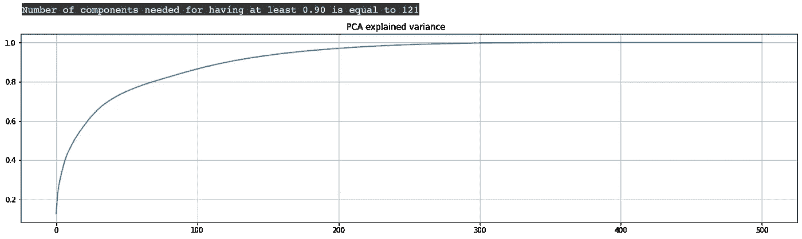

EDA - PCA Explained Variance

可以观察到，需要 121 个分量来解释 90%的方差。目前，我们正在对所有数据进行主成分分析，用于 EDA 目的。稍后，可以如下应用带建模的 PCA:

*   仅在训练集上安装 PCA➔*PCA . fit(x _ train)*
*   将映射(转换)应用于训练集和测试集➔x _ train =*PCA . transform(x _ train)，x _ test = PCA . transform(x _ test)*

# 3.用浅层技术建模

## 3.1.特征工程

第 2 节提供的 EDA 将**样品** (' *var1* ，…，' *var501* ')视为**特征**。在这一点上，当处理特征工程时，可以考虑以下方案(可以应用一个或多个):

1.  将特征定义为样本，即 1:1 映射
2.  将特征定义为降维后的样本，例如通过应用 PCA、t-SNE、相关阈值等。
3.  通过处理样本来定义特征，线性或非线性，也称为基于核的映射。
4.  考虑添加将样本组合在一起的特征，获得标签样本之间的交互信息

通常建议从最轻的方案开始，如果有必要的话，从武器库中较重的工具开始。因此，我们将从上述列表中的方案 1+2 开始，即将特征定义为高相关性样本。

## 3.2.懒惰预测

[Lazy Predict](https://lazypredict.readthedocs.io/en/latest) 有助于用很少的代码构建许多基本模型，并有助于了解哪些模型在没有任何参数调整的情况下工作得更好。不幸的是，Lazy Predict 在大数据上表现不佳(内存消耗太高)，但假设数据在一段时间内大致类似地分布，将它应用于一小部分数据可能是有教育意义的。这里的目的基本上是提供特征如何与标注“交互”的粗略感觉，这可能暗示如何进行进一步的分析。因此，允许在结构化期间混洗数据，这通常不太适合时间序列分析。当时间序列特征被认为不太重要时，这可能表现得很好。在其他情况下，可以跳过混洗数据。

```
for label_type in ('502', '503'): # only small portion, due to memory limitations:
   df = high_correlated_dict[label_type].iloc[:int(1e4),:] # Fill missing values with zeros:
   df = df.fillna(0) # Structure the data (+shuffle):
   X, y = shuffle(df.drop(['result 502', 'result 503'], axis=1),
                  df['result %s' % label_type],
                  random_state=42) # Split data into train and test sets (80:20 ratio):
   cv_tuple = train_test_split(X, y, test_size=.2, random_state=0)
   X_train, X_test, y_train, y_test = cv_tuple # Create an instance of the estimator, and fit it to the data:
   reg = LazyRegressor(verbose=0,
                       ignore_warnings=False,
                       custom_metric=None,
                       predictions=True) lazy_models, lazy_predictions = reg.fit(X_train, 
                                           X_test,
                                           y_train,
                                           y_test) # Results analysis:
   print('Lazy Models (label = result %s)' % label_type)
   display(lazy_models) if not lazy_models.empty: fig, axs = plt.subplots(1, 1, figsize=(20, 5), sharex=True)
      sns.set_theme(style="whitegrid")
      sns.barplot(x=lazy_models.index,
                  y="R-Squared", 
                  data=lazy_models,
                 ax=axs)
      axs.set(ylim=(0, 1))
      axs.set(title='Lazy Models (label = result %s)' % label_type)
      plt.xticks(rotation=90)
      plt.show()
```

运行上述代码最终会得到以下结果:

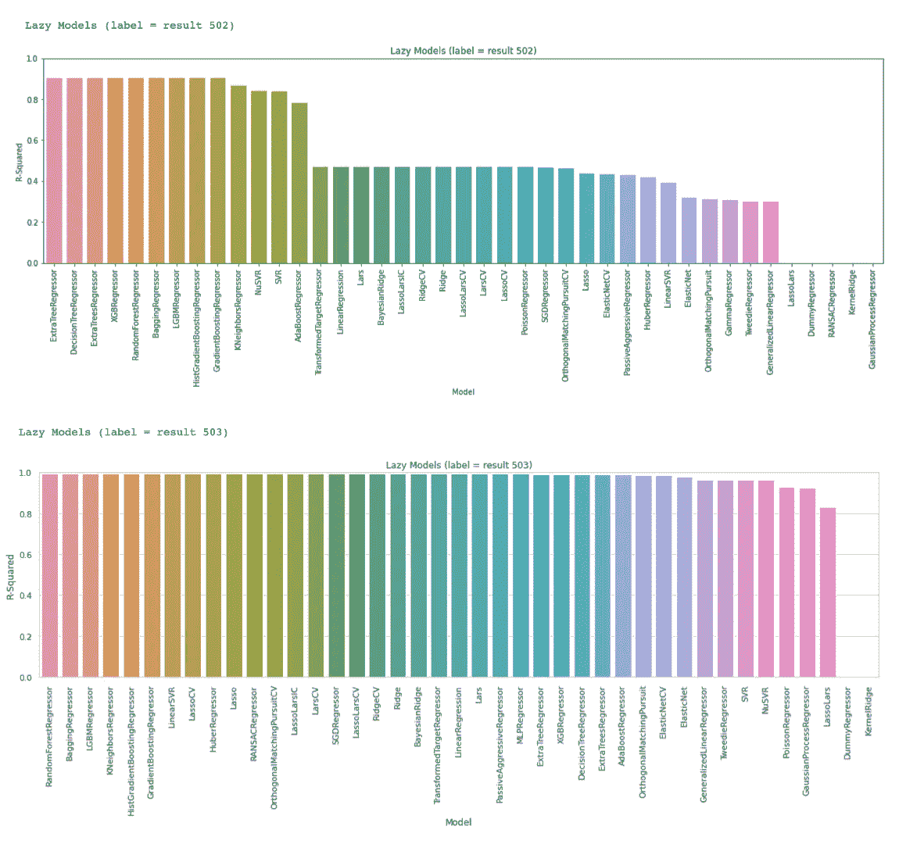

Modeling — Lazy Predict, over small portion of the big-data (+shuffling)

可以观察到，一些模型在高 R 平方精度方面表现良好，这是令人鼓舞的。

## 3.3.XGBoost 回归器

前一节(3.2)暗示了浅层学习方案可能对数据表现良好。这一节重点介绍了流行且强大的 XGBoost 回归模型。在此，不应用洗牌，使用 Dask 的*客户端*、 *train_test_split* 和 *XGBRegressor* 机器处理全部数据。正在生成两个模型，每个标签一个。

```
client = Client(processes=True, threads_per_worker=1)
#client = Client('scheduler-address:8786')for label_type in ('502', '503'): # Structure the data (high-correlated features only):
   df = high_correlated_dict[label_type]
   high_correlated_dd = dd.from_pandas(df , npartitions=3) X = high_correlated_dd.drop(['result 502', 'result 503'], axis=1)
   y = high_correlated_dd['result %s' % label_type] # Split data into train and test sets (80:20 ratio):
   cv_tpl = dd_train_test_split(X, y, test_size=.2, random_state=0)
   X_train, X_test, y_train, y_test = cv_tpl # Fit the model
   est = XGBRegressor()
   est.fit(X_train, y_train) # Results analysis:
   test_df = pd.DataFrame(y_test.compute())
   test_df['predicted'] = est.predict(X_test).compute() accuracy_r2 = r2_score(test_df['result %s' % label_type],
                          test_df['predicted']) print('accuracy=%.2f' % accuracy_r2) feature_import_df = pd.DataFrame(index=X_test.columns,
                                    data=est.feature_importances_) title_str = 'Result %s - Features Import. (XGboost)' % label_type
   feature_import_df.plot(title=title_str, 
                          kind='bar',
                          legend=None,
                          figsize=(20,5)) fig, axes = plt.subplots(2, 1, figsize=(20,12))
   title_str = 'Result %s - Act. vs. Predicted - full' % label_type
   test_df.plot(title=, grid=True, ax=axes[0])
   title_str = 'Result %s - Act. vs. Predicted - first 10K samples'    
   test_df_zoom = test_df.iloc[:int(1e4),:]
   test_df_zoom.plot(title=title_str, grid=True, ax=axes[1])
   plt.show()
```

运行上述代码最终会得到以下结果:

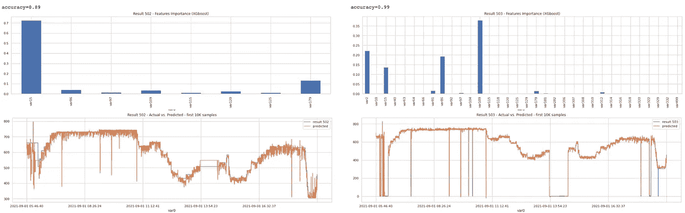

Modeling — XGBoost Regressor

可以观察到，建模结束得相当好，因为'*结果 502* '和'*结果 503* '模型分别引入了 0.89 和 0.99 的 R2 平方精度。顶部的特征重要性条形图也有意义，因为重要的特征与高度相关的样本相匹配，这些样本在第 2.5 节中检索。

# 摘要

一个真正的大数据回归问题被介绍，伴随着代码和定性分析。第一部分涉及以有效的方式加载数据。接下来的部分集中在 EDA 的各个方面。最后，第三部分介绍了建模细节，包括特性工程考虑，最终在 R2 平方精度方面取得了令人满意的结果。

## 下一步是什么？

1.  探索其他降维技术，或者替代当前的高相关性阈值方案，或者在当前的高相关性阈值方案之上
2.  探索其他浅层学习模型，如轻型 GBM 等。
3.  深度学习技术的转换(下一部分文章)，例如 LSTM/RNN，自动编码器，变压器等。

## 最后一个音符

在处理大数据时，pickle 是您的好朋友……通常建议将中间(和最终)对象存储在指定的 Pickle 文件中，只在没有它们的情况下重复繁重的计算。

[](/mlearning-ai/mlearning-ai-submission-suggestions-b51e2b130bfb) [## Mlearning.ai 提交建议

### 如何成为 Mlearning.ai 上的作家

medium.com](/mlearning-ai/mlearning-ai-submission-suggestions-b51e2b130bfb)