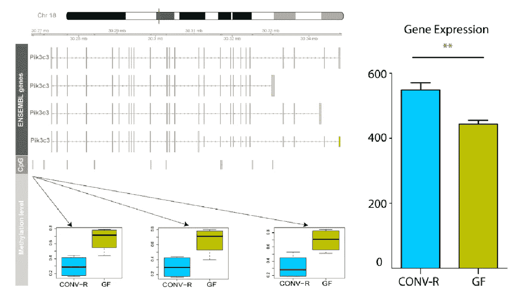

# 生物信息学家？统计员？还是数据科学家？他们需要具备哪些技能？

> 原文：<https://medium.com/mlearning-ai/bioinformatician-statistician-or-data-scientist-what-are-the-skill-sets-they-need-to-have-2627e1db61c8?source=collection_archive---------7----------------------->

Differential methylation/gene expression in Pik3c3 (Wei-Hung Pan et.al 2018 )

我经常接到猎头的电话，询问我的工作经验。曾经有一段非常可笑的对话。

招聘人员: *“你能告诉我你在生物统计学方面的经验吗？”*

**我:***我想大概 10 年左右到现在吧*