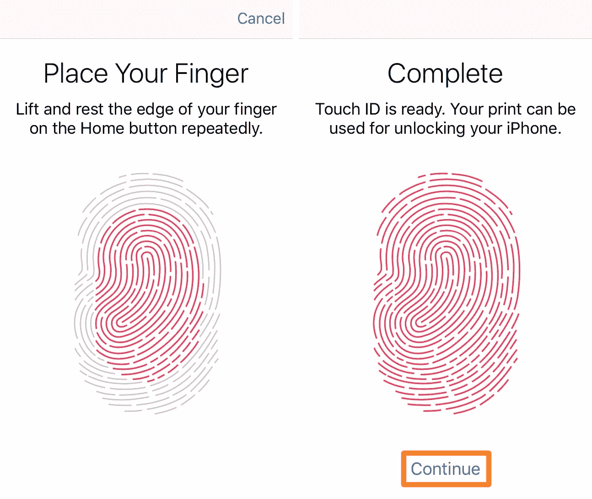
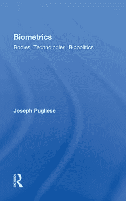
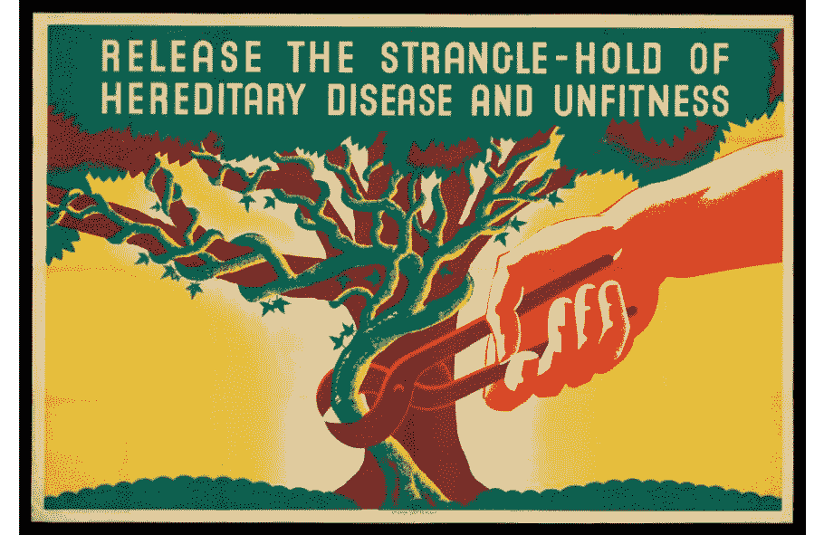

# 生物识别技术与人力资本理论

> 原文：<https://medium.com/mlearning-ai/biometric-technology-and-the-theory-of-human-capital-cc18754281e6?source=collection_archive---------5----------------------->

## 关于生物规范性的思考

*“如果像谷歌希望的那样安装了许多支持谷歌的机器人设备，谷歌可能很快就会知道你冰箱里的东西、你锻炼时的心率、你家前门外的天气、你家的用电模式”*

伯纳德·哈科特- *曝光:数字时代的欲望和叛逆*

> **认证和验证:定义问题**

在他的整个职业生涯中，福柯工作的一个中心关注点是调查、分析和提供一个关于*讲真话*作为主观化的*模式的系谱描述。*生物政治学的概念*暗示了许多不同的方式来理解真理政治及其历史构成的现代问题。重要的是要明白，真理不能再用大写的“T”来拼写；它现在已经成为计算、生产和制造的对象。真理已经成为一种消费品，只有在它能催化资本积累的时候，它才是有意义的。当现代提取真相的做法开始在人类实验对象身上运作时，它们采取了一种更可怕的形式。生物识别技术正在开始，或者说*已经开始在这个过程中扮演越来越重要的角色。当身体本身面临成为菜单上另一个项目的风险时，马克思主义关于人类劳动商品化的老问题现在达到了一个新的水平。雇主将很快能够选择、比较、通过风险评估和为盈利而购买。人体测量、医学-法律人工制品将允许把人转化为人类材料，一系列生物质量单位，每个单位都有市场价值。工人的平均预期寿命，即他们的健康状况，对企业的寿命有直接影响。因此，公司有权访问员工和经理的医疗档案，这将“符合他们的利益”。而这只是众多类似可能情景中的一种。**

将身体从权力中解放出来是生物政治批判的技巧。必须区分*分离*和*解开*。后者并不意味着最终解决的可能性。生物政治的解开带来的是权力关系的重新安排，没有废除权力这种乌托邦式的借口，甚至没有将权力应用于特定案例的有限意义。因为即使在有限的目标和特定的问题中，我们作为主体也总是被权力所左右。这是福柯式的社会互动微观物理学。但是这远非宿命论的观点，这样的框架意味着*抵抗*同样随处可见。生物识别技术为我们提供了一个完美的“机会”——因为没有更好的术语——来展示权力是如何在福柯范式的运作中被观察和暴露的。*技术*这个词本身就是需要被拆开包装的东西。这个术语将在我们的讨论中以分层的方式重复出现。

碰巧的是，我们在这里谈论的既有生物识别*技术*也有自我的*技术。按照通常的习惯，第一个意思非常清楚，而后者应该沿着术语“治理”的路线(不完全重合)来追溯；或者*政府性。**governementalite*指元动作的集合，其目的是指挥他人的动作。不难看出*技术是一种非常有效的技术*，正是在这种对技术的分层理解中，技术不仅是人类的人工制品，也是限制、煽动、操纵、威胁或以其他方式引导他人行为的工具。*

根据 Btihaj Ajana 的说法，单词*生物测定学*的字面意思是“生命的测量”。生物识别技术；

> "*指测量、分析和处理独特生物数据和行为特征的数字表示的技术，如指纹、视网膜、虹膜、声音和面部模式、体臭、手型等"* (Ajana，2013，3)

普列塞给出了如下定义:

> *“生物识别系统是扫描主体的生理、化学或行为特征以核实或认证其身份的技术”*(普列塞，2010，2)

两位作者(我们关于生物识别技术的生物政治的主要来源)特别强调了双重概念:验证和 T2 认证。看起来，关于生命的*测量、*或*捕捉*的全部论述，即“生物计量学”，将围绕这两个中心概念展开。

如果说认证服务于主体“接地气”的功能，可以这么说；确保数据与人匹配，然后验证指的是将一个人与另一个人绑定在一起的*生物规范性*的网格。这些是完全不同的关系，尽管它们通常很难区分。他们几乎总是一起工作。第一个意味着看似事实的问题，即“x”是否是她声称的她是谁，这是一个确定生物标记的非虚拟参考对象的问题，第二个确保关于主题的所有数据，它的内部虚拟一致性，保持一致。即她确实是这种性别、那种国籍、某种发色、身高等。生物规范是指实施和进行生物识别部署的整套政府做法和机构，以及使其规范化合法化的话语。

福柯拒绝将自我本质化，而是提供了一个对主体性的历史解构的解释。按照福柯的说法，我们是历史技术的产物；各种自我构造的技术。但它不是一个有限的，也不是一个有限可确定的以因果方式生产和复制自我的机构集。相反，它们的运作就像维特根斯坦式的语言游戏，不断地交叉和重叠，通过家族相似性被过度确定。

福柯认为经济治理是新自由主义的主体化、真理形成和自我构成的模式。市场同时作为验证、主观和政府的模式运行。有新自由主义特有的认证和验证形式，也有生物识别技术特有的认证和验证模式。后者很容易被视为对前者的强化。事实上，它们可能就像链条上的链环一样。因此，我们寻求的问题如下:

> *生物识别技术在新自由主义议程中是如何体现和发挥作用的？新自由主义议程是将人类生活商品化，并从人类主体的工作能力和促进经济增长的角度提取其生物“真相”？*

普列塞在生物识别技术方面的惊人且明显被低估的工作始于追溯生物识别技术的谱系，以打破关于其中立性、透明性或客观性的固有假设。以表明他们实际上被偏见和规范价值观所左右。Biopower 通过将身体(受试者的生物底层)插入数学算法，通过生物识别技术进行操作。这是生物规范的另一个显著特征；这种特殊的真理体系是通过生命的*算法化*来实现的，以这种方式，它与 Ajana 将生物统计学定义为“生命测量”直接相关。

> *“身体转化为可处理、可存储和可检索信息的方式有很多，其中最著名的是遗传指纹技术、DNA 分型和不断发展的生物信息学领域。在所有这些技术中，能够实现的是通过算法和计算方法获取、存储和分析生物信息的过程，由此产生新形式的知识产品，其中“身体作为信息”的概念是突出的”*(普列塞 2010 *，* 7)

> ***延伸新自由主义超殖民:人力资本理论***

经济人的概念对于理解新自由主义人力资本理论的福柯式分析至关重要。新自由主义劳动分析的一个决定性特征是，工人不再仅仅是生产函数中的一个变量，事实上，她甚至不再仅仅是一个消费者，在这一点上，劳动者已经成为一个有进取心的个人，同时也是一个生产者。“完全对象化”的最后一点，也就是把资本主义的标尺直接放在主体上，在某种程度上变成了控制的另一个极端:劳动力的完全主体化。我们现在关心的是那些为我们工作的人的主观体验。*经济人*标志着政府魅力的一个新对象，它现在关注的是*作为潜在资本的个人与自身的主观关系。*这标志着新自由主义治理进入了一个全新的领域，进入了以前未开发的领域，即未商品化的领域。生物识别技术在这个等式中处于什么位置？

让我们读一读福柯 1978-1979 年关于生物政治的演讲:

> *“人力资本是如何构成的？他们说，它是由先天因素和后天因素组成的。先说先天要素。有些我们可以称之为遗传的，有些则是天生的；当然，这些差异对于任何对生物学稍有了解的人来说都是不言而喻的。我不认为目前有任何关于人力资本遗传因素问题的研究，但很明显它们可以采取什么形式……”*(福柯 2008，227)

福柯在这里明确暗示了其他人正确定义的自由市场优生学的可能性*。回到之前讨论的例子，虽然设想我们的雇主可以在选择过程中访问我们的高度敏感的个人信息是令人不安的，但对我们的*遗传物质*应用类似的监控、审查和资本化过程确实令人恐惧。*

尽管如此，这些是我们通过同意生物识别技术的标准化，即生物标准化，所面临的前景。福柯继续说道:

> *“遗传学使得有可能为任何给定的个体确定他们在给定的年龄、在给定的生命周期或在生命的任何时刻以任何方式感染这种或那种疾病的概率。换句话说，将遗传学应用于人类群体的当前兴趣之一是使识别处于风险中的个体和个体在其一生中遭受的风险类型成为可能"* (Foucault 2008，227)

在这种情况下，风险的概念不是微不足道的。正是通过风险和稀缺的新自由主义概念装置，福柯做出了最后的调整，表明一个人的基因构成如何决定他在经济人居住的竞争环境中的社会地位。风险的概念在遗传学和市场分析之间起着中继的作用。生物学和经济治理之间的关系。这恰恰是生物识别技术被“插入”的地方，也许真的是这样。

> 当我们能够确定哪些个体处于危险中，以及处于危险中的个体联合起来产生一个具有使他或她成为危险携带者的特定特征的个体的风险是什么时，我们就能够很好地想象以下情况:良好的基因构成——也就是说，那些能够产生低风险或风险水平对他们自己、他们周围的人无害的个体， 或者社会——肯定会变得稀缺，只要它们稀缺，它们就完全可能进入经济循环或计算，也就是说，替代选择，这是完全正常的。 明确地说，这将意味着，鉴于我自己的基因构成，如果我希望有一个基因构成至少和我一样好，或者尽可能比我更好的孩子，那么我将不得不找一个基因构成也很好的人。如果你想要一个人力资本(简单地从先天和遗传因素的角度来理解)很高的孩子，你会发现你必须进行投资，也就是说，你必须工作足够多，有足够的收入，并有一定的社会地位，使你能够将这种未来人力资本的配偶或共同生产者，即自己拥有大量人力资本的人"(福柯 2008，228)

> ***反抗:用主体的解释学绕过市场***

尽管我们的生活变得越来越商品化，我们变得越来越有事业心，但是权力本身可以，而且通过福柯式的视角，权力必须为反抗提供多种可能性。一个人从哪里开始*去主观化*自我的过程？我们以前提到过，新自由主义逻辑倾向于渗透到以前被认为没有竞争、企业和商品化的领域。寻找不那么受市场机制支配的“剩余”空间将是一种方法。探索*异常*或非机构化区域，建立替代社区。尝试毒品、写作、隔离、艺术或其他非常规形式的实验和极限体验；释放身体隐藏的能力，如武术等。

但在更深层次上，我们必须理解生物技术公司已经并将利用的话语、修辞和各种形式的合法化，以使生物识别监控正常化。换句话说，我们必须尽我们最大的能力来识别我们这个时代的当代**。但是要特别强调的是:科学是如何让理性凌驾于精神之上的，理性本身是如何成为制度化压迫的一部分的？**

**答案就在福柯在法兰西学院的另一系列讲座中，题为*主题的诠释学。我们必须再次关注两个非常重要且非常不同的概念，如果不是在讲座中遇到的完全相反的概念的话:Gnothi seauton*[***【2】***](#_ftn2)*和*Epimeleia heautou*[***【3】***](#_ftn3)*。前者可能是当代知识论的直接代表，而后者可能为我们提供了一种破坏前者的方式，并为对抗生物规范性的对抗行为开辟了可能性。不幸的是，事情并没有那么简单。福柯似乎在说，对自我的*关怀*实际上可能持有*认识你自己*在实际实践中应该有的更真实的意义。我们必须记住，这两个术语都出现在古代，它们是并存的。因此，对自我的关心并不是固有的，也不是默认的对“T42 了解你自己”的替代。关系比较复杂。****

*例如，据说苏格拉底一直在反刍这两者。有时他谈到诺斯替·西乌顿，有时谈到伊比米莉亚；完全可以互换。福柯认为，对自我的关怀是“认识你自己”的基础和基础原则，他提出了一种对自我关怀的复兴，这似乎被 gnothi seauton“掩盖”了。*

> **“我认为这个关于伊比米莉亚·休托的问题应该从诺斯替·休托的声望中解救出来，因为这种声望在某种程度上掩盖了它的重要性”*(福柯 2005，8)*

*那么，是什么让德尔菲神谕的禁令带有我们当代科技时代的痕迹呢？它是如何在生物特征的标准化中发挥作用的？上述复苏将如何帮助抵消其影响？*

*首先， *epimeleia heautou* 在希腊化的思想家中经常遇到；斯多葛派和罗马人。但是与大多数福柯派学者选择过分强调的相反，从苏格拉底到基督教教父，历史上都会遇到*[***【4】***](#_ftn4)*，*以及*对自我的关怀*(两个不相互排斥的概念)。**

> ***照顾自己的概念有着悠久的历史，从苏格拉底阻止年轻人告诉他们要照顾自己的形象，到基督教的禁欲主义，让禁欲生活从照顾自己开始】*(福柯 2021，10)**

**标志着伊皮梅里亚与灵知的区分和分离的事件就是福柯所说的*“笛卡尔时刻”*(福柯 2005，14)。福柯认为，正是笛卡尔式的时刻标志着对自我的关怀最终被推翻，取而代之的是“认识自己”。它标志着一个特定的门槛，一个主观性和真理关系转变的历史点，或者如我们前面提到的；真理政治中的分歧。从这一刻起，没有了它的补充，gnothi seauton 将意味着完全不同的东西。**

**福柯区分了“知识”和“精神”。第一个是指通过笛卡儿矩转化的苏格拉底戒律，指的是给予主体的那种知识，它的获得不涉及任何种类的训练或自我转化。一种惰性的自我证明，不涉及作为获得真理的条件的明确实践。它缺乏对自我的关怀。另一方面，精神性的后一个概念恰恰是用来限制那些实践和日常养生，各种各样的仪式或自我的*技术*确实涉及到自我的照顾。他们规定“为了知道需要知道什么，需要做什么”。**

> **"*《自我关怀》准确地指明了一系列的精神状态，一系列的自我转变，这是获得真理的必要条件"*(福柯 2005，17)**

**当代认识论标志着知识和精神之间的最终断裂。然而，最初的分离并不是笛卡尔式的时刻，严格地说，并没有一个明确划分的时期，在这个时期，精神不再存在于主体与真理的关系中。这是一个渐进的、有些不连续的过程，其标志是历史上的几个时刻，可以追溯到早期的基督教之父和新柏拉图思想的诺斯替派；简而言之，知识和精神之间的断裂最初是神学上的，只是后来才“恰当地”成为科学上的。**

**那么，我们如何去设想，并找到作为科学主义的认知祖先的知识优先于精神性和用于将生物识别技术的使用正常化的话语之间的联系呢？生物规范性是如何抑制我们照顾自己的能力的？这是一个大问题，因为现在我们只能暗示回答它的可能性。当代知识论基于这样一种观点，即技术是科学理性的物质表现。因此，技术在自然中的应用产生了真理。“我们”相信测量是准确的，它们不是*强加* *一个真理的政体*，而是*反映*现实的真理。从这个意义上来说，我们可以(有点粗略地)通过证明生物识别技术寄生在启蒙话语上来预测生物识别安全设备[【5】](#_ftn5)的可能性，这种启蒙话语植根于笛卡尔和基督教新柏拉图主义的特定真理和验证技术遗产，这种技术后来作为*公正的旁观者*或*客观的旁观者*流传给我们。在《现代技术的真相》中进一步举例说明。**

**因此，我们可以拒绝认同我们的数字复制品，并发起一场抵抗运动，其目标是颠覆将人类生命简化为大数据和统计数据库的抽象知识的新自由主义议程。科学哲学中反现实主义立场的一种变体可能在反对生物规范性的斗争中被证明是有用的，生物规范性被理解为特定政府和另一种武断规则的当代部署，一种将“真理”与主观性绑定的新技术。**

****备注:****

**福柯使用术语*知识论*来指代定义一个特定时代的概念、思想或知识体系的集合。这个术语在*事物的顺序中有解释。***

**[【2】](#_ftnref2)著名的苏格拉底箴言:*《认识你自己》***

**[【3】](#_ftnref3)福柯推广的一个术语，通常由福柯作为 *Gnothi seauton 的替代词提出，*意思是:*“照顾好自己”***

**[【4】](#_ftnref4)*畏缩*可译为*“实话实说”*或*“勇敢的说话”。*它是*照顾自我*的一部分。它的目标是通过“对权力说真话”来颠覆非法机构。关于基督教思想中的 *parresia* 的例子，参见福柯的《性的历史:肉体的自白》第四卷。**

**非常不幸的是，我们没有时间明确地讨论福柯的演讲安全、领土、人口和安全机构的问题。生物识别技术为研究*安全*理念在新自由主义治理中的作用提供了完美的案例。**

****参考书目:****

**1.阿贾纳，Btihaj。*通过生物统计学治理:身份的生物政治学*。斯普林格，2013。**

**2.福柯、米歇尔、阿诺德·戴维森和格雷厄姆·波切尔。自我政府及其他:1982-1983 年在法兰西学院的演讲。斯普林格，2010 年。**

**3.米歇尔·福柯。安全、领土、人口:1977-78 年在法兰西学院的演讲。斯普林格，2007 年。**

**4.福柯、米歇尔、阿诺德·戴维森和格雷厄姆·波切尔。*生物政治学的诞生:法兰西学院讲座，1978-1979*。斯普林格，2008 年。**

**5.福柯、米歇尔、罗伯特·赫尔利和格罗·弗雷德里克。*肉体的自白*。英国:企鹅图书公司，2021 年。**

**6.格罗、弗雷德里克、米歇尔·福柯、格雷厄姆·波切尔、弗朗索瓦·埃瓦尔德、亚历山德罗·丰塔纳和阿诺德·戴维森。主题的诠释学:在法兰西学院的演讲，1981-1982。反式。纽约:帕尔格雷夫麦克米伦出版社，2005 年。**

**7.伯纳德·e·哈科特*曝光:数字时代的欲望与不服从*。哈佛大学出版社，2015 年。**

**8.约瑟夫·普列塞。*生物统计学:身体、技术、生物政治*。Routledge，2010 年。**