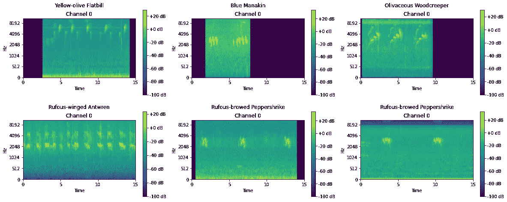
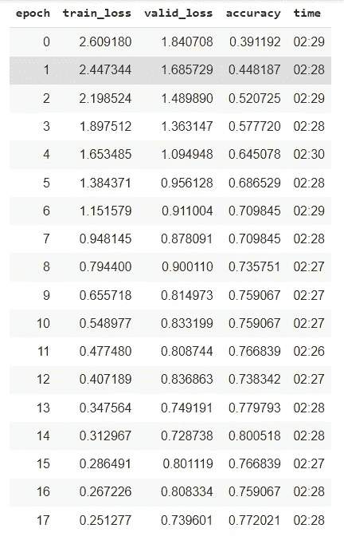
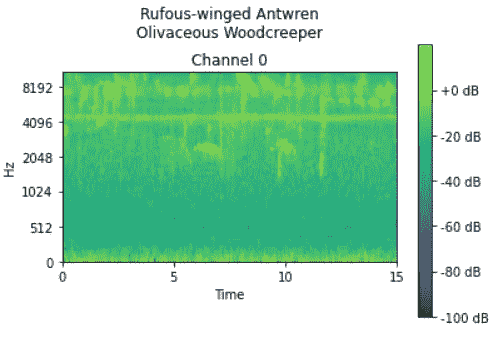
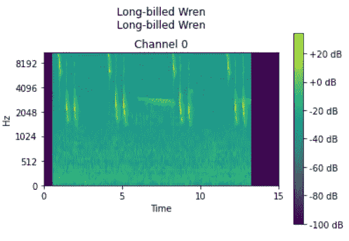
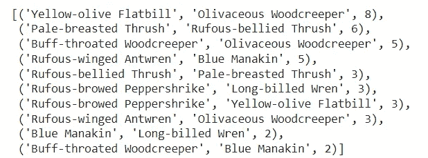
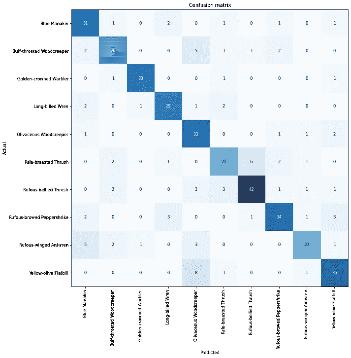
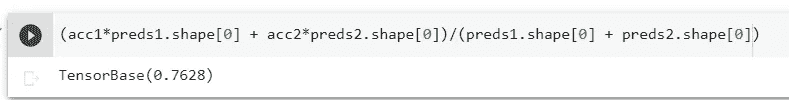

# 使用 FastAudio (FastAi)进行鸟声分类

> 原文：<https://medium.com/mlearning-ai/bird-sound-calssification-using-fastaudio-fastai-49eea9b5953a?source=collection_archive---------0----------------------->

*使用公共鸟类歌曲数据库和 FastAudio(用于 *FastAi Python API 的* n 音频模块)来创建基于声音的深度学习鸟类分类器*


Yellow-olive Flatbill. Source: [https://en.wikipedia.org/wiki/Yellow-olive_flatbill](https://en.wikipedia.org/wiki/Yellow-olive_flatbill)

互联网上有几个例子可以说明如何使用 [FastAi](https://docs.fast.ai/) API 来训练深度学习，以执行广泛的任务。正如我们所见，FastAi 可以用于创建[分割模型](https://www.kaggle.com/arunasna/liver-segmentation-with-fastai-v2)、[图像分类器](https://towardsdatascience.com/deep-learning-image-classification-with-fast-ai-fc4dc9052106)和[语音识别](https://walkwithfastai.com/Audio)算法。

然而，找到关于执行除语音识别之外的任务的音频分类模型的内容并不容易。此外，在互联网上找到的大多数例子使用为用于机器学习训练而创建的参数化数据集。

考虑到所有这些，我决定发表这篇文章，以展示如何使用公共协作数据集中的真实世界数据来训练深度学习音频分类器。在这个例子中，我使用了[fast audio](https://fastaudio.github.io/)(FastAi Python API 的一个模块)和 [xeno-canto](https://www.xeno-canto.org/) 数据库来创建一个模型，该模型可以根据鸟类独特的歌声对它们进行分类。

这里有一个包含代码的 github 库

# 要求

这些是我们将在这个项目中使用的所有库

```
!pip install fastaudio
!pip install pandas
!conda install -c conda-forge ffmpeg
## I had problems installing ffmpeg via pip
!pip install pydub
!pip install scikit-learn
```

# 下载文件并创建数据集

在创建和训练我们的模型之前，我们需要下载鸟鸣的音频文件，并组织一个可以在以后使用的数据集。

首先，我们需要放弃使用 xeno-canto API 来找出他们的数据库中有哪些可用的内容。在我的例子中，我将搜索限制在巴西制造的录音，但是您可以通过在下面的脚本中更改 ***country*** 变量来改变这一点:

之后，我们需要选择要下载的文件。我决定下载《物种》中超过 100 个音频样本的所有文件。在将数据集限制为具有 100 多个样本的物种后，我最终得到了 108 种不同鸟类的 14470 个音频文件。用于过滤文件并下载它们的代码如下:

下载所有的音频文件需要几个小时。为了加快这个过程，你可以将数据集重新划分为 10 个最常见的物种。如果您喜欢这样做，请将`downloader.py`的第 13 行改为`chosen = counts.head(10).index`

我将在下面展示的结果是通过对前 10 个物种的音频文件进行分类获得的，即:*红腹鸫、黄橄榄扁嘴鸫、红眉胡椒伯劳、橄榄丘鹬、浅喉丘鹬、蓝海牛、长嘴鹪鹩、金冠莺、浅胸鸫、小丘鹬*。总共使用了 2145 段录音。

# 准备文件

接下来，我从我的数据集中删除没有下载的文件，并把剩下的 10%按物种分类，用作测试集。

我还创建了一个函数，将所有不同的 mp3 文件转换成一个 16 kHz 的 wav 文件，这将使它们更容易加载到模型中。

现在我们在`wav_files/train/`中有了所有的训练(和验证)文件，在`wav_files/test/`中有了我们的测试文件。

# 数据块和数据加载器准备

让我们加载我们的数据集，存储在`downloaded.csv`并再次分离它们。(您也可以使用我们最近创建的 dataframes 进行训练和测试)。

```
downloaded = pd.read_csv('downloaded.csv')
downloaded['filename'] = downloaded['filename'].str[:-4] + '.wav'
downloaded.columns = ['filename', 'category']train_files = listdir('wav_files/train')
test_files = listdir('wav_files/test')df = downloaded[downloaded['filename'].isin(train_files)]
df_test = downloaded[downloaded['filename'].isin(test_files)]print(df.shape)
print(df_test.shape)
```

现在我们加载 fastaudio 组件并创建一个音频到声谱图的转换。

```
from fastai.vision.all import *
from fastaudio.core.all import *
from fastaudio.augment.all import *
from fastaudio.ci import skip_if_cipath = Path('.')seconds = 15
cfg = AudioConfig.BasicMelSpectrogram(n_fft=512)
a2s = AudioToSpec.from_cfg(cfg)
item_transforms = a2s
```

现在我们可以创建我们的数据块了。由于我们的数据集中有不同长度的文件，AudioBlock 会将信号裁剪为 15，000 毫秒

将它加载到数据加载器后，我们可以看一下我们的批处理:

```
batch_size = 64
dbunch = auds.dataloaders(df, bs=batch_size, shuffle=False)
dbunch.show_batch(figsize=(20, 8), nrows=2, ncols=3)
```



Result of dbunch.show_batch

# 创建和训练模型

现在我们可以实例化我们的模型了。我们将使用预训练的 resnet34 架构和 CrossEntropyLossFlat 作为我们的损失函数

```
model_type = resnet34
learn = cnn_learner(dbunch, 
                    model_type,
                    n_in=1,
                    loss_func=CrossEntropyLossFlat(),
                    metrics=[accuracy])
```

我们现在可以使用 lr_find 方法来找到我们的理想学习率

```
lr = learn.lr_find()[0]/10
print(lr)
```

最后我们将训练我们的模型。我们计划了 20 个时期，但是由于我们使用的是 EarlyStoppingCallback，如果 4 个时期没有改善，模型就会停止。

```
callbacks = [SaveModelCallback(),
ReduceLROnPlateau(monitor='valid_loss', min_delta=0.1, patience=2), EarlyStoppingCallback(monitor='valid_loss', min_delta=0.05, patience=4)]learn.fine_tune(20, wd=0.1, base_lr=lr, cbs=callbacks)
```



Epochs log

在 13 个时期中，我们在验证集中达到了 80.05%的准确率。模型在第 17 个时期后停止，因为验证损失在连续 4 个时期没有减少。

# 模型评估

我们可以用 show_results 函数查看一些结果

```
learn.show_results()
```



One example where the model fails (left) and another where it gets the result right (right)

我们还可以检查混淆矩阵和模型产生的最常见错误。

```
interp = ClassificationInterpretation.from_learner(learn)
interp.plot_confusion_matrix(figsize=(12,12), dpi=60)
interp.most_confused()[:10]
```



Most common errors



Confusion matrix

# 用新数据测试模型

现在我们可以用我们的测试数据集来测试我们的模型。让我们将它加载到一个新的数据加载器中，并检查模型预测新的未知数据的准确性。

在测试集中，模型达到了 76%的准确率。



# 结论

通过几个时期，我们能够使用鸟鸣建立一个相当好的分类模型！

非常感谢您的阅读。如果您有任何改进代码和/或模型的建议，请告诉我。

你可以在 f.freller@gmail.com 联系我

[](/mlearning-ai/mlearning-ai-submission-suggestions-b51e2b130bfb) [## Mlearning.ai 提交建议

### 如何成为 Mlearning.ai 上的作家

medium.com](/mlearning-ai/mlearning-ai-submission-suggestions-b51e2b130bfb)