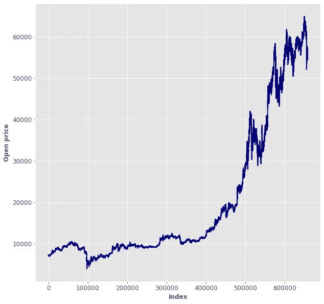
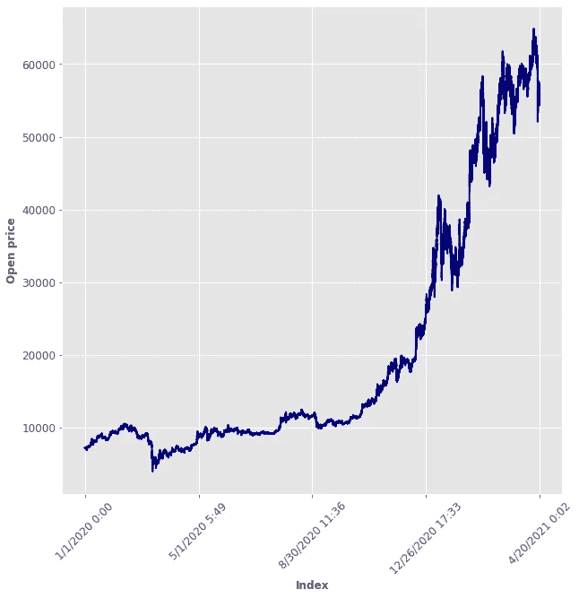
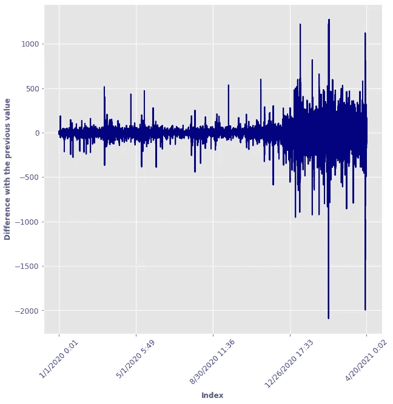
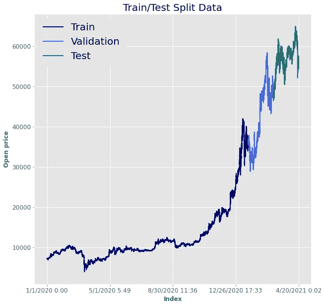
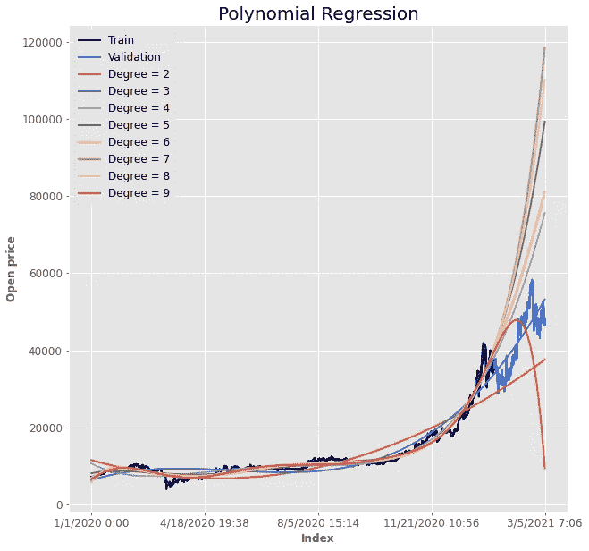
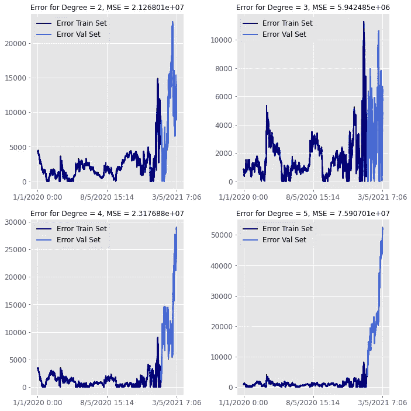
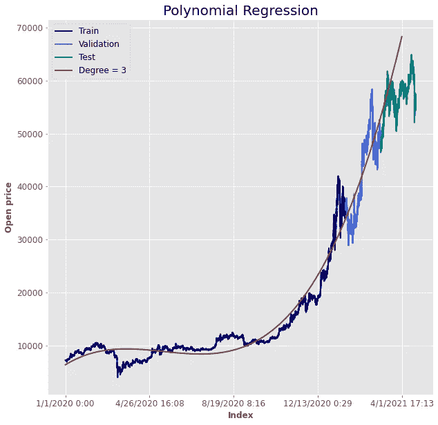

# 使用机器学习的比特币时间序列(长期)预测

> 原文：<https://medium.com/mlearning-ai/bitcoin-time-series-long-time-forecasting-using-machine-learning-46e0563876b1?source=collection_archive---------4----------------------->

Photo by [Bermix Studio](https://unsplash.com/@bermixstudio?utm_source=unsplash&utm_medium=referral&utm_content=creditCopyText) on [Unsplash](https://unsplash.com/s/photos/bitcoin?utm_source=unsplash&utm_medium=referral&utm_content=creditCopyText)

## 以下是如何使用基本的机器学习来预测比特币股价

> 注意！我不是比特币专家。这个用例只是为了展示如何以一种简单的方式应用机器学习，并尝试解决一个现实世界的问题。

当我开始机器学习时，我着迷于能够解释数据并从中提取信息的想法，即使**我之前没有任何领域知识。**

在这种情况下，作为一名物理学家和航空航天工程的博士生，我对比特币没有任何想法或看法。尽管如此，这个话题仍被广泛讨论，了解比特币如何以及何时(以及是否)在不久的将来稳定下来也很有趣。因此，我想在我们走之前强调一下:

> 这篇博文的目的是展示如何使用基本的机器学习来预测比特币的股票价格。

所以我刚刚下载了[这个数据集](https://www.kaggle.com/mczielinski/bitcoin-historical-data)，我用 Python 来分析它。

看起来是这样的:

而这是“**开**栏的情节，那将是我们的**目标**。

为了把事情弄清楚，**这是它在时间方面的样子**:

可以看到，随着时间的推移，数据变得越来越不稳定。事实上，它是差异数据集:

为了预测接下来会发生什么，我们的想法是取出部分数据，称为**测试集。**测试集将用于测试算法的性能。

**训练装置**将用于使机器**学习**其任务。在使用训练集之后，我们将得到多个经过训练的现成模型。**验证集**将用于理解已训练模型中可能的最佳模型。

训练集约为 **80%** ，而验证集和测试集各为 **10%** 。

看起来是这样的:

好，那么我们开始用机器学习。这个想法非常简单，被称为**多项式回归。**

> 回归过程旨在从输入值或向量中找出一个实数值(或者一个浮点数，如果您愿意的话)。

简单点说吧。想象一下，你在一个 2 维空间中有一堆点，占据了这个空间的一个狭窄区域。**线性回归任务**旨在找到最适合你的 2d 空间中的点的直线。一旦你有了这条线，给定一个新的点，你就可以通过参考拟合的线来预测目标值。

Here is an example of Linear regression. [Source](https://mlfromscratch.com/machine-learning-introduction-8-linear-regression-and-logistic-regression/#/).

完全相同的想法可以适用于我们的情况。如果不想受限于线性的情况，我们可以把点变换到一个 K 维空间(3，4，5，…)，拟合出我们的 K 维多项式的最佳参数，然后回到原来的空间。这就是所谓的**多项式回归。**

**这是你使用从 2 到 9 的所有度数时的情况。**

关于多项式回归的事情是，你需要小心 K。如果 K 太低，你可能会得到低性能，因为你的模型不够强大。同样，你的模型可能“过于强大”，因此仍然无法让你获得良好的性能(对这种现象的有趣解释是过度拟合[这里](/analytics-vidhya/but-my-mom-says-im-beautiful-a-film-written-and-directed-by-overfitting-4eaaf1137795))。

**话虽如此，说白了就是用验证集得到最佳 K 值，然后用 K 次多项式得到我们的预测。**

可以看出，次数= 3 的多项式是最适合验证数据的多项式。

最后，这是与测试集进行比较后得出的预测:

重要的是要注意，当测试集有一些难以解释的起伏时，多项式将保持其值的上升。为此，如果我们想要更精确地了解在更短的时间跨度内发生了什么，我们需要**玩一个不同的游戏**、**、**并分析点数的波动。但是，正如我所说的，这是另一个挑战。

再次声明，我不是比特币专家。我只是想指出，用数据分析和机器学习，用 0 以前的领域知识，从某个现象中获得一些有见地的信息和预测是多么容易。

如果你喜欢这篇文章，你想知道更多关于机器学习的知识，或者你只是想问我一些你可以问的问题:

A.在 [**Linkedin**](https://www.linkedin.com/in/pieropaialunga/) 上关注我，我在那里发布我所有的故事
B .订阅我的 [**简讯**](https://piero-paialunga.medium.com/subscribe) 。这会让你了解新的故事，并给你机会发短信给我，让我收到你所有的更正或疑问。
C .成为 [**推荐会员**](https://piero-paialunga.medium.com/membership) ，这样你就不会有任何“本月最大故事数”，你可以阅读我(以及数千名其他机器学习和数据科学顶级作家)写的任何关于现有最新技术的文章。

再见。:)