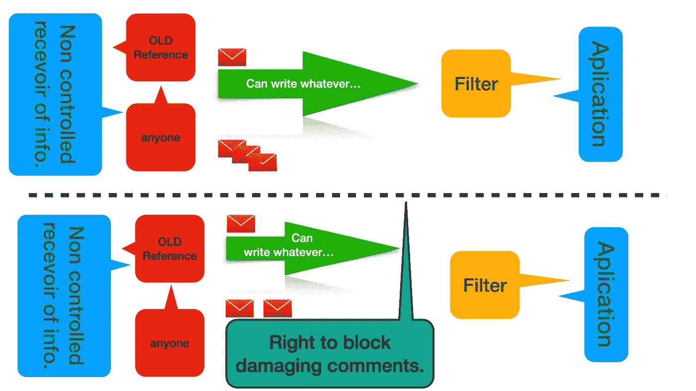
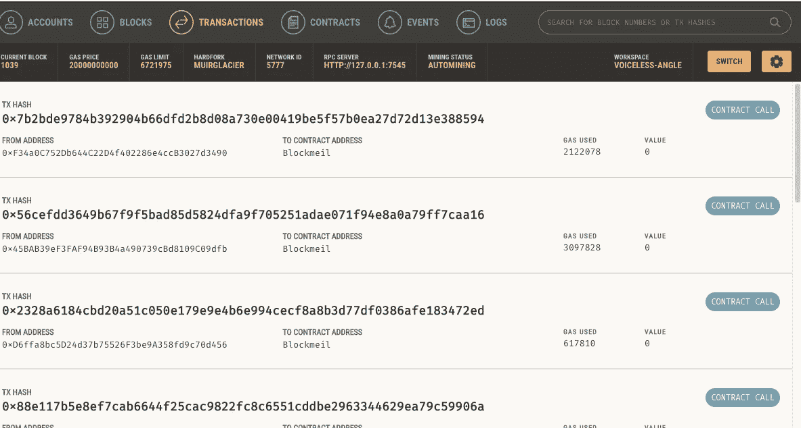
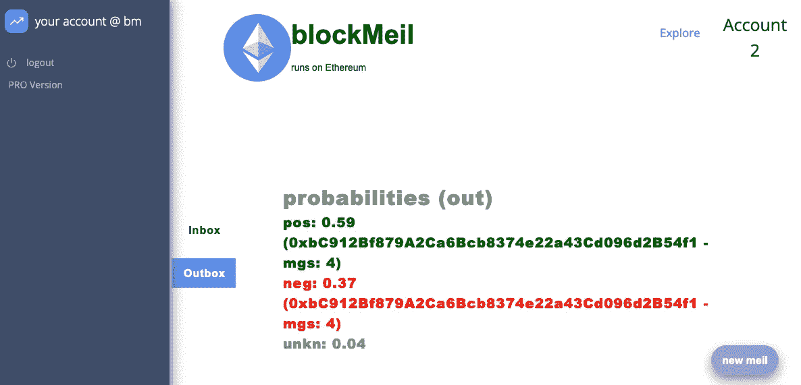
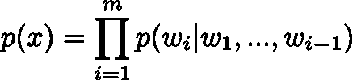
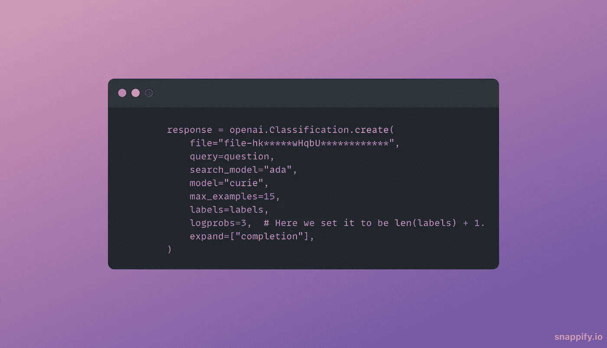
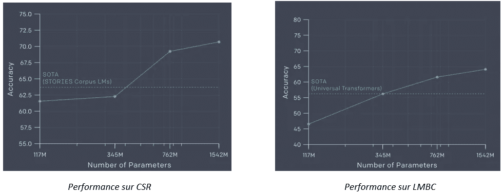
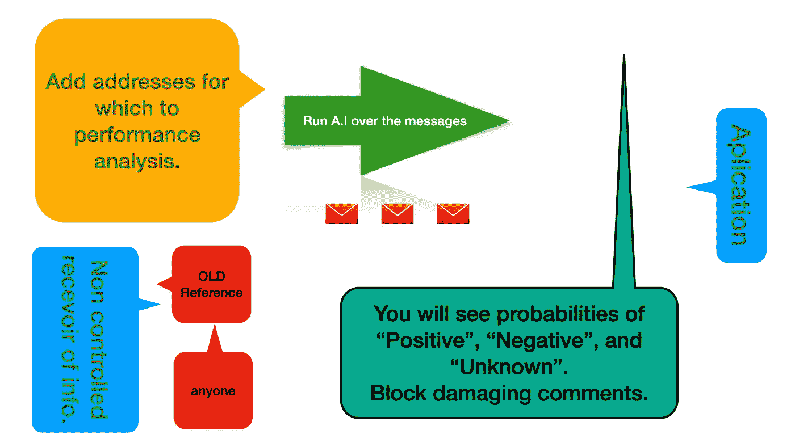
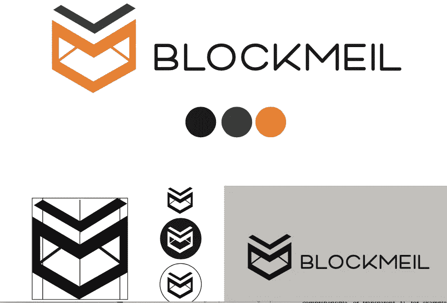

# BlockMeil:以人为中心(更公平)的推荐系统(一)。

> 原文：<https://medium.com/mlearning-ai/blockmeil-a-human-fairer-centric-recommendation-system-i-8b69e09f951e?source=collection_archive---------2----------------------->

## 2021 年圣诞节项目。三种技术组合成一个单一(假设)提案。


With **privacy-preserving** classification.

在这个图片、帖子或断章取义的信息可以用来伤害一个人的生活的社交媒体时代，需要一种更透明的方法，这种方法不仅以**人为中心**，而且还可以应对一张图片可能导致的 [***大众*** 歇斯底里](https://en.wikipedia.org/wiki/Mass_psychogenic_illness)和*在线欺凌*。众所周知，欺凌主要存在于四种类型中，如通过短信、电子邮件、电话或图片/视频片段等。每当一个人受到这种欺凌的时候，他们的心理健康就会受到影响。恃强凌弱的想法来自于人们倾向于取笑一个人，因为他们看到或发现了一些对他们不利的事情，为了让他们感觉不好，他们大多数时候会用不同的方式在精神上伤害他们。我们都在生活的不同阶段经历过欺凌，有些人在学校经历过，有些人可能在网上经历过。改变媒介并不能改变被欺负者的感受。作为一个应用程序:如果雇主、申请人和推荐人在同一个系统中，**申请人应该有权阻止(阻止)**来自恶意(或困惑)的前雇主/个人的破坏性、不合理的“*推荐*”意见。区块链和人工智能技术允许我们拥有这样的系统，避免了各种尴尬的情况，其中**区块**是完全合理的。 [***当然我们将来会使用 ML 对数据进行加密***](https://eprint.iacr.org/2014/331.pdf) ***(隐私保护*** *分类* **)** 。

# 以太坊区块链网络

> 这份草稿将使用[以太坊网络](https://ethereum.org/en/)制作。本质上，我们将构建一个 dApp(分散式应用程序)。没有中央服务器、公共账本和加密技术。



**Up**: Traditional “unfair” system. **Bottom**: BlockMeil.

# 智能合同

*智能合约* ( **SC** )允许我们作为一个拥有**地址**的实体与区块链系统进行交互。这里我们将展示使用模拟环境和 [Ganache](http://trufflesuite.com/docs/ganache/overview) 的快照和命令。借助 Ganache，开发人员可以快速构建区块链环境，用于原型开发和测试他们的 dApp。对于智能合约与网络的管理和连接，我们将使用[***truffle***](http://trufflesuite.com/index.html):一套为此目的设计的工具。让我们安装它，并运行我们的项目结构的设置。

在项目的目录中:

```
npm install -g truffle
truffle init
```

现在您已经建立了一个目录结构，它应该有以下子目录: ***/contracts、/migrations、/build、/test*** 。你还会有一个***truffle-config . js***，配置文件在哪里定位连接的参数等。你应该把智能合同放在。*合同*子目录。智能合约有扩展名 ***。sol** 将用 [**Solidity**](https://docs.soliditylang.org/en/v0.8.9/) 编程，这是一种专门为 SC 开发的编程语言。

在迁移目录中，您应该有您的合同的部署方法。它们看起来像这样:

```
// Help Truffle find `TruffleTutorial.sol` in the `/contracts` directory
const TruffleTutorial = artifacts.require("TruffleTutorial");

module.exports = function(deployer) {
  // Command Truffle to deploy the Smart Contract
  deployer.deploy(TruffleTutorial);
};
```

这将创建您的智能合约项目的结构。然后需要编译和部署(在 **127.0.1.7545** 处连接 Ganache):

```
truffle migrate --reset
```

我们还建议运行测试( ***松露测试*** )。我们跟随[这本指南](https://github.com/trufflesuite/truffle)。

一旦你的 **SC** 被正确部署， ***松露*** 看到连接正确，环境设置好，你应该看到 Ganache 运行。现在你可以走了:



BlockChain virtual environment for develop dApp.

# 前端烧瓶

我们设法运行并启动了一个具有登录/注销功能的系统(在不久的将来，我们计划使用 [***元任务***](https://addons.mozilla.org/en-US/firefox/addon/ether-metamask/) 作为认证标准)，我们的 dApp 从 testnet 运行并提供服务(测试中的区块链)。



Web3 Screenshot of the message system showing Probabilities of classifications of messages: **Positive, Negative or Unknown**.

# 情感模型

我们已经使用 [IMDB 数据集](https://www.kaggle.com/lakshmi25npathi/imdb-dataset-of-50k-movie-reviews)(使用预训练的 **gpt2** )训练了情感分类( **gpt2** )模型。该模型遵循将概率 ***p(w1，w2，w3，…wm)*** 分配给单词序列的经典方法，大小为 ***m*** :



The probability of occurrence of the phrase “x”.

并采用 [***零投学习***](https://cetinsamet.medium.com/zero-shot-learning-53080995d45f) 的方法。

对于标签，我们遵循了[公开信息](https://beta.openai.com/docs/guides/classifications)中给出的说明(正确地标记了我们的条目):

```
## ------ After  trained  our model with 100 reviews --------
from transformers import GPT2TokenizerFast

# Load the tokenizer.
tokenizer = GPT2TokenizerFast.from_pretrained("gpt2")

# Make sure the labels are formatted correctly.
labels = ["Positive", "Negative"]
labels = [label.strip().lower().capitalize() for label in labels]

# Encode the labels with extra white space prepended.
labels_tokens = {label: tokenizer.encode(" " + label) for label in labels}
```

在最后有“**正**”、“**负**”和其余的概率，即 *1-Sum(“正”+“负”)*，给一个未知的( **unkn** )第三个标签。

你需要有证书来训练你自己的模型:

```
import os
import openai
import random

openai.api_key = $OPENAI_KEY
```

在详细介绍了参数的用法和含义后，我们最终为 **NLP** 模型服务:



我们发现了一个合理的准确度:



Source : [https://blog.openai.com/better-language-models](https://blog.openai.com/better-language-models)

所以总的流程是:



Flow of **Blockmeil**.

# 结论

我们用***Web3+区块链+A.I*** 创造了一个更“人”的推荐系统，促进生活走出数字“欺凌”和八卦时代产生的恐怖和恐惧的阴影。会有赞成和反对的意见，这将产生一场公开辩论。开发这种系统的想法是为了检测和识别可能导致在线欺凌的不同事件，也是帮助已经受到影响的人的一种方式。无论决定是什么，这个系统都为解决一些与恶意竞争相关的问题打开了窗户。技术可能有助于解决其中一些问题。在本系列的第二部分中，我们将把我们的 dApp 部署到一个测试网上，使我们更接近于在一个主网上的完全部署，

> **包括 Web3 域 blockmeil.nft.**

# 我们在这里包括一个投票系统:

第一周:(从 2022 年 1 月 24 日开始)[https://www.menti.com/bx6chyw4gy](https://www.menti.com/bx6chyw4gy)(投票代码 1785 8016 现在有效，7 天后到期。)

第二周:[https://www.menti.com](https://www.menti.com/bx6chyw4gy)/bx 6 chy w4 gy(投票代码 2499 4216 现在有效，7 天后到期。)

第三周:[https://www.menti.com](https://www.menti.com/bx6chyw4gy)* * * * * * * * * *(投票代码 1**0 **43 现在有效，7 天后到期。)

# 结果可以在这里看到:

第一周:[https://www . menti meter . com/s/c 7 f 9 ed 0712 a 0 de 567525113399 c 0 b 34 e](https://www.mentimeter.com/s/c7f9ed0712a0de567525113399c0b34e)

第 2 周:

第 3 周:



The logo we are planing to use.


Some nice rendered.

[](/mlearning-ai/mlearning-ai-submission-suggestions-b51e2b130bfb) [## Mlearning.ai 提交建议

### 如何成为 Mlearning.ai 上的作家

medium.com](/mlearning-ai/mlearning-ai-submission-suggestions-b51e2b130bfb)