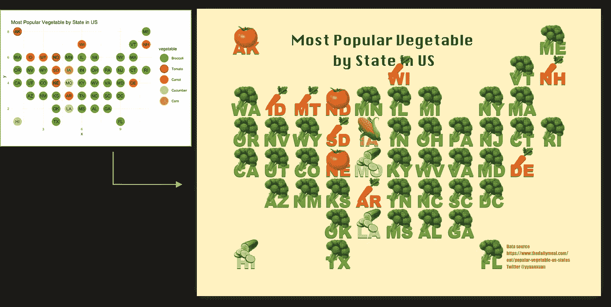
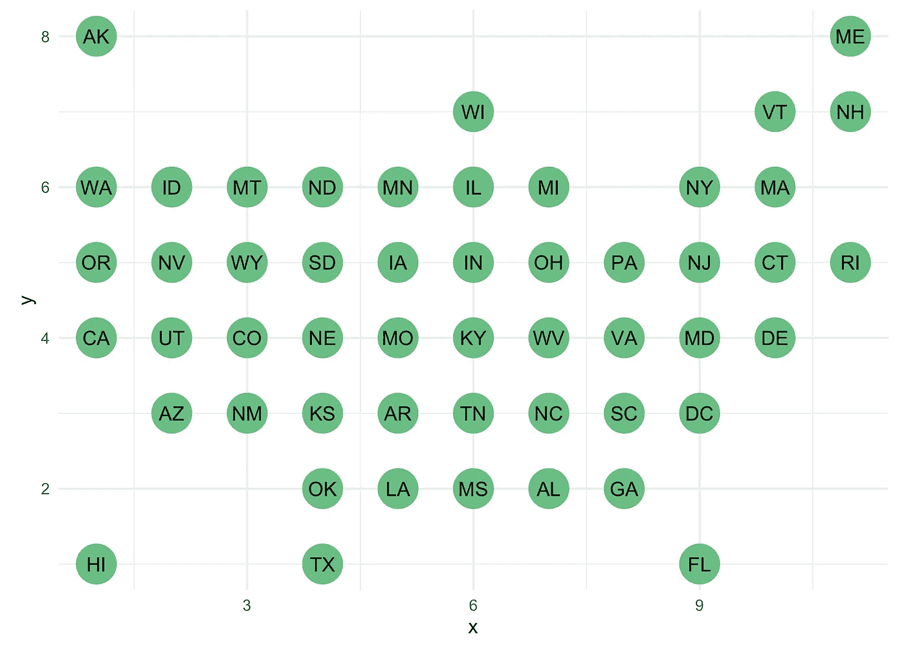
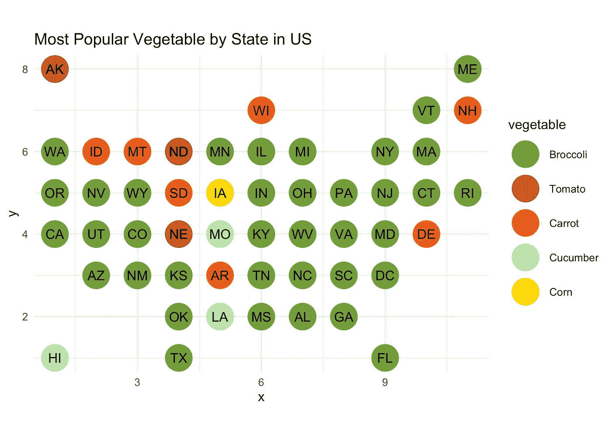
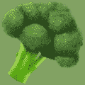
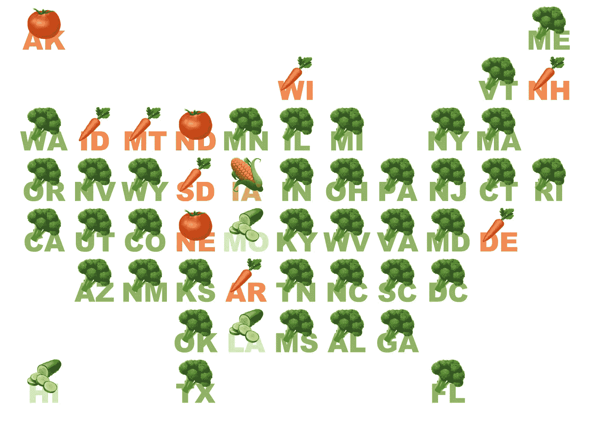
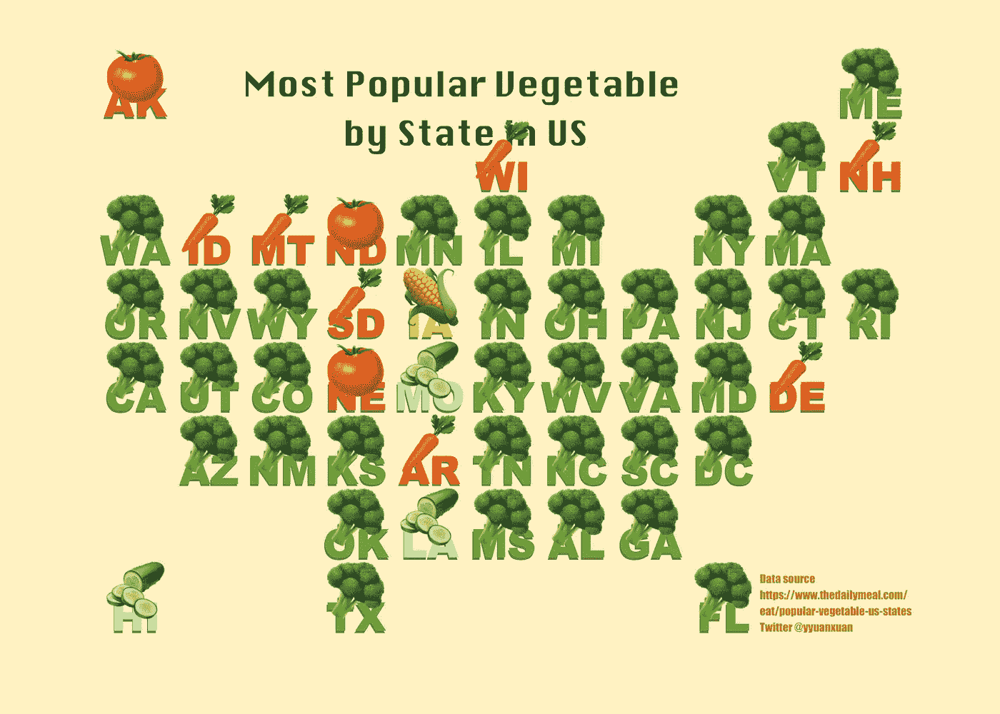
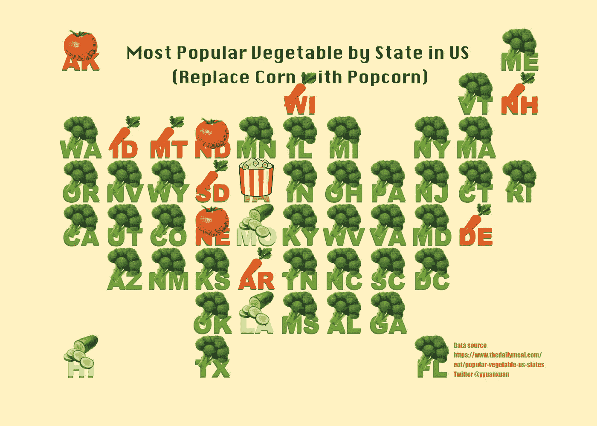

# 如何在 ggplot2 散点图中使用表情符号

> 原文：<https://medium.com/mlearning-ai/blog-mdyuanxuan-yang-a328348c4946?source=collection_archive---------2----------------------->

这是一个在 ggplot2 散点图中使用表情符号(或其他图像)的教程。我们的任务是创建一个地图(散点图)来显示“美国各州最受欢迎的蔬菜”，其中每个州都由蔬菜表情符号表示。以下是最终数字的预览。我们开始吧！



Use emoji for scatter plot in ggplot2

# 1.获取数据

**最受欢迎的蔬菜数据**来自[https://www . the daily meal . com/eat/popular-vegetable-us-States](https://www.thedailymeal.com/eat/popular-vegetable-us-states)，我已经整理并存储在我的 github [资源库](https://github.com/yyuanxuan/squared-map-veg-emoji)的“data/state-fav-veg.csv”中。

现在让我们看看我们的数据记录。

```
## name vegetable 
## 1 Alabama Broccoli 
## 2 Alaska Tomato 
## 3 Arizona Broccoli 
## 4 Arkansas Carrot 
## 5 California Broccoli 
## 6 Colorado Broccoli
```

“state_veg”中的每个记录都包含美国一个州的名称和最受欢迎的蔬菜。

接下来要做的是获取每个州的坐标/位置。于是我在这个[的 twitter 帖子](https://twitter.com/katiepark/status/598139293509492736)中按照凯蒂·帕克的作品设计，坐标存储在“数据/状态-位置-网格. csv”中。

```
## code name x y 
## 1 AL Alabama 7 2 
## 2 AK Alaska 1 8 
## 3 AZ Arizona 2 3 
## 4 AR Arkansas 5 3 
## 5 CA California 1 4 
## 6 CO Colorado 3 4
```

每条记录包含美国一个州的代码(两个字母的缩写)、名称和 x，y 坐标。我们可以快速浏览一下它们的位置:



US state map — grid location

然后我们连接 **state_veg** 和 **state_location** ，并使用 ggpplot2 制作一个基本的散点图。圆点的颜色代表不同的蔬菜类型。



Most Popular Vegetable by State in US (normal scatter plot with ggplot2)

# 2.表情符号时间

上面的散点图到目前为止看起来还不错，但是为什么不用一些表情符号蔬菜代替那些无聊的点呢？我们开始吧！



Broccoli emoji

我尝试过在 ggplot 中使用表情符号的不同方式，虽然也有类似 [**emojifont**](https://cran.r-project.org/web/packages/emojifont/vignettes/emojifont.html) 和 [**emoGG**](https://github.com/dill/emoGG) 的做法，但他们倾向于使用平面版的表情符号。作为一个苹果粉丝(不是真的)，我更喜欢经典的苹果版本。[**gg image**](https://www.rdocumentation.org/packages/ggimage/versions/0.2.8)**::geom _ image**是将 img 添加到 ggplot 的另一个潜在解决方案。然而，我对 img 纵横比的复杂设置不感兴趣。

所以今天我将采用另一种非常简单的方法——使用 **ggtext** 包中提供的 **geom_richtext** 。这种方法的灵感来自于[埃米尔·赫维特费尔德的](https://www.hvitfeldt.me/)精彩的[博客文章](https://www.hvitfeldt.me/blog/real-emojis-in-ggplot2/)。

## 2.1 获取表情符号

你可以找到并下载 https://emojipedia.org/的所有表情符号。下载完成后，我们可以创建一个数据帧来存储链接/地址(在您的本地机器上),如下所示

```
## vegetable emoji_link 
## 1 Broccoli img/broccoli_1f966.png 
## 2 Tomato img/tomato_1f345.png 
## 3 Carrot img/carrot_1f955.png 
## 4 Cucumber img/cucumber_1f952.png 
## 5 Corn img/ear-of-corn_1f33d.png
```

## 2.2 加入数据框

然后我们需要通过公共变量“蔬菜”来连接 **state_veg** 和 **emoji_pic** 数据，因此，每条记录都将包含链接到 emoji 的字符串。

一旦加入，我们的数据终于准备好了，让我们看看

```
## name vegetable code x y emoji_link 
## 1 Alabama Broccoli AL 7 2 img/broccoli_1f966.png 
## 2 Alaska Tomato AK 1 8 img/tomato_1f345.png 
## 3 Arizona Broccoli AZ 2 3 img/broccoli_1f966.png 
## 4 Arkansas Carrot AR 5 3 img/carrot_1f955.png 
## 5 California Broccoli CA 1 4 img/broccoli_1f966.png 
## 6 Colorado Broccoli CO 3 4 img/broccoli_1f966.png
```

## 2.3 定义一个函数，为你的表情图像提供更多信息

我们将使用 **geom_richtext** 在散点图中绘制数据点，并用表情符号替换点形状。 **geom_richtext** 绘制类似于 **ggplot::geom_label** 的标签，但使用基本 markdown/html 进行格式化。因此，可以在 richtext 标签中嵌入图像。在这里，我们将定义一个函数，以便添加表情符号并将其格式化为 markdown/html 中的资源。

## 2.4 关键时刻

现在让我们尝试使用表情符号将**几何点**替换为**几何丰富文本**



万岁，成功了！因此，我们可以做一些进一步的调整，添加复古纸外观背景色，改变字体样式，添加标题和数据源信息。希望你喜欢这个改进版本！



# 3.最后一个音符

制作这张地图并不意味着我同意地图上的一切。首先，我们可以整天争论“西红柿是水果还是蔬菜？”

以下是谷歌的回答


所提出的方法(使用 **geom_richtext** )的一个好处是，我们可以使用任何我们想要的图像来绘制点，而 [**emojifont**](https://cran.r-project.org/web/packages/emojifont/vignettes/emojifont.html) 和 [**emoGG**](https://github.com/dill/emoGG) 包只能为我们提供表情符号的选择。所以我把玉米换成了无版权的爆米花图片。:)



*最初发表于 https://github.com/yyuanxuan/squared-map-veg-emoji*T2