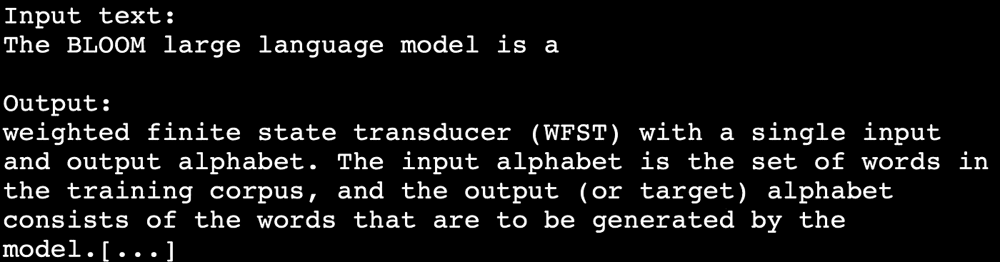
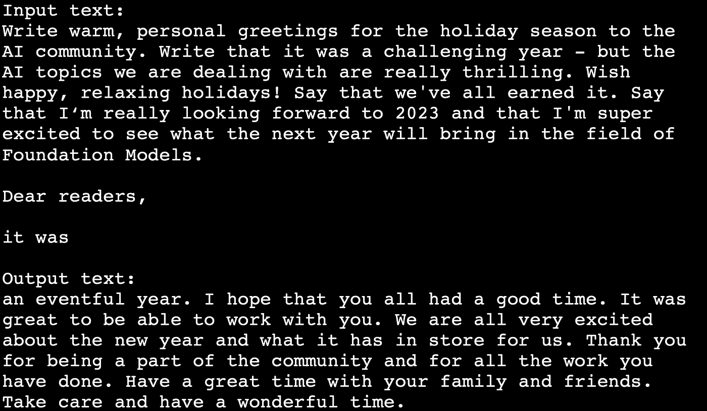

# BLOOM 176B —如何在自己的云中运行真正的大型语言模型？

> 原文：<https://medium.com/mlearning-ai/bloom-176b-how-to-run-a-real-large-language-model-in-your-own-cloud-e5f6bdfb3bb1?source=collection_archive---------0----------------------->


# 我们中的许多人以 SaaS 的方式使用 GPT-3 或其他 LLM，由他们的供应商托管。但是**在自己的云中运行 GPT-3 大小的模型是什么感觉？**

**设置起来并不琐碎，但是运行自己的模型**超级刺激。让我告诉你如何开始，你可以期待什么样的结果。

[**BLOOM**](https://huggingface.co/docs/transformers/model_doc/bloom)—big science 大型开放科学开放存取多语种语言模型是由 **1000+研究人员**[创建的一个基于 **transformer 的语言模型**。对其进行了关于](https://bigscience.huggingface.co/)[1.6 TB 预处理多语言文本](https://arxiv.org/abs/2211.05100)的培训。这是免费的——任何想尝试的人都可以试试。参数中最大的 BLOOM 模型的大小是 176B，大约是有史以来最成功的语言模型 openAI 的 GPT-3 模型的大小。还有一些更小的型号，如 7b、3b、1b7 等。

**当你可以像 SaaS 像自来水一样使用商业模式时，你为什么要建立自己的模式**？在许多原因中，主要论点是完全的**数据主权**——预训练数据和用户输入的数据完全在你的控制之下——而不是在人工智能公司的控制之下。BLOOM 还没有真正的托管 SaaS 解决方案。

好的，那你是怎么做的呢？


# **型号尺寸**

我们的 Bloom 模型需要大约 360 GB 的 RAM 来运行——这是一个传统云托管无法通过双击按钮来实现的要求，而且这也非常昂贵。

幸运的是，微软已经提供了一个具有 INT8 权重(来自原始 FLOAT16 权重)的 [**下采样变体**](https://huggingface.co/microsoft/bloom-deepspeed-inference-int8) **，它运行在 **DeepSpeed 推断**引擎上，并使用张量平行排列。DeepSpeed-Inference 引入了几个特性来有效地服务于基于 transformer 的 PyTorch 模型。它支持模型并行性(MP ),以适应原本不适合 GPU 内存的大型模型。**

这里有更多关于最小化和加速模型的信息。

在微软回购协议中，张量被分成 8 个部分。因此，一方面，绝对模型尺寸减小，另一方面，较小的模型被拆分和并行化，因此可以分布在 **8 个 GPU**上。

# 托管设置

我们为模型选择的主机是 AWS，因为它为能够初始化模型的深度学习容器提供了 SageMaker 设置。这样做的说明可以在这里找到:
[用大型模型推理深度学习容器和 DeepSpeed](https://aws.amazon.com/de/blogs/machine-learning/deploy-bloom-176b-and-opt-30b-on-amazon-sagemaker-with-large-model-inference-deep-learning-containers-and-deepspeed/) 在亚马逊 SageMaker 上部署 BLOOM-176B 和 OPT-30B。

请只考虑 Bloom 176b 部分，OPT 部分与我们的目的无关。

在 AWS 上，你必须**找到正确的数据中心**来设置模型。所需的能力不是随处可得的。我们去了东海岸，去了弗吉尼亚州，乘坐 us-east-1.amazonaws.com 的 T9 号列车。您必须通过支持获得您需要的实例，您无法通过自我配置来实现。**你需要 8 个 Nvidia A100，每个 40 GB 内存。**

**我们的 devops 工程师 Thomas** 找到了创建环境的方法，他最终完成了创建，在此，我要为他的成功向他深深鞠躬。


# 启动模型

托管模型可以从 Huggingface 上的[微软存储库](https://huggingface.co/microsoft/bloom-deepspeed-inference-int8/tree/main)加载到同一数据中心的 S3 中——这就是我们所做的，以便让模型接近运行时环境——或者您可以在公共 S3 环境中使用 AWS 提供的模型。**型号大小为 180 GB。**

在 Github 上的[说明](https://aws.amazon.com/de/blogs/machine-learning/deploy-bloom-176b-and-opt-30b-on-amazon-sagemaker-with-large-model-inference-deep-learning-containers-and-deepspeed/)和 [jupyter 笔记本中，您将找到在 Sagemaker 上创建模型和设置端点的各个步骤，这些步骤对于获得低延迟运行的模型是必要的。](https://github.com/aws/amazon-sagemaker-examples/blob/main/inference/nlp/realtime/llm/bloom_176b/djl_deepspeed_deploy.ipynb)

**搞定。BLOOM 176B 模型现在正在运行。**

在我们的设置中，运行时每小时花费大约 32 美元。因此，如果模型不需要在生产系统中一直运行，那么为测试回合启动模型并再次关闭它以释放资源是有意义的。使用该脚本，您可以在大约 18 分钟内启动它，关闭和释放资源需要几秒钟。


# 使用模型

我们在 Sagemaker 端点之上的接口中放置了一个定制的 API 网关和 lambda 函数，允许用户使用 API 密钥进行外部连接——这使得使用和调用更加容易。点击此处查看介绍。

对 Bloom 模型的调用原则上与对其他完成模型的调用完全相同:您抛出一个文本和参数，如 temperature、max_new_tokens 等。并得到一个文本响应。

```
smr_client.invoke_endpoint(
    EndpointName=endpoint_name,
    Body=json.dumps(
        {
            "input": "The BLOOM large language model is a",
            "gen_kwargs": {
                "min_length": 5,
                "max_new_tokens": 100,
                "temperature": 0.8,
                "num_beams": 5,
                "no_repeat_ngram_size": 2,
            },
        }
    ),
    ContentType="application/json",
)["Body"].read().decode("utf8")
```

我们首先用一个较小的 BLOOM 模型 1B7(带有 SageMaker JumpStart)测试了模型接口，然后在一切正常后，用大型的 176B 模型进行了测试。

**嗯，结果是什么？**

我们让模型做两个 hello-world 和一个 goodbye-world:



**成功了！**

随着模型的美好，但不是非常具体的再见世界，我想关闭今年。我将在后续文章中与 BLOOM-model 分享一些能力测试的结果。

非常感谢，甘兹，甘兹，感谢托马斯·博格曼

获取有关设置和文章的帮助。

用 OpenAI 的 DALL-E 2 生成的所有 bloomy 图像。

请随时问我关于 BLOOM 设置的问题。

[](/mlearning-ai/mlearning-ai-submission-suggestions-b51e2b130bfb) [## Mlearning.ai 提交建议

### 如何成为 Mlearning.ai 上的作家

medium.com](/mlearning-ai/mlearning-ai-submission-suggestions-b51e2b130bfb)