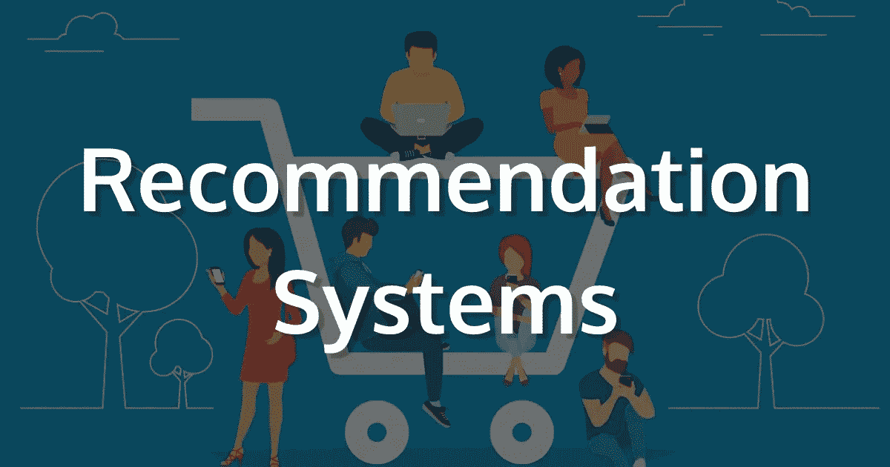
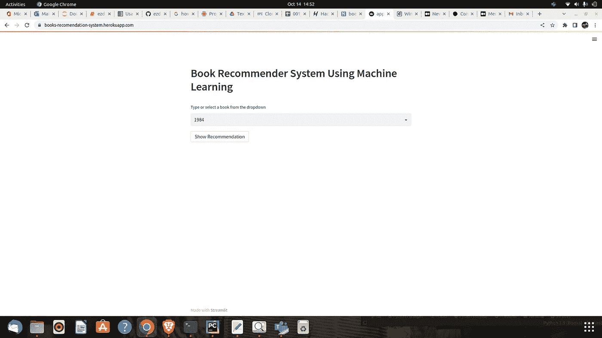
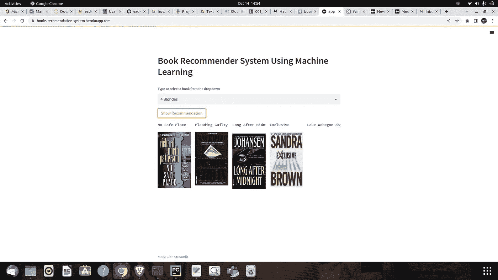

# 基于机器学习的图书推荐系统

> 原文：<https://medium.com/mlearning-ai/book-recommender-system-using-machine-learning-a1c36c683cf0?source=collection_archive---------11----------------------->

机器学习、推荐系统、人工智能

Image By Author

在当今极其繁忙的世界中，推荐系统变得越来越重要。人们总是没有时间在有限的 24 小时内完成无数的任务。因此，推荐系统是必不可少的，因为它们帮助他们做出正确的选择，而不必花费他们的认知资源。

推荐系统的目的基本上是搜索个人感兴趣的内容。此外，创建针对每个用户/个人的有用和有趣内容的个性化列表涉及许多因素。推荐系统是基于人工智能的算法，它浏览所有可能的选项，并创建一个定制的项目列表，这些项目是个人感兴趣的和相关的。这些结果基于他们的个人资料、搜索/浏览历史、具有类似特征/人口统计数据的其他人正在观看的内容以及观看这些电影的可能性。这是通过对可用数据的预测建模和试探法实现的。

# 推荐系统的类型:

## 1)基于内容:

*   基于内容的系统，使用特征信息并考虑项目属性。
*   推特，Youtube。
*   你在听什么音乐，你在看什么歌手，这些都是嵌入的特征。
*   特定于用户的动作或类似项目推荐。
*   它会创建一个矢量。
*   这些系统使用用户的项目和简档特征进行推荐。他们假设，如果用户过去对一个项目感兴趣，他们将来会再次对它感兴趣
*   出现的一个问题是由于过度的专门化而产生明显的推荐(用户 A 只对类别 B、C 和 D 感兴趣，而系统不能推荐这些类别之外的项目，即使它们可能是他们感兴趣的)。

## 2)基于协作:

*   基于用户-项目交互的协同过滤系统。
*   具有相同评级、相似用户的用户群。
*   一本书推荐，所以用集群机制。
*   我们只接受一个参数，评分或评论。
*   简而言之，协同过滤系统基于这样的假设:如果一个用户喜欢项目 A，而另一个用户喜欢相同的项目 A 以及另一个项目 B，则第一个用户也可能对第二个项目感兴趣。
*   问题是- 1。用户项目 nXn 矩阵，计算量很大。2.只有著名的项目会得到推荐。3.新项目可能根本不会被推荐。

# 3)基于混合的:

*   混合系统，它结合了两种类型的信息，目的是避免只使用一种信息时产生的问题。
*   两者结合，现已使用。
*   使用 word2vec，嵌入。

# 关于这个项目:

这是一个 streamlit web 应用程序，可以根据用户的兴趣推荐各种类似的书籍。这是一个演示，

[点击这里在服务器上运行它](https://books-recomendation-system.herokuapp.com/)

# 演示:

Image By Author

Image by Author

# 怎么跑？

## 步骤:

克隆存储库:

## 步骤 01——打开存储库后创建一个 conda 环境

## 步骤 02-安装需求

现在快跑，

 [## Mlearning.ai 提交建议

### 如何成为 Mlearning.ai 上的作家

medium.com](/mlearning-ai/mlearning-ai-submission-suggestions-b51e2b130bfb)