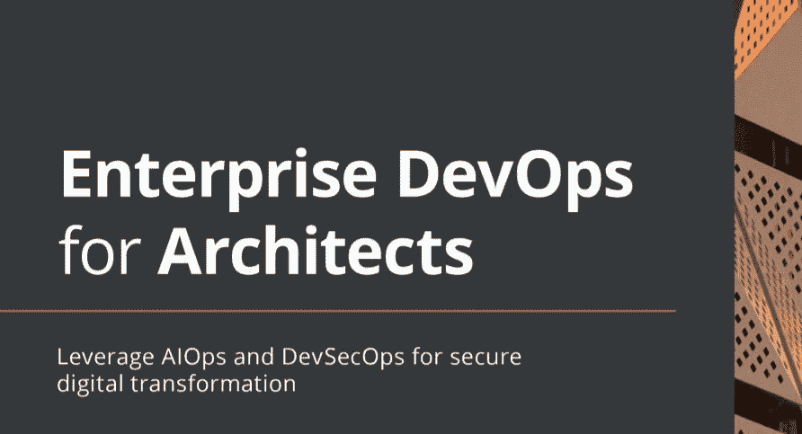

# 书评:面向架构师的企业开发运维

> 原文：<https://medium.com/mlearning-ai/book-review-enterprise-devops-for-architects-f3587066f774?source=collection_archive---------11----------------------->

作为一名数据科学家，我再一次深入到了我的舒适区之外。但是让我们诚实地说，在很长一段时间里，技术是一个用来帮助其他行业变得更好的行业，然而今天，技术是我们几乎做任何事情的基础，因此它变得非常复杂。话虽如此，我仍然认为我们应该努力至少对我们可能不熟悉的其他技术领域正在发生的事情有所了解。这就是我坐下来从头到尾阅读这本书的原因，我必须说，尽管它不是为我写的，但我很高兴我对企业开发运营这一主题有了一些见解。

今天，我给大家带来了我对由[耶鲁安·穆德](https://www.linkedin.com/in/jeroen-mulder-b61986/)所著的《建筑师的企业发展》一书的看法。像往常一样，我必须提到我不是主题专家，我的领域是数据科学而不是 DevOps，我也不是系统架构师，这是本书的目标读者。尽管如此，正如我之前在其他评论中提到的，更多地了解我们工作中所依赖的不同技术领域是一种找到新的思考方式和激发创造力的好方法。

和往常一样，我将通过问一些非常具体的问题来引导这篇评论，从我的角度来评价这本书的有用性。我们开始吧。

**这本书是关于什么的？**

这本书的标题非常清楚地说明了它是关于什么的，它关注的是企业开发运维，关注的是软件架构师。它还给了我们一个副标题:“利用 AIOps 和 DevSecOps 实现安全的数字化转型。”嗯，现在有很多行动。

好吧，简单点说， [DevOps](https://en.wikipedia.org/wiki/DevOps) 就是收缩软件开发(Dev)和 it 运营(Ops)，是共享原则和实践的结合，提供高软件质量和持续运营。因此 [AIOps](https://en.wikipedia.org/wiki/Artificial_Intelligence_for_IT_Operations) 是相同的概念，但应用于人工智能的开发(这让我对这本书更感兴趣)，而 [DevSecOps](https://en.wikipedia.org/wiki/DevOps#DevSecOps,_Shifting_Security_Left) 涉及到将安全原则和实践添加到 DevOps 中。

现在我们知道这本书是关于什么的了。不要烦恼，即使它在某些部分变得技术性，这本书在帮助理解所有的概念方面是非常好的。

这本书写得好吗？

对我来说，这是一个响亮的是。语气很友好，就像一个专家对教别人做什么很感兴趣。耶鲁安做得很好，让自己感到亲近和私人，就像一个我愿意和他一起喝杯咖啡、聊上几个小时的人。事实是，虽然我不认识作者，但读了这本书后，我确实觉得我们有某种血缘关系，我们应该成为朋友。

他使用简单的语言，并有一种开放的语气，总是专注于我们(指开发团队)，让你感觉自己是他团队的一部分。

通常很难找到能做到这一点的技术书籍，所以把这本书看作是这方面的瑰宝。虽然对于高度技术化的人来说，这种风格可能感觉有点松散，但是给它一个机会，它可能会让你越来越喜欢。

**是否很好的呈现了素材？**

我相信是的，但是正如我提到的，我不是这方面的专家。当我开始阅读这本书时，我对 DevOps 只有一个非常肤浅的概念，现在我相信 a 对它有了更好的理解。本书分为几个具体的部分，从解释企业开发运维开始，它们是什么以及为什么重要，这是本书最不专业的部分，它很好地向您介绍了主题。然后，它转向开发的更技术性的方面，以及如何开始将 DevOps 集成到公司的流程中。最后，它进入了本质的，但过于重要的开发合作，并将安全性集成到开发过程的每个部分。

**易读吗？**

整本书很好地结合了文字和视觉信息。大量的图表来加强主题，理解开发过程的流程，以及 DevOps 在哪里以及如何增加价值，应该如何实现。所以，简而言之，是的，这本书非常好读。

阅读这本书需要成为专家吗？

不，你不需要成为专家，尤其是对于这本书的第一部分。然而，随着您进入第 2 部分和第 3 部分，将会有越来越多的技术语言，如果您没有 DevOps 或敏捷开发(或一般的开发)方面的背景，很容易迷失方向，或者不得不依靠快速的 google 搜索和一些在线文章来填补空白，尽管作者试图尽可能地覆盖这些空白。此外，值得一提的是，他还为我们提供了进一步阅读的建议，以防我们想更深入地挖掘或简单地覆盖我们的基础。

**你会从这本书中学到多少？**

如果你对这个主题一无所知，你会学到很多，你甚至可能需要多读一些来涵盖这样一个庞大而重要的主题。如果你已经是一名软件架构师或者有一些开发软件的经验，你将会了解 DevOps 及其重要性(它甚至可能让你成为 DevOps 的传播者)。如果您已经熟悉或专门研究 DevOps，您可能希望阅读它来填补任何空白，但由于我不是专家，我不能肯定这种说法。

**容易引用吗？**

我一直觉得 Packt 总是在为他们的书编制索引方面做得非常出色，这本也不例外。一旦你读了这本书，回到它是很容易的，你可以在几秒钟内得到你需要的细节，如果你读的是电子版，甚至更快。

如果您想了解 Enterprise DevOps，您是否是一名软件架构师，或者只是想了解更多关于开发过程中良好实践的信息，特别是如果您想了解 AIOps 和 DevSecOps 的细节，这将是一项很好的投资和非常好的读物。

这本书已经出了，你可以在这里得到:[https://www . Amazon . com/Enterprise-devo PS-Architects-DevSecOps-transformation/DP/1801812152](https://www.amazon.com/Enterprise-DevOps-Architects-DevSecOps-transformation/dp/1801812152)

**注:** [Packt](https://www.linkedin.com/company/packt-publishing/) 为了能够写这篇评论，确实提前给我发了一份这本书的免费拷贝。我没有得到任何其他的东西，无论是这个评论还是图书销售。我确实感到很幸福，因为我是这一经历的一部分，能够帮助像耶鲁安·穆德这样的伟大作家和他的书受到关注，这样他们就可以继续他们惊人的工作。

 [## Mlearning.ai 提交建议

### 如何成为 Mlearning.ai 上的作家

medium.com](/mlearning-ai/mlearning-ai-submission-suggestions-b51e2b130bfb) 

[成为作家](/mlearning-ai/mlearning-ai-submission-suggestions-b51e2b130bfb)