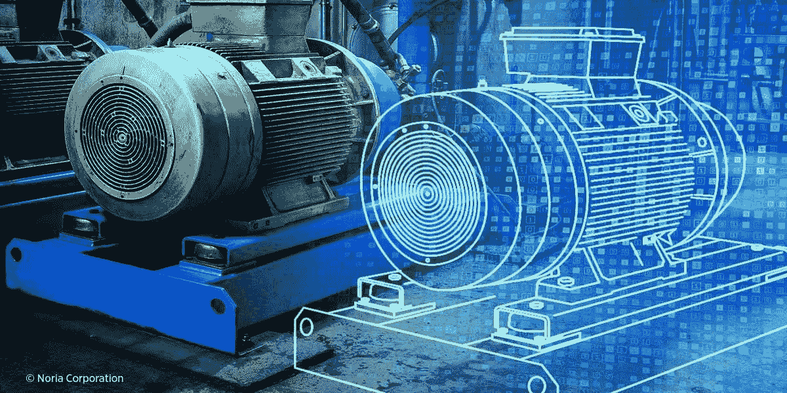

# 书评:动手 Azure 数字双胞胎

> 原文：<https://medium.com/mlearning-ai/book-review-hands-on-azure-digital-twins-9a2de998f561?source=collection_archive---------4----------------------->

我一直很喜欢阅读有关技术的书籍，这种感觉是在我开始学习和现在在技术行业工作后才增长的。它很大，大到不可能知道所有的一切，因此你必须学会满足于在大多数池塘的表面划来划去，并完全接受你永远也不会知道它的水下秘密。

尽管如此，偶尔，当你在其中一个池塘里戏水时，诱惑是如此之大，以至于你必须提醒自己你自己的水坑(或大海，或海洋)的未探索深度，以免失去焦点。不要误解我的意思，了解一些其他技术是很重要的，如果你是一名数据科学家或软件开发人员，在某个时候可能不得不处理它们，这是必要的，但不要一头扎进所有这些技术也是明智的，因为一生中没有足够的时间来学习所有这些技术。

所有这些长篇大论的介绍只是为了帮助你理解我阅读这本书的心态，因为我被[数字双胞胎技术](https://en.wikipedia.org/wiki/Digital_twin)的迷人召唤迷住了，为什么这可能是我最近一段时间内关于非数据科学和机器学习主题的最后一篇书评。

说到你读这篇文章的真正原因，这本书的书评[由](https://www.amazon.com/Hands-Azure-Digital-Twins-distributed/dp/1801071381/ref=sr_1_1?crid=3GUZ7QT9X6DV3&keywords=Hands+on+Azure+Digital+Twins&qid=1646317755&sprefix=hands+on+azure+digital+twins%2Caps%2C637&sr=8-1)[亚历山大·梅耶斯](https://www.linkedin.com/in/ACoAAADUxnEB9yHm_Y3erI_019F6GzMGZ0Jausc/)撰写。我再次提醒你，这不是我的专业领域(我是一名数据科学家)，这是我第一次阅读关于数字双胞胎以及如何实现它们的文章以外的内容。

为了保持我的评论的一致性，我将基于我一直使用的相同问题来评价这本书。我们走吧。

这本书是关于什么的？

与大多数技术书籍一样，标题说明了一切:《动手 Azure Digital Twins 》,构建分布式物联网解决方案的实用指南。但为了以防万一，我还是总结一下。这是关于如何使用 Azure Digital Twins 架构构建数字双胞胎。

你可能会问，什么是[数字孪生物](https://en.wikipedia.org/wiki/Digital_twin)(这是为那些决定不点击维基百科链接的前两个实例的懒人准备的)，它是“作为物理对象或过程的实时数字对应物的虚拟表示”[【1】](#_ftn1)

换句话说，它是你在现实世界中可能找到的任何东西的数字模型。如今，通过使用来自各种物联网设备的数字信号来创建房屋、办公室、建筑甚至城市的文字双胞胎，数字双胞胎变得越来越常见，这允许各种有趣的应用，从诊断到预测再到规范模型。

这本书写得好吗？

这将是短暂的。是的，这本书写得很好。它包含了大量的图表、代码和屏幕截图，所有这些都很容易通过简单明了的解释来理解、设置和运行这个系统。

**它很好地呈现了素材吗？**

又一次，是的。俗话说:“一图胜千言。”，虽然这不太准确(根据神经科学，一张图片接近 20，000 个单词)，但事实是我们是视觉动物。因此，有一本花时间展示 evert step 的具体截图，并为附带的解释进行清晰编号的技术书，是我认为一本介绍良好的书。

作者还非常谨慎地坚持描述性风格，让读者明白在他所解释的架构的约束下，他们能做什么，不能做什么。

**容易读吗？**

在这里，我犹豫不决。作为一个试图至少对每一项技术都有所了解的技术迷(他明白这对一个人来说是不可能的任务)，我发现它非常容易阅读。对于许多人来说，尤其是那些不熟悉数字双胞胎及其相关技术(物联网、遥测等)的人。)，可能会有点挑战。

尽管如此，这本书有一个特定的读者群，那就是已经对数字双胞胎感兴趣和/或正在工作的人，对于所有这些人来说，这是一本非常容易阅读的书。

你需要成为专家才能阅读这本书吗？

再说一次，我在这个问题上有分歧。我会说，你不需要成为一个专家来阅读这本书，见鬼，我读了这本书，但我远不是这个领域的专家。然而，正如我在最后一部分提到的，如果你对数字双胞胎一无所知，甚至如果你是技术新手，这可能是一个挑战。

但是不要担心，我们生活在技术时代，几乎没有什么好的互联网搜索不能回答的。

你会从这本书中学到多少？

如果你对开发和/或构建数字双胞胎感兴趣，并且希望使用 Azure 架构来实现，你就找到了今年你将购买的最佳书籍。如果你正在学习如何建立数字双胞胎，这是一本值得拥有的好书。如果你像我一样是一个技术书呆子，这将是一个非常愉快的阅读，谁知道呢，它可能会激励你找到一个新的职业道路。

**容易参考吗？**

对我来说，技术书籍最重要的一个方面是参考，因为你经常需要回到书中的特定部分。像往常一样, [Packt](https://www.linkedin.com/company/packt-publishing/) 书籍有一个非常全面的索引，它的结构方式使你可以通过快速浏览和翻页找到你想要的东西。

简而言之，如果符合以下任何一条，请购买这本书:

1.你想学习如何在 Azure 上构建数字双胞胎。

2.你想和一家在 Azure 上有数字双胞胎的公司合作。

3.你想了解更多关于数字双胞胎的知识。

4.你想了解一项你一无所知的技术，而这项技术恰好是数字双胞胎。

[这本书今天就要出版了，你可以点击这个链接得到它。](https://www.amazon.com/Hands-Azure-Digital-Twins-distributed/dp/1801071381/ref=sr_1_1?crid=3GUZ7QT9X6DV3&keywords=Hands+on+Azure+Digital+Twins&qid=1646317755&sprefix=hands+on+azure+digital+twins%2Caps%2C637&sr=8-1)

**注:** [Packt](https://www.linkedin.com/company/packt-publishing/) 确实提前给了我一本书的免费拷贝，以便我能写这篇评论。我没有得到任何其他的东西，无论是这个评论还是图书销售。我真的感到很幸福，因为我是这次经历的一部分，能够帮助像亚历山大·梅耶斯这样的伟大作家和他的书得到关注，这样他们就可以继续他们令人惊叹的工作。

维基百科:[https://en.wikipedia.org/wiki/Digital_twin](https://en.wikipedia.org/wiki/Digital_twin)这是你第三次点击它的机会。

 [## Mlearning.ai 提交建议

### 如何成为 Mlearning.ai 上的作家

medium.com](/mlearning-ai/mlearning-ai-submission-suggestions-b51e2b130bfb)