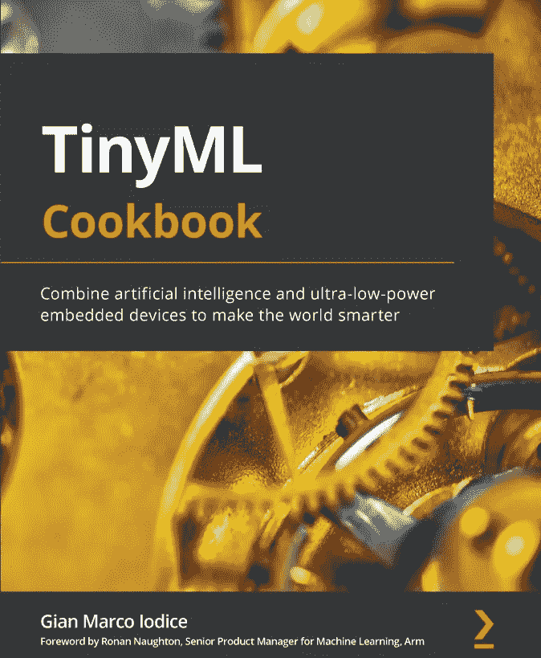

# 书评:TinyML 食谱

> 原文：<https://medium.com/mlearning-ai/book-review-tinyml-cookbook-454cba380c3d?source=collection_archive---------2----------------------->

当我被邀请评论一本名为“ [TinyML Cookbook](https://www.amazon.com/TinyML-Cookbook-artificial-intelligence-ultra-low-power/dp/180181497X/ref=sr_1_1?crid=1PDYRPBJRIT80&keywords=tinyml+cookbook&qid=1650977349&sprefix=tinyml+cookbook%2Caps%2C188&sr=8-1) ”的书时，我很兴奋，尽管我并不清楚这本书是关于什么的。这是一本充满了机器学习伟大秘诀的小书吗？它有快速 ML 的小片段吗？难道是指挥一个机器人手臂如何烹饪？——顺便说一下，最后一个实际上正在发生，以防你想知道，[这里有一个关于五星级机器人厨师](https://www.youtube.com/watch?v=mKCVol2iWcc)的有趣视频。

这个世界充满了惊喜，因此当我开始阅读这本书时，我最终发现了一个全新的世界，机器学习正在被应用，甚至不在我周围最远的角落。原来微型 ML 指的是在低功耗设备上直接使用嵌入式机器学习，是的，就像那些微型计算机，现在构成了从智能手表到智能雨伞的大量产品(如果你想知道，[是的，智能雨伞确实存在](https://www.youtube.com/watch?v=R4dLdvvannM))。

Gian Marco io dice[的](https://www.linkedin.com/in/gian-marco-iodice-3183a9a1/)[微型 ML 食谱](https://www.amazon.com/TinyML-Cookbook-artificial-intelligence-ultra-low-power/dp/180181497X/ref=sr_1_1?crid=1PDYRPBJRIT80&keywords=tinyml+cookbook&qid=1650977349&sprefix=tinyml+cookbook%2Caps%2C188&sr=8-1)来了，给我们带来了一本伟大的书，里面充满了将人工智能添加到不断增长的物联网世界的食谱。

这本书是关于什么的？

因为这是一篇书评，而不是一篇关于 Tiny ML 的文章，所以我将只给你一个它的应用的小例子，以及为什么它是一个有趣和有前途的领域。我们很多人都熟悉谷歌助手或 T2 的 Alexa，从智能手机到智能音箱，有很多设备都可以连接到这些服务。识别神奇的激活词“Ok Google”或“Alexa”是一个实际的机器学习应用程序。一些联网设备，如[谷歌 Nest 产品线](https://store.google.com/us/?hl=en-US&regionRedirect=true)或大量 Alexa 驱动的设备，都很小，然而，它们需要在本地运行神奇的单词识别，否则，它们将不得不一直占用大量带宽，服务器端将非常混乱。

这就是 Tiny ML 的救援之处，它完全是关于如何在小型物联网设备中实施 ML 应用程序，并发现由此带来的机遇和挑战。

这就是这本书的全部内容，如何在微型低功耗嵌入式设备中实现 ML。因此，如果你一直想知道如何通过应用 ML 让你的智能设备做更多的事情，这本书就是为你准备的。

一个小小的建议，如果你想从这本书中获得最大收益，确保你有硬件，像 Arduino 或 Raspberry Pi 系统(以及一些像传感器之类的组件)。

不过，如果你没有上述硬件，不要担心，你仍然会从这本书得到很多(但如果你可以，一定要得到一些甜蜜的 Arduino 或覆盆子齿轮)。

这本书写得好吗？

是的，很好。它清楚地解释了概念，并带有清晰易懂的所有硬件原理图，清晰的电路解释图和易于理解的编码示例。

简而言之，即使你对物联网设备没有什么经验，也很容易遵循每一步。非常重要的是，这是一本针对熟悉机器学习概念的人的书，尽管它在解释这些概念方面做得很好，但对于没有至少一些基本知识的人来说，这可能是具有挑战性的。

**是否很好的呈现了素材？**

一个字是。图纸，图形和编码的例子是清晰和良好的介绍。从写到画，到做，再到画，再到读，很容易，大部分时间都不会迷失自己。而且，虽然它有大量的内容，但它从来没有像许多技术书籍那样让人感到不知所措。

它很容易阅读，特别是如果你理解了概念，如果你熟悉 Arduino 和/或 Raspberry Pi 设备(我不熟悉)，它可能会更容易。

**它容易阅读吗？**

再说一次，这个问题很难回答。我倾向于肯定，不仅仅是因为它对我来说很容易阅读，还因为尽管我不太熟悉物联网设备，或者硬件，但我发现我从来没有努力去理解，掌握概念所需的信息就在那里。

我确实相信，这本书对至少没有一些机器学习背景的人来说是一个挑战，但我确实意识到，从我的角度来看，这可能只是我自己的偏见。

**你需要成为专家才能阅读这本书吗？**

在这里我倾向于不，你不。虽然我相信这本书的读者是寻求将他们的技术应用于物联网设备的 ML 专家，但事实是，我能够毫无问题地掌握这些设备的硬件概念，因此，可能任何人都会通过这本书开始接触物联网或 ML。

所以，即使我提到有些人可能会对这本书的 ML 方面感到困惑(同样，这可能是我自己的偏见)，也不要太在意我，毕竟，我们都必须从某个地方开始，这本书可能是一个有趣的起点。

**你会从这本书中学到多少？**

很多……周期。这本书汇集的两个主题非常广泛。物联网规模巨大，涵盖的设备多种多样，令人难以置信。另一方面，ML 是一个庞大的课题，然而，吉安·马尔科能够给我们带来一些创造性的解决方案，将复杂的算法(包括深度学习)应用到处理方面的小型和非常有限的设备中。

即使您无意使用物联网设备，您也将学习如何处理处理限制的 ML 问题。

当然，如果您对物联网一无所知，您会学到很多东西。

**易参照吗？**

是的。我会重复我自己的话: [Packt](https://www.linkedin.com/company/packt-publishing/) 书籍有一个非常全面的索引，它的结构方式使它可以让你通过快速浏览和翻页找到你想要的东西。也就是说，回到书的任何部分都是快速简单的。

简而言之，如果你是一个物联网专家，想通过添加 ML 来改进你的游戏，那就买这本书吧。如果您是想进入 TinyML 的 ML 专家，这是一本适合您的好书。如果你两者都不是，并且想了解两者，那就去做吧。

您会喜欢 TinyML 烹饪书并从中获益良多。

[这本书已经卖完了，你可以点击这里购买。](https://www.amazon.com/TinyML-Cookbook-artificial-intelligence-ultra-low-power/dp/180181497X/ref=sr_1_1?keywords=tinyml+cookbook&qid=1651068331&sprefix=tinyml+coo%2Caps%2C234&sr=8-1)

**注:** [Packt](https://www.linkedin.com/company/packt-publishing/) 确实提前给了我一本书的免费拷贝，以便我能写这篇评论。我没有得到任何其他的东西，无论是这个评论还是图书销售。我真的很高兴能成为这一经历的一部分，并能够帮助像[吉安·马可·奥迪斯](https://www.linkedin.com/in/gian-marco-iodice-3183a9a1/)这样的伟大作家和他的书得到关注，这样他们就可以继续他们的惊人工作。

 [## Mlearning.ai 提交建议

### 如何成为 Mlearning.ai 上的作家

medium.com](/mlearning-ai/mlearning-ai-submission-suggestions-b51e2b130bfb)