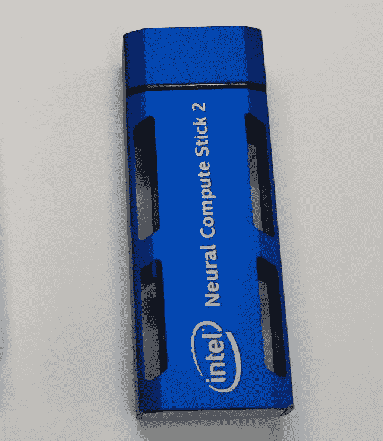

# 用神经计算棒 II 增强你人工智能模型

> 原文：<https://medium.com/mlearning-ai/boost-your-ai-model-with-neural-compute-stick-ii-ead507869fb1?source=collection_archive---------2----------------------->

在这个故事中，我向你展示了我是如何克服在一台简单的 i7 core 笔记本电脑上进行复杂的人工智能推理的项目需求的，该笔记本电脑具有合理的帧率，并有一个加速棒的帮助。这是什么，它是如何设置的，它如何执行将在这个故事中显示。

在我的情况下，这是一个姿态估计任务，需要在一个基本的办公笔记本电脑上运行，并带有 at…