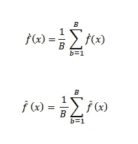
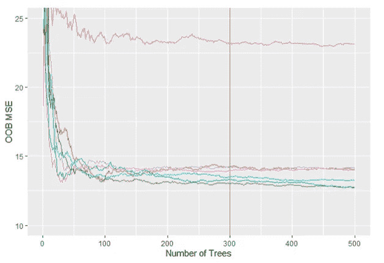
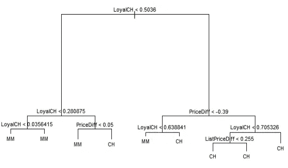
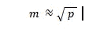
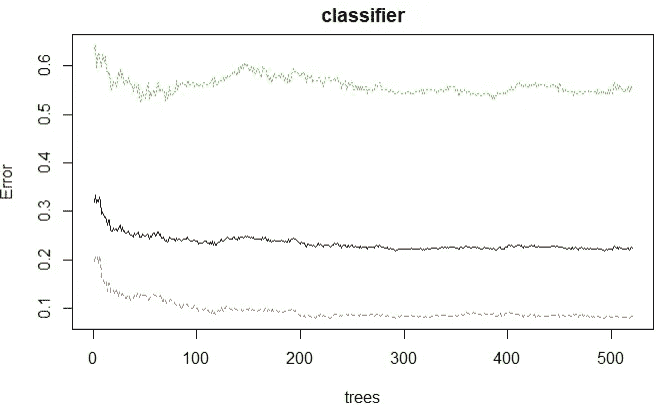
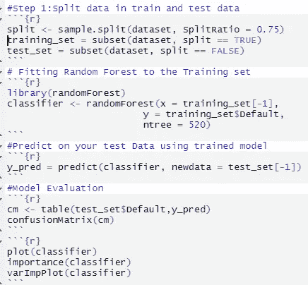
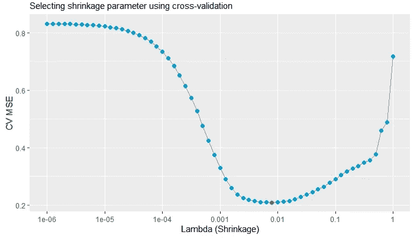
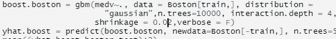

# 助推，装袋，随机森林

> 原文：<https://medium.com/mlearning-ai/boosting-bagging-random-forest-126fef1d1e74?source=collection_archive---------0----------------------->

可能存在无法计算数据集标准偏差的情况，在这种情况下 **Bootstrap** 变得有用，可以改进决策树等统计方法。

有时，决策树也可能具有很高的方差，也就是说，如果我们将训练数据集分成两半，并对它们运行决策树算法，两个输出可能会给出完全不同的结果。另一方面，当在不同的数据集上重复应用时，线性回归往往给出较低的方差。在这样的**场景下，自举聚合或打包**是一种有用且有效的技术。

作为一般概念，我们知道对一组观察值进行平均会减少方差。然而，在实际场景中，这可能是不可实现的，因为我们可能无法访问多个训练集。在这种情况下，我们通过从相同的训练集中获取重复的样本来引导，从而产生 B 个不同的引导训练集。然后，我们在中的 bth 自举训练集上训练我们的方法，最后对所有预测值进行平均。

Bagging 可以改进预测，在决策树中特别有用。实际上，我们使用一个大的 B，这样误差就稳定下来了。还有一种非常直接的方法来估计袋装模型的测试误差，甚至进行交叉验证。这被称为自付费用(OOB)。这是因为装袋的关键是重复拟合观测值的自举子集，装袋的树通常使用大约 2/3 的观测值，剩余的 1/3 不用于拟合装袋的树。

决策树最大的优势之一就是它的图形化表示。然而，当我们用袋子装大量的树时，这就被扭曲了。当我们提高预测准确性时，我们放弃了可解释性。虽然袋装树的集合比单一的树更难解释，但是我们可以使用 RSS(回归树)或 Gini 指数(分类树)很好地总结每个预测值的重要性。对于回归树，我们计算 RSS 由于在集合上的分割和在所有 B 树上的平均而减少的总量。大值表示是一个重要的预测值。而在分类树的情况下，我们得到基尼指数并在所有 B 树上平均它。

Each time we split a random sample of predictors is chosen typically where chosen

现在，让我们假设我们应用了 bagging，并在数据集中获得了一个非常强的预测器和一些中等强度的预测器。然后在收集袋装树时，大多数树会在顶部使用这种强预测器。因此，我们将有一个高度相关的袋装树。为了克服这种相关性，我们使用**随机森林。**我们在训练样本上建立了许多决策树。但是每次我们分开的时候，一个随机的预测样本会被选择

这也主要是因为平均许多高度相关的量不会导致方差的大幅减少，因为平均许多不相关的量并因此装袋不会显著减少方差。如果我们能够管理每次分割，以处理数据集的子集，我们就有可能克服这一挑战。这就是典型的随机森林所做的。我们对这些树进行去相关处理，从而使平均值的可变性更小，更加可靠。bagging 和随机森林的主要区别在于预测子集大小 m 的选择**当 m = p 时是 bagging，当 m=√p 时是随机森林。**

A plot to find the no of trees ; how error decreases with no. of tree

随机森林因此可以被认为是决策树的集合。它构建并组合多个决策树，以提高准确性。之所以命名为 random，是因为预测器是随机选择的；之所以命名为 forest，是因为使用了多个决策树来进行预测/决策。随机森林有助于克服过度拟合，并通过其特性使模型健壮。

作为随机森林算法的简单方法

A simple R code approach

1.  从训练集中随机抽取 m 个观察值。
2.  根据引导示例制作决策树。
3.  在每个节点随机选择 ***f*** 特性。
4.  根据目标函数(例如信息增益)基于产生最佳分裂的特征来分裂节点，
5.  重复上述步骤 k 次(k 是我们想要使用子集创建的树的数量)
6.  聚集从每个树中为新的数据点导出的预测值，以形成新的数据点，从而通过多数投票来分配类别标签。

随机森林的一些**优缺点**

1.  易于计算
2.  可以有效地处理数据
3.  缺失值、异常值，不要妨碍输出

然而:证明过度拟合并且不能预测超出训练数据集范围的值。

**Boosting** 是另一种改进决策树预测的方法。虽然一般方法与 bagging 相同，但在 bagging 中，每棵树都建立在 bootstrap 数据集上，而在 boosting 中，树是按顺序生长的，这意味着每棵树都是基于前一棵树生长的。

升压有三个调谐参数:

1.  树的数目 b .我们使用交叉验证来选择 b。
2.  收缩参数(λ):一个小正数，控制模型学习的速率。
3.  每棵树的分裂数 d。

— — — — — — — — — — — — @ — — — — — — — — — — — — — — — -