# 通过 Arvato 金融服务公司的目标市场营销提高销售额

> 原文：<https://medium.com/mlearning-ai/boosting-sales-through-targeted-marketing-with-arvato-financial-services-cd8043a04046?source=collection_archive---------8----------------------->

# 介绍

如果你曾经在 YouTube 上看过一个关于吸尘器的视频，然后发现自己无论走到哪里都被吸尘器广告轰炸，那么你就经历了目标营销。这种特定的定向营销是通过使用基于内容的推荐引擎来实现的。

今天，我还将进行有针对性的营销。然而，我不是向潜在客户提供产品推荐，而是向营销团队提供潜在客户转化的预测概率(假设他们已经参与了营销活动)。

# 项目定义

在这个项目中，德国的一家邮购销售公司有兴趣确定其市场营销的目标人群，以实现增长。

因此，我的目标有两个:

1.  使用客户细分，确定最能描述公司核心客户群的普通人群
2.  确定在营销活动中，哪些人最有可能转化。

为了衡量我的细分方法是否成功，我将定义一个叫做**客户因素(CF)的指标。** CF 是给定人群中的客户百分比除以总人群中的客户百分比。一个**CF 为 1** 的细分市场拥有与普通人群相同的客户比例。因此，我们的目标是找到 CF 大于 1 的片段。

我还将使用 ROC 曲线下面积(AUC) **度量**来评估监督学习模型在每个可能的分类阈值下的性能。

# 分析

我为这个项目提供了 3 个数据集:

1.  德国普通人口的人口统计数据- 89 万人
2.  邮购公司客户的人口统计数据- 19 万人
3.  作为营销活动目标的个人的人口统计数据-42，000 人

所有 3 个数据集至少有 **366 个分类(序数和名词)和数字特征**。还提供了一个数据字典，给出了这些特征的 85% (314)的描述。

366 个特性太多了，无法手动分析，所以我使用带有自定义配置的 [Pandas Profiling](https://pandas-profiling.github.io/pandas-profiling/docs/master/rtd/) 来执行我的探索性数据分析，使用下面的代码片段:

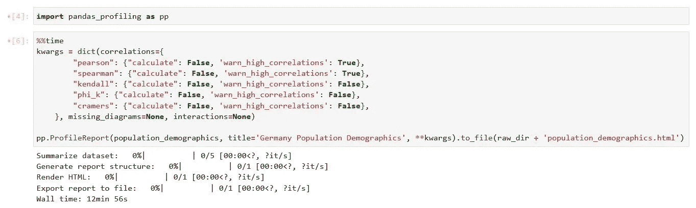

Generating Pandas Profiling EDA Report with custom configs

使用这些报告和数据字典，我得出了以下两个关键观察结果:

*   74%的特征是有序的

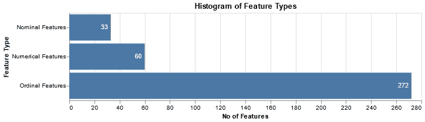

Distribution of Feature Types

*   我们的转化率为 **1.25%** 。这意味着在预测转化率时，我们将面对一个**不平衡的目标变量**。

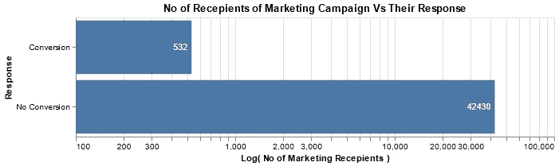

# 方法学

## 数据预处理

我的数据预处理流水线相对较轻。我

*   丢失数据超过 90%的已删除要素
*   对字符串列执行了标签编码
*   对相对于数据集的其余部分具有很大分布的要素执行最大-最小缩放。

因为我计划使用一个基于树的模型，所以[没有必要对名义特征进行一次性编码](https://towardsdatascience.com/one-hot-encoding-is-making-your-tree-based-ensembles-worse-heres-why-d64b282b5769)。

## 客户细分

我解决这个问题的第一个方法是使用带有噪声的应用程序的**基于分层密度的空间聚类***(*[**hdb scan**](https://hdbscan.readthedocs.io/en/latest/)**)**来执行分割/聚类，然后单独使用降维算法、**t-分布式随机邻居嵌入(**[**TSNE**](https://scikit-learn.org/stable/modules/generated/sklearn.manifold.TSNE.html)**)**来可视化结果。

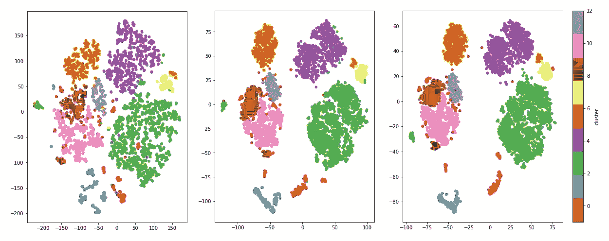

TSNE Visualisation at Perplexity 5, 30 and 50 respectively and clustered using HDBSCAN (Performed on 10% of the Population Data set)

HDBSCAN 更可取，因为它:

*   成功群集不同密度的数据组
*   将不适合任何聚类的数据标记为噪音
*   [比 DBSCAN 和其他几种聚类算法更具可扩展性](https://hdbscan.readthedocs.io/en/latest/performance_and_scalability.html)

然而，在经历了许多`MemoryError`例外之后，部分是由于我的机器的限制，我选择了如下所示的方法。

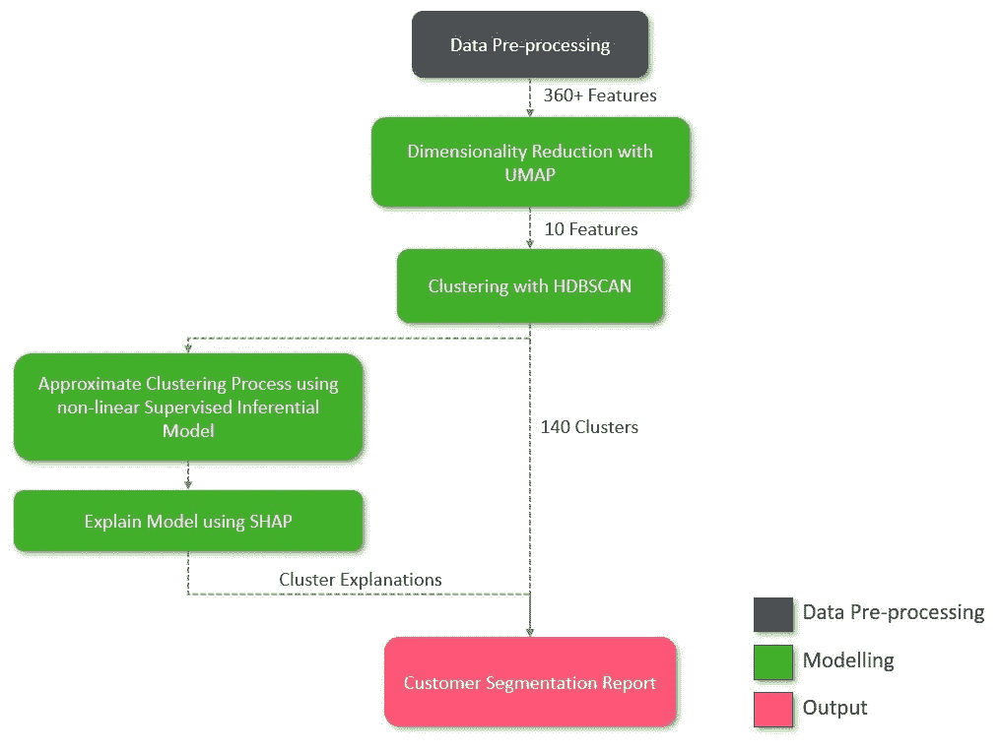

Flow Chart for Customer Segmentation Process

然而，正如你在上面看到的，我把 TSNE 换成了**均匀流形近似和投影(**[**【UMAP】**](https://umap-learn.readthedocs.io/en/latest/)**)**。为什么？

1.  UMAP 比 TSNE 更能代表全球结构。这对于聚类来说非常重要，以便获得能够很好地代表数据的聚类。
2.  相对于 TSNE，UMAP 提供了 x40 的速度提升。

我还使用了**一个非线性推理模型(LightGBM)** 来近似 UMAP 和 HDBSCAN 算法执行的聚类过程。这是为了揭示个体 clusters⁹.的特征重要性

最后，我使用 **SHAP 库**来生成推理模型的特征重要性，而不是原生基尼特征重要性。这是因为这是唯一一种既有一致性又有准确性的特征归属方法**，正如 Scott Lundberg 在[这篇非常有趣的帖子](https://towardsdatascience.com/interpretable-machine-learning-with-xgboost-9ec80d148d27)中解释的那样。**

## **构建转化率预测模型**

**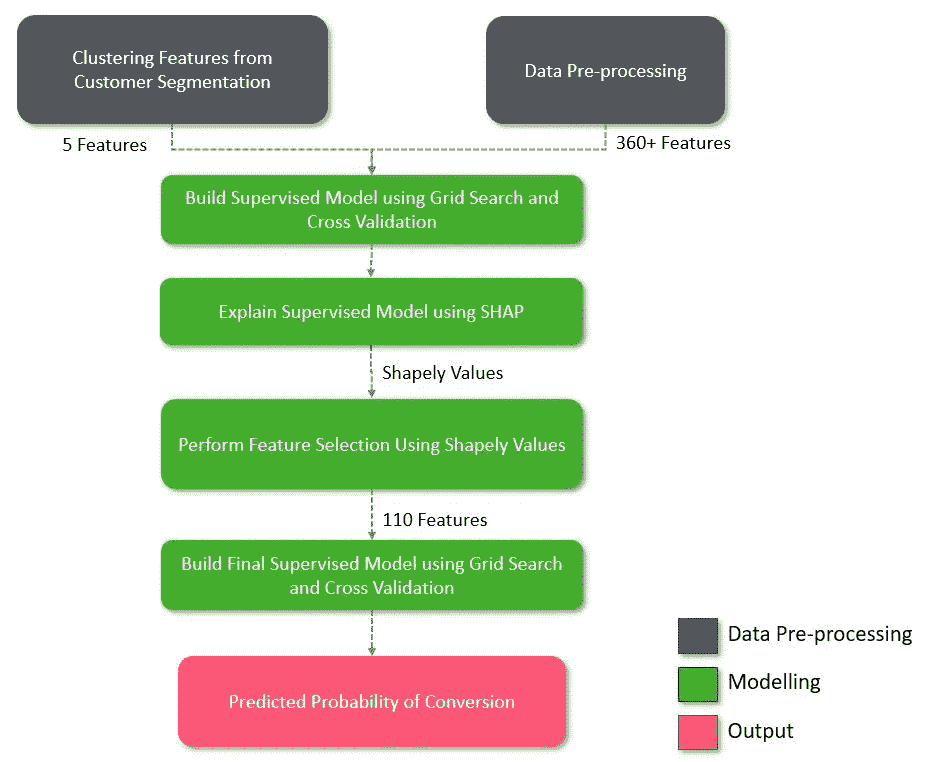**

**Flow Chart for Building Supervised Conversion Prediction Model**

**我在这里使用了 **LightGBM** ，因为监督模型训练比 xGBoost 或 sci-kit learn 的随机森林模型更快，性能也差不多。我还用网格搜索来确定参数。**

**为了处理转换速率的不平衡，我选择了**合成少数过采样技术(SMOTE)。在我的训练过程中，我测试了三种风格的 SMOTE:kmeansmote，BalancedSMOTE &由学习不平衡的 library⁸.提供的常规 smote****

**我还为模型训练创建了两个独立的工作流。在一个实验中，我用原始特征训练模型，而在另一个实验中，我用 UMAP 算法的 10 维向量训练模型。这里的关键思想是，后者应该训练得更快，AUC 与前者相似。**

**我使用了**分层 K 折叠交叉验证**来确保在执行交叉验证时在每个折叠中保持类平衡。**

**最后，我使用 SHAP 库生成的 Shapely 值来执行特征选择，如下面的代码片段所示:**

**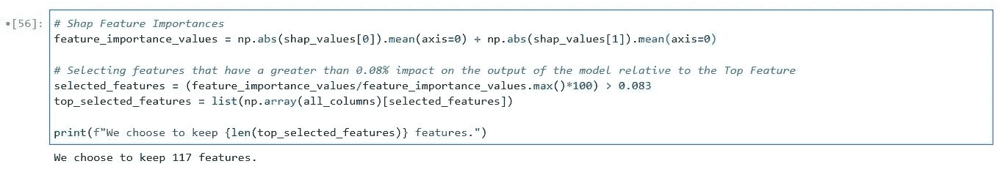**

**Performing Feature Selection with SHAP**

# **结果**

## **客户细分**

**上述多步聚类方法产生了 145 个独特的聚类。84%的群体数据集被成功聚类，而剩余的 16%被标记为噪声。**

**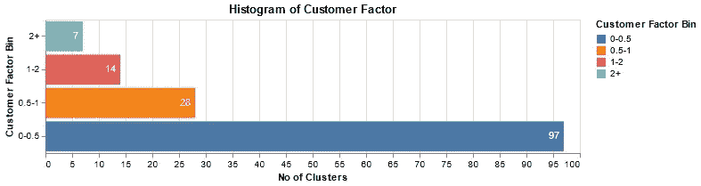**

**上面的直方图显示，我们发现了 21 个客户因子(CF)大于 1 的集群。这太棒了！**

**然而，这 21 个集群占客户群的百分比是多少？如果它少于 **15%** (这是我们在随机分配集群的情况下得到的结果)，那么我们的技术失败了。**

**为了回答这个问题，我制作了下面的气泡图**

**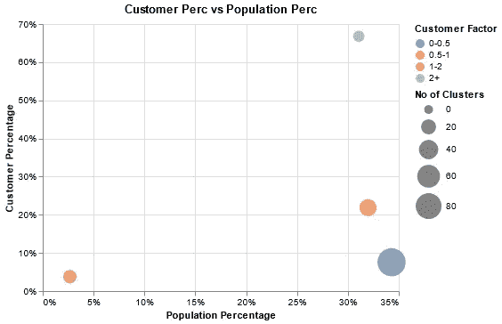**

**x 轴给出了分组聚类所捕获的德国总人口的百分比。y 轴也做同样的事情，但是是针对邮购公司的客户。**

**我们看到前 7 个集群(青色)占据了大约 67%的邮购公司客户群。剩余的 14 个簇(红色)捕获了大约 4%。因此，总体而言，21 个集群占据了 70%以上的客户群。成功！**

**另请注意，底部的 97 个集群(蓝色)虽然只占据了客户群的 **8%** ，却占据了德国人口的 **34%** 。可以肯定地说，营销团队应该把这部分人群放在次要位置。**

**使用我们构建的推理模型+ SHAP，我们可以发现顶级 clusters⁹的关键特征(注意，我使用了 SHAP 的依赖图来制定以下解释):**

**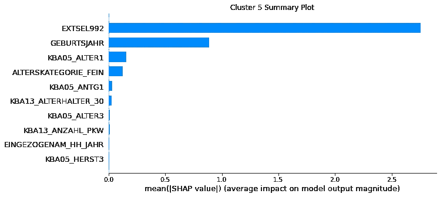**

**Feature Importance of Cluster 5 from Inferential Model**

****该集群包含约 44%** 的邮购客户群，其特点是在 31 岁以下车主比例较高的地区，相对较年轻。( **EXTEL992** 和 **GEBURTSJAHR** 与个人年龄有关。)**

**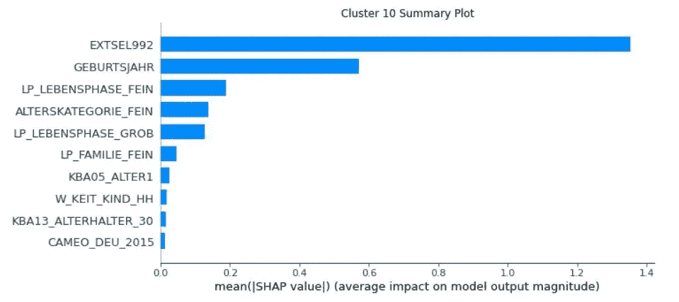**

**Feature Importance of Cluster 10 from Inferential Model**

****这个群体包含大约 20%** 的邮购客户群，其特点是相对年轻，没有孩子。(**LP _ lebenphase _ FEIN**与个人的生命阶段有关)**

## **构建转化率预测模型**

**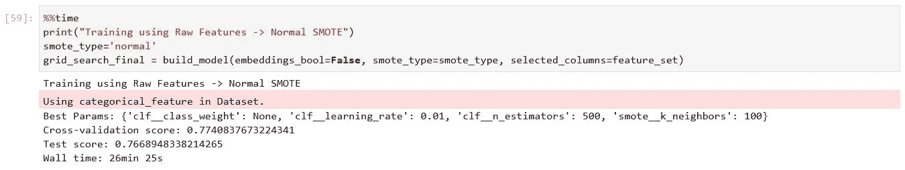**

**Best Performing Model**

**我的表现最好的模型在**测试** **中 AUC 达到 0.767。**注意，我满足于常规 SMOTE，因为它导致最小的过拟合模型。如上所示，获胜参数是:**

*   **0.01 的 LightGBM **learning_rate****
*   **500 棵决策树( **n_estimators****
*   **正则 SMOTE 算法**
*   **击杀邻居 100 人**

**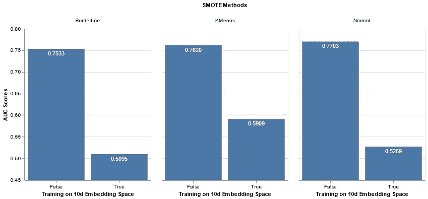**

**Training Results**

**上面我们看到了在特征选择之前的 AUC 测试集结果**。特征选择前后的结果相当相似。因此，即使在执行了特性选择之后，上面的图表仍然可以给我们提供有用的见解。****

**在来自 UMAP 的 10-d 向量上的训练产生了好得多的训练时间。在某些情况下，我实现了 **x8 的加速**。但是，请注意上面的内容，它会导致较差的 AUC。**

**这是因为我调整了 UMAP 算法，产生了一个 10 维向量，它能更好地代表全局结构，而不是局部结构。因此，它不包含足够的局部结构信息，因此模型无法预测各个转化率。**

**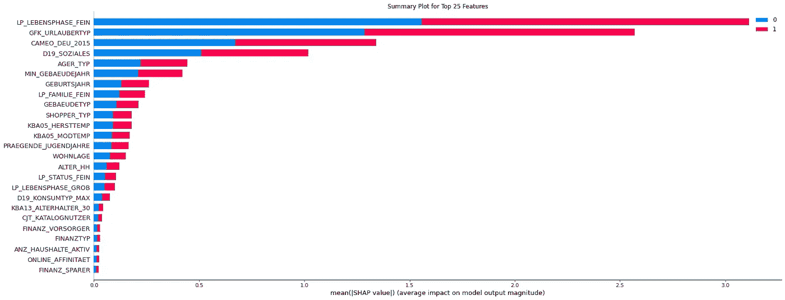**

**的五大特性解释如下。(注意，我使用了 SHAP 的依赖图来阐述下面的解释)**

1.  ****LP _ lebenphase _ FEIN**:个人的美好人生阶段范畴。处于人生早期阶段(单身低收入到平均收入)的人更有可能皈依。**
2.  **GFK_URLAUBERTYP :个人的度假习惯。度假习惯不明的人很可能会皈依。**
3.  ****CAMEO _ DEU _ 2015**:CAMEO 提供的人物分类。属于“最富有的人”一类的人可能会改变信仰**
4.  ****D19_SOZIALES** :未知特性。与个人的“社会”特征相关**
5.  ****AGER_TYP** :年龄分类。属于“经验驱动型老年人”的人更有可能改变信仰**

# **结论**

**总之:**

*   **我在普通人群中发现了客户系数大于 1 的细分市场，这些细分市场占据了邮购公司 70%以上的核心客户群。**
*   **我建立了一个监督模型，以 0.767 的 AUC 预测营销活动接受者的转化概率。**

**以下是我的方法可以改进的两个地方:**

1.  **测试处理不平衡数据的其他方法，例如 ADASYN**
2.  **尝试其他型号，如 CatBoost**

**这个项目真的很有趣！最具挑战性的部分是制定客户细分解决方案，因为机器的限制以及新手的限制；).如果你对项目的任何部分有更好的方法，请随意分享。**

**如果你想看看我的代码，可以在这里找到**

# **参考**

1.  **[如何有效地使用 t-SNE 作者:马丁·瓦滕伯格，费尔南达·维加斯&伊恩·约翰逊](https://distill.pub/2016/misread-tsne/)**
2.  **[hdb scan 如何工作— HDBSCAN 文档](https://hdbscan.readthedocs.io/en/latest/how_hdbscan_works.html)**
3.  **安迪·科恩的《了解 UMAP》&亚当·皮尔斯**
4.  **[使用 UMAP 进行聚类— UMAP 文档](https://umap-learn.readthedocs.io/en/latest/clustering.html)**
5.  **[tSNE vs. UMAP:尼古拉·奥斯科尔科夫的全球结构](https://towardsdatascience.com/tsne-vs-umap-global-structure-4d8045acba17)**
6.  **[用 light GBM-SHAP 文档进行普查收入分类](https://shap-lrjball.readthedocs.io/en/docs_update/example_notebooks/tree_explainer/Census%20income%20classification%20with%20LightGBM.html)**
7.  **[KSV·穆拉利达尔交叉验证 SMOTE 的正确使用方法](https://towardsdatascience.com/the-right-way-of-using-smote-with-cross-validation-92a8d09d00c7)**
8.  **[比较过采样采样器—不平衡学习文档](https://imbalanced-learn.org/stable/auto_examples/over-sampling/plot_comparison_over_sampling.html)**
9.  **[集群中的重要特性— GitHub 问题](https://github.com/scikit-learn-contrib/hdbscan/issues/195)**

** [## Mlearning.ai 提交建议

### 如何成为 Mlearning.ai 上的作家

medium.com](/mlearning-ai/mlearning-ai-submission-suggestions-b51e2b130bfb)**