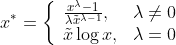
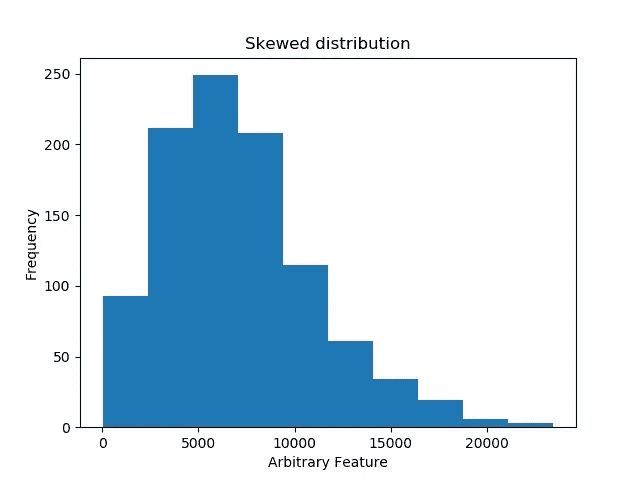
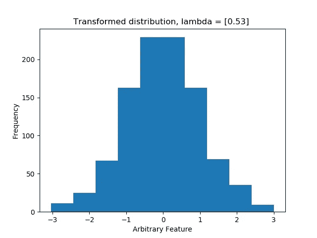
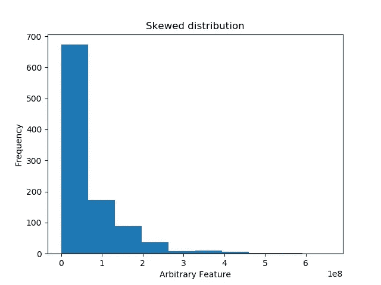
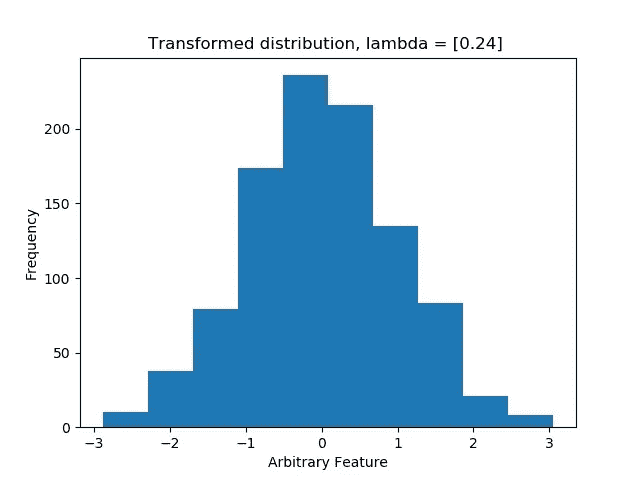
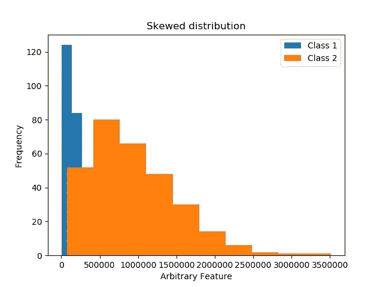
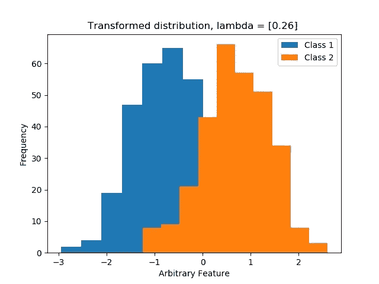

# Box-Cox 变换，一种提高模型稳健性的有效方法

> 原文：<https://medium.com/mlearning-ai/box-cox-transformation-an-effective-method-to-improve-robustness-of-your-model-a2a3014c7997?source=collection_archive---------3----------------------->

在本文中，我们将深入探讨数据的一个重要假设，这个假设经常被忽视或忽略。即数据的分布，特别是数据接近正态分布的程度。


Photo by [Mildlee](https://unsplash.com/@mildlee?utm_source=medium&utm_medium=referral) on [Unsplash](https://unsplash.com?utm_source=medium&utm_medium=referral)

在许多情况下，您在项目中应用的机器学习方法的底层算法假设数据近似正态分布，并且在许多情况下，数据接近正态分布，太好了！。但是，有时(这也是经常发生的),分布是偏斜的或扭曲的，这种方式阻止了模型在训练期间达到最优解。例如，[线性判别分析](https://mgudik.medium.com/linear-discriminant-analysis-lda-maximum-class-separation-1c3e2f66d846)假设数据呈正态分布。一般来说，在计算均值和方差时，计算方法与高斯分布的最大似然相关。好了，听够了这吓人又居高临下的演讲。

老实说，这真的没什么大不了的，但是解决这个问题的方法也没那么难，所以为什么不试一试呢？

1964 年，Box 和 Cox 开发了一种方法，通过将数据提升到功率变换器中，将你的分布映射成近似正态分布。这是通过使用最大似然估计来估计下式中的幂指数λ来实现的:



这看起来很混乱，但是让我们来分析一下。x 平铺(x 上方的曲线)是数据的几何平均值。

如果 lambda 等于 0，则转换为对数函数 log(x ),而 lambda = 1 将转换为单位转换，这意味着不进行任何转换。到目前为止，一切顺利。

如果λ= 0.5，那么方程的上半部分就变成了 x 的 0.5 次方，也就是平方根，除以 0.5 倍几何均值的-0.5 次方，等于分子乘以几何均值的平方根。换句话说(更简单的话)，如果 lambda 等于 0.5，那么转换就简化为计算平方根。

类似的，如果 lambda = -1，那么对应的是数据的逆变换，以此类推。

我可以看到这可能有点混乱和神秘，但是我将尝试给出一些(人工的)例子，在这些例子中，我创建了分布来验证转换是正确的。参见下图:



Here we can see that the skewed distribution is approximated Gaussian by using Box-Cox transform with lambda = 0.5, hence square root.



Another example, here the skewed distribution is transformed by lambda approximately 0.25, which is the fourth root of the data.

这种方法适用于几乎所有类型的分布，当然，有些数据是从非常奇怪的分布中生成的，这可能不容易通过变换发现，但大多数情况下，它最终会比原始分布更好地逼近高斯分布。

当转换已经发生时，很容易在转换的数据 NB 上拟合机器学习模型。应该记住，用于测试的数据应该以类似的方式进行转换，以保持管道中的一致性，以便在相同的尺度上比较特性。

## sklearn 中的实现

通过使用 Box-Cox 方法建立电源变压器模型，使用 sklearn 可以轻松实现 Box-Cox 电源变换。

```
from sklearn.preprocessing import PowerTransformerX_train = ...      # Data in the format (n_instances, n_features)model = PowerTransformer(method='box-cox')
model.fit(data)data_transformed = model.transform(X_train)clf =              # Some arbitrary classifier
clf.fit(data_transformed, y_train)
```

## 使用逻辑回归的快速分类示例

为了说明使用这种转换的重要性，我生成了一些 1D 数据(为了简单起见)并拟合了一个逻辑回归模型来对数据进行分类。在下面的图中，您可以看到原始数据和转换后的数据。



根据转换是否发生，评估两个模型的准确性会给出不同的结果。在下表中，您可以看到这个相对简单的转换的改进。

```
+-------------+---------------------+---------------+
|   Dataset   |    Classification   |    Accuracy   |
+-------------+---------------------+---------------+
| Original    | Logistic Regression |       0.5     |
| Transformed | Logistic Regression |       0.84    |
+-------------+---------------------+---------------+
```

## 结束语

应该提到的是，Box-Cox 变换只对严格的正数起作用。如果您的数据集包含负数，您要么必须移动数据所在的范围，要么使用另一个幂变换，*请参阅资料来源以了解更多信息。*

这就是现在的全部内容，我会很快带着更多关于机器学习的文章回来。我希望这篇文章有助于理解 Box-Cox 作为一种数据转换算法，并且您已经准备好在当前或下一个 ML 管道中使用这种算法。

如有任何意见或建议，请随时与我联系。

感谢您的阅读…

## 来源:

[](https://scikit-learn.org/stable/modules/generated/sklearn.preprocessing.PowerTransformer.html#sklearn.preprocessing.PowerTransformer) [## sk learn . preprocessing . power transformer-sci kit-learn 0 . 24 . 1 文档

### 幂变换是一系列参数化的单调变换，用于使数据更加…

scikit-learn.org](https://scikit-learn.org/stable/modules/generated/sklearn.preprocessing.PowerTransformer.html#sklearn.preprocessing.PowerTransformer) [](https://scikit-learn.org/stable/auto_examples/preprocessing/plot_map_data_to_normal.html) [## 将数据映射到正态分布-sci kit-了解 0.24.1 文档

### 请注意，当应用于某些数据集时，转换成功地将数据映射到正态分布，但是…

scikit-learn.org](https://scikit-learn.org/stable/auto_examples/preprocessing/plot_map_data_to_normal.html) 

*   特征工程和选择:预测模型的实用方法，2019，Max Kuhn & Kjell Johnson。