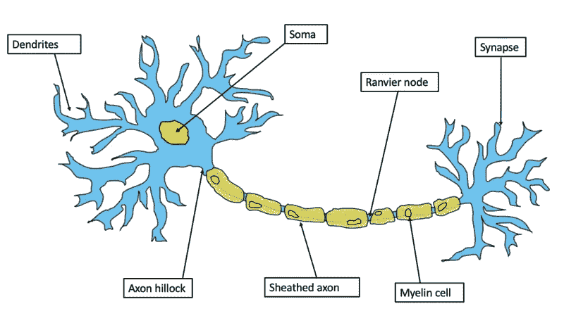

# 大脑中的思想、行动路径

> 原文：<https://medium.com/mlearning-ai/brain-robotics-neurons-thoughts-e62dc05931dd?source=collection_archive---------2----------------------->

A Neuron via [BrunelloN](https://commons.wikimedia.org/w/index.php?title=User:BrunelloN&action=edit&redlink=1)

大脑在类比意义上是如何工作的？

这些发生在这些电路，那些发生在那里。当有东西来访时，它们就会被激活。在这些访问的传递中有电信号。化学信号按位置顺序释放。

大脑中有两种主要细胞，主要的神经细胞和支持神经胶质细胞。流动性是丰富的，但理论上，中枢神经系统中最重要的运输被认为是。

哺乳动物睡觉有各种各样的原因，但另一个答案是思想。

为什么，因为任何时刻头脑上只能有一个主动的念头，却有无数个被动的念头。任何内部活动或外部感知的过程都可以成为一种活跃的思想——它进入记忆，然后到达感觉效果的现场。

在每个周期中，每件事都必须是积极的想法，所以在睡眠期间，一些人进入状态，而在清醒时，其他人进入状态。这使得过多的睡眠或睡眠不足成为问题，因为一些部分被否认成为活跃的思想。

就像腿、手或眼睛在刚醒来时感觉没有准备好，或者说有一段时间没有变得活跃一样，身体的许多其他随机部分在长时间清醒后也没有准备好，因为它们一直是被动的思想，没有变得活跃。

[活跃的思想交流](https://writer.zoho.com/writer/open/dpbiea67ec9ee78fe4654b2649387ec49c7ca)让睡眠时变换姿势或有规律地从一边到另一边变得很重要。

在休息或放松时，眼睛是闭着的，积极的想法会转移到其他区域，记忆会给人一种清新的感觉，几乎等同于睡眠，因为其他部分从被动变成了主动。

有一些上瘾的用法很容易将大部分应该是积极的想法转化为消极的想法，自动地将事物的感觉效果从它们原来的地方移除。新的活跃的思想可以带来最好的感觉，或者没有，但至少消除了情绪低落的积累点等等。记忆倾向于从活跃的思维中得到放松，从而反复使用。

由于大多数想法变得被动，它们能够很容易地切换到睡眠期间感觉影响的区域，使其容易昏厥，甚至更糟。

药物是生化的，所以它们会对基地感觉产生直接影响，更像是激素如何引起基地感觉。通常有一种思想等同于这种引起感觉效应的思想。精神活性物质既能收敛又能直接，比平常更有规律。

身体里发生的任何事情都不能用思想来解释，不管是主动的还是被动的。不是神经细胞是什么，而是它们承载的思想。

思想服务于记忆。记忆决定、努力和转移。是记忆给了我们什么，告诉我们该做什么。这是记忆把感情送到的地方。思想呈现，记忆决定。感觉像、焦虑、抑郁、障碍等等，很大程度上都是记忆路线。

分泌物等等处于较低的水平，因为记忆有一个允许——不允许的功能，告诉我们什么是应该的，什么是不应该的。引人入胜的想法会从记忆中浮现出来，压倒睡觉、吃饭等强烈的感觉。

好的情况或坏的情况在一段时间后往往不会有同样的感觉，因为他们最初积极的想法和参与，随着时间的推移变得被动，所以尽管它可能会被记住或经历，但它可能不会总是以最初的方式产生影响。

自动的和受控的过程从记忆中发生——都是以思想的形式，主动的或被动的。记忆可能会自动地给出一个想法，或者有控制或决定去寻找已知的东西。

身体任何部位发生的任何事情都必须进入记忆。最初，记忆可能知道也可能不知道，但它会到达那里。进入记忆的是思想或思想的一种形式。

它是在各种情况下储存、分组和给予的任何事物的思想版本。

这使记忆变得超级强大，所以它不仅仅是饥饿、寒冷、困倦或其他生化过程，而是通过记忆的加入，因为它已经存储了它是什么，并且必须给它感觉效果，使它看起来如此。

大脑中有一个恐惧回路，当一个活跃的想法到达那里时就会被激活。

恐惧回路之外是死亡。

如果死亡不在大脑中，没有人会死。

从理论上讲，为什么在危险中反应经常被累加的一个原因是避免想法从恐惧回路中到达死亡的地方。

大脑中至少有两个死亡中心——在恐惧回路之下，在睡眠时决定感觉的回路之上。

在这个睡眠回路中，在昏迷、用药过量和全身麻醉时，思想也会进入其中。在那里，有规律的消极思想变得活跃起来，但是比正常的要短。脑死亡是指大多数消极思想变得积极的能力减弱，除非有支持。离脑死亡一英寸就是死亡。

复苏可以说是一个转换成思想的感觉输入过程，以便它变得活跃，从而从死亡点带走。

思想回归常规线路，生活回归。

有时候，人们难以置信地在某些情况下幸存下来，因为思想没有进入死亡回路。有些人在某些情况下会突然死亡，因为它确实如此，包括某些休克。

就像有人可以暂停思想去听一个低沉的声音，注意或期待痛苦一样，有人可以保持积极的思想去死亡点，坚持，直到不可能，然后放手。

老年人更接近死亡，因为随着大量的休息，身体某些部分的积极思维比例下降，使他们变得被动，而其他人则变得更加积极地走向睡眠回路。

活跃的思维可能会发现从睡眠区一点一点地往上走更容易，并且一次到达目标，使老年人过渡。

这有时也适用于某些疾病。

衰老，理论上是很多部位缺乏足够活跃的思想的问题。这也是由于长时间的沉重的感觉影响，例如，从身体的其他部位获得最佳的注意力。

大脑根据思想的走向工作。

神经网络并不是模拟大脑最重要的发现。机器人思想有望至少赋予机器人一些情感，这样在帮助人类时，它们就有了自己的功能性情感。

 [## Mlearning.ai 提交建议

### 如何成为 Mlearning.ai 上的作家

medium.com](/mlearning-ai/mlearning-ai-submission-suggestions-b51e2b130bfb)