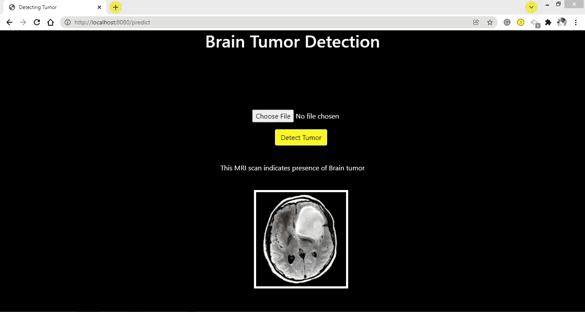
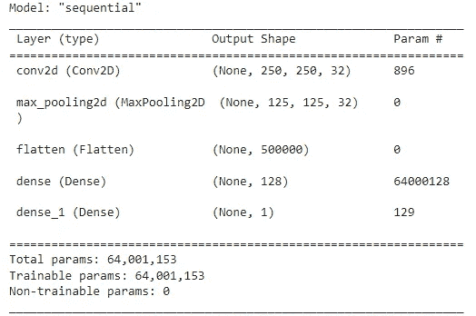

# 使用 VGG16 进行脑肿瘤检测和迁移学习

> 原文：<https://medium.com/mlearning-ai/brain-tumor-detection-transfer-learning-using-vgg16-a0d0a31f2e9?source=collection_archive---------3----------------------->

CNN 中使用自定义 VGG 变量和迁移学习检测脑瘤



在这篇博客中，我将谈论在深度学习中使用 CNN(卷积神经网络)进行脑肿瘤检测。我还会解释迁移学习的一点一滴，同时在旅途中解决问题。这篇博客要求你对 CNN 有一个清晰的了解，因为我不会在这里深入 CNN。如果你已经忘记了一些，打开你的笔记本&只是扫一扫那些笔记。我们都有或多或少忘记概念的问题。😉

也就是说，我写这篇博客更多的是为了记录我忘记迁移学习概念的时候。但是我确信&我真的希望这也能帮助你。😃

我第一次遇到这个问题是在 Edureka 的一个视频中:[利用深度学习进行癌症检测](https://www.youtube.com/watch?v=7MceDfpnP8k)。他们使用了一个脑肿瘤数据集，该数据集由多个健康的&肿瘤人脑的 MRI 扫描图像组成。他们使用 CNN 架构&转移学习在这个数据集中对健康的&肿瘤大脑进行分类。接下来，我进一步看到了一个很棒的博客:[如何对狗和猫的照片进行分类(准确率 97%)](https://machinelearningmastery.com/how-to-develop-a-convolutional-neural-network-to-classify-photos-of-dogs-and-cats/)作者是一位了不起的作家*杰森·布朗利。如果你还没有看过他的博客，现在是个好时机。永远都不晚！⏰ 😃*

我这篇文章的大部分内容都是受上述 2 个来源的启发。我用于训练和验证的数据集来自上面提到的 Edureka 的视频。为了进行测试，我使用了来自完全不同来源的数据:Kaggle 的[用于脑瘤检测的脑 MRI 图像](https://www.kaggle.com/navoneel/brain-mri-images-for-brain-tumor-detection)。我故意这样做，以便查看我的模型执行起来有多健壮。事不宜迟，我们先来看一些 CNN 的模型。

在训练数据集中，我们有 2513 个肿瘤脑图像和 2087 个健康脑图像，我从其中分离出 80:20 的分割用于训练:验证。数据集相当平衡。测试数据集有 155 张肿瘤图像和 98 张健康大脑图像。

这一点经常被忽略，但我认为 EDA 是非常必要的“初始步骤”，不仅在机器学习中，在深度学习中也是如此。为了能够将数据输入 CNN，首先对数据进行预处理是很重要的。例如，在这个问题中，我们有不同形状的图像(准确地说是宽度和高度)。在每个图像中，通道的数量是相同的，即这里是 3。现在，在机器学习中，我们通过标准化，规范化等进行预处理，对吗？有印象吗？😜

在图像数据的情况下也需要这样做。我快速绘制了所有图像的高度和宽度的 pdf，发现 250(像素，如果你不知道的话)是我们数据集中所有图像最常出现的高度和宽度。所以，第一步完成了:我们要把每张图片的形状做成(250，250)的形状。

接下来是在 Tensorflow/Keras 中使用 [ImageDataGenerator](https://www.tensorflow.org/api_docs/python/tf/keras/preprocessing/image/ImageDataGenerator) 类。它帮助您创建一个批量图像的生成器(如果您想用简单的术语思考，可以用迭代器),带有实时数据扩充。

*注意:我将在本文的稍后部分触及这个数据扩充部分*。

现在，让我们专注于完成预处理。首先，我们需要规范化图像(这里只是(250，250)形状的数组)。为此，我们可以使用 ImageDataGenerator 的 rescale 参数，并指定 1/255 来将像素值的比例降低到 0–1。

现在来看第一款**车型** →一个简单的架构:-



这是一个简单的模型，没有正规化，什么都没有。但是在完全看不见的测试数据集上仍然给出了 99.605%的准确率。

对于第二个模型，我使用了退出正则化。

```
# defining 2nd model architecture
model2=Sequential()model2.add(Conv2D(filters=32,kernel_size=(3,3),activation=”relu”,kernel_initializer=”he_uniform”,padding=”same”,input_shape=(250,250,3)))model2.add(MaxPooling2D(pool_size=(2,2)))model2.add(Dropout(0.2))model2.add(Conv2D(filters=64,kernel_size=(3,3),activation=”relu”,kernel_initializer=”he_uniform”,padding=”same”))model2.add(MaxPooling2D(pool_size=(2,2)))model2.add(Dropout(0.3))model2.add(Conv2D(filters=128,kernel_size=(3,3),activation=”relu”,kernel_initializer=”he_uniform”,padding=”same”))model2.add(MaxPooling2D(pool_size=(2,2)))model2.add(Dropout(0.3))model2.add(Flatten())model2.add(Dense(units=128,activation=”relu”,kernel_initializer=”he_uniform”))model2.add(Dense(units=1,activation=”sigmoid”))# compile the modelmodel2.compile(optimizer=”adam”,loss=”binary_crossentropy”,metrics=[“accuracy”])
```

这也给出了 99.605%的准确度。

现在来谈谈数据扩充。它是人工创建图像并扩展训练数据集的过程。这样做是为了让模型在学习实际输入图像的同时，学习其他多种不同的图像。这在数据集很小时尤其重要，但在数据集很大时也应该这样做。如果不是改进，增强不会对你的模型造成任何伤害。这也可以使用 ImageDataGenerator 来完成。看一下它的文档，它真的🆒！

注意:你不应该增加你的验证和测试数据集。绝不！这是强制性的，以便使模型在非增强图像上进行预测，非增强图像具有尽可能低的变化。

下一个模型增加了数据，架构与模型 2 相似，准确率为 90.514 %。

来转学…

迁移学习是一种采用神经网络模型的技术，该模型已经在不同的数据集上进行了预训练&使用该知识将学习“迁移”到不同的数据集任务。它有许多用例:-

情况 1:使用预先训练好的模型，如 VGG16，使用 [ImageNet](https://en.wikipedia.org/wiki/ImageNet) 权重进行特征提取。

案例二:微调 VGG16 的最后几层，同时保持较低的学习速率。

情况 3:在用 ImageNet 的权重初始化权重之后，微调整个网络。

案例 4:从头开始重新培训整个网络。

什么时候可以使用哪个用例:-

1.  您的数据集 **D** 很小，类似于 ImageNet👉使用预训练的模型进行特征提取，并将这些提取的特征输入到更简单的模型中，如逻辑回归，甚至是简单的展平+密集+输出图层(任意数量和类型的图层)。
2.  **D** 大&类似 ImageNet👉微调预训练模型的整个架构。
3.  **D** 是类似 ImageNet 的中型&👉只微调最后几层。
4.  **D** 小&与 ImageNet 不相似👉使用预训练模型的前 2-3 个块的权重进行特征提取&将它们添加到您自己的层或模型中以获得最终结果。
5.  **D** 较大&与 ImageNet 不相似👉用预定义的权重初始化架构，如 ImageNet 的权重，然后继续训练整个网络。

*注意:在以上几点中，预先训练好的模型可以是任何东西。可以是像 VGG16，ResNet，InceptionNet 等最臭名昭著的 CNN 机型。它也可以是您自己的预训练模型，您之前可能已经在另一个数据集上进行了训练&希望现在用于不同的数据集。*

注意:对于迁移学习，您需要以这些预训练模型期望的方式预处理您的图像。您可以使用 ImageDataGenerator 中的参数“preprocessing_function”来完成此操作。

对于这个问题，我使用权重从 2 个不同的层提取特征，并形成了 2 个不同的模型。

```
# loading the base-model
model4=VGG16(weights=’imagenet’,include_top=False,input_shape=(224,224,3))# mark the loaded layers as not-trainable
for layer in model4.layers:
  layer.trainable=False# adding new classifier layers
flat = Flatten()(model4.layers[-1].output)classifier = Dense(units=128,activation=’relu’,kernel_initializer=”he_uniform”)(flat)output = Dense(units=1,activation=”sigmoid”)(classifier)# define the model
model4 = Model(inputs=model4.inputs,outputs=output)
```

我使用最后一个 max-pooling 层的输出进行特征提取。这也给出了 99.605%的准确度。

*如果您不想让预训练模型的权重在训练期间更新，请记住将预训练模型的层设为不可训练。*

对于下一个模型，我使用第三块的输出进行特征提取。

```
base_model = VGG16(weights=’imagenet’,include_top=False,input_shape=(224,224,3))# mark the loaded layers as not-trainable
for layer in base_model.layers:
  layer.trainable=False# adding new classifier layers
flat = Flatten()(base_model.get_layer(‘block3_pool’).output)dense1 = Dense(units=128,activation=’relu’,kernel_initializer=”he_uniform”)(flat)drp = Dropout(0.3)(dense1)dense2 = Dense(units=64,activation=’relu’,kernel_initializer=”he_uniform”)(drp)dense3 = Dense(units=32,activation=’relu’,kernel_initializer=”he_uniform”)(dense2)output = Dense(units=1,activation=”sigmoid”)(dense3)# define the model
model5 = Model(inputs=base_model.inputs,outputs=output)
```

该模型的精确度非常低，为 62.055 %，而第四个模型的精确度更高，这可能是因为这里使用了更早的图层权重来提取特征。这表明最好使用后面层的权重，因为它们已经在非常好的资源和非常强大的数据集 ImageNet 上进行了训练。

我喜欢创建端到端的项目。下面是我的 web 应用程序的 GIF，它是我使用 Flask API 创建的，部署在本地:-

注意:我在这里主要是在玩模型。您可以&更确切地说，肯定应该使用上述模型或其他架构进行更多的实验。😃 😏

如果你想知道我实验的更详细的方法，请访问这个问题的 GitHub Repo。

我将向您介绍一些非常好的资源，我接受了他们的帮助

[](https://keras.io/guides/transfer_learning/) [## Keras 文档:迁移学习和微调

### 作者:fchollet 创建日期:2020/04/15 最后修改时间:2020/05/12 描述:迁移学习的完整指南&…

keras.io](https://keras.io/guides/transfer_learning/) [](https://keras.io/api/applications/#extract-features-with-vgg16) [## Keras 文档:Keras 应用程序

### Keras 应用程序是深度学习模型，可与预训练的权重一起使用。这些型号可以是…

keras.io](https://keras.io/api/applications/#extract-features-with-vgg16) [](https://machinelearningmastery.com/how-to-develop-a-convolutional-neural-network-to-classify-photos-of-dogs-and-cats/) [## 如何对狗和猫的照片进行分类(准确率 97%)-机器学习掌握

### 逐步开发一个深度卷积神经网络来对狗和猫的照片进行分类

machinelearningmastery.com](https://machinelearningmastery.com/how-to-develop-a-convolutional-neural-network-to-classify-photos-of-dogs-and-cats/) 

其他:-

[](https://www.appliedaicourse.com/) [## 应用根

### 我们知道转行是多么具有挑战性。我们的应用人工智能/机器学习课程被设计为整体学习…

www.appliedaicourse.com](https://www.appliedaicourse.com/) [](/mlearning-ai/mlearning-ai-submission-suggestions-b51e2b130bfb) [## Mlearning.ai 提交建议

### 如何成为 Mlearning.ai 上的作家

medium.com](/mlearning-ai/mlearning-ai-submission-suggestions-b51e2b130bfb)