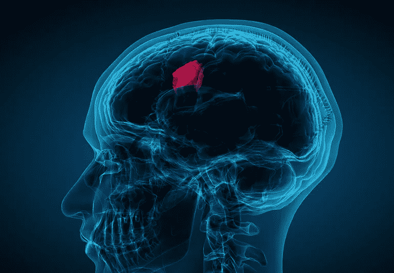
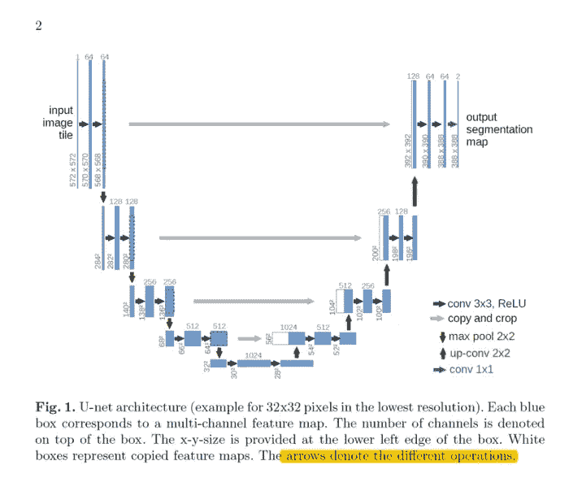
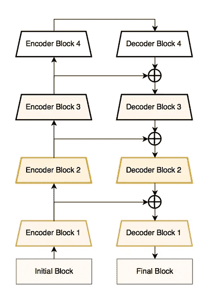
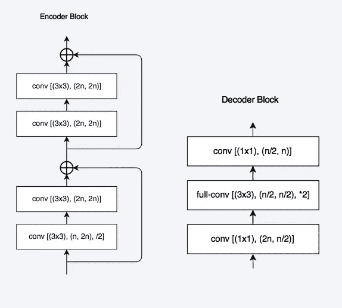
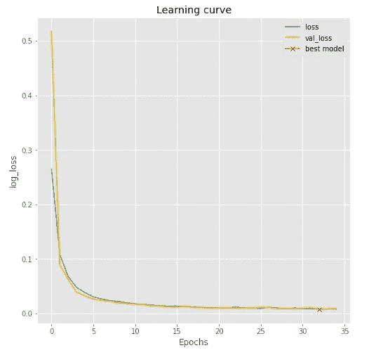
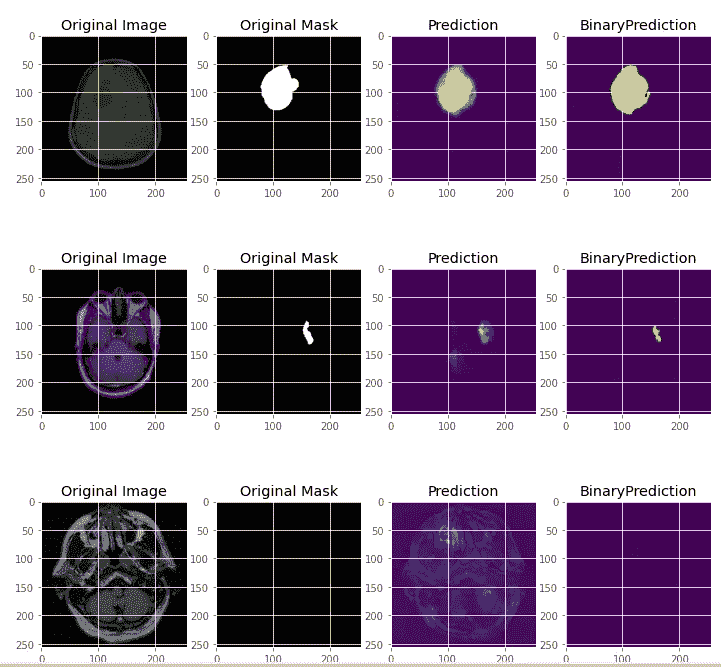
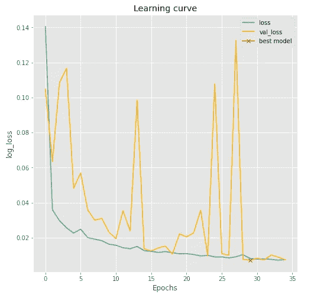
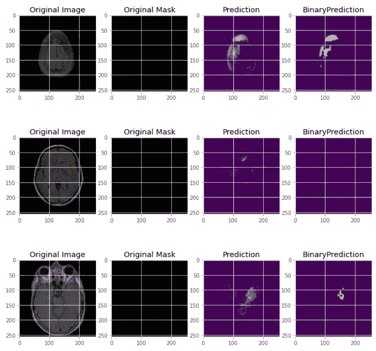

# 使用深度学习模型的脑肿瘤分割

> 原文：<https://medium.com/mlearning-ai/brain-tumor-segmentation-using-deep-learning-models-5047984b53c0?source=collection_archive---------1----------------------->

> 一种使用脑部 MRI 分割肿瘤的深度学习方法。

**Source** — [Cleveland clinic](https://health.clevelandclinic.org/what-are-the-actual-warning-signs-of-a-brain-tumor/)

> **摘要—** 用于脑肿瘤分割的精确自动算法具有改进疾病诊断、治疗计划以及实现大规模病理学研究的潜力。本文介绍了两个深度学习模型的实现，这两个模型用于使用 Kaggle 上的数据集中可用的图像来分割脑肿瘤。

# 介绍

仅在美国，据估计 2015 年将诊断出 23，000 例脑癌新病例。 [1](http://www.sciencedirect.com.dtulibrary.remotexs.in/science/article/pii/S1361841516300330#fn0001) 虽然神经胶质瘤是最常见的脑肿瘤，但在预期寿命为几年的患者中，神经胶质瘤的侵袭性较低(即低级别)，在预期寿命至多为 2 年的患者中，神经胶质瘤的侵袭性较高(即高级别)。

虽然外科手术是脑瘤最常见的治疗方法，但放射和化学疗法可以用来减缓不能用物理方法切除的肿瘤的生长。磁共振成像(MRI)提供大脑的详细图像，并且是用于诊断脑肿瘤的最常见的测试之一。更重要的是，从 MR 图像中分割脑肿瘤可以对改进诊断、生长率预测和治疗计划产生重大影响。

脑肿瘤影像分析的最终目的是提取患者特异性的重要临床信息及其诊断特征。嵌入在多维图像数据中的这种信息可以在疾病已经被检测和定位之后指导和监控干预，最终导致疾病的临床诊断、分期和治疗的知识。

# 了解数据集

本文所指的数据集摘自 kaggle，[《脑 MRI 分割》](https://www.kaggle.com/mateuszbuda/lgg-mri-segmentation)。

它最初是从癌症成像档案馆的 110 名患者那里收集的。数据集包含 110 个文件夹，每个文件夹对应一名患者。每个文件夹都包含磁共振图像及其遮罩。总共有 3929 个图像和掩模对，每个患者平均有 35.71 个 MR 图像。为了增加图像的数量，使用以下参数进行数据扩充— *rotation_range=0.2，width_shift_range=0.05，height_shift_range=0.05，shear_range=0.05，zoom_range=0.05，horizontal_flip=True，fill _ mode =‘nearest’。*

为了测试这些模型，完整的数据集被分成两部分——按 70:30 的比例进行训练和测试。

# 深度学习模型

在数据集上实现两个深度学习模型来分割肿瘤。

## UNet

UNET 由 Olaf Ronneberger 等人开发，用于生物医学图像分割。该架构包含两条路径，收缩路径也称为编码器，用于捕获图像中的上下文。编码器只是一个传统的卷积和最大池层堆栈。编码器路径之后是解码器路径或对称扩展路径，用于使用转置卷积实现精确定位。因此，它是一个端到端的完全卷积网络(FCN)，即它只包含卷积层，不包含任何密集层，因此它可以接受任何大小的图像。

培养

为了训练用于分割的 UNet 模型，将 256×256×3 的图像作为输入馈送到模型中。训练在 35 个时期进行，批次大小为 32。

## Linknet

LinkNet 是一种*轻型*深度神经网络架构，旨在执行语义分割，可用于自动驾驶车辆、增强现实等任务。

在每个下采样块之后，Linknet 架构试图有效地与解码器共享由编码器学习的信息。这被证明比在解码器中使用汇集索引或仅在解码器中使用完全卷积网络要好。这种特征转发技术不仅给了我们良好的精度值，而且使我们能够在解码器中具有较少的参数。

Linknet Architecture

**编码器和解码器—** 在所示的编码器和解码器块中，可以使用 ***n = 64x2^i*** 来计算每层的输入和输出特征图，其中 ***i*** 块索引。第一编码器块不执行步进卷积，并且每个卷积层之后是批量归一化和作为非线性的 ReLU。编码器架构与 ResNet-18 相同

Encoder Decoder blocks

培养

为了训练用于分割的 Linknet 模型，将 256×256×3 的图像作为输入输入到模型中。训练在 35 个时期进行，批次大小为 32。

# 评估结果

上面提到的两个模型都是在相同的条件下训练和测试的。为最小验证损失设置了回调。

对于 UNet 模型，最佳权重给出了 0.084 的验证损失和 99.90%的准确度。下图显示了模型的训练和测试数据的对数损失与历元的关系。最佳权重在图中标记为十字。

UNet model results

Predictions of UNet model

对于 Linknet 模型，最佳权重给出了 0.070 的验证损失和 99.74%的准确度。下图显示了模型的训练和测试数据的对数损失与历元的关系。最佳权重在图中标记为十字。

Linknet model results

Predictions of Linknet model

# 观察

观察到，对于 MR 图像中的肿瘤分割，Linknet 能够产生比 UNet 模型更少的损失。尽管 Linknet 不太准确。总的来说，可以看出，这两种模型在医学成像中工作良好，可以在更大的数据集上进行测试，因此可以在医学科学领域中实施，以帮助专家分割肿瘤，并进一步帮助更快地治疗癌症患者。这项研究还可以在其他身体部位的磁共振图像上实施，以检测肿瘤。

# 参考

1.  [https://doi.org/10.1016/j.media.2016.05.004](http://doi.org.dtulibrary.remotexs.in/10.1016/j.media.2016.05.004)
2.  【https://doi.org/10.1016/j.mri.2013.05.002 号
3.  【https://arxiv.org/abs/1505.04597 
4.  [https://doi.org/10.1109/VCIP.2017.8305148](https://doi.org/10.1109/VCIP.2017.8305148)
5.  [https://www.kaggle.com/mateuszbuda/lgg-mri-segmentation](https://www.kaggle.com/mateuszbuda/lgg-mri-segmentation)

 [## GitHub-sakshamchecker/脑瘤分割

### 此时您不能执行该操作。您已使用另一个标签页或窗口登录。您已在另一个选项卡中注销，或者…

github.com](https://github.com/sakshamchecker/BrainTumorSegmentation)  [## Mlearning.ai 提交建议

### 如何成为 Mlearning.ai 上的作家

medium.com](/mlearning-ai/mlearning-ai-submission-suggestions-b51e2b130bfb)