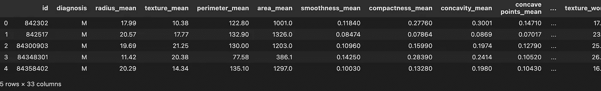
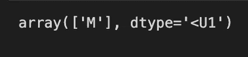
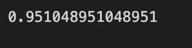

# 乳腺癌——朴素贝叶斯

> 原文：<https://medium.com/mlearning-ai/breast-cancer-naive-bayes-7f89942c05fa?source=collection_archive---------7----------------------->

## 使用朴素贝叶斯模型，我们将制作一个乳腺癌预测模型，该模型将预测乳腺癌的类型。

正如在上一篇文章中，我已经给你介绍了**朴素** **贝叶斯**现在我将告诉你如何在这篇文章中用几行**代码制作一个**朴素** **贝叶斯模型**。**

如果您想了解**朴素贝叶斯** **模型**，请点击此**链接—**

 [## 什么是朴素贝叶斯？

### 机器学习算法导论

iaviral.medium.com](https://iaviral.medium.com/what-is-naive-bayes-1276a384efc) 

**那么让我们开始**

**第一步**是我们需要**下载**数据集**然后将数据集应用于模型。您可以从 **URL —** 中**下载**或**复制**数据**

[https://raw . githubusercontent . com/aviralb 13/git-codes/main/datas/Breast % 20 cancer . CSV](https://raw.githubusercontent.com/aviralb13/git-codes/main/datas/Breast%20cancer.csv)

 [## git-codes/Breast cancer . CSV at main aviral B13/git-codes

### 在 GitHub 上创建一个帐户，为 aviralb13/git-codes 的开发做出贡献。

github.com](https://github.com/aviralb13/git-codes/blob/main/datas/Breast%20cancer.csv) 

# 导入库

现在我们将导入**熊猫**和 **NumPy** ，如下图所示。如果您的系统没有安装这些库，您可以使用 **pip** 命令获得它们。

# 数据准备

现在我们将使用 **Pandas** 读取数据，并将其保存在一个名为 **data** 的变量中，这样我们就不用**一次又一次地调用**了。使用**头**命令，我们可以查看第 **5 个组件**的数据；如果想让**看得更清楚**，在**支架**内输入**编号**。

# 定义 X 和 Y

现在我已经创建了一个**列表**，其中我认为它将是一个**乳房** **癌症**的**诊断**的**决定因素**，即(半径 _ 平均值、纹理 _ 平均值、周长 _ 平均值、面积 _ 平均值、平滑度 _ 平均值、紧密度 _ 平均值和凹度 _ 平均值)并将其分配给**变量** **特征**现在我将在**特征**中传递

我相信这些 **x** **参数**更**合适**，如果你想修改**参数**，因为你相信它们与**相关**，你可以这样做。

# 制作模型

## 分割数据集

在**拆分**我们的模型**数据集**到**训练**和**测试**数据集**之前，我们必须先从**sk learn**模型** **选择**中导入**测试训练拆分**。****

## 模型

这里我们将使用一个**高斯朴素贝叶斯** **模型**，因为我们希望我们的值是一个整数值，并将我们的模型命名为 **GNB** 。我们将从 sklearn 导入我们的模型，这是一个很棒的机器学习库。

# 预测

我没有制作一个名为**预测**的**变量**，它将**预测**我们测试数据的值。

我们也可以通过手工将**值**添加到**列表中来**预测** **输入的**值。**

> 我在这里输入了值
> 
> 半径平均值=17.99
> 
> 纹理平均值=10.38
> 
> 周长平均值=122.8
> 
> area_mean=1001
> 
> smoothness _ mean = 0.1184
> 
> 紧密度均值=0.2776
> 
> 凹度平均值=0.3001

这意味着特定输入的**诊断结果**为 **M**

## 准确(性)

现在我们来看看我们的**型号的** **精度**。我们的模型有 95%的准确性，这意味着它正确地预测了可能的 100 个值中的 95 个值。这很好。

# 源代码

你可以去查看完整代码的链接

 [## git 代码/乳腺癌(nb)。主 aviralb13/git 代码处的 ipynb

### 在 GitHub 上创建一个帐户，为 aviralb13/git-codes 的开发做出贡献。

github.com](https://github.com/aviralb13/git-codes/blob/main/machine%20learning%20models/breast_cancer%28nb%29.ipynb) 

# 结论

在这篇文章中，我已经给了你如何制作一个**乳房** **癌症** **预测** **模型**和**源代码**的信息和代码，我会为你制作更多令人兴奋的**模型**，所以请保持**联系。**

 [## Mlearning.ai 提交建议

### 如何成为 Mlearning.ai 上的作家

medium.com](/mlearning-ai/mlearning-ai-submission-suggestions-b51e2b130bfb)