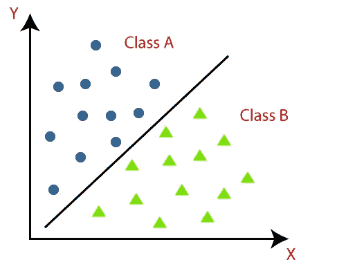
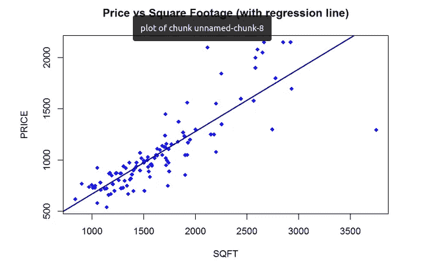
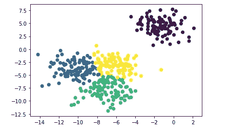

# 机器学习的类型简介

> 原文：<https://medium.com/mlearning-ai/brief-introduction-to-the-types-of-machine-learning-d743dded981f?source=collection_archive---------4----------------------->

机器学习问题通常可以分为 3 种类型

> *分类、回归和聚类*

虽然分类和回归是有监督的学习方法，但是聚类是无监督的学习方法。什么是监督与非监督学习？让我们深入研究一下。

**监督学习:** *监督学习是一种机器学习方法，它是通过使用标记数据集来定义的。这些数据集旨在训练或“监督”算法对数据进行分类或准确预测结果*

**无监督学习:** *无监督学习利用机器学习算法对无标签数据集进行分析和聚类。这些算法发现数据中的隐藏模式，无需人工干预(因此，它们是“无人监管的”)。*

现在，让我们深入研究监督学习方法——分类和回归。

## 分类-

顾名思义，分类是一种机器学习类型，其中您预测或分类类别/标签。它只能有分类输出。

例如，如果预测值倾向于是/否、肯定/否定等类别，那么它属于机器学习中的分类类型问题。

例如:给定一个句子，预测它是负面的还是正面的评论。或者给定学生的属性，预测他们属于 A 类还是 b 类。

## **回归-**

与分类类型类似，这里唯一的区别是预测值往往是一个连续值。在这些情况下，它属于机器学习中的回归型问题

例如:给出地区名称、土地面积等特征，并预测土地的预期成本。土地成本可以是一个连续的数值，而不是一个分类值。

接下来让我们来看看无监督学习方法——聚类。

**聚类** —在聚类中，由于我们不知道标签/类别，我们通过计算数据集之间的欧几里德(或任何其他类型的距离)距离来找到数据集中的相似性，并将它们聚类/分组在一起。简而言之，将一组点分组为给定数量的簇。

示例:给定-3、-4、-8、-9、-12、-13、6.6、6.7 和 4 个聚类数，那么 ML 系统可以将给定的集合划分为**聚类 1**–3、-4 和**聚类 2**–8、-9 **、聚类 3**–12、-13 和**聚类 4**–6.6、6.7，它们由下面的四个聚类表示。

 [## Mlearning.ai 提交建议

### 如何成为 Mlearning.ai 上的作家

medium.com](/mlearning-ai/mlearning-ai-submission-suggestions-b51e2b130bfb)