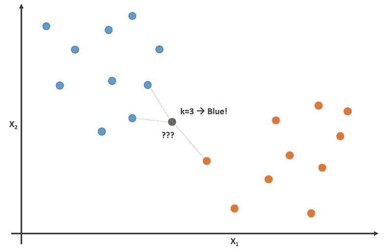

# 使用-k-最近邻构建模型

> 原文：<https://medium.com/mlearning-ai/build-a-model-using-k-nearest-neighbours-91925bcc83bb?source=collection_archive---------7----------------------->

k-最近邻(k-NN)算法是一种简单的监督机器学习算法，可用于解决分类和回归问题。它被称为“懒惰学习者”，因为它不从训练数据中学习判别函数，而是简单地存储训练数据，并将其作为分类的基础。

# 它是如何工作的

k-NN 算法通过计算测试点和训练数据集中所有点之间的距离来工作。距离可以是任何度量单位，如欧几里德距离、曼哈顿距离或闵可夫斯基距离。一旦计算出距离，该算法就选择 k 个最近邻，其中 k 是由用户指定的正整数。

接下来，该算法查看 k 个最近邻的标签(或输出值),并使用它们对测试点进行预测。在分类问题中，预测只是 k 个最近邻中最常见的标签。在回归问题中，预测是 k 个最近邻的输出值的平均值。

k-NN 算法的主要优点之一是它非常容易实现和理解。此外，它是一个非参数算法，这意味着它对底层数据分布不做任何假设。这使得它非常适用于数据可能具有非线性模式或要素数量较大的问题。



然而，k-NN 算法也有一些缺点。一个主要的缺点是计算量很大，尤其是当训练数据集很大时。此外，该算法可能对 k 的选择敏感，这使得难以找到最优值。此外，该算法不适用于高维数据，因为距离度量在高维中可能变得不可靠。

# 为“k”优化

优化 k-最近邻(k-NN)算法中 k 的选择的一种方法是使用一种称为交叉验证的技术。交叉验证包括将训练数据集分成多个折叠，通常为 10 个，然后运行 k-NN 算法 k 次，每次使用不同的折叠作为测试集，剩余的折叠作为训练集。

对于 k 的每个值，算法计算测试集的准确度(或误差)。然后选择产生最高准确度(或最低误差)的 k 值作为 k 的最佳值。这种方法允许客观地评估算法并选择 k 的最佳值，而不需要单独的验证数据集。

另一种优化 k 选择的方法是使用一种叫做网格搜索的技术。在网格搜索中，用户指定 k 的可能值的范围，算法尝试 k 的每个值，并使用性能度量(如精度或误差)来评估 k-NN 算法的性能。然后选择产生最佳性能的 k 值作为 k 的最佳值

还需要注意的是，k 的最佳值可能会因数据集和所解决的问题而异。因此，可能有必要试验不同的 k 值，并使用交叉验证或网格搜索来找到给定数据集的最佳值。

# 用 k-NN 预测房价

假设我们得到了一个城市中房子的数据集，目标是根据房子的大小、卧室数量和位置来预测房子的价格。这是一个回归问题，因为产出变量(房价)是连续的。

为了使用 k-NN 算法解决这个问题，我们首先需要将数据集分成训练集和测试集。训练集用于训练 k-NN 算法，而测试集用于评估其性能。

接下来，我们需要为 k 选择一个值。如前所述，这可以使用交叉验证或网格搜索来完成。为了这个例子，假设我们选择 k = 5。

为了应用 k-NN 算法，我们首先需要计算每个测试点和训练集中所有点之间的距离。这通常使用欧几里德距离来完成，欧几里德距离是欧几里德空间中两点之间的直线距离。

计算出距离后，该算法会根据距离选择每个测试点的 5 个最近邻居。然后，它查看 5 个最近邻居的输出值(房价),并将这些值的平均值作为测试点的预测房价。对每个测试点重复这个过程，将预测的房价收集到一个列表中。

为了评估 k-NN 算法的性能，我们可以将预测的房价与测试集中的实际房价进行比较。这可以通过一个性能指标来实现，比如均方根误差(RMSE)，它衡量预测值和实际值之间的差异。RMSE 越低，算法的性能越好。

总之，要使用 k-NN 算法进行回归，我们需要:

1.  将数据集拆分为训练集和测试集。
2.  使用交叉验证或网格搜索选择 k 值。
3.  计算每个测试点和训练集中所有点之间的距离。
4.  选择每个测试点的 k 个最近邻。
5.  取 k 个最近邻的输出值的平均值作为测试点的预测值。
6.  使用性能度量标准(如 RMSE)评估算法的性能。k-NN 算法的结果可以解释如下:

a.如果 RMSE 较低，则说明预测房价接近实际房价，算法表现良好。

b.如果 RMSE 高，说明预测房价与实际房价相差甚远，算法执行效果不好。在这种情况下，可能需要尝试不同的 k 值或使用不同的算法。

下面是如何用 Python 实现这段代码的两个例子。首先，使用 sklearn 的算法。其次，编写数学计算并手动执行。这两者都有助于您理解该方法的内部工作原理。

# 使用 Sklearn 包

```
from sklearn.neighbors import KNeighborsRegressor
from sklearn.metrics import mean_squared_error

# load the dataset
X = ... # input variables (size, number of bedrooms, location)
y = ... # output variable (house price)

# split the dataset into a training set and a test set
train_set = ...
train_labels = ...
test_set = ...
test_labels = ...

# create the k-NN regressor
regressor = KNeighborsRegressor(n_neighbors=5)

# train the k-NN regressor on the training set
regressor.fit(train_set, train_labels)

# make predictions for the test set
predictions = regressor.predict(test_set)

# evaluate the performance of the k-NN regressor using RMSE
rmse = np.sqrt(mean_squared_error(test_labels, predictions))
print(rmse)

# compare the predicted values to the actual values
for i in range(len(test_set)):
  print("Actual:", test_labels[i], "Predicted:", predictions[i])
```

这段代码使用 sklearn 包中的 KNeighborsRegressor 类来实现回归的 k-NN 算法。n_neighbors 参数指定用于 k-NN 算法的 k 值。

要使用 k-NN 回归器，我们首先需要创建 KNeighborsRegressor 类的一个实例，并指定要使用的 k 值。接下来，我们使用拟合方法在训练集上训练 k-NN 回归器。

为了进行预测，我们使用 predict 方法并传递测试集。predict 方法返回预测值列表，然后我们可以使用 sklearn.metrics 模块中的 mean_squared_error 函数来评估 k-NN 回归器的性能。

最后，我们将预测值与测试集中的实际值进行比较，以了解 k-NN 回归器的表现如何。

# 手动计算距离

```
import numpy as np

# calculate Euclidean distance between two points
def euclidean_distance(x1, x2):
  return np.sqrt(np.sum((x1 - x2)**2))

# calculate the distances between a test point and all points in the training set
def calculate_distances(test_point, train_set):
  distances = []
  for train_point in train_set:
    distance = euclidean_distance(test_point, train_point)
    distances.append(distance)
  return distances

# select the k-nearest neighbors to a test point
def select_neighbors(distances, k):
  sorted_distances = np.argsort(distances)
  neighbors = sorted_distances[:k]
  return neighbors

# predict the output value for a test point using the k-nearest neighbors
def predict(train_set, train_labels, test_point, k):
  distances = calculate_distances(test_point, train_set)
  neighbors = select_neighbors(distances, k)
  neighbor_labels = train_labels[neighbors]
  predicted_label = np.mean(neighbor_labels)
  return predicted_label

# evaluate the performance of the k-NN algorithm using RMSE
def evaluate(test_set, test_labels, train_set, train_labels, k):
  predictions = []
  for test_point in test_set:
    predicted_label = predict(train_set, train_labels, test_point, k)
    predictions.append(predicted_label)
  predictions = np.array(predictions)
  rmse = np.sqrt(np.mean((predictions - test_labels)**2))
  return rmse

# example usage

# load the dataset
X = ... # input variables (size, number of bedrooms, location)
y = ... # output variable (house price)

# split the dataset into a training set and a test set
train_set = ...
train_labels = ...
test_set = ...
test_labels = ...

# choose the value of k
k = 5

# evaluate the performance of the k-NN algorithm using RMSE
rmse = evaluate(test_set, test_labels, train_set, train_labels, k)
print(rmse)
```

此代码实现了用于回归的 k-NN 算法，如下所示:

1.  euclidean_distance 函数计算两点之间的欧氏距离。
2.  calculate_distances 函数计算测试点和训练集中所有点之间的距离。
3.  select_neighbors 函数选择测试点的 k 个最近邻点。
4.  预测函数使用 k-最近邻预测测试点的输出值。
5.  评估函数使用 RMSE 评估 k-NN 算法的性能。

总的来说，k-最近邻算法是解决分类和回归问题的强大工具，对于许多应用程序来说是一个不错的选择。

[](/mlearning-ai/mlearning-ai-submission-suggestions-b51e2b130bfb) [## Mlearning.ai 提交建议

### 如何成为 Mlearning.ai 上的作家

medium.com](/mlearning-ai/mlearning-ai-submission-suggestions-b51e2b130bfb)