# 使用 python 在 10 分钟内构建一个推荐系统

> 原文：<https://medium.com/mlearning-ai/build-a-recommendation-system-in-10-minutes-using-python-8944e7ef9dd6?source=collection_archive---------0----------------------->

# 目标:

> 这个项目的目的是建立一个电影推荐系统，使用不同电影的相似特征，如类型等。

# 该项目将分为 3 个部分

1.  **加载数据集**
2.  **数据清洗和预处理**
3.  **建立推荐系统**

注意:所有的代码和资源都可以在我的 [GitHub](https://github.com/oluwatomsin?tab=repositories) 上找到

## 加载数据集

数据集包含字典，所以我们导入了 json 库和 pandas，JSON 库在处理类似字典的对象时很流行，pandas 用于加载数据集。

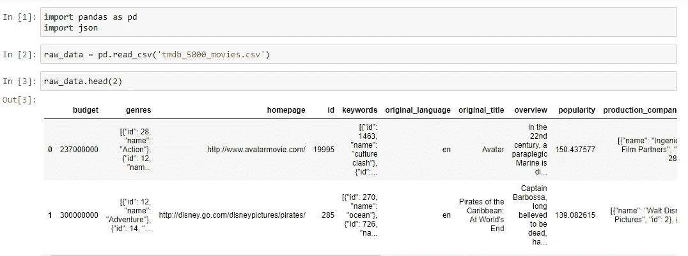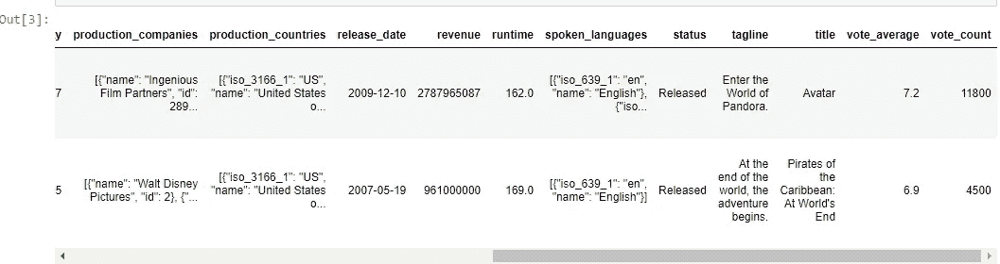

## 数据清理和预处理

仅仅查看数据集，我们可以立即看到，可能用于观察电影之间的相似性的列将是流派和关键字列。此时所有其他列似乎都是多余的，因此将被删除。

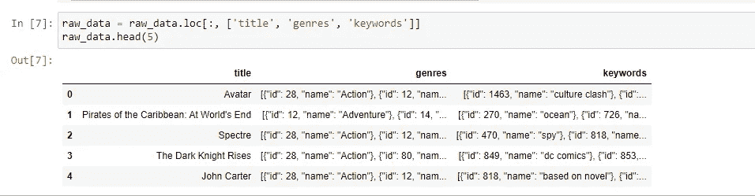

我们必须创建一个功能，将从流派和关键字列提取文本，并创建一个新的列，将用于推荐系统。这就是 json 派上用场的地方。

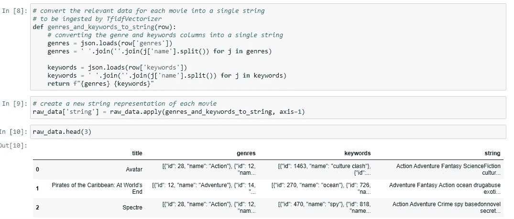

使用 apply 方法，从清除的文本中创建了一个新列。

这里的下一步将是把文本转换成向量，以便可以对它们执行数学运算。一种流行的方法是使用 TfidfVectorizer 类，如下所示。点击[此处](https://en.wikipedia.org/wiki/Tf%E2%80%93idf)阅读更多课程信息

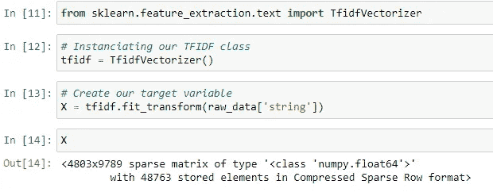

## 建立推荐系统

在构建推荐系统之前，我们必须从 sklearn 导入[余弦相似度](https://en.wikipedia.org/wiki/Cosine_similarity)来帮助我们获得向量序列之间的相似度。分数显示了一系列向量与“1”是向量本身的向量有多相似。

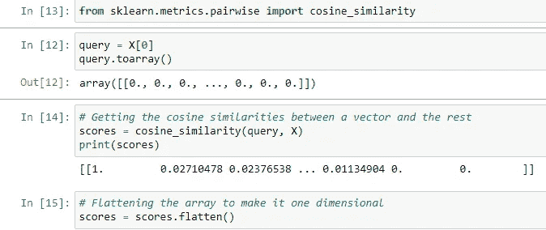

绘图将帮助我们看到我们选择的索引中的向量和其他向量之间的相似性。

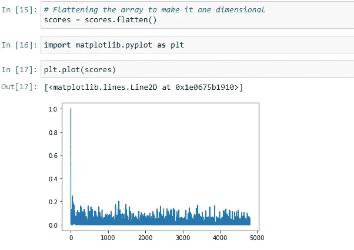

为了得到与我们选择的向量最相似的向量，我们需要对分数进行排序。使用了 argsort()函数。值得注意的是,( a) argsort()函数按升序排序,( b)它返回值的索引而不是值本身。为了缓解问题(a ),我们决定在向量的相反方向上使用 argsort()函数，对于(b ),我们通过索引分数本身来获得值。该图现在以升序显示这些值。

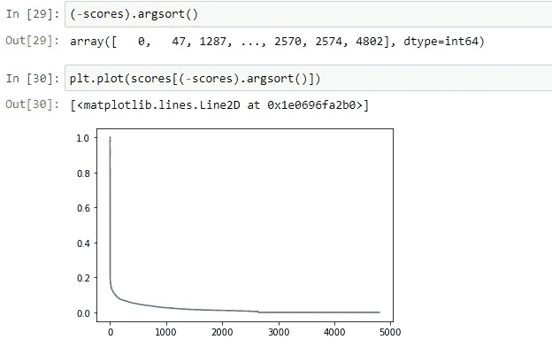

注意:argsort()的索引与我们正在处理的数据框的索引相同。因此，我们可以使用 argsort()函数返回的索引从数据帧中获取电影的名称。以下是与索引“0”中的电影最相似的电影。索引 0 被省略，因为它是电影本身。

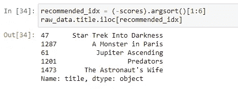

> 下一步是创建一个函数来一次性完成所有这些任务。

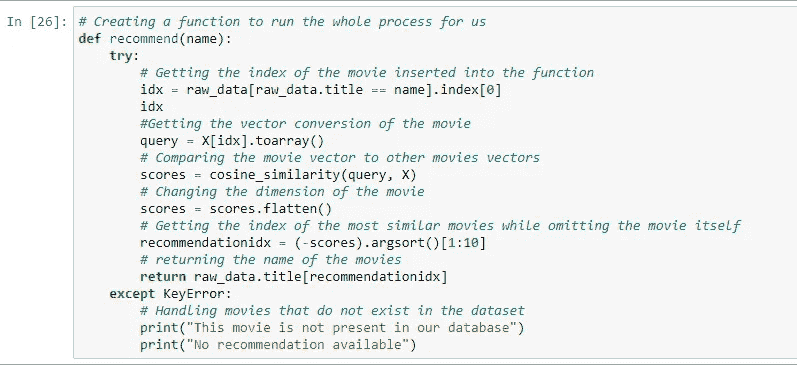

让推荐系统发挥作用

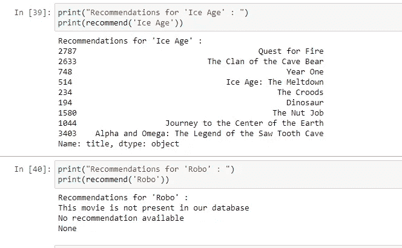

**资源:**

点击这个[链接](https://github.com/oluwatomsin/Recommendation_System/blob/master/Recommendation%20system.ipynb)，可以在我的 GitHub 上找到该项目的所有资源。如果你对 NLP 感兴趣，也请订阅。我将每周出版。另一边见:)。

 [## Mlearning.ai 提交建议

### 如何成为 Mlearning.ai 上的作家

medium.com](/mlearning-ai/mlearning-ai-submission-suggestions-b51e2b130bfb)