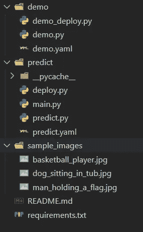
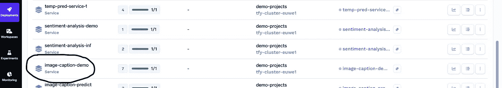
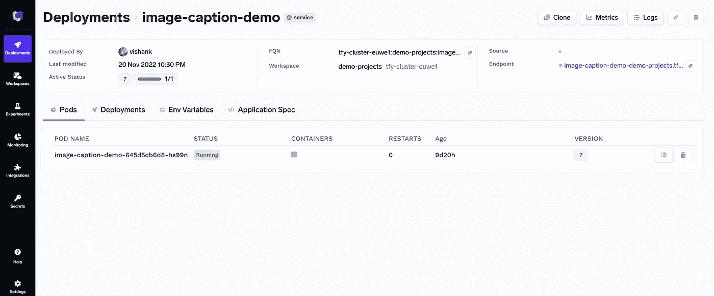
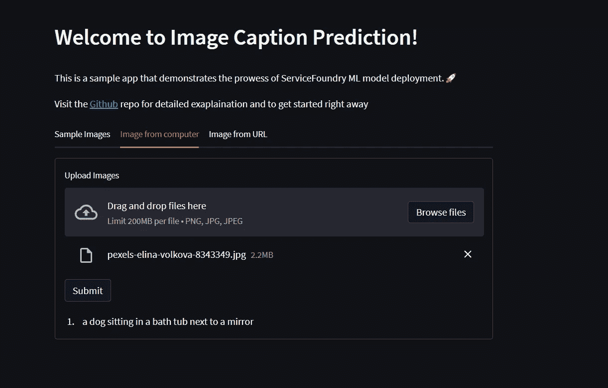

# 仅用 100 行代码构建一个智能图像字幕 Web 应用程序

> 原文：<https://medium.com/mlearning-ai/build-a-smart-image-captioning-web-app-with-just-100-lines-of-code-565a4fba9cc8?source=collection_archive---------3----------------------->

图像字幕是自动生成图像文本描述的过程。这项任务很困难，因为它需要理解图像的内容，而这些内容通常是复杂和抽象的。图像字幕是机器学习的一个流行应用，并且已经被用于改善网站和应用的用户体验。在本文中，我们将讨论如何在 TrueFoundry 上部署图像字幕模型。

TrueFoundry 是部署机器学习模型的一个很好的平台。该平台不仅管理部署下的基础设施和技术，还提供了易于使用的 API 和各种可用于部署模型的 web 应用程序。这使得它成为希望快速高效地部署其模型的数据科学家和机器学习工程师的绝佳选择。

在本文中，我们将使用来自 [Huggingface](https://huggingface.co/nlpconnect/vit-gpt2-image-captioning) 的 vit-gp T2-图像字幕模型来预测图像的字幕。这个模型是一个最先进的机器学习模型，已经在一个大型图像和字幕数据集上进行了训练。该模型可用于为作为输入提供的图像生成标题。然后，生成的标题作为输出返回。该模型是图像字幕的最佳选择，因为它准确而高效。

让我们从代码开始吧！

我们将首先创建 3 个文件夹、一些 python 文件和一个 requirements.txt 文件:

1.  *演示*:这将存储和部署我们的 streamlit 应用程序。我们将在这个目录中创建 *demo.py、demo _ deploy . py&demo . YAML*文件。
2.  *预测*:这将存储和部署我们的 FastAPI 端点。我们将在这个目录中创建 *main.py、deploy.py、predict . py&predict . YAML*文件。
3.  *sample_images* :我们将存储一些样本图像，为我们的 web 应用程序添加标题。

通过运行以下 pip 命令安装所有库:

`pip install -r requirements.txt`

最终的目录应该如下所示:

Image Captioning Directory

让我们添加 python 文件的代码:

一旦 python 文件准备就绪，我们可以首先通过运行以下命令来部署 FastAPI 端点:

`python predict/deploy.py`

这将部署服务 TrueFoundry，我们可以在 TrueFoundry 的[仪表板](https://app.truefoundry.com/deployments)中进行检查。

点击你的项目，你会看到类似这样的东西。

点击端点 URL，在我的例子中是这个 [Streamlit 网站](https://image-caption-demo-demo-projects.tfy-ctl-euwe1-production.production.truefoundry.com/)。

哒哒！您的图像字幕 Web 应用程序现已上线！Streamlit 使您的 web 应用程序响应迅速，因此您可以从任何想要的设备访问它。

现在，让我们在 web 应用程序中测试图像标题本身。我会从我的电脑上传一张狗的照片。

Test Image uploaded

Captioned Image

如你所见，预测的字幕似乎非常准确。我们可以尝试上传多张图片或者尝试图片网址。请试用我的 web 应用程序，如果您有任何问题/建议，请告诉我！

参考资料:

1.  [使用 MLFoundry 跟踪 ML 模型](/mlearning-ai/tracking-ml-models-with-mlfoundry-5de8520752e6)
2.  [使用 ServiceFoundry 部署 ML 模型](/mlearning-ai/use-servicefoundry-to-deploy-machine-learning-models-like-a-ninja-a912ca550333)
3.  [GitHub](https://github.com/vishank97/image-captioning) repo 包含使用 FastAPI 服务部署模型的源代码，简化 web 应用程序和培训工作，如果你想快速入门的话。
4.  [TrueFoundry 文档](https://docs.truefoundry.com/documentation/)

 [## Mlearning.ai 提交建议

### 如何成为 Mlearning.ai 上的作家

medium.com](/mlearning-ai/mlearning-ai-submission-suggestions-b51e2b130bfb)