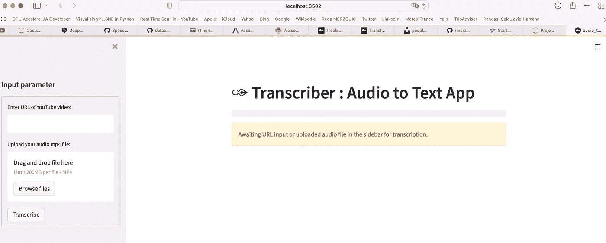
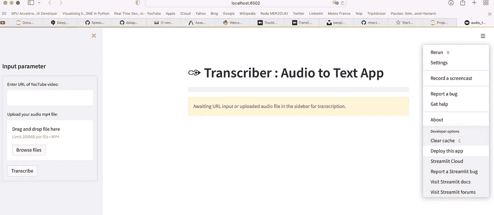
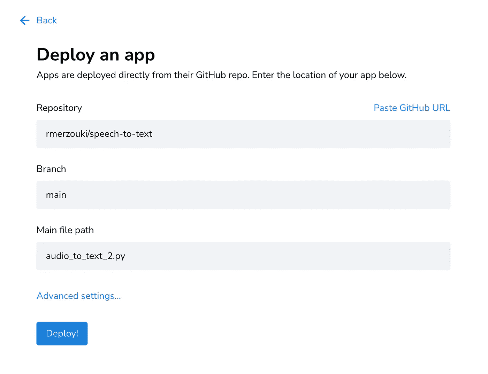
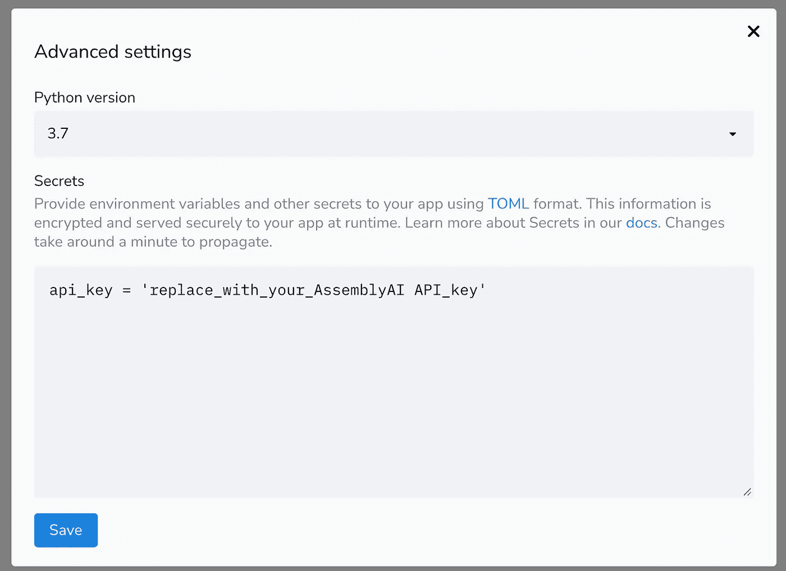

# 构建转录应用程序

> 原文：<https://medium.com/mlearning-ai/build-a-transcription-application-23d4ef3f2e3a?source=collection_archive---------3----------------------->

## 使用 AssemblyAI 和 Streamlit 进行语音到文本转换


Photo by [History in HD](https://unsplash.com/@historyhd?utm_source=unsplash&utm_medium=referral&utm_content=creditCopyText) on [Unsplash](https://unsplash.com/s/photos/speech-martin-luther?utm_source=unsplash&utm_medium=referral&utm_content=creditCopyText)

是否需要将预先录制的音频和视频文件以及实时音频流转换为文本？如果是这样，你绝对应该考虑使用[**assembly ai API**](https://www.assemblyai.com/)。

[**AssemblyAI**](https://www.assemblyai.com/) 是一家深度学习公司，构建强大的 API 来转录和理解音频。

在本文中，我将重点关注第一类用例，即将预先录制的音频和视频文件转换为文本。我将与您分享一种利用[**assembly ai API**](https://www.assemblyai.com/)轻松构建语音到文本转录应用程序的方法，并使其可供观众使用。我将一步一步地描述如何构建一个转录应用程序，将它部署到云中，并与您的观众分享。这个应用是用 [**Python**](https://www.python.org/) **，**[**assembly ai**](https://www.assemblyai.com/)， [**Streamlit**](https://streamlit.io/) 构建的，最后部署在[**Streamlit Cloud**](https://streamlit.io/cloud)上。

正如我在以前的一篇文章中所写的， [**Streamlit**](https://streamlit.io/) 是一个非常棒的开源框架，它可以轻松地为机器学习和数据科学创建和共享漂亮的定制 web 应用程序。

我构建的语音转文本 web 应用的灵感来自 Chanin Nantasenamat[**Chanin 的视频**](https://youtu.be/NNq_XBVk30w) 。事实上，我从 Chanin 的代码开始，我对其进行了一些修改，主要是为了处理从您的本地机器下载音频或视频文件的选项。除了 YouTube 文件，我还描述了如何将本地 [**Streamlit**](https://streamlit.io/) 应用程序部署到云。

我的方法的目的一方面是通过将我的语音转文本应用程序部署在 [**Streamlit 云**](https://streamlit.io/cloud) 上，与尽可能多的人分享它，另一方面是展示以人们既喜欢又理解的方式构建语音转文本应用程序是多么容易。

那些想了解更多允许部署应用程序的代码、工具和文件的人可以参考我的 GitHub 资源库 [**这里**](https://github.com/rmerzouki/speech-to-text) **。**

# 1-制作食谱所需的工具:

*   一个 Github 账号: [GitHub](https://github.com)
*   一个 IDE : [Visual Studio 代码](https://code.visualstudio.com/download)， [PyCharm](https://www.jetbrains.com/pycharm/download/#section=mac) ， [Jupyter 笔记本](https://jupyter.org)， [Spyder](https://www.spyder-ide.org) …
*   一个 [AssemblyAI](https://www.assemblyai.com/) 账号:免费计划可用。
*   A [Streamlit Cloud](https://streamlit.io/cloud) 账号:免费账号。

# 2-代码:

下面的代码非常简单，由三个自定义函数组成。

**函数# 1****->*****def get _ yt(URL)***:这是打算通过 YouTube 视频的 URL 来处理它。它使用[***pytube***](https://pytube.io/en/latest/)库通过其 URL 检索 YouTube 音频文件，并将其加载到您当前的工作目录中。

**功能# 2****->*****def upload _ file(上传文件)*** :这是为了处理第二个选项，即从本地机器上传文件。此功能将把上传的音频写入您当前的工作目录。

**函数# 3->*def transcripte _ audio _ file()***:该函数将把 **mp4** 音频文件从你当前的工作目录上传到 AssemblyAI，在那里它将被转录成文本并被检索。为此，我们将先后使用以下 **API 端点、**[](https://api.assemblyai.com/v2/upload)**和[***【https://api.assemblyai.com/v2/transcript】***](https://api.assemblyai.com/v2/transcript)。**

# **3-在本地测试我们的代码:**

**首先，您需要安装所需的库:**

```
**pip install streamlit pytube**
```

**然后运行应用程序代码:**

```
**streamlit run audio_to_text_2.py**
```

**我们用 YouTube URL 和从本地机器上传的音频或视频文件来测试我们的应用程序。**

****

**Speech-to-text application running locally**

**一旦我们确信应用程序运行正常，我们就开始在 Streamlit Cloud 上部署，但在此之前，我们要确保用本地项目目录中的任何更改来更新我们的 Github 存储库。事实上，在 Streamlit 上，应用程序直接从它们的 GitHub 存储库中部署。**

# **4-在 Github 上推送我们的代码更改:**

```
**git statusgit add .git commit -m “my message”git push origin main**
```

# **5-在 Streamlit 上部署应用程序:**

**回到本地运行的应用页面，打开右上方的菜单，选择并点击“**部署此应用**”。**

****

**Deploy the app on Streamlit**

**你将进入下一页；点击“高级设置…”。**

****

**复制保存在 ***secrets.toml*** 文件中的 **API 密匙**，粘贴到下面，点击保存。**

****

**现在，点击部署！**

****

**请注意，当您的 Github 存储库中发生更改时，它们会被检测到，代码更改会被自动提取，应用程序也会更新。**

**在下面的短视频中，我将一步一步地向您展示如何在 Streamlit Cloud 上部署语音到文本转录应用程序，以及如何使用它。**

**供您参考，我的 web 应用程序部署在 Streamlit 上，可通过以下路径访问:[***https://share . Streamlit . io/rmerzouki/speech-to-text/main/audio _ to _ text _ 2 . py***](https://share.streamlit.io/rmerzouki/speech-to-text/main/audio_to_text_2.py)**

*****平均而言，周转时间约为音频文件持续时间的 15–30%，最短处理时间约为 20–30 秒。*****

# **6-重新创建应用程序并使用它:**

**如果您对这个应用程序感兴趣，那么您可以简单地按照 ***README.md*** 文件中描述的步骤- 在我的 GitHub 资源库中可用 [**这里**](https://github.com/rmerzouki/speech-to-text)**——在您的身边重新创建它，使用它，甚至增强它。****

# ****7-结论:****

****我希望您喜欢阅读这篇文章，在这篇文章中，我描述了一种使用[**assembly ai**](https://www.assemblyai.com/)**和**[**Streamlit**](https://streamlit.io/)构建语音到文本转录应用程序的简单方法。也希望这篇文章对你的日常工作有用。当然， [**不要犹豫使用我在 GitHub 仓库**](https://github.com/rmerzouki/speech-to-text) 中的代码和文件，随时通过建议新的更改和/或添加新的功能来丰富这项工作。****

****如果你有任何问题或者想保持联系，请随时在 LinkedIn 上联系我:[*Reda Merzouki*](https://www.linkedin.com/in/reda-merzouki-02843b/)****

# ****感谢您的阅读！****

****[](/mlearning-ai/mlearning-ai-submission-suggestions-b51e2b130bfb) [## Mlearning.ai 提交建议

### 如何成为 Mlearning.ai 上的作家

medium.com](/mlearning-ai/mlearning-ai-submission-suggestions-b51e2b130bfb)****