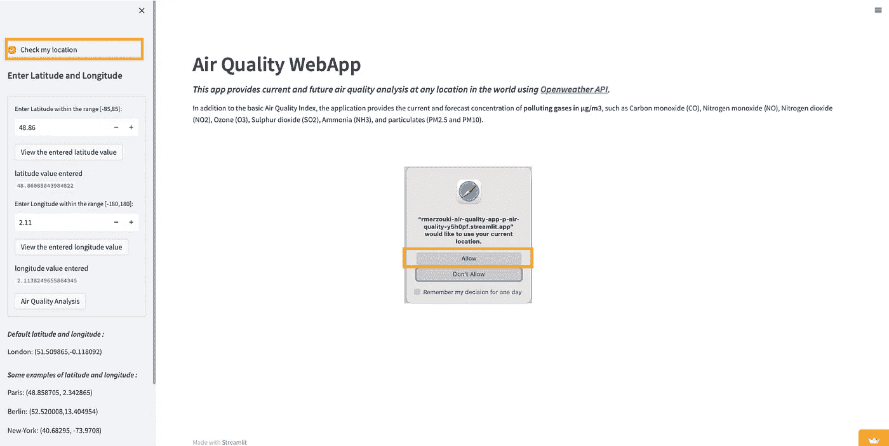

# 构建空气质量 web 应用程序

> 原文：<https://medium.com/mlearning-ai/build-an-air-quality-web-application-bbe12fb82a50?source=collection_archive---------3----------------------->

## **提取、变换&可视化**

Photo by [ian dooley](https://unsplash.com/@sadswim?utm_source=unsplash&utm_medium=referral&utm_content=creditCopyText) on [Unsplash](https://unsplash.com/collections/448571/you-can%27t-take-the-sky-from-me?utm_source=unsplash&utm_medium=referral&utm_content=creditCopyText)

答你是否对你居住的地方或你计划去的地方的空气质量感兴趣，或者对地球上其他地方的空气质量感兴趣，你想知道这些地方的主要污染气体目前和未来的浓度水平(单位为 g/m3)？

基于**纬度**和**经度**我用 python 构建并部署在 streamlit cloud 中的这个 web 应用程序使用[**OpenWeather API**](https://openweathermap.org/)提供了世界上任何地方当前和未来的空气污染数据。

默认坐标是伦敦市的坐标，但您也可以通过勾选“**检查您的位置”**框来提供您自己的位置，并允许应用程序使用您的坐标，实际上，您只需在弹出窗口出现时选择**“允许”**，如下图所示。还可以输入地球上的任意坐标，得到你感兴趣的地方的空气质量，以及主要污染物的浓度，单位为 g/m3。
设置好坐标后，只需点击**“空气质量分析”**按钮，即可获得感兴趣位置的当前和预测空气质量及主要污染物浓度。

**Select your current location**

除了基本的空气质量指数，应用程序还提供了气体污染物的当前和预测浓度，单位为 g/m3，如一氧化碳(CO)、一氧化氮(NO)、二氧化氮(NO2)、臭氧(O3)、二氧化硫(SO2)、氨(NH3)和颗粒物(PM2.5 和 PM10)。

在本文中，我将一步一步地向您展示如何用[**【Python】**](https://www.python.org/)**[**OpenWeather API**](https://openweathermap.org/)**[**Streamlit**](https://streamlit.io/)**[**Plotly**](https://plotly.com/)**[**Mapbox**](https://www.mapbox.com/)(图)********

****正如我在以前的一篇文章中所写的， [**Streamlit**](https://streamlit.io/) 是一个非常棒的开源框架，它可以轻松地为机器学习和数据科学创建和共享漂亮的定制 web 应用程序。****

****我的方法的目的一方面是通过将我的空气质量 Web 应用程序部署在 [**Streamlit Cloud**](https://streamlit.io/cloud) 上，与尽可能多的人分享它，另一方面是为了展示以一种对大多数人都有用、愉快和有意义的方式构建空气污染数据应用程序是多么容易。****

****那些想了解更多关于允许部署应用程序的代码、工具和文件的人可以通过[**mylinkedin**](https://www.linkedin.com/in/redamerzouki/)**直接联系我。******

******I -创建您的食谱所需的工具:******

****一个 Github 账号: [**GitHub**](https://github.com/)****

****一个 IDE : [**Visual Studio 代码**](https://code.visualstudio.com/download) **，**[**py charm**](https://www.jetbrains.com/pycharm/download/#section=mac)**，** [**Jupyter 笔记本**](https://jupyter.org/) **，**[**Spyder**](https://www.spyder-ide.org/)**…******

****一个[**OpenWeather API**](https://openweathermap.org/)**账号:有免费计划。******

******一个 [**细流云**](https://streamlit.io/cloud) 账号:免费计划可用。******

****一个 [**地图框**](https://www.mapbox.com/) 账号:有免费计划。避免创建 Mapbox 帐户的另一种方法是将 mapbox_style 设置为“open-street-map ”,而不是需要 mapbox_accesstoken 的 mapbox_style。****

******二-程序步骤:******

****代码非常简单，但是在我文章的下一部分，我将与您分享步骤而不是代码本身。基本上，它是关于提取、转换和可视化的。****

******第一步，提取:******

*   ****使用`http://api.openweathermap.org/data/2.5/air_pollution?lat={lat}&lon={lon}&appid=[{API key}](https://home.openweathermap.org/api_keys)`提取当前空气污染数据****
*   ****使用`http://api.openweathermap.org/data/2.5/air_pollution/forecast?lat={lat}&lon={lon}&appid=[{API key}](https://home.openweathermap.org/api_keys)`提取预测空气污染数据****

******第二步，变换:******

*   ****利用 [**Pandas**](https://pandas.pydata.org) 将 json 响应转换成 Pandas 数据帧。****

******第三步，观想:******

*   ****利用****和**[**Mapbox**](https://www.mapbox.com/)**以一种高效且有吸引力的方式可视化当前和预测污染数据。************

********III - A 代码草图:********

****同样，在接下来的内容中，我不会分享我的代码，但会给你一个大纲，这样你就可以继续前进，创建一个让你的创造力发挥作用的程序。****

******IV -在本地测试你的代码:******

****要执行这一步，请参考我之前的文章 [**这里的**](/mlearning-ai/build-a-transcription-application-23d4ef3f2e3a#:~:text=3%2D%20Testing%20our%20code%20locally%20%3A) **。******

******在 Github 上 V - Push 你的代码变更:******

****要执行这一步，请参考我以前的文章 [**这里的**](/mlearning-ai/build-a-transcription-application-23d4ef3f2e3a#:~:text=4%2D%20Pushing%20our%20code%20changes%20on%20Github%20%3A) **。******

******VI -在 Streamlit 云上部署应用:******

****要执行这一步，请参考我之前的文章 [**这里的**](/mlearning-ai/build-a-transcription-application-23d4ef3f2e3a#:~:text=5%2D%20Deploying%20the%20application%20on%20Streamlit%20%3A) 。****

******VII -空气质量应用的简短演示:******

******Air quality web application demo******

****该应用程序可从以下网址在线获得:****

****[https://rmerzouki-air-quality-app-p-air-quality-y 5h 0 pf . streamlitapp . com/](https://rmerzouki-air-quality-app-p-air-quality-y5h0pf.streamlitapp.com/)****

*******注 1:该应用程序在 2002 年 12 月 20 日之前可在线访问。*******

*******注 2:2022 年 11 月 15 日增加了获取你当前所在位置空气质量的选项。*******

******八-结论:******

****我希望您喜欢阅读这篇文章，在这篇文章中，我描述了一种相当简单的方法来构建一个空气污染数据应用程序，它使用了 [**Python**](https://www.python.org/) **，**[**OpenWeather API**](https://openweathermap.org/)**，**[**Streamlit**](https://streamlit.io/)**，**[**Plotly**](https://plotly.com/)**和[**我也希望这篇文章能激发你在污染或其他对你意义重大的主题上创造新应用的欲望。当然，请随意提出新的修改来丰富这项工作。**](https://www.mapbox.com/)******

*****如果你有任何问题或者想保持联系，请随时在 LinkedIn 上联系我:*[*Reda Merzouki*](https://www.linkedin.com/in/redamerzouki/)****

**** [## Mlearning.ai 提交建议

### 如何成为 Mlearning.ai 上的作家

medium.com](/mlearning-ai/mlearning-ai-submission-suggestions-b51e2b130bfb)****