# 建立一个自动化的标签系统

> 原文：<https://medium.com/mlearning-ai/build-an-automated-labeling-system-f960419e458b?source=collection_archive---------5----------------------->

## 这篇文章介绍了我如何建立一个标签系统的过程，从理论到部署。

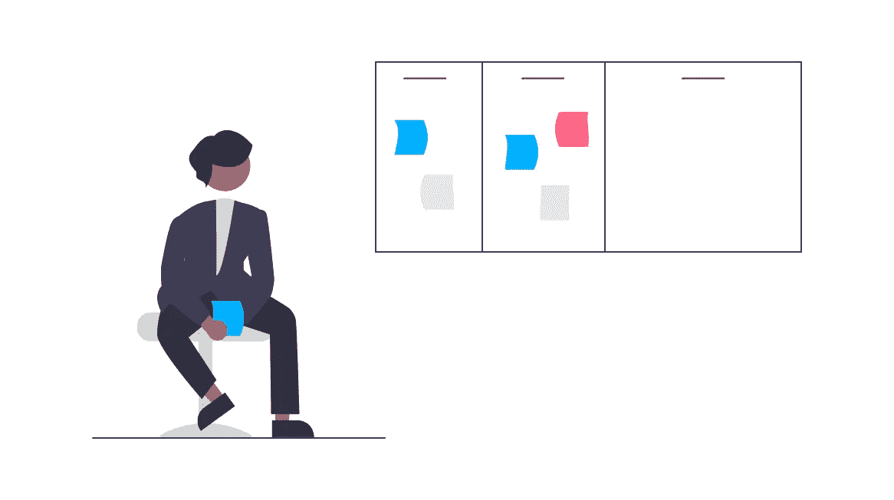

image from undraw.co

# 让我们理解为什么我们需要标签

人工智能的最新发展，包括计算机视觉、自然语言处理、预测分析、自主系统和广泛的应用，都是由机器学习驱动的。我们需要数据，所以这些算法可以从中学习，从而可以很好地推广。大多数过渡算法需要标签数据才能工作。当谈到深度学习时，与传统的机器学习算法相比，需要的数据量是巨大的，特别是在深度学习神经网络中，以建立一个达到适当精度水平的模型。因此，不言而喻，为了得到准确的机器学习模型，机器学习数据必须是干净、准确、完整和标记良好的。尽管总是出现垃圾进垃圾出的情况，但对于机器学习数据来说尤其如此。大约 80%的 AI/ML 项目时间花在收集、组织和标记计算上。

> 我们可以获得大量未标记的数据，但是手动标记是昂贵的

我希望现在你已经很好地理解了标记数据对于我们机器学习项目的重要性。

# 我们最终会拥有什么！

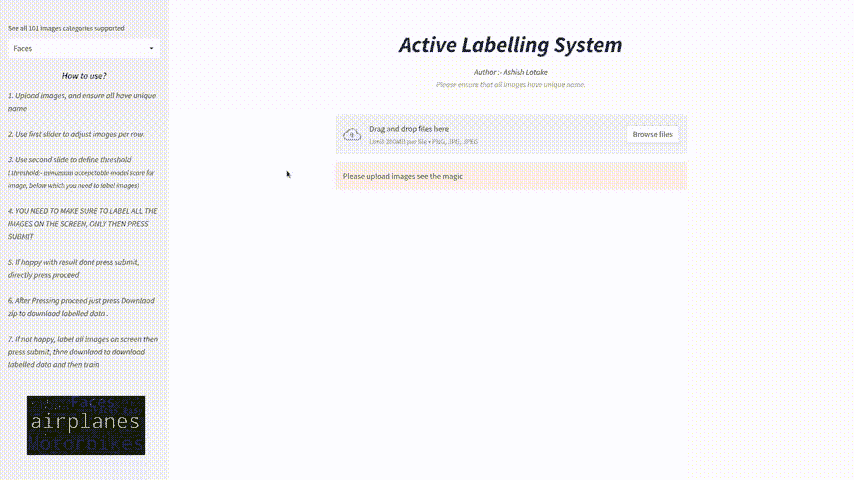

Source [https://ashishlotake-active-labelling-system-project-app-14t6bq.streamlitapp.com/](https://ashishlotake-active-labelling-system-project-app-14t6bq.streamlitapp.com/)

[Web App](https://ashishlotake-active-labelling-system-project-app-14t6bq.streamlitapp.com/) 、 [Docker Image](https://hub.docker.com/r/ashishlotake/active-labelling-system) 和所有 IPYNB [Colab 链接](https://www.ashishlotake.com/blog/active-labelling-system#all-jupyter-notebooks)

# 我们前进需要什么

具有讽刺意味的是，我们需要带标签的数据，原因很简单，模型在标记任何东西之前应该知道标签是什么，然后它还应该知道哪个标签对应于哪个图像。

> 这就像增加我们需要的钱一样

*   我们将使用深度学习，所以 GPU 是必须的，使用谷歌 Colab。

如果你有这两样东西，你就可以建立你的标签系统

# 手头的数据集

我将使用 Caltech101 数据集，但您也可以使用任何其他数据集。让我们简单回顾一下 Caltech101 数据集。


Image by Author

它由 9146 幅图像组成，不均匀地分布在 101 个不同的物体类别和一个背景类别之间。根据官方网站，每个类别大约有 40 到 800 幅图像，此外，大多数类别在数据集中有大约 50 幅图像。当试图在深度神经网络训练中实现高精度时，每个类别的这种变化的图像可能是一个真正的问题。每个图像的大小大约为 300 x 200 像素。图像的格式是 RGB，这意味着我们有 3 个颜色通道。

现在我们来看看班级分布


Image by Author

from giphy.com

我们可以看到，飞机和摩托车类别的图像数量最多，约为 800 张，而对于大多数标签，图像数量最少的可能只有 40 张。对于这样一个不平衡的数据集，如果我们决定从头开始训练，将很难从网络中获得良好的性能。

# 让我们了解一下高层部署

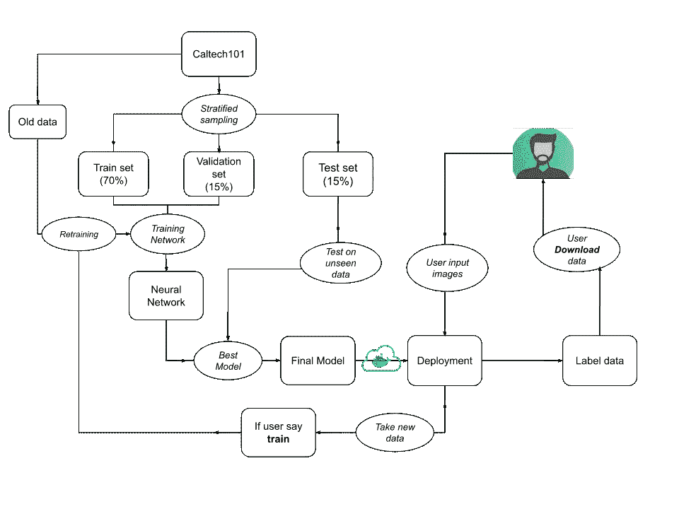

Image by Author

我觉得上面的布局不言自明。不过，我还是要用几行字来解释一下

*   使用分层抽样将数据集分为三个部分
*   训练 CNN，然后评估看不见的数据
*   选择最佳型号
*   创建一个 stremlit web 应用程序
*   将 stremlit 包在容器中
*   在云上部署容器
*   Wola！你的模型现在是全球性的，
*   如果用户想要训练模型，则获取新数据和一部分旧数据，将它们组合起来并重新训练。
*   然后，用户可以下载带标签的数据。

# 让我们开始真正的工作吧

我们会弄脏自己的手，通过创建一个基线模型并从头训练它，我知道我告诉如果我们从头训练模型获得良好的性能将是困难的，但这不会伤害我们，我将从头实现 Alexnet，就像架构一样，所以如果我们没有达到满意的结果，我们仍然可以说'我从 starch 实现了 Alexnet！

顺便说一下，在 2012 年的 ImageNet ILSVRC 挑战赛中，正是在这场比赛中，AlexNet 展示了深度卷积神经网络可以用于解决图像分类，这是一个新时代的开始。

> 当你看到大多数先进的深度学习模型时，它们都是通过实验研究得出的，其中大多数甚至没有像传统的机器学习算法那样有适当的数学或统计解释

## AlexNet

在从头开始创建 Alexnet 之前，让我们对卷积神经网络(CNN)有一个高度的概述，这样你就知道在什么之上发生了什么。

卷积神经网络是借助于堆叠在彼此之上的不同层来形成的，以执行图像分类任务。CNN 的架构包含不同的层。整个网络本身分为两部分:**卷积基**和**分类器**。在卷积库中提取特征，在分类器中进行分类。


## 卷积基中的层:-

*   输入图层-该输入图层接受原始图像，并将其转发到其他图层以提取要素。
*   卷积层-在这一层中，许多过滤器被应用于图像，用于从图像中寻找特征。
*   池层-该层捕获大图像并缩小它们，并缩小参数以保存重要信息。它保留了每个窗口的最大值。

## 分类器中的层:-

*   完全连接层-该层采用高级过滤图像，并将其转换为带有的标签。
*   输出图层-该图层为每个类提供小数概率。这些十进制概率介于 0 和 1 之间。

这是你能建立的最简单的 CNN。

现在你知道了 CNN 的基本知识，让我们来看看 AlexNet 的结构

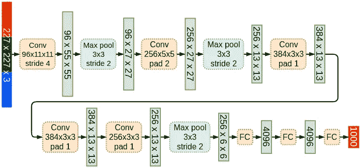

Image from
Advanced Deep Learning with Python by Ivan Vasilev

这是一个很大的进步，所以让我们简要地回顾一下每一个独特的层

*卷积层* :-数学术语“卷积”是指两组元素的点积相乘。卷积层的过滤器/内核和一系列图像数据受到深度学习中卷积运算的影响。因此，卷积层只是一个包含发生在滤波器和由卷积神经网络处理的图像之间的卷积运算的层。

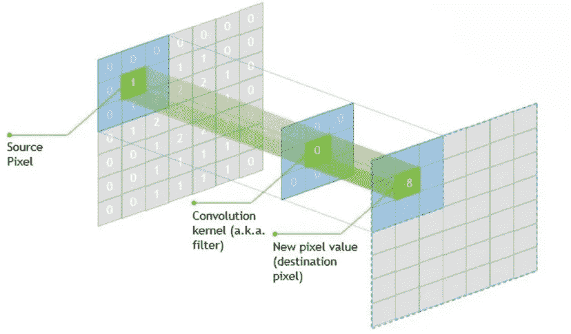

Image from Nvidia.com

*ReLU 激活功能*:修改神经元价值输出的特定激活过程。ReLU 对来自神经元的值施加的变换由公式 y=max(0，x)表示。来自神经元的任何负值都被 ReLU 激活函数箝位到 0，而正值保持不变。在神经网络中，这种数学转换的结果被用作下一层的输入和当前层的输出。

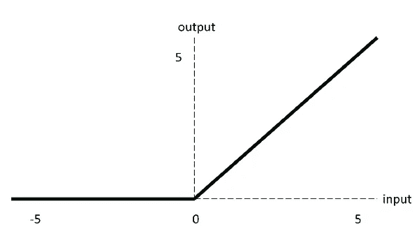

Image by Hossam H. Sultan from researchgate

*最大汇集* :-使用最大汇集，输出是包含在子采样层内的单元感受域内的像素的最高像素值。下面的 max-pooling 操作通过用一个 2x2 窗口滑过输入数据来产生内核感受域内像素的平均值。


Image from wikimedia

*批量标准化* :-通过增加一层对来自前一层的输入进行操作，批量标准化是一种减少神经网络内不稳定梯度影响的技术。在缩放和移位操作转换输入值之前，这些操作首先对输入值进行标准化和规范化。

*丢失* :-丢失技术随机减少神经网络中互连神经元的数量。在每个训练步骤中，每个神经元都有机会从连接神经元的整理贡献中被丢弃。


Image by Imad Dabbura

*展平图层* :-获取一个输入图形，并将输入图像数据展平成一维数组。

*展平图层* :-获取一个输入图形，并将输入图像数据展平成一维数组。

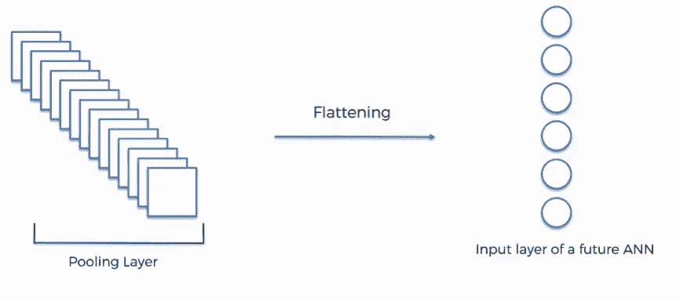

Image from SuperDataScience

*密集层* :-密集层中嵌入了任意数量的单元/神经元。每个神经元都是一个感知器。

*Softmax 激活函数*:一种特定类型的激活函数，用于确定包含在输入向量中的一组数字的概率分布。softmax 激活函数的结果是一个向量，该向量的一组值表示类或事件将发生的可能性。向量的值总计为 1。

# 让我们从头开始编写 AlexNet

请记住这个架构:-


下载数据并从 zip 文件中提取

分层将数据分为训练、val 和测试文件夹

加载数据

从头开始建模

培训模式

```
history = alexnet_scratch.fit(
  train_dataset,
  epochs=30,
  validation_data=validation_dataset,
  )
```

# 从零开始训练的表现

```
plot_performance(history)
```

# 从零开始训练的表现

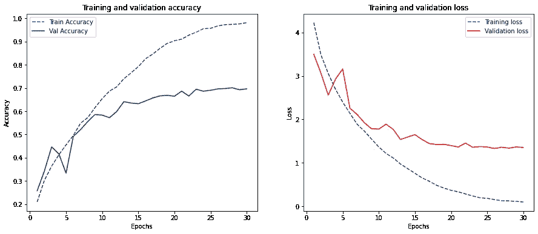

Image by Author

很明显，这个模型过于符合我们的训练数据。

# 超参数调谐

深度学习非常依赖于超参数优化。其原因是神经网络极难配置，并且需要设置大量参数。此外，单个模型的训练可能非常慢。我们将尝试为 CNN 优化一些重要的超参数

1.  优化算法:-优化器是改变神经网络的权重和学习速率以最小化损失的技术。
2.  学习率:-学习率控制在每批结束时更新多少重量。
3.  动量:-动量控制学习率的先前更新对当前权重更新的影响程度

我试用了三个优化器 RMSProp，Adam，和 SGD 在不同的学习速率下(0.001，0.005，0.01，0.05，0.1)，使用 SGD 在 0.01 和 0.05 的学习速率下得到最好的结果。

## 优化器和学习率

在不同学习速率下使用 SGD 作为优化器的结果。

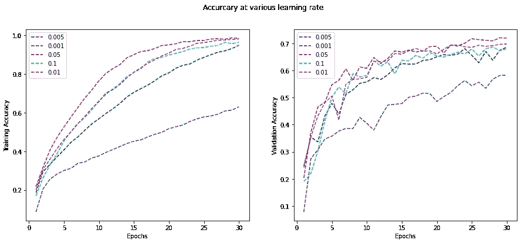

Image by Author

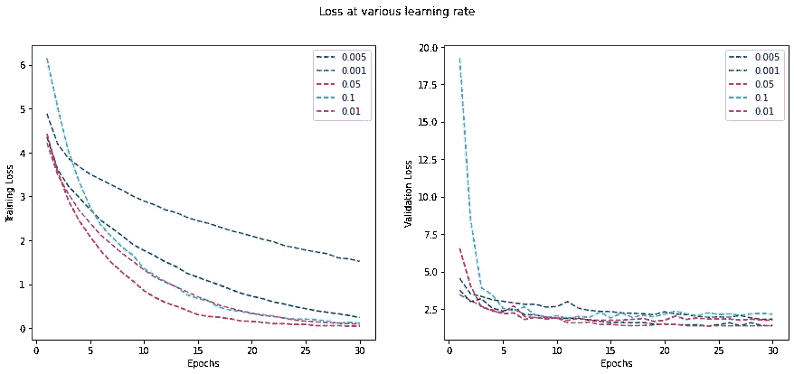

Image by Author

学习率为 0.01 和 0.05 时的结果看起来很有希望，让我们探索更多。


通过查看图和表，与 0.01 相比，0.05 的学习率看起来非常好，但是我们需要理解，我们需要我们的模型在新的/看不见的数据上表现良好，即使我们在训练数据上没有完美的 99–100%的分数。现在，如果我们关注测试数据的损失，0.01 的学习率看起来不错。

> 这些结果在每次运行期间会有所不同，因为我们使用的是 SGD，它在本质上是随机的。

我们可以说，在学习率为 0.05 和 0.01 时，两个结果非常相似，这里的差异是由于 SGD 的随机性质。

## 动力

现在我们将在各种动量(0，0.3，0.6，0.8，0.9)下试用这个配置(优化器=sgd，学习率=0.01)。

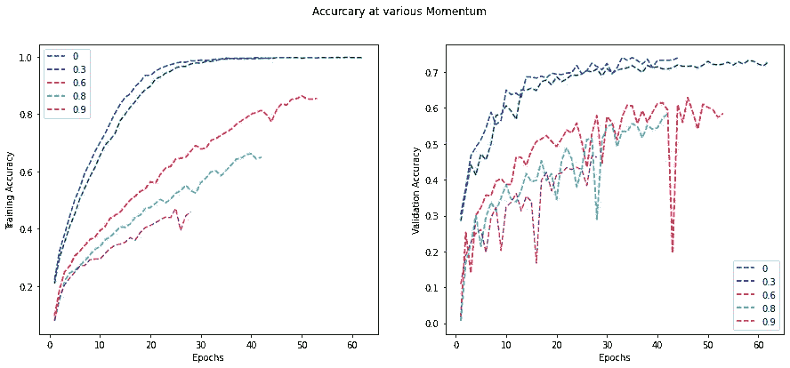

Image by Author

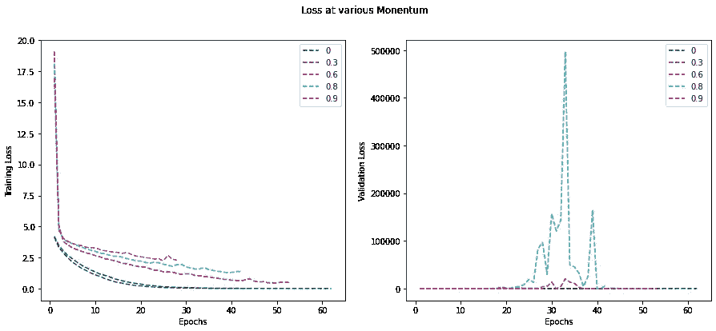

Image by Author

让我们把注意力集中在三大动力上


动量=0.3 似乎是更好的选择，因为与动量= 0 时相比，它已经在少得多的时期内取得了良好的结果，并且动量= 0.3 的模型与其他学习速率相比似乎具有良好的泛化能力。

## 到目前为止取得了什么成就


我们可以看到，我们能够将模型的验证和测试精度提高 2%，仅仅是通过调整一些超参数，或者可能是由于 SGD 的随机性质。

我们在上面看到的各种图表表明，用如此少的样本从头开始训练一个网络，除了能够很好地概括看不见的数据之外，不会产生一个从训练集中很好地学习的好模型。

> 总之，在小数据集的情况下，从头开始训练网络是一项困难且耗时的任务。

# 数据扩充

影像数据扩充是一种通过生成数据集影像的变更版本来人为增加训练数据集大小的方法。这是通过将特定于领域的技术应用于来自训练数据的示例来实现的，这些示例创建新的不同的训练示例。

将使用以下增强功能:

*   水平翻转增强
*   随机旋转增强
*   随机变焦增强

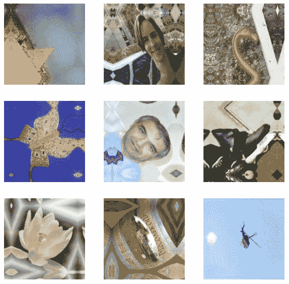

Image by Author

应用数据数据扩充后的结果:-


Image by Author


Image by Author

看起来应用数据扩充似乎并没有改善我们的模型架构和数据集的模型泛化。

从这里我们可以去很多地方:

1.  过采样和欠采样
2.  添加新数据
3.  迁移学习

> 剧透->只有转移学习有效

如果你还想了解我是如何进行过采样和欠采样的，以及如何添加新的数据点，请查看 [Jupyter notebook](https://www.ashishlotake.com/blog/active-labelling-system#all-jupyter-notebooks) notebook，[扩展数据集托管在 Kaggle](https://www.kaggle.com/datasets/ashishlotake/extendedcaltech101) 上。

# 迁移学习

在小图像数据集上进行深度学习时，一种常见且高效的方法是使用预训练模型。

神经网络通常需要大量数据才能有效运行，在这种情况下用于分类。为了解决从零开始训练中的低精度问题，可以使用迁移学习，该迁移学习使用来自大数据集上的预训练模型的权重，如果该原始数据集足够大并且足够通用，则由预训练模型学习的特征的空间层级可以有效地充当视觉世界的通用模型，因此，其特征可以证明对许多不同的计算机视觉问题有用， 尽管这些新问题可能涉及与原始任务完全不同的类，但它被用作在我们的小数据集(即加州理工学院-101)上训练的起点。

使用预训练模型有两种方式:特征提取和微调。我们将使用特征提取。用于图像分类的内容包括两个部分:一系列卷积和池层，最后是密集连接的分类器，第一部分称为模型的卷积基。

特征提取包括采用先前训练的网络的卷积基，通过它运行新数据，并在输出之上训练新的分类器，因为卷积基学习的表示可能更通用，因此更可重用。而由分类器学习的表示将必然特定于模型在其上被训练的类别集。

*这是如何使用 ResNet50 进行迁移学习的示例，只需根据您选择的模型和 conv 库改变预处理函数。*

在将图像馈送到网络之前，我们需要以针对预训练模型对图像进行预处理的相同方式对它们进行预处理。

我们将测试 3 种型号:

*   MobileNet
*   ResNet50
*   InceptionV3

对于我的场景，MobileNet 的性能似乎比基线模型差。


Image by Author

Resnet50 和 Inception 都已经实现了大于 90%训练和赋值准确度。让我们关注损失。

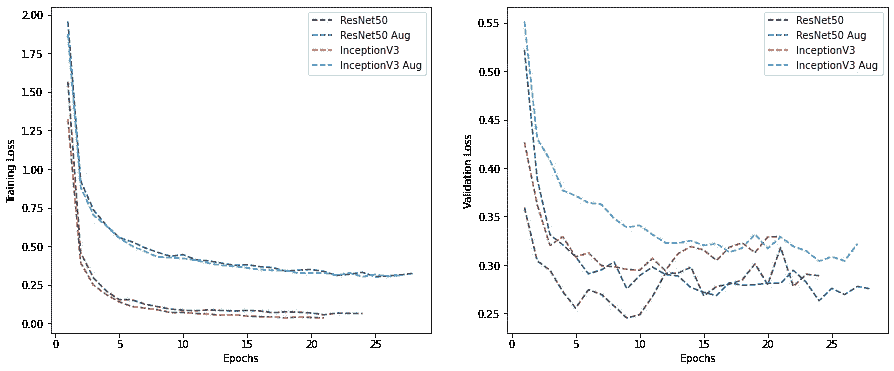

Image by Author


t 看起来 Resnet 在有和没有数据增强的情况下都表现良好，模型的大小大约为 100 MB

# 最终确定模型

在进行了从超参数调整到添加新数据的各种实验后，我们决定使用 keras 的 ResNet50，因为结果非常好，在测试和验证集上都比我们的基线模型提高了约 20%。

如前所述，我们需要根据我们选择的预训练模型预处理图像，让我们看看来自 resnet50 卷积库的预处理图像:

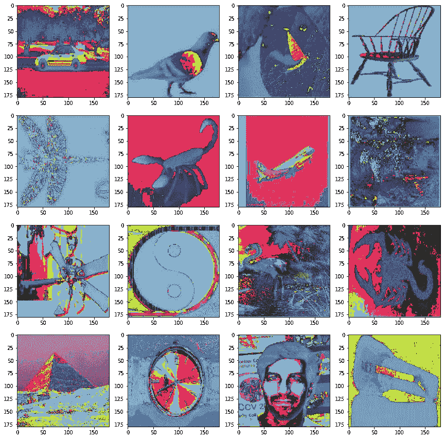

Image by Author

# 再训练

为了重新训练模型，我们将加载模型，并在离开的地方继续模型训练，而不进行编译，因此分类器学习的所有权重将从先前的模型复制，并且模型将从离开的地方开始学习。

我们将从原始数据集中复制一些数据点，然后将新图像复制到原始数据集中，我们将通过结合新旧图像来开始重新训练。

# 模型可解释性

在开发计算机视觉应用程序时，最基本的问题之一是可解释性:当你看到的只是一个扳手时，为什么你的分类器会认为一个特定的图像包含一把吉他？

深度学习模型经常被称为“黑盒”，因为它们学习难以提取和以人类可读格式呈现的表示。虽然对于一些深度学习模型来说是这样，但是对于 convnets 来说就不是这样了。convnets 所学的表述是高度可解释的。

我们将着重于在图像中可视化类激活的热图。这有助于理解给定图像的哪些部分导致 convnet 做出最终分类决定。这有助于“调试”convnet 的决策过程，尤其是在分类错误的情况下。

类激活图(CAM)可视化是一个广泛的方法家族，包括在输入图像上创建类激活的热图。类别激活热图是与特定输出类别相关联的分数的 2D 网格，针对任何输入图像中的每个位置进行计算，指示每个位置对于所考虑的类别的重要性。

Grad-CAM 包括获取卷积层的输出特征图，给出输入图像，并通过与通道相关的类的梯度对该特征图中的每个通道进行加权。直观地说，理解这种技巧的一种方法是想象您正在用“每个通道对类的重要性”来加权“输入图像激活不同通道的强烈程度”的空间映射，从而得到“输入图像激活类的强烈程度”的空间映射


Image by Author

通过查看上面的图像，我们可以说，在模型检测到附近有一个人和车轮后，模型以 99.64%的置信度判定这是一辆轮椅

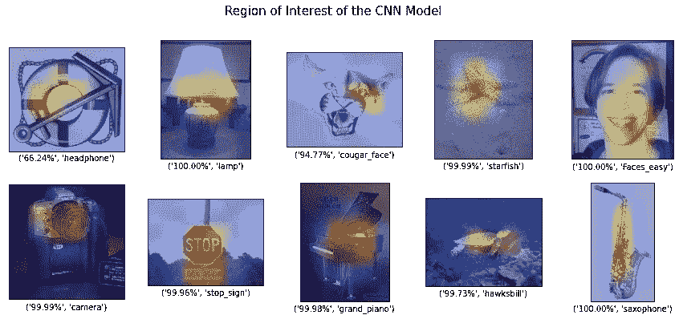

Image by Author

# 建筑应用

该模型将用于现实世界的场景，从用户那里获取连续的原始输入，然后给他们带标签的数据作为输出。

在这一步中，使用 [Streamlit](https://www.ashishlotake.com/blog/streamlit.io) 开发了一个 web 应用程序。它为用户提供了一个上传多张图片的前端。 [Streamlit](https://www.ashishlotake.com/blog/streamlit.io) 是一个开源 python 框架，用于构建机器学习和数据科学的 web 应用。它只需在几分钟内将简单的 Python 脚本转换成实用的、交互式的、可共享的 web 应用程序。

使用 [Streamlit](https://www.ashishlotake.com/blog/streamlit.io) 构建应用程序的详细步骤将在后面的文章中介绍。

该文件的代码可以在[这里](https://github.com/ashishlotake/active-labelling-system-project/blob/main/app.py)找到。

# 归档

Dockerizing 是使用 Docker 容器打包、部署和运行应用程序的过程。Docker 是一个开源工具，它将您的应用程序作为一个包含所有必要功能的包来提供。Docker 允许您将应用程序运行所需的一切(如库)打包，并作为一个单独的包——一个容器来运输。容器由指定其确切内容的图像组成。

创建 docker 而不是直接部署的原因:-

*   易于使用:- Docker 简化了我们部署应用程序的方式。您不将软件作为源代码分发，而是发送磁盘一部分的二进制映像。
*   快速:- Docker 容器只是运行在内核上的沙盒环境。您可以在几秒钟内创建并运行容器
*   能够创建一个可复制的环境:-将所有东西包装到容器中意味着您构建的应用程序可以在其他设备上无摩擦地运行。

## 创建 Dockerfile 文件

在您创建 Streamlit 应用程序的根目录中创建 Dockerfile 文件:

```
FROM python:3.8-slim
EXPOSE 8501
WORKDIR /app
COPY . .
RUN pip3 install -r requirements.txt
ENTRYPOINT ["streamlit", "run", "app.py", "--server.port=8501","--server.address=0.0.0.0"]
```

1.  从 docker hub 中提取 python3.8 slim 图像。
2.  公开端口 8501 以从浏览器访问 streamlit。
3.  创建一个新目录。
4.  将根目录中的所有内容复制到 app 文件夹中。
5.  安装项目依赖项。
6.  配置将作为可执行文件运行的容器。

## 建筑形象

从保存 Dockerfile 的项目根目录运行此命令:-

```
docker build -t streamlit:v1 .
```

建立形象需要一些时间

构建映像后，运行以下命令检查映像。

```
docker images
```


Image by Author

这就是你创建的 docker 图像！

## 运行图像

```
docker run -p 8501:8501 streamlit:v1
```

现在，我们可以通过访问 localhost:8501 来访问 web 应用程序。

您的 streamlit 应用程序已被 dockerized，现在它可以部署在任何地方，现在它可以在任何地方启动。

# 部署

部署是项目的最后一个阶段，在这个阶段，我们将整个机器学习管道部署到一个实时场景中的生产系统中。在这个最后阶段，我们必须部署这个机器学习管道，以使最终用户能够获得研究成果。该模型将用于现实世界的场景，从用户那里获取连续的原始输入，然后给他们带标签的数据作为输出。

我已将我的应用程序部署在:-

*   简化应用程序
*   在 AWS EC2 上

我们将在此介绍 streamlit 部署，因为它是最快且免费的

1.  在 GitHub 上创建一个资源库。
2.  将所有代码从本地推送到 GitHub 存储库。
3.  现在转到 [Streamlit](https://www.ashishlotake.com/blog/streamlit.io) 并创建一个帐户。
4.  点击新应用程序


Image by Author

5.选择存储应用程序的存储库和所有 streamlit 代码所在的主文件路径，然后按 Deploy！。

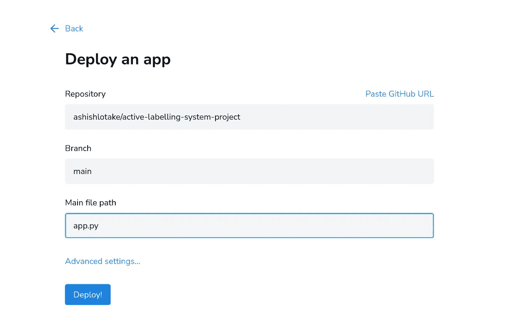

Image by Author

Wola，您的应用程序已部署。转到 streamlit 给出的链接。

# 最终想法

我们已经成功地创建了一个主动标记系统，使用迁移学习可以在看不见的数据上实现 90%以上的准确性。允许用户输入原始数据，标记模型是否表现不佳，然后通过将图像放入正确的目录，为用户提供正确分类的图像。

# 所有 Jupyter 笔记本 Colab 链接:

IPYNB [Colab 链接](https://www.ashishlotake.com/blog/active-labelling-system#all-jupyter-notebooks)

> 本帖原帖[此处](https://www.ashishlotake.com/blog/)

# 参考

1.  [https://www.manning.com/books/deep-learning-with-python](https://www.manning.com/books/deep-learning-with-python)
2.  [https://machine learning mastery . com/grid-search-hyperparameters-deep-learning-models-python-keras/](https://machinelearningmastery.com/grid-search-hyperparameters-deep-learning-models-python-keras/)
3.  [https://keras.io/api/applications/](https://keras.io/api/applications/)
4.  [https://data.caltech.edu/records/mzrjq-6wc02](https://data.caltech.edu/records/mzrjq-6wc02)

[](/mlearning-ai/mlearning-ai-submission-suggestions-b51e2b130bfb) [## Mlearning.ai 提交建议

### 如何成为 Mlearning.ai 上的作家

medium.com](/mlearning-ai/mlearning-ai-submission-suggestions-b51e2b130bfb)