# 使用 Azure percept 设备构建自定义模型

> 原文：<https://medium.com/mlearning-ai/build-custom-model-using-azure-percept-device-9ec56f74a4d0?source=collection_archive---------8----------------------->

# 使用 Azure Percept 收集图像和训练自定义模型的过程

# 要求

*   Azure 帐户
*   天蓝色感知设备
*   Azure Percept 工作室
*   Azure 认知定制视觉服务

# 步伐

*   首先安装并配置 Azure percept 设备
*   然后进入—[https://ms . portal . Azure . com/# blade/AzureEdgeDevices/Main/overview](https://ms.portal.azure.com/#blade/AzureEdgeDevices/Main/overview)—Azure Percept Studio
*   单击概述页面
*   点击新的人工智能模型

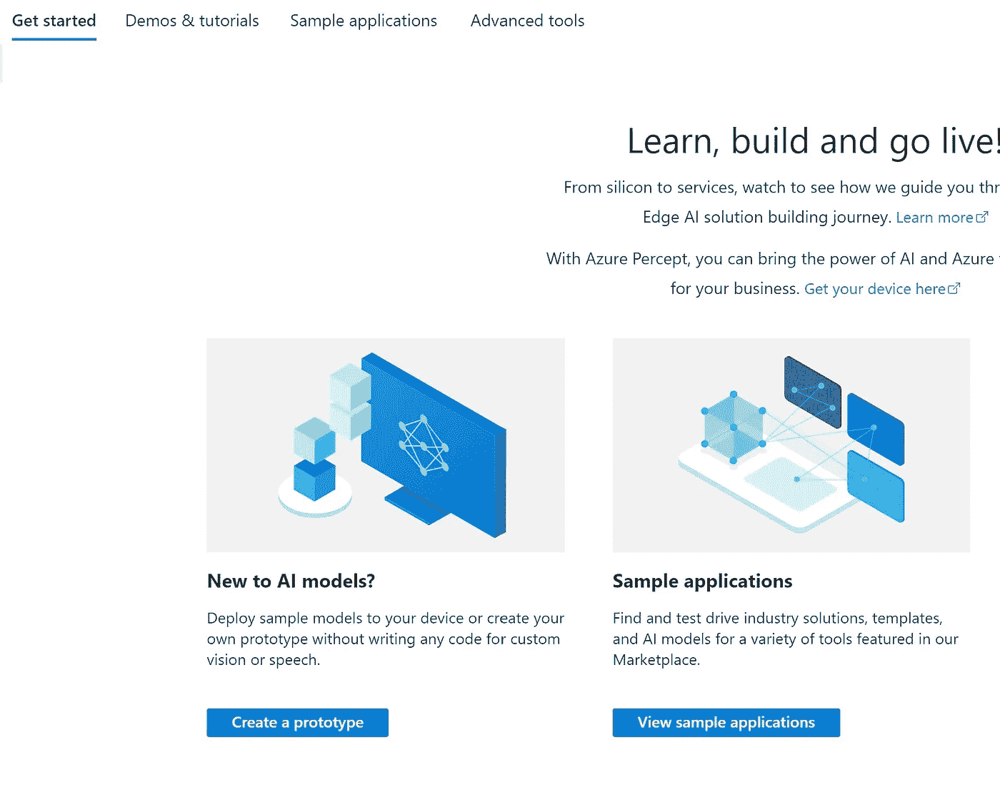

*   然后单击创建视觉原型

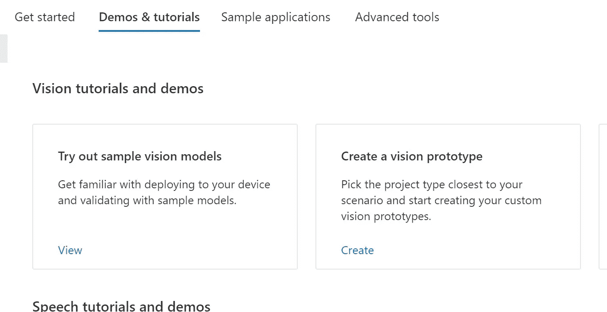

*   现在为项目命名并选择资源组
*   确保选择合适的认知服务定制愿景资源
*   选择对象检测
*   为了优化，请选择精度

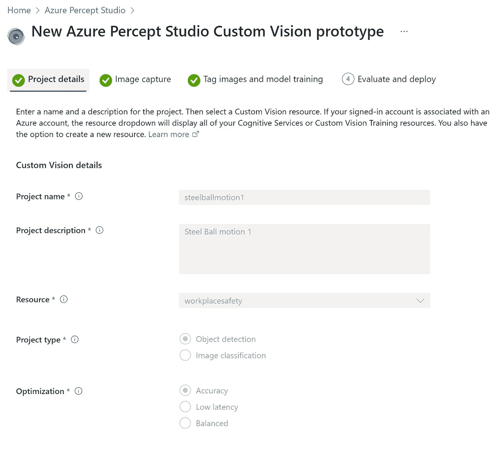

*   现在让我们配置设备来收集图像
*   选择物联网集线器，然后选择设备
*   对于收集的频率，我选择每 5 秒拍摄一帧，然后将其发送到自定义视觉服务

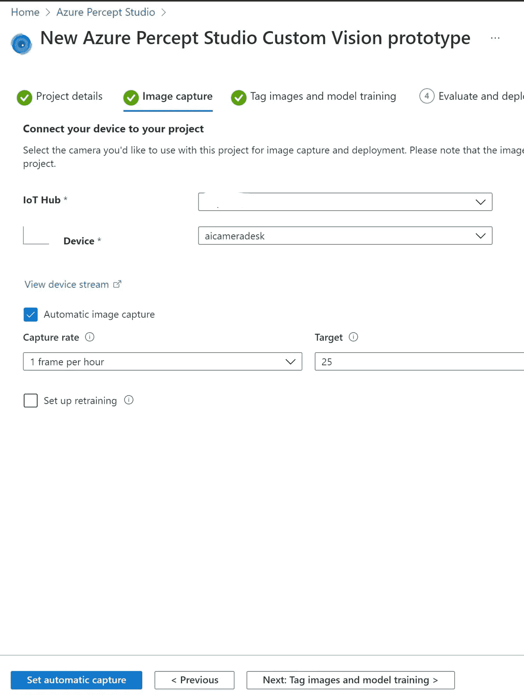

*   下一步是去自定义视觉和标签的图像
*   在我的例子中，我正在拍摄钢珠的图像，并希望检测这些图像以进行计数

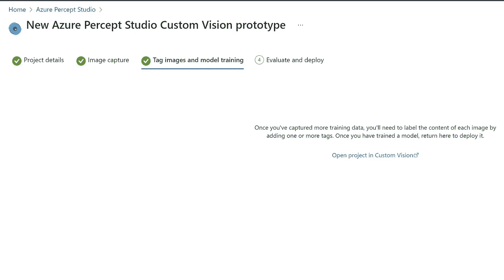

*   确保至少收集了 25 张图像
*   如果没有，那么再次返回并收集更多的图像
*   我几乎尝试了 3 次来获得正确的图像数量
*   还要记住，有时我们可能需要 50 张或更多的图片来获得准确性
*   这是图片列表

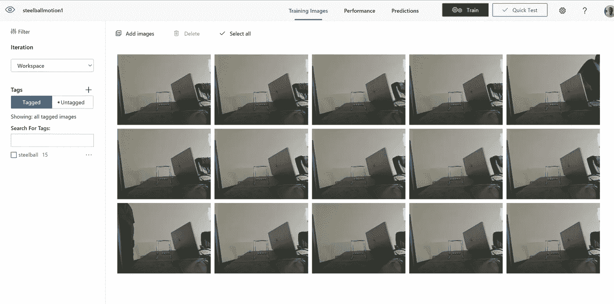

*   现在是检测盒子的时候了
*   花时间确保在图像上画出边界框，并用标签标记它们

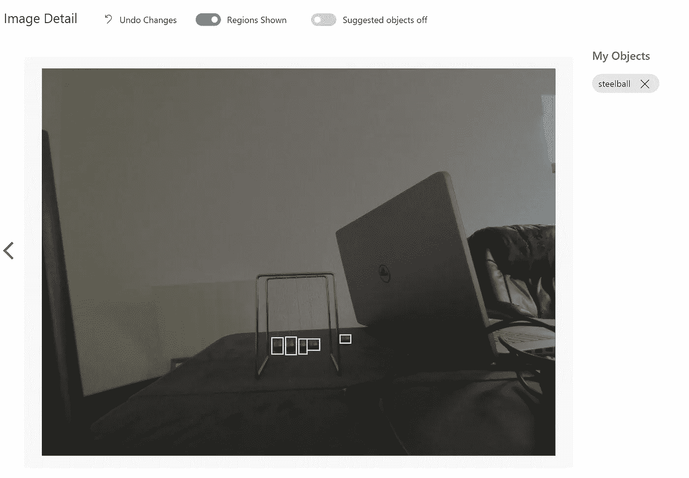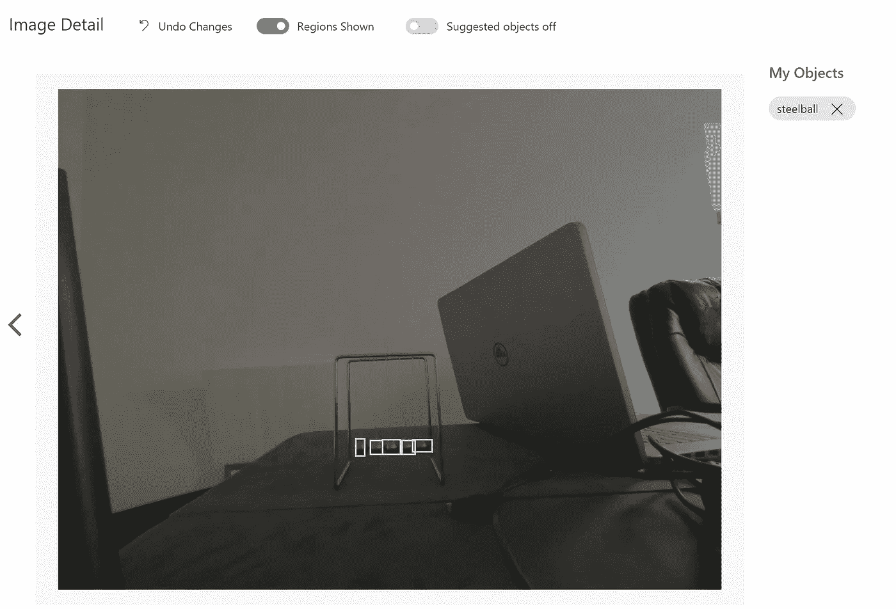

*   现在，单击自定义视觉中的培训
*   等待培训完成

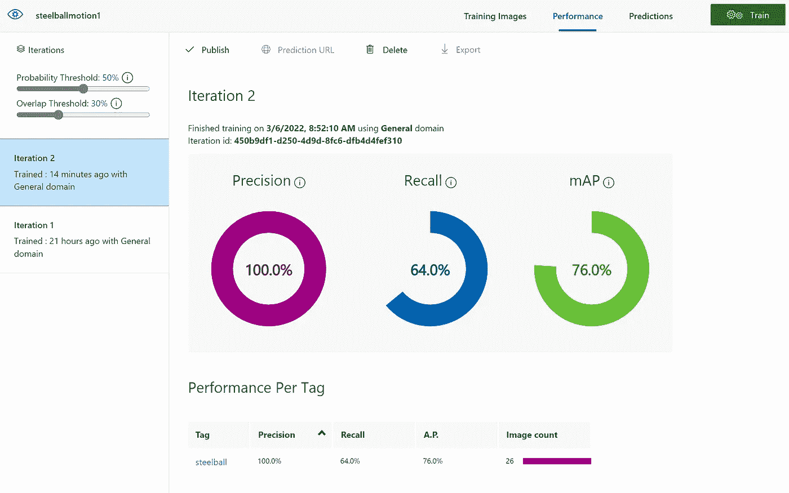

*   现在回到 Azure Percept Studio
*   转到下一步，即部署模型

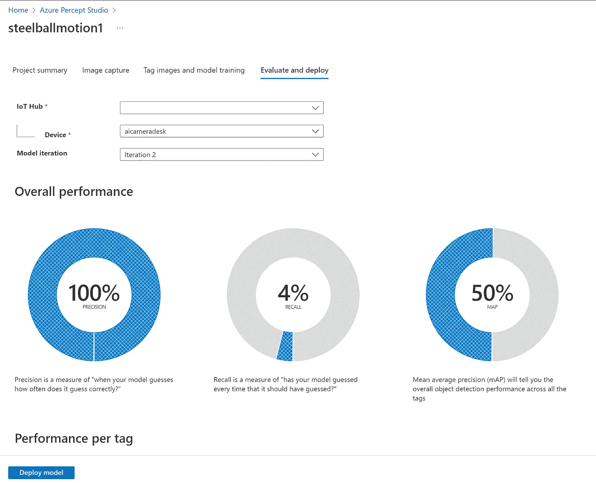

*   现在部署模型
*   转到 webstream 并查看设备摄像头输出
*   给几分钟时间来加载部署的模型
*   看看这个设备是否能够预测钢珠

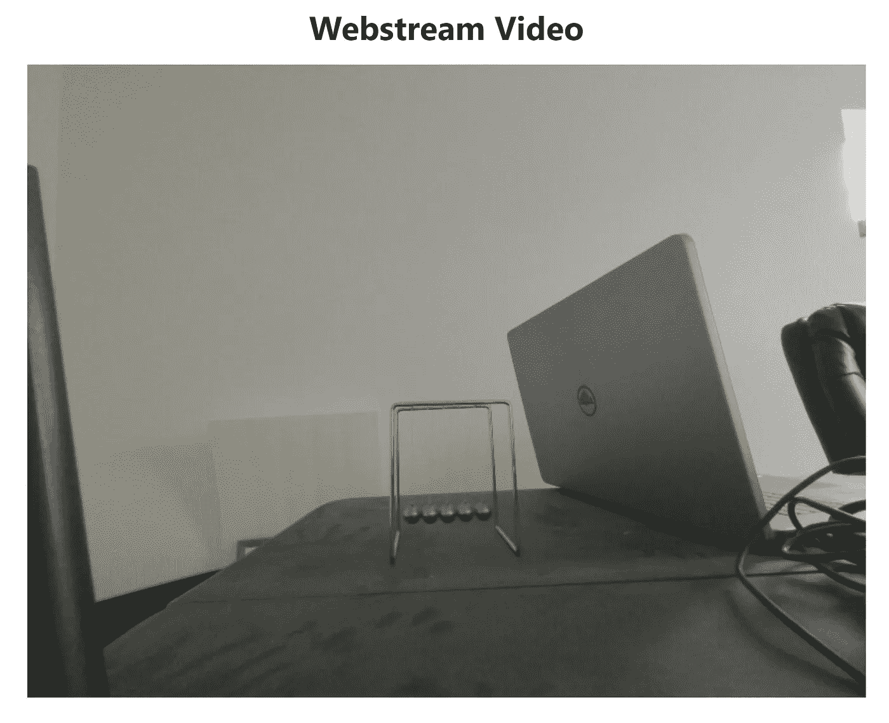

*   小物体总是难以探测
*   在自定义视觉服务中测试模型
*   使用 test1.jpg 和 test2.jpg 图像

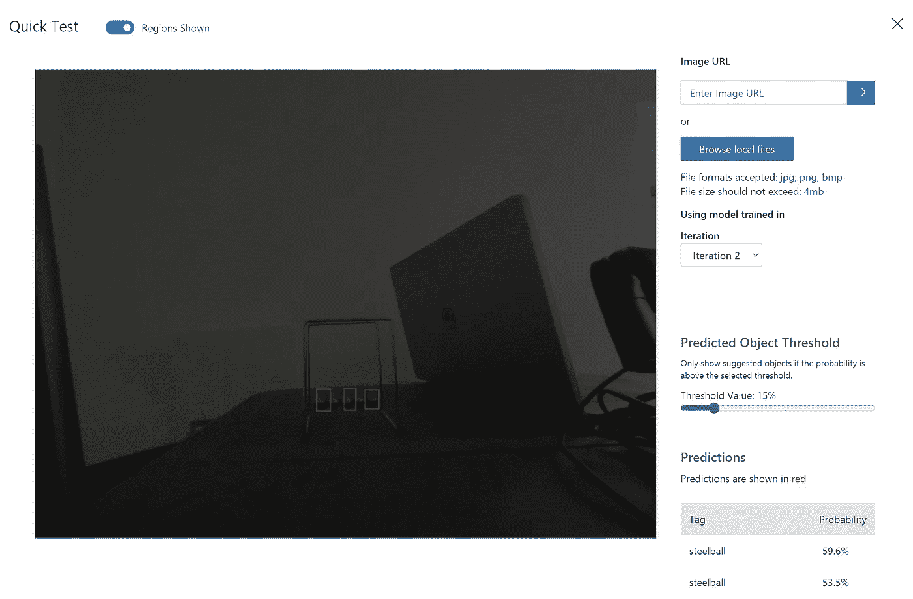

*   在用更多的图像测试后，你可以看到模型的准确性
*   必须将物体拉近，以便摄像机拾取和检测物体
*   以下是预测结果的示例

```
{
  "body": {
    "NEURAL_NETWORK": [
      {
        "bbox": [
          0.561,
          0.81,
          0.587,
          0.846
        ],
        "label": "steelball",
        "confidence": "0.708984",
        "timestamp": "1646696076787165855"
      },
      {
        "bbox": [
          0.435,
          0.805,
          0.458,
          0.844
        ],
        "label": "steelball",
        "confidence": "0.665527",
        "timestamp": "1646696076787165855"
      },
      {
        "bbox": [
          0.5,
          0.808,
          0.525,
          0.844
        ],
        "label": "steelball",
        "confidence": "0.570801",
        "timestamp": "1646696076787165855"
      }
    ]
  },
  "enqueuedTime": "2022-03-07T23:34:37.313Z"
}{
  "body": {
    "NEURAL_NETWORK": [
      {
        "bbox": [
          0.566,
          0.706,
          0.589,
          0.748
        ],
        "label": "steelball",
        "confidence": "0.623535",
        "timestamp": "1646695846850685038"
      }
    ]
  },
  "enqueuedTime": "2022-03-07T23:30:47.368Z"
}{
  "body": {
    "NEURAL_NETWORK": [
      {
        "bbox": [
          0.566,
          0.705,
          0.592,
          0.747
        ],
        "label": "steelball",
        "confidence": "0.547852",
        "timestamp": "1646695845809100162"
      }
    ]
  },
  "enqueuedTime": "2022-03-07T23:30:46.306Z"
}{
  "body": {
    "NEURAL_NETWORK": [
      {
        "bbox": [
          0.575,
          0.706,
          0.598,
          0.747
        ],
        "label": "steelball",
        "confidence": "0.680176",
        "timestamp": "1646695844725854422"
      }
    ]
  },
  "enqueuedTime": "2022-03-07T23:30:45.243Z"
}{
  "body": {
    "NEURAL_NETWORK": [
      {
        "bbox": [
          0.562,
          0.706,
          0.586,
          0.748
        ],
        "label": "steelball",
        "confidence": "0.670410",
        "timestamp": "1646695843642607332"
      }
    ]
  },
  "enqueuedTime": "2022-03-07T23:30:44.166Z"
}{
  "body": {
    "NEURAL_NETWORK": [
      {
        "bbox": [
          0.569,
          0.706,
          0.593,
          0.748
        ],
        "label": "steelball",
        "confidence": "0.540039",
        "timestamp": "1646695842601024050"
      }
    ]
  },
  "enqueuedTime": "2022-03-07T23:30:43.102Z"
}{
  "body": {
    "NEURAL_NETWORK": [
      {
        "bbox": [
          0.571,
          0.705,
          0.596,
          0.745
        ],
        "label": "steelball",
        "confidence": "0.592773",
        "timestamp": "1646695841517776948"
      }
    ]
  },
  "enqueuedTime": "2022-03-07T23:30:42.040Z"
}{
  "body": {
    "NEURAL_NETWORK": [
      {
        "bbox": [
          0.562,
          0.708,
          0.586,
          0.748
        ],
        "label": "steelball",
        "confidence": "0.736816",
        "timestamp": "1646695840434530132"
      },
      {
        "bbox": [
          0.494,
          0.708,
          0.517,
          0.753
        ],
        "label": "steelball",
        "confidence": "0.504395",
        "timestamp": "1646695840434530132"
      }
    ]
  },
  "enqueuedTime": "2022-03-07T23:30:40.961Z"
}
```

*   网络流上的输出

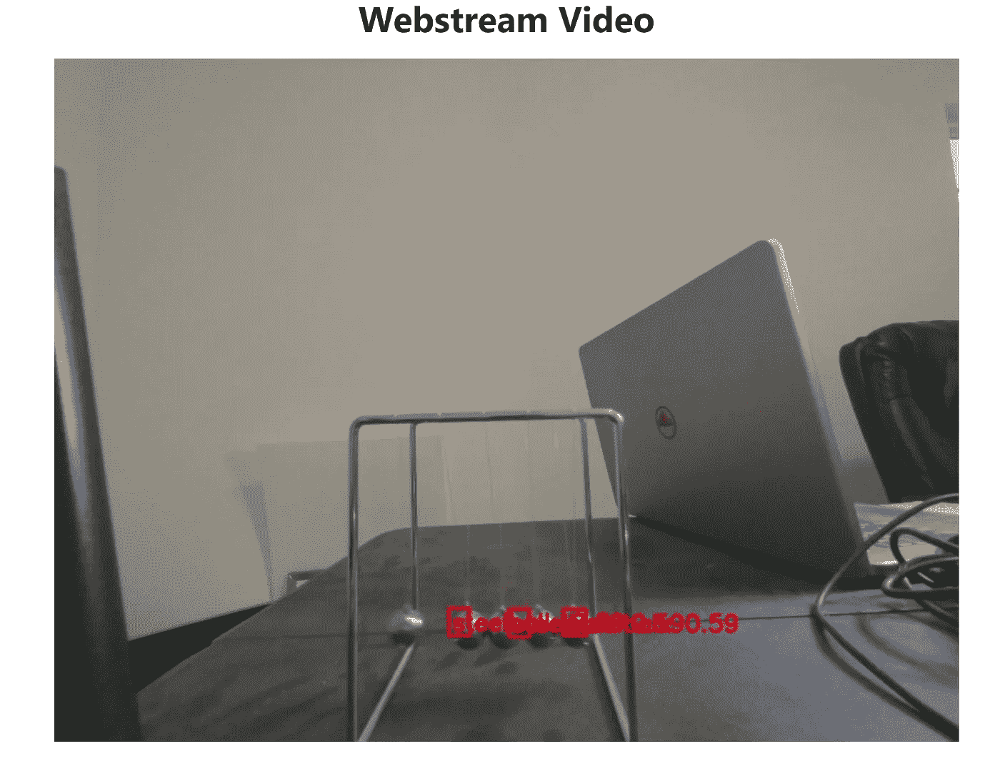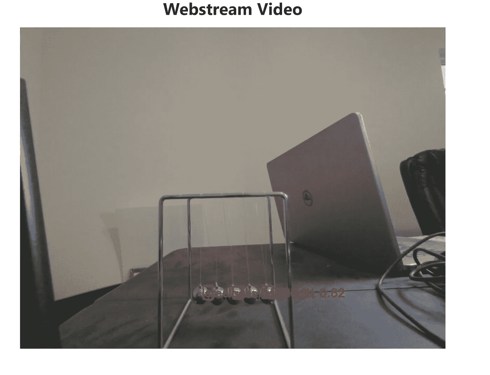

*   重置为模型

```
https://github.com/microsoft/azure-percept-advanced-developmenthttps://aedsamples.blob.core.windows.net/vision/aeddevkitnew/openpose.zip
```

原文—【github.com】samples 2022/custommodelpepent . MD at main balakreshnan/samples 2022

[](/mlearning-ai/mlearning-ai-submission-suggestions-b51e2b130bfb) [## Mlearning.ai 提交建议

### 如何成为 Mlearning.ai 上的作家

medium.com](/mlearning-ai/mlearning-ai-submission-suggestions-b51e2b130bfb)