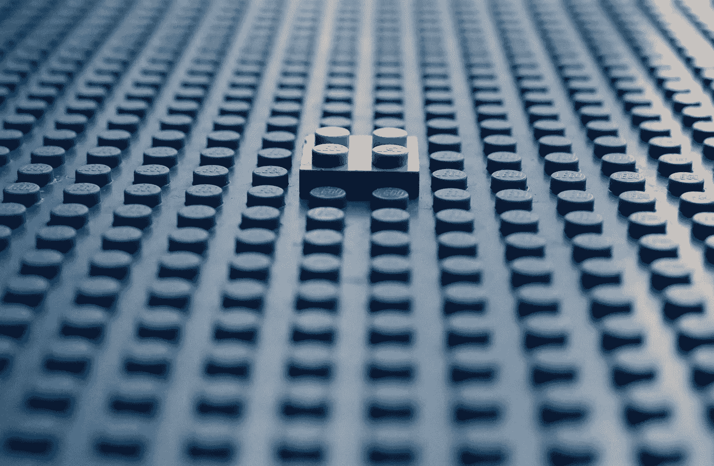

# 构建材料:我如何通过构建获得 7x 云认证以了解

> 原文：<https://medium.com/mlearning-ai/build-stuff-how-i-got-7x-cloud-certified-by-building-to-learn-cafb6bb273b3?source=collection_archive---------2----------------------->

## 通过微型项目学习云概念的案例

Photo by [Glen Carrie](https://unsplash.com/@glencarrie?utm_source=unsplash&utm_medium=referral&utm_content=creditCopyText) on [Unsplash](https://unsplash.com/s/photos/lego?utm_source=unsplash&utm_medium=referral&utm_content=creditCopyText)

云计算正在接管。出于多种原因，在安全、可扩展的托管环境中即时启动服务器、虚拟机或平台的能力非常有吸引力。这里有三个:

1.  **从头开始构建是艰难的**:使用 PaaS 和 SaaS 云产品简化开发
2.  **可扩展性很难**:扩展内部服务需要维护、硬件和资本支出决策。这一切都在云上实现了简化
3.  **GPU 价格昂贵**:租用计算和存储设备在设计和成本管理方面提供了更大的灵活性

**这又如何加速云学习呢？**

*   **从头开始构建是艰难的:**您可以直接学习存储和分析的云基础知识，而无需先学习 kubernetes
*   **可扩展性很难:**你可以构建和测试各种各样的云应用程序，只需支付实际使用的计算时间
*   **GPU 贵:**不受硬件限制(这年头买个树莓派试试……)

我用这三个概念跳进去，很快就拿到了 7x Azure 认证。以下认证:

 [## 威廉·纳撒尼尔·范布斯柯克在 Credly 上的简介

### Credly 是一个全球开放的徽章平台，它缩小了技能和机会之间的差距。我们与学术界合作…

www.credly.com](https://www.credly.com/users/william-vanbuskirk/badges) 

## 怎么会？建筑材料

课程很棒，考试复习指南也很有帮助，但是构建在云上真的是唯一的学习方式。

不要因为你缺乏知识而气馁。我构建的许多“应用程序”都是微小的构建模块，例如:

*   一个简单的 Azure 函数，它从一个 API 中提取数据并将其放入数据库(我每小时从一个免费的 API 中提取比特币的价格)
*   快速机器学习管道(从无代码到低代码再到实际代码)([https://level up . git connected . com/From-No-Code-to-Code-in-azure-machine-learning-38e 6b 556 de 2](https://levelup.gitconnected.com/from-no-code-to-code-in-azure-machine-learning-38ee6b556de2))
*   从物联网传感器获取数据以在 PowerBI 上可视化([https://blog . cryptostars . is/web 3-IoT-connect-IoT-devices-to-azure-via-helium-network-FDD 144d 526 f 1](https://blog.cryptostars.is/web3-iot-connect-iot-devices-to-azure-via-helium-network-fdd144d526f1))
*   使用 Azure Percept 在边缘构建分析([https://medium . com/@ William . n . vanbuskirk/Azure-Percept-IOT-a 535 CB 0 AE 7c 6](/@william.n.vanbuskirk/azure-percept-iot-a535cb0ae7c6))
*   将您的手机变成物联网设备([https://medium . com/mlearning-ai/get-started-in-azure-IoT-with-just-your-phone-23d 846 c01c 58](/mlearning-ai/get-started-in-azure-iot-with-just-your-phone-23d846c01c58))
*   在 Azure App Service 上托管 web 应用([https://medium . com/mlearning-ai/curate-your-data-science-journey-with-web-apps-3b 58 c8 DCA 69](/mlearning-ai/curate-your-data-science-journey-with-web-apps-3b58c8dca69)

下面，我将介绍我所追求的 5 组认证:

1.  云基础知识(Azure 基础知识、数据基础知识、人工智能基础知识)
2.  数据分析(PowerBI 数据分析助理)
3.  数据科学(Azure 数据科学助理)
4.  数据工程(Azure 数据工程助理)
5.  物联网(Azure 物联网开发者专业)

# 云基础:Azure 基础，AI 基础，数据基础

有了初步的云基础知识，最好的办法就是将[微软在线培训](https://learn.microsoft.com/en-us/training/paths/microsoft-azure-fundamentals-describe-cloud-concepts/)与你自己的构建结合起来。就我个人而言，我不喜欢只使用引导式实验。我认为自己动手提供资源是一件很棒的事情([此外，你可以用一个新账户](https://azure.microsoft.com/en-us/free/)获得 200 美元的信用额度)。

在你找到方向之后，直接把数据上传到 Azure Data Lake Storage (ADLS)就可以了。开始和 ADLS 一起玩真是太棒了。然后，您可以尝试上传。csv 文件到 ADLS，并在 Azure 数据工厂或 Synapse 管道上修改。还是那句话，小步前进是关键。

**人工智能和数据基础:**类似于 azure 基础考试，最初提供 Azure 机器学习工作区进行初步实验是很棒的。用 Azure Machine Learning 花< $5 就能学到一吨。数据基础，探索 CosmosDB 这个 NoSQL 数据库在访问约束、与仪表板的集成和模式约束方面非常精简。

# 数据分析:Power BI 分析助理

学习 PowerBI 是一项杀手锏。对于许多工作来说，构建引人注目的仪表盘和报告来讲述一个故事并为决策提供信息是至关重要的。在线培训非常棒，涵盖了许多主题，从工作区权限、RLS(行级安全性)、数据集成等等。

但是，我再强调一遍:学习 PowerBI 最好的方法是抓一个数据集，开始撕(加分:连接其他切向技能；不要只连接到本地。csv 文件)。上传到 ADLS 并清理 Azure 数据工厂/ Synapse 管道上的数据。然后，推送至 PowerBI。将云技术与单个实验结合起来，确实可以巩固所学到的经验。

卡格尔和 UCI 有一些很好的数据集可用于数据分析和机器学习。首先，查看里程数据集([https://archive.ics.uci.edu/ml/datasets/auto+mpg](https://archive.ics.uci.edu/ml/datasets/auto+mpg))；https://www.fueleconomy.gov/feg/download.shtml

这是一个我将数据分析与物联网相结合的演示:

 [## Web3 + IoT:通过氦网络将物联网设备连接到 Azure

### 将物联网设备连接到氦并在 Azure 上访问数据的简单指南

blog.cryptostars.is](https://blog.cryptostars.is/web3-iot-connect-iot-devices-to-azure-via-helium-network-fdd144d526f1) 

# 数据科学和机器学习:Azure 数据科学家助理

现在，当我们进入机器学习时，我们变得越来越认真。这个考试有一些机器学习的基础知识和更广泛的“如何使用 Azure 机器学习”的细节。

Azure 机器学习本质上有三个级别的机器学习:

1.  无代码—自动
2.  低代码— Azure 机器学习设计器
3.  实际代码——Azure 机器学习管道

获得该认证的最佳方法是尝试这三者的结合。不要记住各种管线的选项，而是尝试创建许多管路和管线。我在这里的演练提供了一些例子

 [## Azure 机器学习从无代码到有代码

### 使用骨科多类数据的 Azure ML 演练

levelup.gitconnected.com](https://levelup.gitconnected.com/from-no-code-to-code-in-azure-machine-learning-38ee6b556de2) 

在 Azure 机器学习上部署模型也相当简单。尝试部署一个简单的推理 API。下面的例子:

 [## GitHub-van-William/Flask _ App _ ml:带有 Azure 机器学习的 Flask Web App

### 这个 web 应用程序提供了使用各种机器学习模型的简单总结(Sklearn、Tensorflow 和 Azure…

github.com](https://github.com/van-william/flask_app_ml) 

# 数据工程:Azure 数据工程助理

这可能更具理论性，因为更难对数据库扩展主题(如分布、分片和散列)进行实验。

除了这些主题，还可以尝试将数据从 ADLS 移动到 SQL Server，然后移动到最终用户应用程序，比如 PowerBI。

学习数据块对于这个认证也是必不可少的。和以前一样，使用 pyspark 在 Databricks 上尝试查询来自 ADLS 的数据

# 物联网:Azure 物联网专业

对于物联网认证，有很多小规模的选择，但我最喜欢的是使用我的 iphone 作为物联网设备。

借助 Azure 即插即用应用，您可以轻松地从手机向物联网中心发送遥测数据:

 [## 物联网即插即用简介

### 了解物联网即插即用。物联网即插即用基于开放式建模语言，支持智能物联网设备…

learn.microsoft.com](https://learn.microsoft.com/en-us/azure/iot-develop/overview-iot-plug-and-play) 

我在这里简单介绍一下基本情况:

 [## 只需您的手机即可开始使用 Azure IoT

### 无硬件 Azure 物联网入门愿景

medium.com](/mlearning-ai/get-started-in-azure-iot-with-just-your-phone-23d846c01c58) 

总体而言，熟悉从设备到物联网中心再到 ADLS 或仪表板的数据路由将使您对物联网概念有一个大致的了解。

物联网即插即用可用于 Azure 的 SaaS 产品:Azure 物联网中心及其 PaaS 产品:物联网中心

# 摘要

建造东西；不要害怕失败

但是，请密切关注您的 Azure 支出，并设置警报和预算，以避免任何代价高昂的错误

抓到的比教到的多得多；跳进去，做一些很酷的东西。

 [## Mlearning.ai 提交建议

### 如何成为 Mlearning.ai 上的作家

medium.com](/mlearning-ai/mlearning-ai-submission-suggestions-b51e2b130bfb)