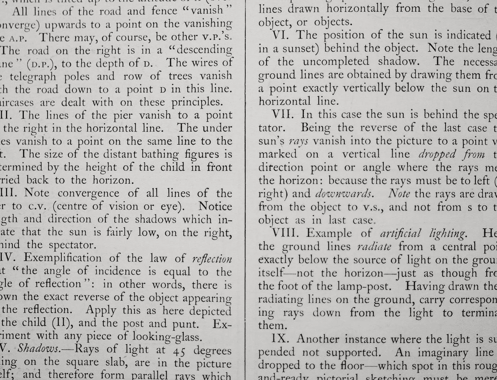
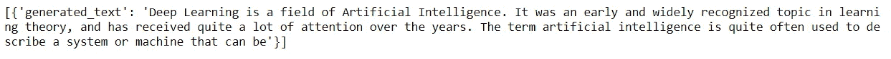

# 用 7 行 Python 代码构建您自己的人工智能内容生成器

> 原文：<https://medium.com/mlearning-ai/build-your-own-ai-powered-content-generator-with-7-lines-of-python-code-a679e7d5a563?source=collection_archive---------0----------------------->



Photo by [Annie Spratt](https://unsplash.com/es/@anniespratt?utm_source=medium&utm_medium=referral) on [Unsplash](https://unsplash.com?utm_source=medium&utm_medium=referral)

# 介绍

在本教程中，我们将使用 GPT-尼奥创建我们自己的内容生成器，这是一个开源的免费替代品，可以替代 [***OpenAI 的***](https://openai.com) GPT-3。

GPT-3 是一个基于深度学习的语言模型，仅在***1750 亿个参数上进行训练。*** 由于其海量的训练参数，在多种自然语言处理任务上表现出色。该模型是大多数自然语言处理过程的理想模型，包括文本生成、情感分析和对话模型。

虽然它有很多优点，但该模型不是开源的，只能通过封闭的测试版获得。这意味着无论你是一个爱好者还是一个商业领袖，你都必须请求许可。

幸运的是，我们可以利用一个名为***【GPT-尼奥】*的 GPT 克隆体，它是由一个名为***[***EleutherAI***](https://www.eleuther.ai/projects/gpt-neo/)***的组织构建的。我们将利用这个预先训练好的模型，因为许多开发者声称它几乎和 GPT 3 的达芬奇模型一样强大。****

# *PyTorch 和变压器安装*

*作为默认的安装方法，您可以在 anaconda 提示符或 cmd 中复制并粘贴这段代码来安装 [*PyTorch。*](https://pytorch.org)*

```
*pip install torch==1.10.0+cu113 torchvision==0.11.1+cu113 torchaudio==0.10.0+cu113 -f https://download.pytorch.org/whl/cu113/torch_stable.html*
```

*接下来我们要做的是安装一个强大的自然语言处理库— *transformers。变形金刚*包括不同的自然语言处理流水线。我们将使用文本生成管道。*

```
*pip install transformers*
```

*现在我们已经安装了必要的工具，让我们继续下一步。*

*打开 Jupyter 笔记本，导入变形金刚。*

```
*from transformers import pipeline*
```

# *生成您的内容创建者*

```
*gen = pipeline('text-generation', model ='EleutherAI/gpt-neo-2.7B')*
```

*此代码调用管道函数，指定其类型，并将预训练的定义为关键字参数。在我们的例子中，我们使用的是拥有 27 亿个参数的 GPT 近地天体。根据计算机的速度，您可能希望减小大小。下面的例子说明了如何减少参数。*

*对于 13 亿个参数；*

```
*gen = pipeline('text-generation', model ='EleutherAI/gpt-neo-1.3B')*
```

*对于 1.25 亿个参数；*

```
*gen = pipeline('text-generation', model ='EleutherAI/gpt-neo-125M')*
```

# *生成文本*

*如果您想要基于上下文生成文本，您将需要指定该上下文，以便模型能够理解并根据该上下文生成文本。创建一个名为 *context* 的变量，用字符串格式写一个句子。*

```
*context = "Deep Learning is a sub-field of Artificial Intelligence."output = generator(context, max_length=50, do_sample=True, temperature=0.9)*
```

*输出变量的第一个参数是我们指定为字符串格式的*上下文*。第二个关键字参数， *max_length* 定义了输出的字数。您可能希望根据需要生成更长的文本。*

**

*Output, image by author*

# *将输出写入文本文件*

*最后，因为输出是字典格式的，我们将把它写到文本文件中，这将使编辑过程相对容易。*

```
*with open('dl.txt', 'w') as f:
       f.write(str(output))*
```

*[](/mlearning-ai/mlearning-ai-submission-suggestions-b51e2b130bfb) [## Mlearning.ai 提交建议

### 如何成为 Mlearning.ai 上的作家

medium.com](/mlearning-ai/mlearning-ai-submission-suggestions-b51e2b130bfb)*