# 建立自己的面部识别系统:即使戴着面具也能工作！

> 原文：<https://medium.com/mlearning-ai/build-your-own-facial-recognition-system-to-work-even-with-a-face-mask-b240539222f6?source=collection_archive---------0----------------------->

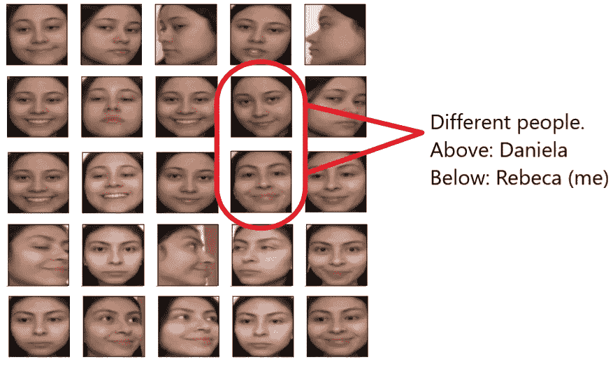

# 介绍

最近，我的一个邻居第五次把我和我妹妹搞混了。她说我和我妹妹在她看来非常相像，以至于把我们弄混了。

在这个项目中，我使用 Keras 用卷积神经网络(CNN)结构从**开始创建了一个面部识别系统，以识别我和我的妹妹。**

后来，在这个项目和笔记本中，**我使用迁移学习技术**建立了另一个模型，以达到更高的验证准确性分数，并在测试新的和不同的照片时，以及在使用不同照明的网络摄像头时。

> **在本教程中，我创建了两个模型:一个是从零开始，另一个是预先训练好的模型**

一直以来，对于这两个模型，也应用了数据扩充。通过这项技术，我能够通过翻转和旋转照片来随机添加或删除亮度、饱和度和更多的面部角度，从而将数据增加到 2794 张照片。正是因为这种数据扩充，我才能创建一个更强大的模型。

这样，模特们会更关注面部特征，而不是颜色或其他图片因素。

从增强的结果图像中，1871 个用于训练模型，923 个用于测试验证集。

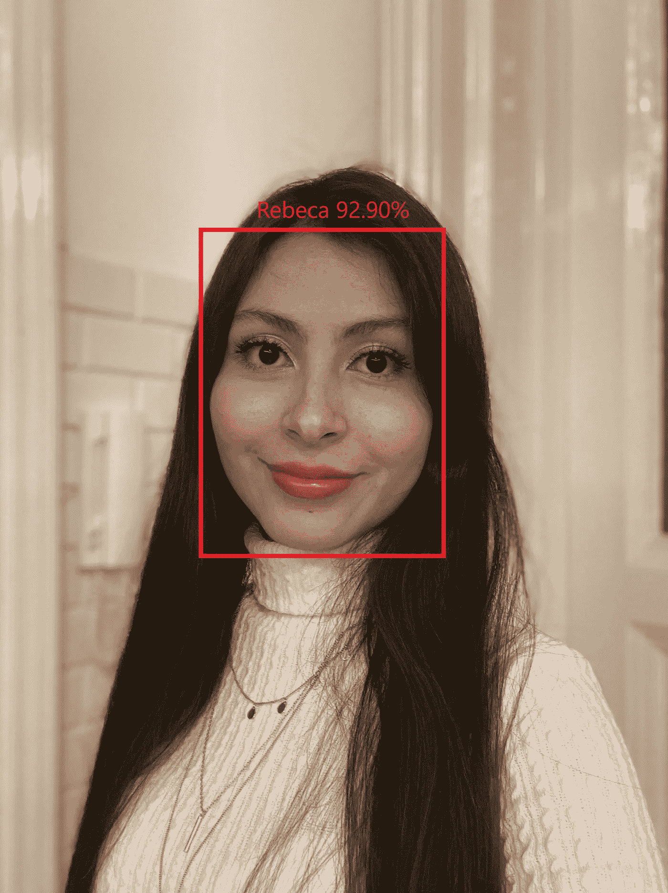

The first model (Build from scratch) recognizing me in a recent photo.

该模型在从不同相机/手机、不同时间和不同长相/化妆拍摄的不同类型的照片中进行测试。使用混淆矩阵，可以看到模型在预测其中一个类别时如何更加精确(在这种情况下，要么是我姐姐的脸，要么是我的脸)。

模型保存为“. h5”文件以便于移植，创建的完整图像数据集压缩为“.npz”文件也是出于同样的原因。

在这个项目的最后，我能够让模特认出我**,即使我戴着面具。对我来说很有趣。**

**你可以在文末我的 Github 链接里找到完整的代码。**

如果你对计算机视觉感兴趣，[你可以学习图像处理中最热门、最有用的技术**，这些技术几乎可以应用于所有行业，包括我在**](http://datacamp.pxf.io/Image-Processing) **[Datacamp 的课程**“用 Python 处理图像”**](http://datacamp.pxf.io/Sign-up) 中的一些技术。**

# **用我们的脸拍照**

**自拍的好处是，在这种情况下，建立一个面部识别系统，如果你已经有了相对较多的照片，那么这样做会更快。在我和我妹妹的例子中，我们确实用自己的照片来计数，尽管其中一些使用了滤镜。**

**为数据集选择的一些照片有点全身类型，所以也需要面部检测系统，这将在本文档和项目的稍后部分更明确地详细说明。**

**在挑选了几张我和我妹妹的照片后，我意识到即使是面部检测器也可能在一些照片中失败，导致数据集比计划的要小很多。我偶然发现了谷歌的一个在线工具“可教机器”，它允许人们在 navigator 中本地训练和测试一个模型，并从视频中生成照片样本，这样我就可以生成数百张照片来补充数据集。**

**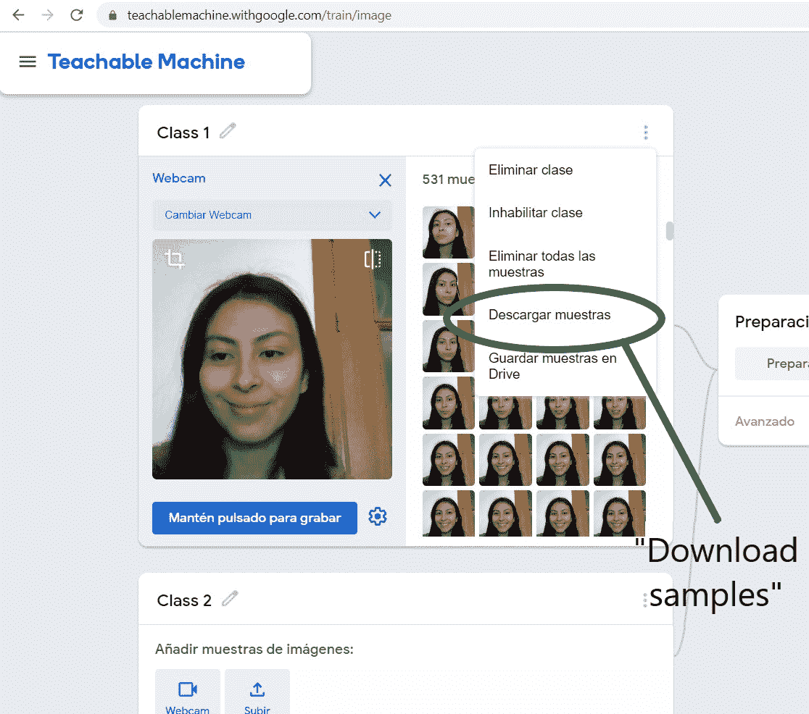**

**以我的脸部为例，从我的照片中提取了 166 个样本，而我能够从用在线工具拍摄的照片中生成另外 541 个脸部样本。而对于我的妹妹，从她的照片中提取了 105 张人脸照片，从用该工具拍摄的照片中提取了 585 张人脸照片。**

****

**完整的人脸数据集被保存为压缩文件。npz”文件，以便于移植。**

# **照片上的人脸检测**

**对于收集到的每一张图像或者要测试的每一张图像，都需要进行人脸检测，以便稍后将特定形状和大小的人脸传递给模型。**

**你可以在我在 Datacamp 的课程**“用 Python 处理图像”**中更详细地了解如何检测人脸。**

# **使用 Sckit-image 进行人脸检测**

**我知道 Scikit-image library，也是在我教授使用它进行图像处理的课程中知道的:人脸检测、将图像转换为灰度等。我使用了 Scikit-Image 提供的级联分类器模型。通过用模块以 XML 文件形式提供的正面数据集对其进行训练，检测器就可以进行配置和使用了。**

**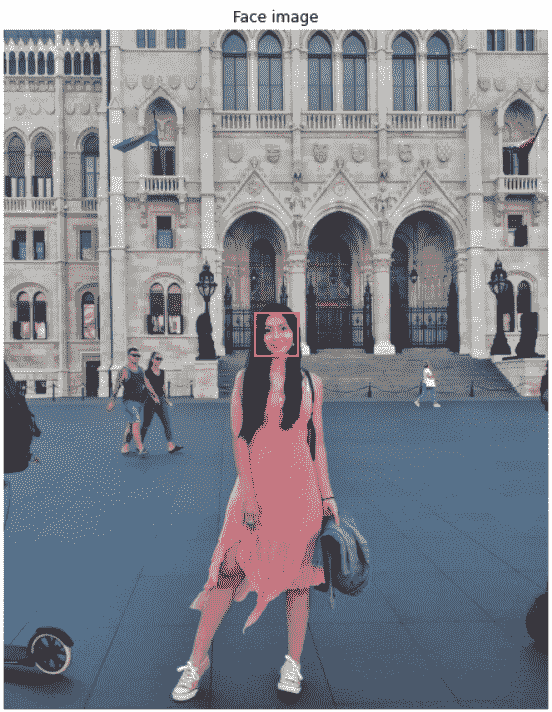****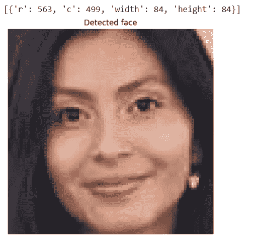**

**我创建了从照片中提取人脸的功能，一旦这些被检测到，也会在原始照片中用红框显示出来。**

# **检测器的优点**

**它非常舒适，因为它是一个我们已经使用过的包，而且 Google Colab 已经安装并导入了它。可以为侧面角度的人脸创建另一个检测器，然后对我来说，提取照片中的人脸，每张照片需要两个检测器。**

# **探测器的缺点是**

**该检测器只能检测正面人脸，但当人脸以不同角度拍摄时，如或侧面角度，它无法检测人脸，所以我无法用我为此创建的函数提取人脸。**

# **基于 Keras 的人脸检测**

**由于 Scikit-Image 人脸检测技术对于正面图像非常有效，我们还希望该模型能够从照片的侧面和其他角度识别人脸。**

**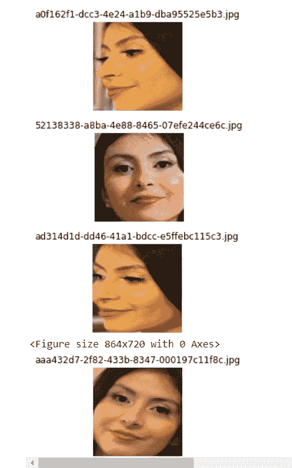**

**为此，我尝试并比较了 MTCNN。人脸检测的 Keras 实现。这能够只用一个检测器，从更多的角度发现和提取人脸:从侧面角度，正面，等等。**

# **检测器的优点**

**一旦安装在 Colab/notebook 环境中，使用起来会很舒服。在检测人脸时非常好，可以选择一个定义的图像大小，与模型的输入相同:(224，224)，224x224 像素，RGB 通道。该模型将具有(224，224，3)的形状作为输入。**

# **探测器的缺点是**

**需要预先安装。**

# **使用检测到的人脸创建数据集**

**一项重要的工作是将来自不同来源的所有检测到的人脸连接起来，并使用相应的标签将它们组织到文件夹中，然后将它们准备为模型的 NumPy 数组。**

**采取了多个步骤来优化数据管理。生成的包含所有面部的完整数据集被保存为压缩的”。npz”文件以实现可移植性。**

**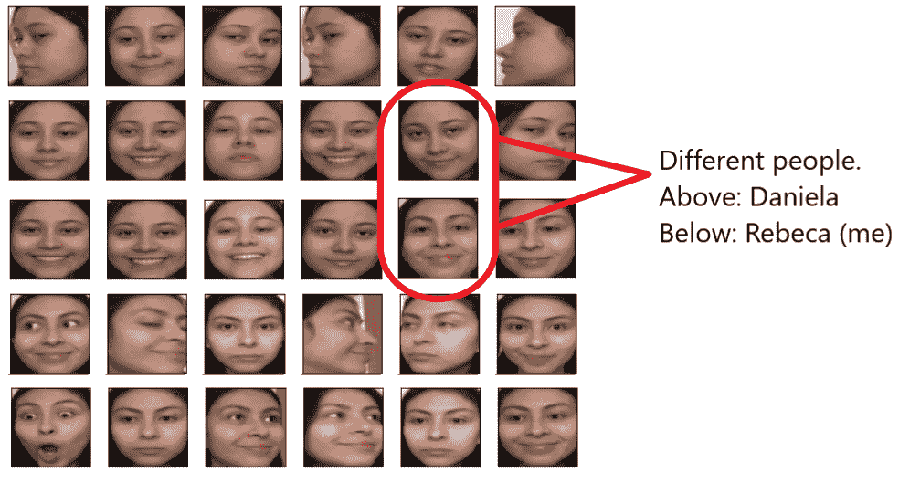**

# **数据扩充**

**数据分析中的数据扩充是指用于显著增加可用于训练模型的数据的多样性的技术和策略，通过添加已有数据的稍微修改的副本或从现有数据中新创建的合成数据。它充当正则化器，有助于在训练机器或深度学习模型时减少过度拟合。**

**应用数据扩充将原始数据集扩展到 2794 张照片，其中约 1800 张用于训练，900 张用于验证测试。**

**应用于照片的技术有缩放、旋转、亮度以及翻转或移动。前两个是完全受控的，没有随机选择值，而对于亮度和翻转，添加了随机因子。例如，通过随机选择一系列值来降低图像的亮度或增加图像的亮度，从而增加曝光和饱和度。这些图像转换包含在课程中，尽管在这种情况下，我使用 OpenCV 库。**

**[你可以在](http://datacamp.pxf.io/Image-Processing)[数据营](http://datacamp.pxf.io/Sign-up)我的**“用 Python 处理图像”** 课程中了解这些技术。**

**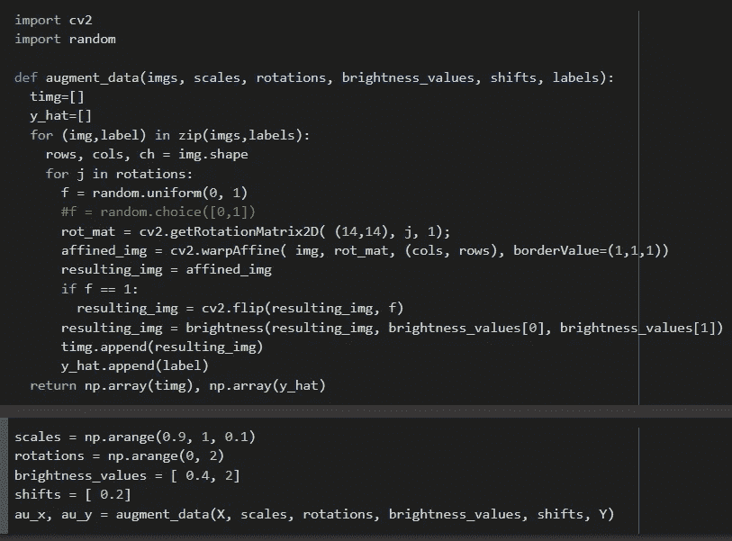**

**Function to perform data augmentation on the photos**

**这样，模型将更多地关注面部特征，而不是颜色或其他图片因素。**

**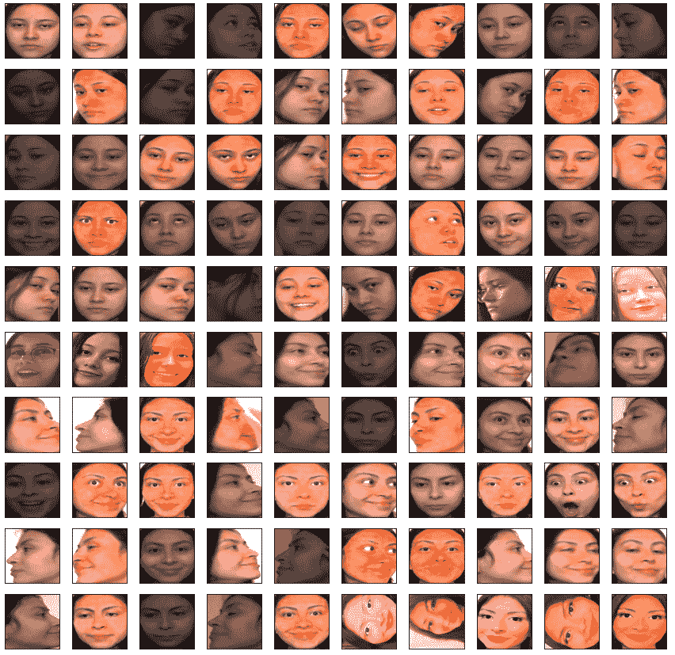**

# **准备数据集:一键编码**

**然后，生成的扩充数据集准备好用于输入模型，在这种情况下，最初作为字符串的原始标签将被转换为数字标签:0 和 1。然后被转换成一键编码。生成的数据集保存为压缩文件，便于以后使用。**

# **创建 Keras 模型**

**使用扩充的数据，现在预处理以满足模型的输入要求；我用 Keras 的回调来获得更高效的训练。**

**该模型的输入将是形状为(224，224，3)的图像，表示具有用于颜色编码的 3 个 RGB 通道的 224×224 像素图像。**

**卷积基是使用一种常见的模式创建的:一个二维卷积层“Conv2D”和最大池“MaxPooling2D”层的堆栈。**

**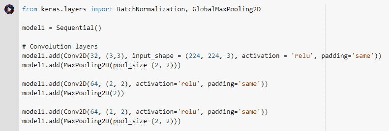**

**为了完成模型，我将把来自最后一个 Max 池的卷积基(形状为(28，28，64))的最后一个输出张量馈送到两个密集层中以执行分类。密集层将矢量作为输入(1D)，而当前输出是 3D 张量。因为这个原因，我将把 3D 输出展平(或展开)到 1D，然后在上面添加密集层，它们之间的 drop_put 为 0.2。最终的密集层将有 2 个输出。**

**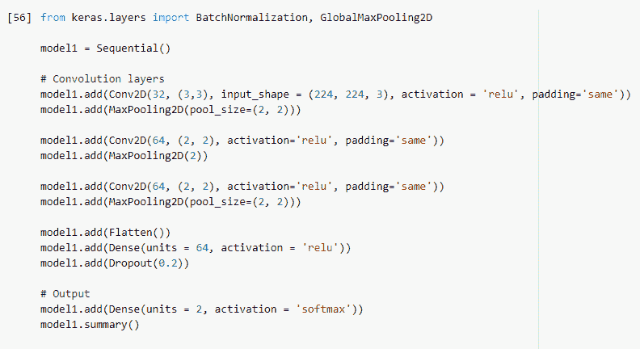**

**模型摘要:**

**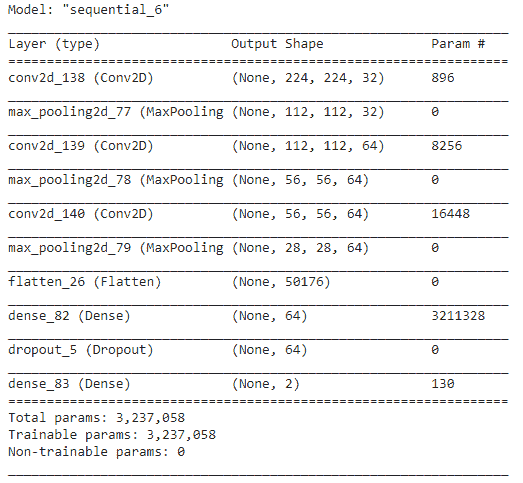**

**在尝试了很多模型之后，我意识到，对于一个模型来说，在很多情况下，包括这种情况，并不一定需要每一层或卷积层都有大量的神经元。另一方面，拥有更多神经元将允许模型看到和覆盖更多细节。**

## **什么是最大池？**

****最大池**是一个**池**操作，从过滤器覆盖的特征图区域中选择**最大值**元素。因此， **max** - **pooling** 图层之后的输出将是包含先前要素地图的最显著要素的要素地图。**

## **为什么要使用池层？**

*   **池图层用于减少要素地图的维度。因此，它减少了要学习的参数数量和网络中执行的计算量。**
*   **汇集图层汇总了由卷积图层生成的要素地图区域中的要素。因此，对概括的特征而不是由卷积层生成的精确定位的特征执行进一步的操作。这使得模型对于输入图像中特征位置的变化更加鲁棒。**

## **什么是辍学？**

****Dropout** 是一种正则化方法，近似并行训练大量不同架构的神经网络。**

**在训练过程中，一些层输出被随机忽略或“*被丢弃*”这具有使该层看起来像并且被视为具有不同数量的节点和与前一层的连通性的层的效果。实际上，训练期间对层的每一次更新都是用已配置层的不同“T2”视图“T3”来执行的。**

**批量标准化和丢弃层可以防止模型过度拟合。**

# **编译模型和回调**

**该模型使用 Adam optimizer、Categorical _ crossentropy 和关于准确性的指标进行编译。通过回调，可以使用“提前停止”功能来避免过度拟合，以便在验证损失显示出过度拟合迹象时进行观察。然后由 ModelCheckpoint 根据验证准确性自动保存来自训练的最佳模型。**

**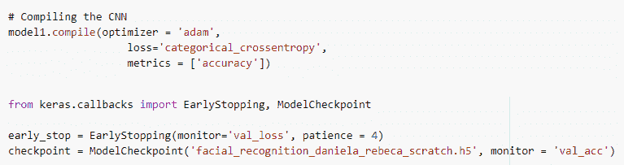**

# **优化器**

**Adam 是用于训练深度学习模型的随机梯度下降的替换优化算法。Adam 结合了 AdaGrad 和 RMSProp 算法的最佳特性，提供了一种可以处理噪声问题上的稀疏梯度的优化算法。**

**根据不同的来源，似乎自适应矩估计(Adam)优化器在最小化训练神经网络中的成本函数时几乎总是工作得更好(更快且更可靠地达到全局最小值)。**

# **损失函数**

**在数学优化和决策理论中，损失函数或成本函数是将事件或一个或多个变量的值映射到实数上的函数，该实数直观地表示与事件相关联的一些“成本”。优化问题寻求最小化损失函数。**

**类别交叉熵是用于多类别分类任务的损失函数。在这些任务中，一个示例只能属于许多可能类别中的一个，模型必须决定属于哪一个。从形式上来说，它被设计用来量化两个概率分布之间的差异。**

**虽然在这种特殊情况下，我只是在我和我妹妹之间进行分类，因此，我可以使用二进制交叉熵，我更喜欢保留多类，以便轻松地重用它，并将其扩展到更多的类或人来识别。**

# **复试**

**通过提前停止，我避免了过度适应，如果没有改善，就会停止训练。我定义了在保存模型检查点时要监控的内容。我将监控停止模型训练的验证损失。**

**使用 ModelCheckPoint，我将训练中的最佳模型保存为“face _ recognition _ daniela _ rebeca _ scratch . H5 ”,以便稍后进行比较。**

# **准确度分数**

**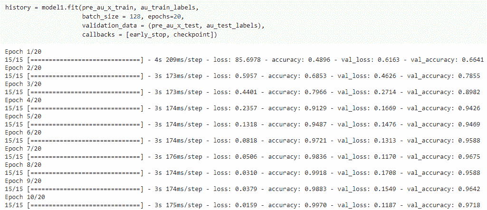**

**该模型实现了 97%的准确性。我们看到，随着一些小的回升，验证损失继续减少。当验证损失不再减少，并且实际上以某种速度增加时，模型会自动停止以避免过度拟合。**

**验证精度和训练精度都增加了，这意味着模型正在学习。**

**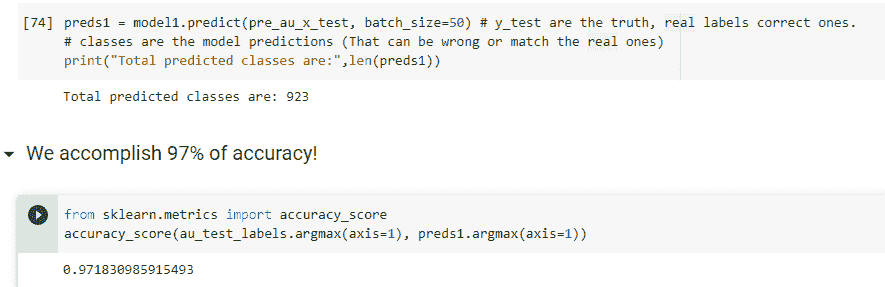**

**我们完成了 97%的分数，如果我们愿意，我们还可以从培训中加载最佳模型，因为我们在回调中指定了。虽然在这种情况下，会和最新款一样。**

# **混淆矩阵**

**混淆矩阵是机器学习分类问题的性能测量，其中输出可以是两个或更多个类别。这是一个预测值和实际值不同组合的表。它通常用于描述一个分类模型(或“分类器”)在一组真实值已知的测试数据上的性能。**

**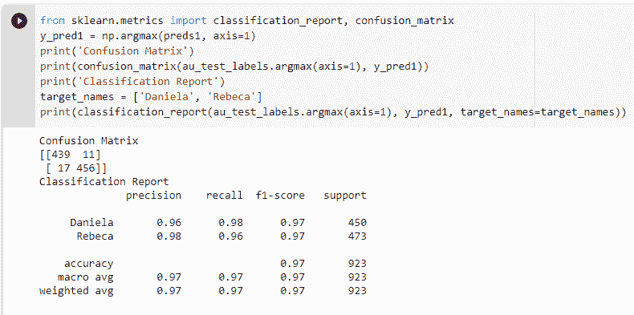**

**生成混淆矩阵以查看预测的可信度以及模型混淆的地方。这里可以看出它比我姐姐(丹妮拉)更会认我。**

**另一次，我重新创建、训练并再次运行该模型，并看到这一次的结果现在完美地平衡了，我们双方的精确度都达到了 97%。因此，在这里我们可以看到训练模型时小随机因素的证据。**

# **更多数据和更少神经元对更少数据和更多神经元**

**在使用这个模型之前，我创建了其他每层有更多神经元的模型，大多数高达 512 个。同时，用更小的数据集来训练他们。在那一刻，我意识到，当模型的数据量减少时，最好添加更多的神经元，因为它们必须更好地观察图像矩阵，才能看到每个时期的差异。**

**当我训练只有 800 张照片的模型时，具有上述非常相似的架构的模型最多只能达到 87%的准确性。**

# **测试它**

**我会用不同的新照片来测试模型。使用函数来检测人脸，提取人脸，将其传递给模型，并使用布尔值作为参数，查看两个类的预测置信度。**

**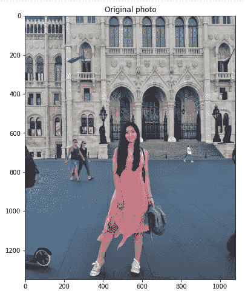****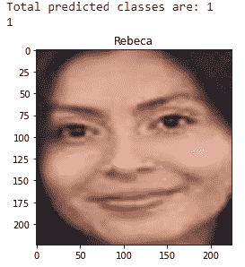****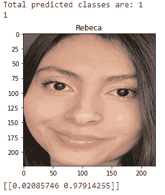****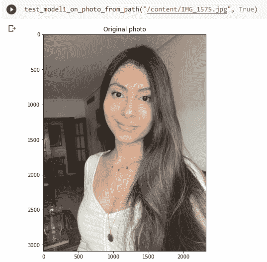****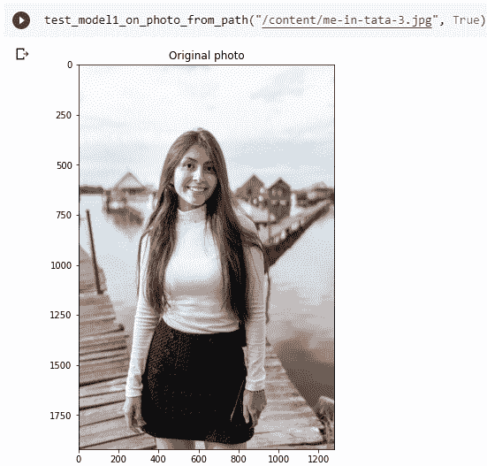****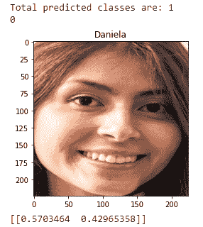**

**上面那张照片其实是我(丽贝卡)在博科迪！尽管这两个阶层的信心差异很小:只有 14%。**

## **这是我最近的一张照片，就在两天前拍的:**

**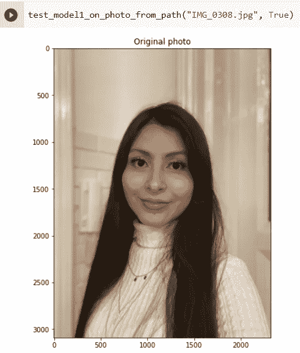****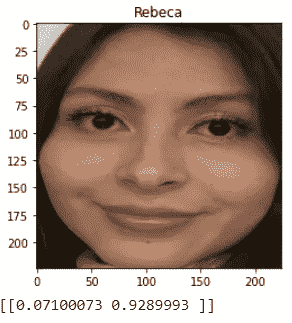**

**模特真的确定是我，虽然我化了妆。**

# **让我们试试丹妮拉的更多照片**

**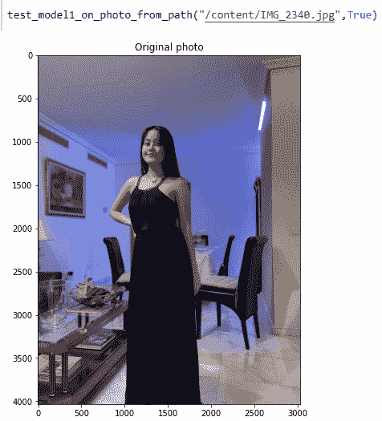****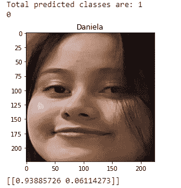**

**即使从不同的角度看，该模型也表现良好。这张照片是两年前的，我从她的脸书那里得到的。**

**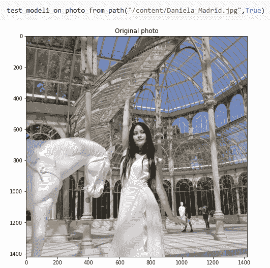****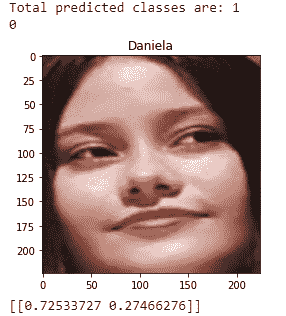****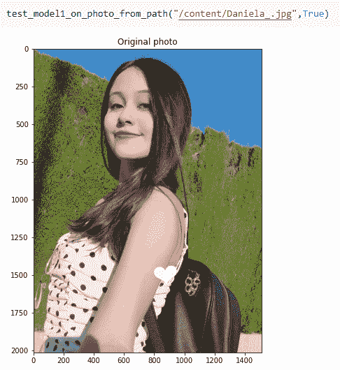****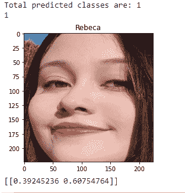**

**最后一个是丹妮拉，不是我。这次的差异是 20%的置信度。**

# **从网络摄像头测试它**

**虽然识别决策的置信度不是很高，但它能够从网络摄像头中识别出我和我妹妹。这些是从 Google Colab 笔记本上拍的。**

**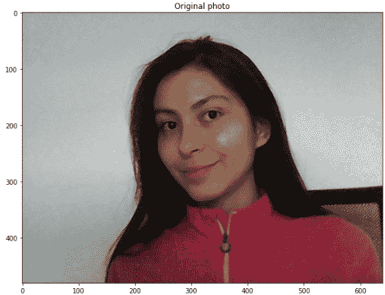****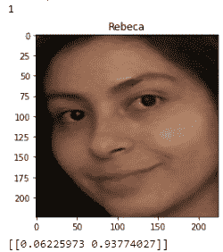**

**在这种情况下，模型在识别我时具有非常高的置信度。有 93%的把握。**

**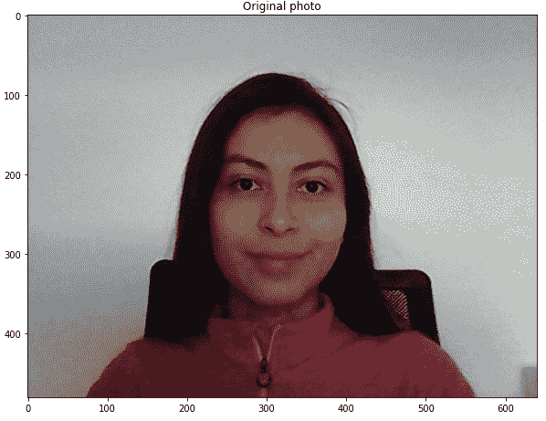****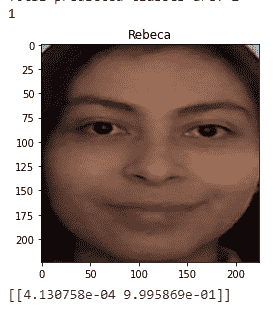**

**即使我遮住了一部分脸，它仍然有 73%的把握认出我:**

**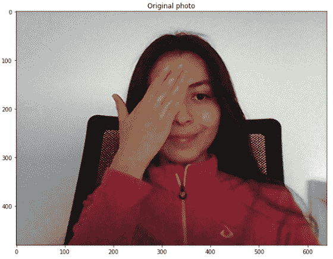****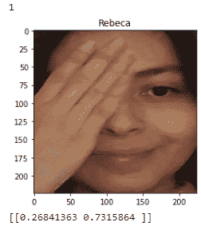**

# **戴口罩测试:戴口罩也能认出我**

**我想试试看，即使戴着面具，模特是否能认出我。令人难以置信的是，它做到了！！**

**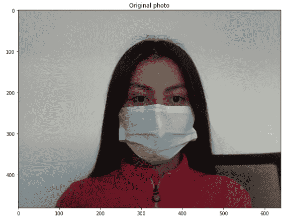****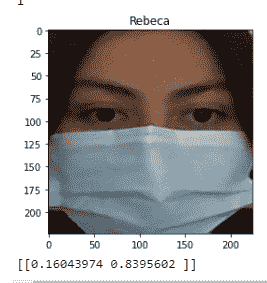**

**83%的信心**

**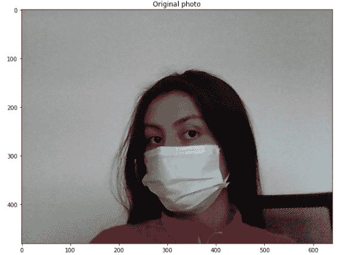****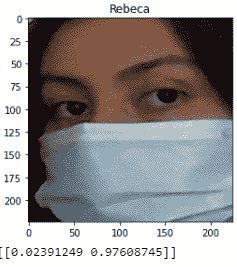**

**这个有 97%的可能性。**

**尽管如此，一旦我把脸的角度转向一边，就开始感到困惑了。当认识到完全错误时，降低信心水平。**

**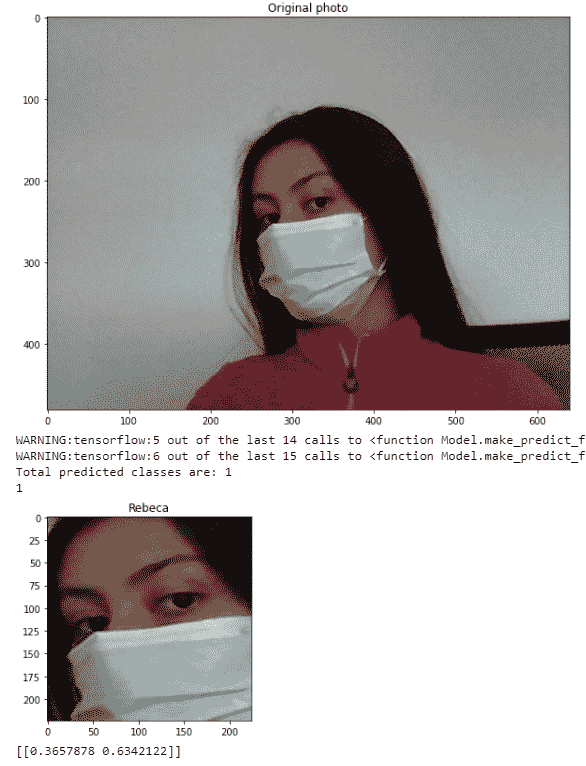****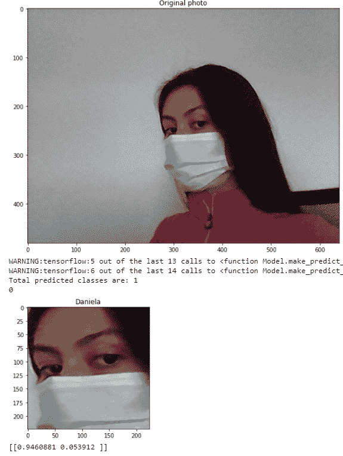****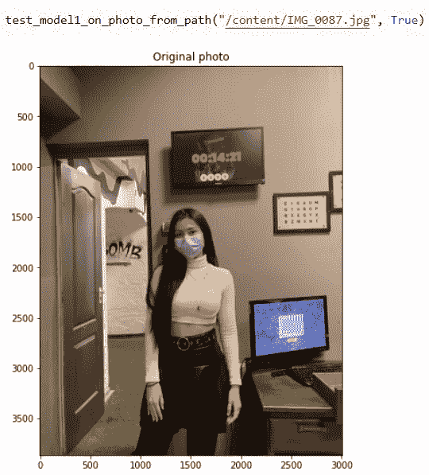**

**Photo of me after winning in my first Escape Room**

**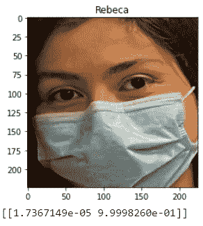**

**模特有 99.99%的把握就是我！做得非常好。**

# **使用迁移学习创建模型**

**我决定使用迁移学习技术建立一个模型，这样我也可以比较这两个模型之间的性能。我将使用 VGG16 预训练模型。**

**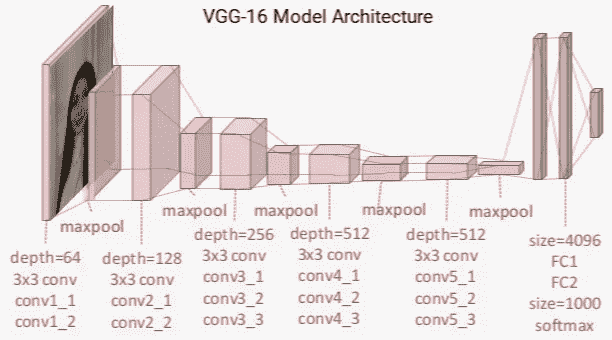**

**Orientation image of the VGG-16 model architecture**

## **什么是迁移学习？**

**迁移学习是一种机器学习方法，其中为一项任务开发的模型被重新用作第二项任务模型的起点。**

**这是深度学习中的一种流行方法，其中预先训练的模型被用作计算机视觉和自然语言处理任务的起点，因为开发关于这些问题的神经网络模型需要大量的计算和时间资源，并且它们在相关问题上提供的技能有巨大的飞跃。**

## **用迁移学习创建模型**

**选择的预训练模型是卷积神经网络 VGG16，因为它也是我最近使用最多的一个。**

**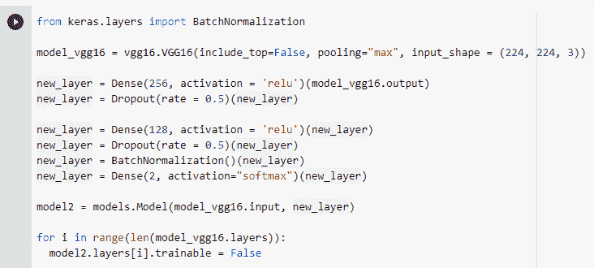**

**模型从 Keras 导入，这样模型的新输入形状可以作为参数给出。我使用了连接技术，所以这些层可以相互连接。在这种情况下，新层被连接到 VGG16 模型的输出。**

**增加了 256 个神经元的新的密集层，具有“Relu”激活功能。一个 0.5 层的健壮的下降在之后被应用，所以它在某种程度上抛弃了过程中的“怀疑”。在每个权重更新周期，它以给定的概率随机选择要被丢弃的节点。Dropout 仅在模型的训练期间使用，而不在评估模型的技能时使用。这种调整有助于防止过度拟合。**

**模型中还添加了批处理规范化。这是一种用于训练非常深的神经网络的技术，该神经网络对每个小批量的层的输入进行标准化。这具有稳定学习过程和显著减少训练深度网络所需的训练时期的效果。**

**最终，来自基础 VGG16 模型的所有层都被冻结或设置为不可训练。这样，参数的总数将大大减少，只剩下我们添加到模型中的那些参数。**

**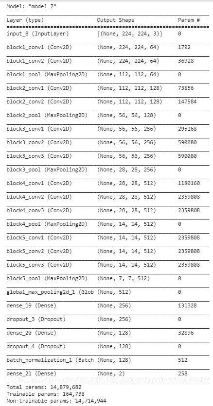**

**与我之前做的相比，最终的模型要大得多。**

# **编译模型和回调**

**该模型的编译方式与第一个模型相同，具有相同的优化器、损失函数和回调，只是最佳模型将以不同的名称保存。**

**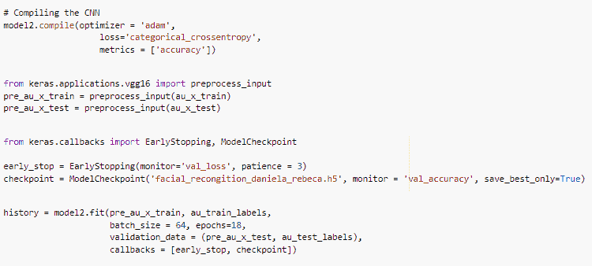**

# **[准确度分数](https://docs.google.com/document/d/1Ga3WOHUxiwKd7WFyOhcwgJlhBvB8j622AqYy-UmdFTo/edit#heading=h.xcp6y2bvztxl)**

**在训练它时，该模型可以完成 98.27%的验证准确率和 99.30%的训练准确率，同时避免在具有回调的训练期间过拟合。**

**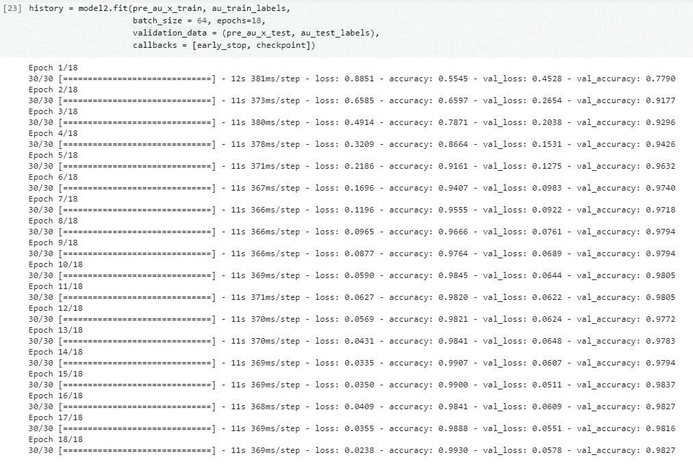****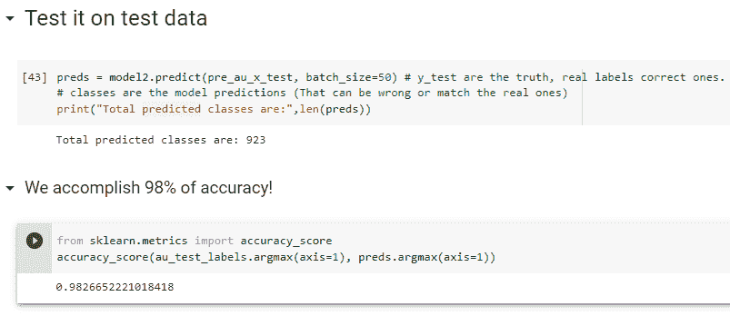**

# **最佳培训模型**

**当从回调自动保存的训练中加载 bets 模型时，可以看到它比最新的略好，为 98.37%**

****

# **混淆矩阵**

**我生成一个混淆矩阵来查看预测的可信度和模型混淆的地方。这里我们可以看到它在识别我妹妹(丹妮拉)方面比我略胜一筹。**

****

# **测试它**

**我会用不同的新照片来测试模型。使用函数来检测人脸，提取人脸，将其传递给模型，并使用布尔值作为参数，查看两个类的预测置信度。**

********************

## **我们这次达到了 99%，用这个模型，在最近的照片上预测:**

********

# **用我们两个来测试**

**在我们俩都在的地方拍照，看看结果。**

********

# **使用网络摄像头进行测试**

**通过使用网络摄像头从 Google Colab 笔记本中拍摄新照片，该模型表现非常好，始终正确分类，并且具有很高的可信度。**

********

**99%确定是我。**

********

**我妹妹的信心水平也非常好，分别为 95%和 99%。**

# **尝试面部表情**

********

**98%和 80%的人确信是我。**

****

# **尝试使用面罩**

************

**Photo of me after winning in my first Escape Room**

****

## **这两个模型在戴着面具识别我们的脸时都做得很好。**

****

**第一个模型在标记我时的置信度为 99.99%，而在最新的模型中，我们的置信度为 99.14%。还是真的好。**

**[**你可以在这里找到一个 Jupyter 笔记本里总结的全部代码。**](https://github.com/Rebecasarai/Facial-Recognition-System)**

**我相信任何人都可以创造和贡献与计算机视觉相关的不可思议的项目。即使你是初学者，你也可以很容易地使用像[数据营这样的平台。在中，您几乎可以找到任何课程，帮助您在数据科学领域实现自己的目标！🙌](http://datacamp.pxf.io/Image-Processing)**