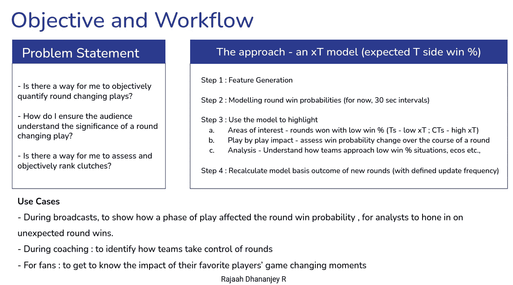
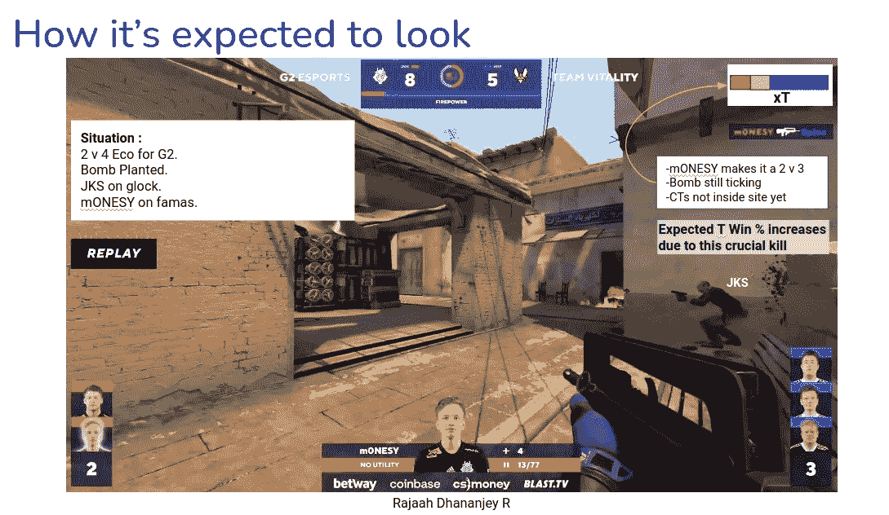
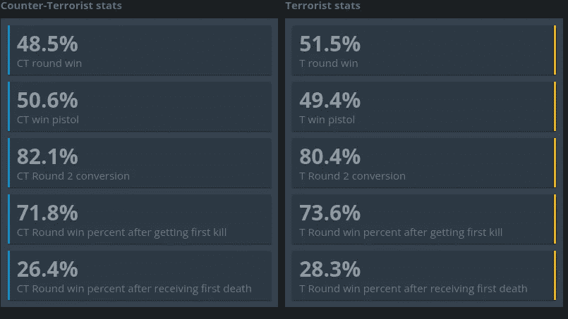

# 构建 CSGO 广播工具:第 1 部分

> 原文：<https://medium.com/mlearning-ai/building-a-csgo-broadcasting-tool-part-1-335722d6595?source=collection_archive---------1----------------------->

第 1 部分—数据收集

TL:本部分涵盖的灾难恢复版本:

*   思维过程和预期结果。
*   从 HLTV 下载演示并解压。
*   生成具有相关要素的数据集(从循环开始)。

在看了一个关于 LaLiga 如何使用统计数据来突出关键的细微差别并提高粉丝参与度和对游戏战术方面的理解的视频后，我非常有兴趣尝试做一些类似的东西——但在一个领域中是新的东西。

对于那些想看视频的人来说——https://www.youtube.com/watch?v=yncU9F_FK8Y。这是一个非常吸引人的视频，有一些很好的例子，给出了可靠的理由以及事情为什么会这样做。

在我制作 one pagers 的所有职业生涯之后，我忍不住转向一张演示幻灯片来巩固我的想法。过了一段时间，这是我想出的办法。

总的 x 对 y 的获胜概率不包括武器，护甲，HP，定位，炸弹工厂等。例如，我们在 HLTV 看到的那个。

**现在我们为什么要在屏幕上显示更多的数字呢？**展示统计数据的目的是让这一时刻更加贴近球员——**“我的球队刚刚赢了一轮，赢的概率非常低。这不仅仅是一项视力测试，统计数据也支持这一点。”**

There is no emotion to this — this is pure probability. What if we can show how my favorite player beat the odds?

关键组件如下:

1.  我下载和生成特性的方法
2.  创建一个模型来预测回合获胜概率
3.  所述模型的用例场景。

我想做的第一个模型是圆形启动模型。本质上是为了强调哪几轮看起来最难赢。

对于一个测试案例，我会选择海市蜃楼，因为它是一个非常开放的地图，无论是 T 还是 CT 端。

因此，第一个模型的目标如下:

步骤 1:下载 2022 年所有顶级 mirage 比赛演示

步骤 2:解析演示以生成循环启动特性

步骤 3:使用这些特征来预测 xT——T 方赢得这一轮的概率。

第四步:用它来产生洞察力？说实话我也不知道！

现在我们已经有了所有的介绍，这里有一个演示下载和特性生成的快速纲要。

从 HLTV 下载演示的脚本可以在[这里](https://github.com/rajaahdjey/HLTVDemoDownloader2.0)找到。我不想在这里要求太多的荣誉——只是利用了现有的 [github 项目](https://github.com/ReagentX/HLTVDemoDownloader),做了一些更改使其工作，并为我的方便和 BAM 添加了一些额外的功能！

由于此分析侧重于回合开始，我们可以查看回合开始的以下特征。

经济价值:可能是对回合胜率影响最大的属性。所有 t 玩家和所有 ct 玩家的装备总和。

公用设施:T 和 CT 侧的闪光、燃烧瓶、nades 和烟雾的数量。还包括 CT 侧的一些套件。

HP:没关系，但我现在保留它，因为我打算在未来的分析中跟踪这些。

盔甲:绝对重要——我现在保留原始值。可能会决定将其转换为分类值 0 或任何数字。

Spawn positions i 我将在后面介绍——这里的问题是如何对这种类型的数据建模。为了捕捉这一点，我使用了稍微修改过的版本的 [awpy](https://github.com/pnxenopoulos/awpy) 库。即使一个浅层的神经网络也可以用我们有限的数据过度拟合，所以这是为了将来的实验。

最后要做的事情是通过分析 2022 年幻影的所有下载演示来创建数据集(直到 11 月 4 日左右有 145 个匹配)。这就是我如何做到的——进一步的优化仍然是可能的。

在下一部分，我们将研究一些基线模型，仅针对回合开始。目标是根据历史数据建立一个基线 xT。

 [## Mlearning.ai 提交建议

### 如何成为 Mlearning.ai 上的作家

medium.com](/mlearning-ai/mlearning-ai-submission-suggestions-b51e2b130bfb)