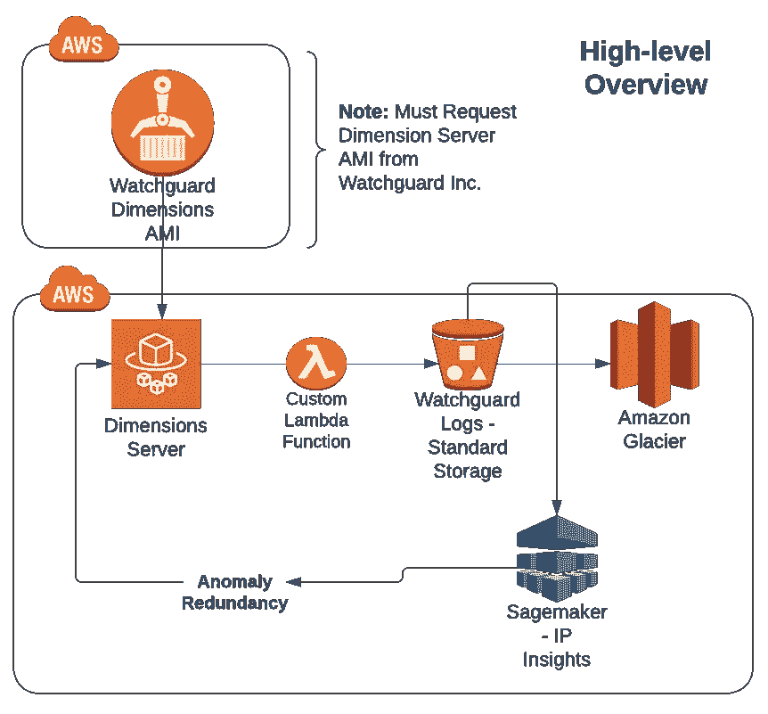
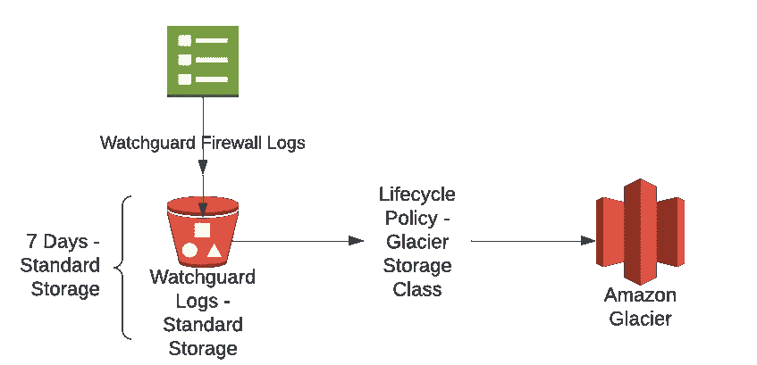
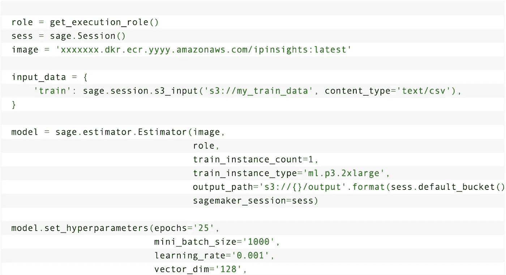
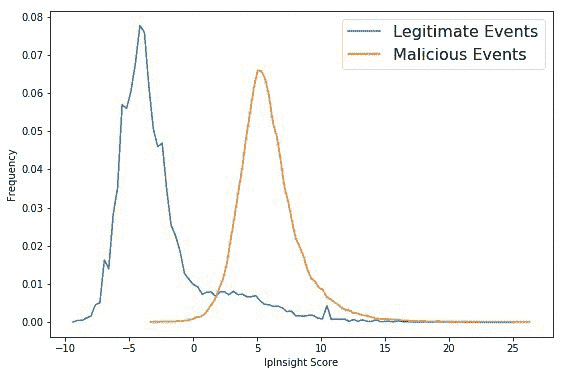
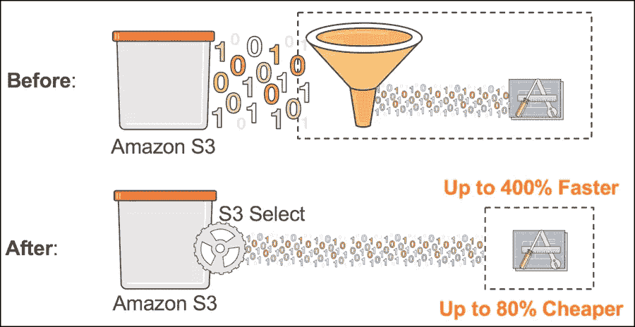
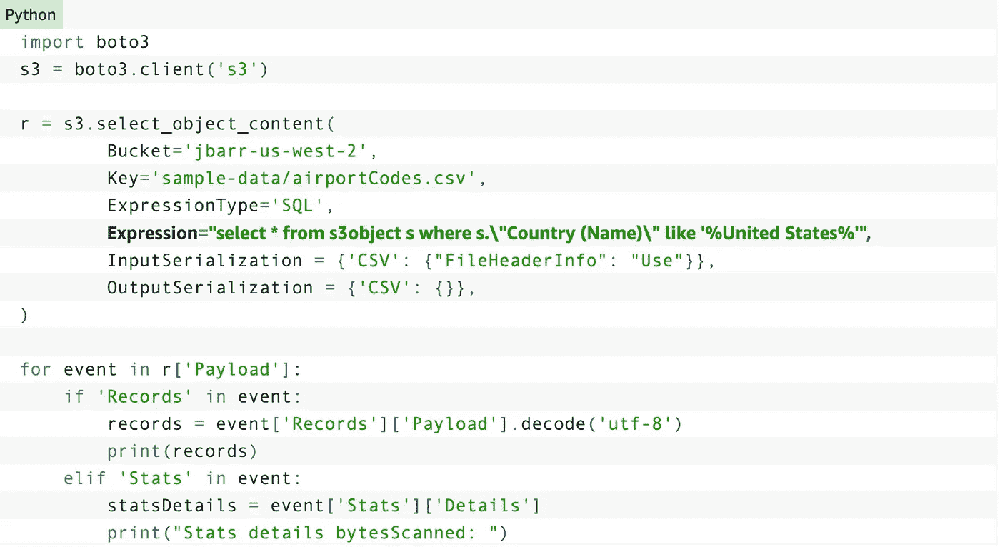

# 在 AWS 中构建客户防火墙档案分析器

> 原文：<https://medium.com/mlearning-ai/building-a-customer-firewall-archive-analyzer-in-aws-47da1fbf3c97?source=collection_archive---------9----------------------->

对一个*接近*的专有解决方案拥有完整的粒度

加入一家初创企业的经历与众不同——令人害怕、兴奋、困惑——但最重要的是——这是一个绝佳的学习机会。

在任何工作中，能够控制自己或快速适应都是一个巨大的优势，没有什么比创业生活更能教会你这一点了。

幸运的是，在我第五次创业时，我抓到了一只[黑天鹅](https://en.wikipedia.org/wiki/Black_swan_theory)；一家在 3 个月内从 3 名员工发展到 250 人的公司。从我们机器的秘密制造到全球生产，该产品开始像野火一样迅速发展。

我在一个投资组合下为 4 家不同的公司担任 AWS 云架构师。同一所有者下的 4 家公司，都有各自的安全问题。

作为唯一一名负责远程保护 10 个仓库的全职开发人员，在管理这种安全状况的同时还要执行日常功能请求和更新 AWS 架构，这是一项艰巨的任务。

所以我开始想出一个冗余的解决方案…

**我们将要使用的服务:**

*   Fargate 集群(EC2 实例)—使用[定制维度服务器映像](https://www.watchguard.com/help/docs/help-center/en-US/Content/en-US/Fireware/firebox_cloud/deploy_aws.html) AMI
*   S3 存储桶—具有各种存储类别(标准、冰川)和生命周期策略
*   AWS Lambda —解压缩文件夹并将日志文件夹放入标准存储中
*   AWS Sagemaker — IP insights 算法

**数据收集:**

有内部安全解决方案；一个小型的校园防火墙。它每天输出 3 GB 的防火墙日志数据。有 9 个这样的 Watchguard 设备——用于德克萨斯州的 9 个不同的仓库。

这意味着一天要处理大约 27 GB 的数据。

我看到了通过构建机器学习解决方案来改善德克萨斯州范围内的安全状况的机会。

我创建了一个 Fargate EC2 实例，作为所有 WatchGuard 防火墙的所有日志的中央存储库。来自休斯顿仓库、拉伯克、埃尔帕索和得克萨斯州所有办公室的日志都将出现，所有这些都采用相同的格式(。TSV) &拉上拉链。

**存储:**

首先，我确定 WatchGuard 设备内部的数据保留期为一周。一周后，日志被删除。但是，在创建日志时，它们会自动发送到 S3 存储桶进行保留。日志将在标准对象类中随时可用 7 天，直到它们被移动到 Glacier。

根据“上传”请求，lambda 函数复制日志(在数据保留桶中保留一份副本)，解压缩文件夹，准备数据(即从 TSV 转换为 CSV)，然后随后将数据存放到另一个 S3 桶中。这个新桶是训练桶，具有为 IP Insights 算法准备的数据。

**训练/建模:**

选择了一个 p 3.2x 大型实例来运行培训作业。

在运行了指定的 epochs 数(20)之后，我能够配置一个 Sagemaker 推断端点。

现在，在检查验证指标和运行恶意流量注入后，推理端点已经可用，我们可以测试控制(Watchguard 设备)和我们新训练的 Sagemaker 端点。

我们的 Sagemaker 端点和机器学习解决方案的目标是看看我们是否可以消除仓库内 SSID 入侵和“虚假入侵者”用户设备存在的误报(通过异常分数)。

**分析:**

令人惊讶的是，Watchguard 防火墙产生了误报，而模型却没有。WatchGuard 防火墙会将自己的 SSIDs 标记为恶意入侵。一旦我们分析了模型和我们自己的 WatchGuard UI 之间的差异，我们就能够将警告降级为误报。

这本来是一个概念验证，但是，它最终变成了一个需要关键安全洞察力的 it 团队的宝贵资产。

也就是说，这是解决冗余的可行方法吗？

不，这就是为什么我称之为“黑天鹅”事件。

**可供选择的改进方案？**

**雅典娜搜索**

我们可以使用 Athena Search——一种无服务器查询交互工具，而不是构建这个需要大量计算实例的系统。只要日志的格式可读，我们就能够搜索它们。

这样，我们可以使用 Watchguard 技术和防火墙日志作为事实的来源，并使用 Athena 查询服务来搜索潜在的恶意 IP。

**注意:**我仍然不会在这里使用 AWS 胶水，因为[解压缩执行时间非常长](https://stackoverflow.com/questions/48953777/decompress-a-zip-file-in-aws-glue)

**冰川选择**

我们可以使用 [Glacier Select](https://aws.amazon.com/blogs/aws/s3-glacier-select/) 简单地查询 S3 存储桶中我们需要的对象，即使它们在“冻结”对象类中，而不是挖掘整个文件并支付快速检索的成本。

对于不同的用例，我们可以使用 Glacier Select 或 Athena Search

*   **如果**文件在标准对象存储器**中，使用** Athena 搜索
*   **如果**文件在冰川对象存储器**中，使用**冰川选择

❓有问题吗？技术还是其他？——[Matthewduke0@gmail.com](mailto:matthewduke0@gmail.com)❓

 [## Mlearning.ai 提交建议

### 如何成为 Mlearning.ai 上的作家

medium.com](/mlearning-ai/mlearning-ai-submission-suggestions-b51e2b130bfb)