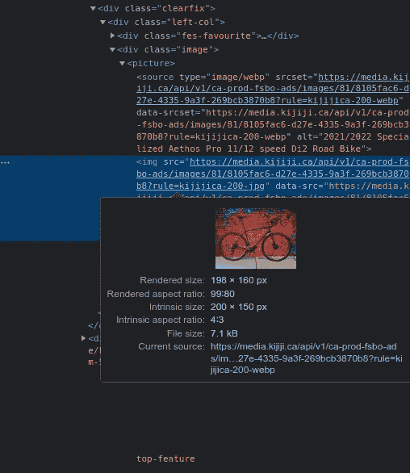
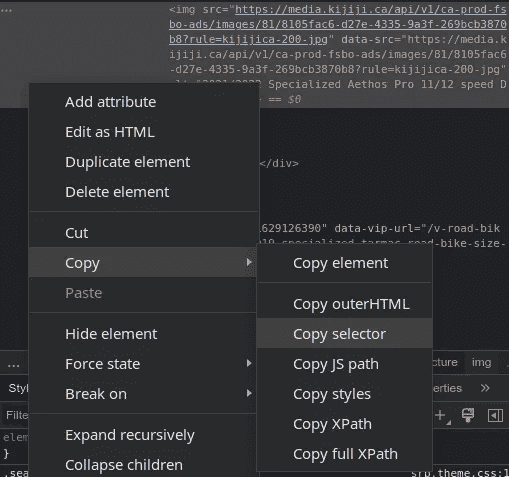
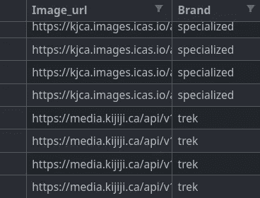
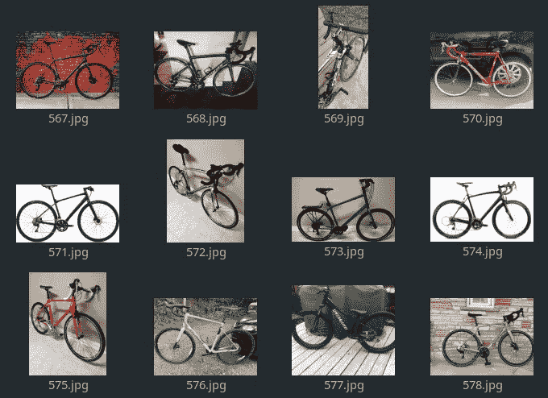

# 使用 web 抓取构建数据集

> 原文：<https://medium.com/mlearning-ai/building-a-dataset-with-web-scraping-e96a9bd6af1c?source=collection_archive---------2----------------------->

## 如何使用 BeautifulSoup 从 Kijiji 广告中收集图像

有时候，在一个数据项目的开始，我们可用的数据可能不足，甚至不存在。您可能会尝试在公开可用的数据源中查找数据集，但是您可能无法找到您要查找的内容。这就是 web 抓取发挥作用的地方，它是一种在 web 上自动收集数据以构建自己的数据集的技术。

## 什么是网页抓取？

网络搜集包括以自动方式收集网站上的数据。它可以是文本、图像或任何类型的数据。

为此，我们编写一个脚本来下载页面内容(通常是 HTML 格式)，然后从中选择所需的元素。这就是我们将在本文中教给你的。

**免责声明:**有些网站比其他网站更容易被抓取，这些网站实施了保护措施，以防止抓取机器人抓取其内容。比如，如果你的目标是刮谷歌，我祝你好运。在本文中，出于教学原因，我举了一个相对简单的例子。此外，一个抓取脚本在时间上是冻结的，一个网站可以发展，然后脚本将不再工作。

## 用例—自行车图像

假设我们想要收集各种品牌的自行车图像，以便稍后构建自行车品牌分类模型。这样的数据集似乎不存在，这就是为什么我们决定创建一个。

在这种情况下，广告网站可能是一个有趣的数据来源。例如， [Kijiji](https://www.kijiji.ca/) 是一个加拿大的广告分类系统。

因此，行动计划是搜索“公路车”类别中的每个目标品牌。

## 设置搜索 URL

首先，我们通过以下步骤定位要抓取的页面的 URL:

*   浏览到[吉吉吉](https://www.kijiji.ca/)
*   将类别设置为“自行车>道路”
*   将文本查询设置为某个自行车品牌，如“specialized”
*   将位置设置为“加拿大”以在整个网站上执行搜索

因此，搜索提示应该如下所示:

之后，URL 将被设置为:

> [https://www . kiji Ji . ca/b-road-bike/Canada/specialized/k0c 648 l 0？rb =真](https://www.kijiji.ca/b-road-bike/canada/specialized/k0c648l0?rb=true)

请注意，我们指定的搜索参数包含在其中。

一次搜索通常会产生几页结果。如果我们浏览到下一页，我们将获得包含页码的 URL:

> [https://www . kiji Ji . ca/b-road-bike/Canada/specialized/page-2/k0c 648 l 0？rb =真](https://www.kijiji.ca/b-road-bike/canada/specialized/page-2/k0c648l0?rb=true)

稍后，这将有助于在脚本中导航结果页面。

## 获取图像链接

既然我们有了所需内容的 URL，我们只需要在页面代码中定位图像。为此，右键单击广告图像，然后单击“检查”。将会打开以下侧栏:

Browser inspection tool

我们已经找到了一个图像链接！您知道手动执行这项任务来收集所有的图像链接会很繁琐。这就是为什么 web 抓取使用脚本来自动完成这项任务。

要正式定位图像，我们必须找到“选择器”。右键单击前一个突出显示的块，然后单击“复制>复制选择器”。

Selector drop-down menu

您将在剪贴板中看到类似这样的内容:

> # main page content > div . layout-3 > div . col-2 > main > div:n-child(2)> div:n-child(4)> div > div . left-col >**div . image>picture>img**

该选择器指示 HTML 代码块中图像链接的精确位置。最后用粗体显示的部分是下一步感兴趣的部分。

## 编写图像链接集合的脚本

我们终于有了写剧本的所有素材。我们将使用 Python 和以下库:

*   **请求** 下载网页
*   **BeautifulSoup** 解析返回的页面
*   **Pandas** 将结果保存在 CSV 文件中

在我们的场景中，假设我们想要为品牌“giant”、“specialized”和“trek”收集图像。因此，我们有一个主循环，遍历品牌，然后再遍历页面。我们根据**请求**下载每个页面，然后用 **BeautifulSoup** 解析它。最后，我们可以提取图像链接并将它们保存在一个 **Pandas** 数据框中。

让我们来看看关于实现的一些细节。您可能会注意到在第 39 行的图片链接上使用了`.replace("200-jpg", "1600-jpg")`。这是因为 Kijiji 图像在他们的服务器上以不同的分辨率存储，我们选择了一个更高的分辨率。在第 43 行，选择器`div.resultsHeadingContainer-781502691 > span`用于获取到当前页面为止显示的结果数与结果总数的比较(获取方式同上)。正则表达式在下一行提取这些数字。这让我们知道什么时候到达最后一页。

Preview of the resulting data frame

## 下载图片

最后一步是从收集的链接中下载图片。为此，我们使用一个简单的脚本，再次依赖于**熊猫**和**请求**。我们使用 **Tqdm** 显示进度条。

脚本可能需要一些时间来运行。最后，您将获得一个`images`文件夹，其中包含每个品牌的文件夹！然后，我们可以分析、清理或预处理图像。为了收集更多的数据，我们可以在其他网站上重复这个操作。

Sample of the downloaded images

## 结论

在本文中，我们看到了如何使用 Python 执行 web 抓取来构建数据集。Web 抓取是一个功能强大的工具，具有广泛的应用。作为数据从业者，知道如何获取数据是一项很有价值的技能。

我希望这篇文章是有用的，并且你从中学到了一些东西。感谢您的阅读！

> 灵感:[https://medium . com/@ kaine black/web-scraping-kiji Ji-ads-with-python-ef 81 a 49 E0 e 9 e](/@kaineblack/web-scraping-kijiji-ads-with-python-ef81a49e0e9e)
> 
> 再进一步:【https://realpython.com/beautiful-soup-web-scraper-python/】T2

 [## Mlearning.ai 提交建议

### 如何成为 Mlearning.ai 上的作家

medium.com](/mlearning-ai/mlearning-ai-submission-suggestions-b51e2b130bfb)