# 用 Google Cloud Vertex AI 和 BigQuery ML 构建需求预测模型

> 原文：<https://medium.com/mlearning-ai/building-a-demand-forecasting-model-with-google-cloud-vertex-ai-and-bigquery-ml-8dd2b7ee5014?source=collection_archive---------0----------------------->

需求预测是使用定量和定性数据预测未来收入以及购物者将购买哪些产品的过程。它帮助你对你的产品供应、库存、员工和营销做出明智的决定。在这篇博文中，我将向您展示如何使用 BigQuery ML 构建一个时间序列模型来预测多种产品的需求。使用爱荷华州的酒类销售数据，我将使用 18 个月的历史交易数据来预测未来 30 天。

## 样本数据集

该解决方案使用来自 BigQuery 公共数据集的[爱荷华州酒类销售数据集](https://console.cloud.google.com/marketplace/product/iowa-department-of-commerce/iowa-liquor-sales)的数据。该数据集包括自 2012 年以来美国爱荷华州的批发白酒购买量。欲了解更多信息，请参阅爱荷华州的官方文件。

本动手实验结束时，您将学会如何:

*   将时间序列数据预处理成创建模型所需的正确格式。
*   在 BigQuery ML 中训练 ARIMA 时间序列模型。
*   评估模型。
*   使用该模型预测未来需求。
*   使用 Data Studio 创建一个仪表板来可视化预测需求。

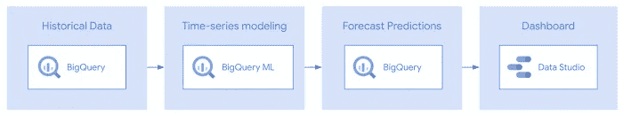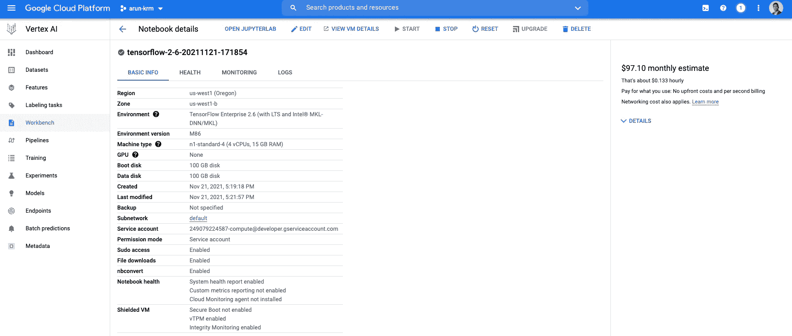

当一切都完成后，你将能够创建一个包含多种产品需求预测的仪表板。

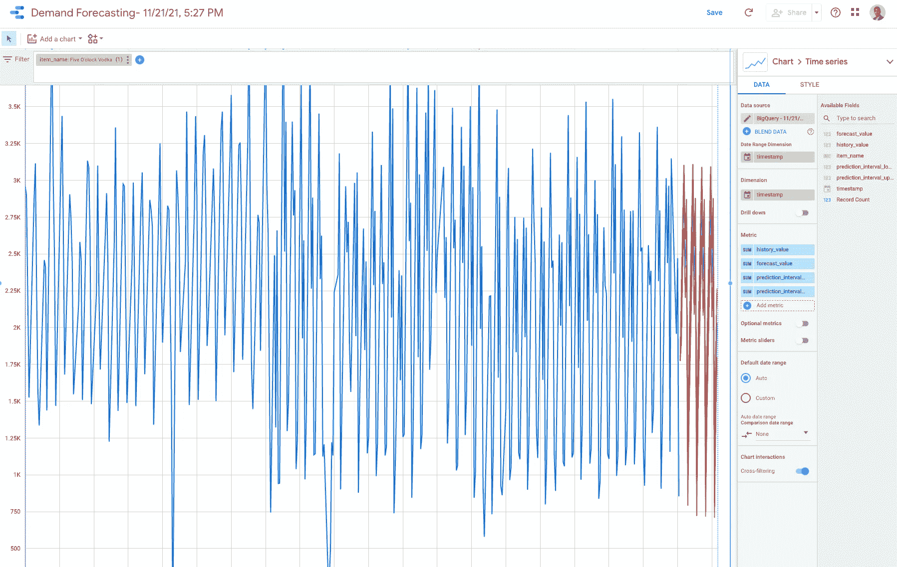

## **设置**

安装所需的包，配置环境变量，并创建一个 BigQuery 数据集。

```
### PIP Install Packages and dependencies!pip install google-cloud-bigquery google-cloud-bigquery-storage — upgrade
```

## **配置 GCP 环境设置**

```
​PROJECT_ID **=** 'arun-krm' *# Change to your project.* REGION **=** 'US'
```

## 导入库并定义常数

```
from google.cloud import bigquery
**import** pandas **as** pd
**from** datetime **import** datetime, timedelta
pd.set_option('display.float_format', **lambda** x: '%.3f' **%** x)
```

## 导入用于数据操作和打印的库

## 创建大查询数据集

在您的项目中创建一个名为`bqmlforecast`的数据集:

```
**!**bq mk **--**location**=**$REGION **--**dataset $PROJECT_ID:bqmlforecastDataset 'arun-krm:bqmlforecast' successfully created.
```

## 准备培训数据

您可以在包含交易资料的资料集上定型时间序列模型。每一行代表一个产品的交易，由`item_description`值标识，并包含销售的瓶子数量和销售额(美元)等详细信息。在下面的步骤中，您将使用售出的瓶数值来预测产品需求。

*注意* : Jupyter 运行以%%bigquery 开头的单元格作为 SQL 查询

```
**%%**bigquery **--**project $PROJECT_IDSELECTinvoice_and_item_number,date,store_number,item_description,bottles_sold,sale_dollarsFROM`bigquery**-**public**-**data.iowa_liquor_sales.sales`LIMIT10Query complete after 0.00s: 100%|██████████| 2/2 [00:00<00:00, 625.74query/s]                         
Downloading: 100%|██████████| 10/10 [00:01<00:00,  7.30rows/s]
```

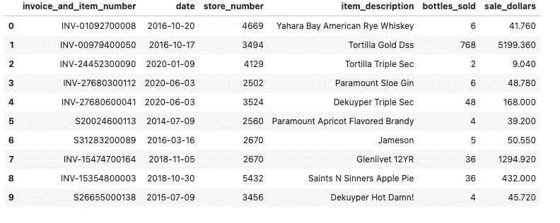

## 设置培训数据的开始和结束日期

您可以调整`TRAININGDATA_STARTDATE`和`TRAININGDATA_ENDDATE`参数来指定您的训练数据的开始/结束日期:

```
ARIMA_PARAMS **=** {'TRAININGDATA_STARTDATE': '2016-01-01','TRAININGDATA_ENDDATE': '2017-06-01',}ARIMA_PARAMS{'TRAININGDATA_STARTDATE': '2016-01-01', 'TRAININGDATA_ENDDATE': '2017-06-01'}
```

# 将训练数据写入表中

如果您查看培训数据，可以观察到某些天没有给定产品的交易。为了避免进行额外的预处理，BigQuery ML 会自动处理以下情况:

*   缺少值。
*   重复的时间戳
*   尖峰和倾斜异常

```
**%%**bigquery **--**params $ARIMA_PARAMS  **--**project $PROJECT_IDCREATE OR REPLACE TABLE bqmlforecast.training_data AS (WITH topsellingitems AS(SELECTitem_description,count(item_description) cnt_transactionsFROM`bigquery**-**public**-**data.iowa_liquor_sales.sales`GROUP BYitem_descriptionORDER BY cnt_transactions DESCLIMIT 5 *#Top N*)SELECTdate,item_description AS item_name,SUM(bottles_sold) AS total_amount_soldFROM`bigquery**-**public**-**data.iowa_liquor_sales.sales`GROUP BYdate, item_nameHAVINGdate BETWEEN **@**TRAININGDATA_STARTDATE AND **@**TRAININGDATA_ENDDATEAND item_description IN (SELECT item_description FROM topsellingitems));SELECTdate,item_name,total_amount_soldFROMbqmlforecast.training_dataORDER BY item_name, dateLIMIT 15Query complete after 0.00s: 100%|██████████| 1/1 [00:00<00:00, 625.55query/s] 
Downloading: 100%|██████████| 15/15 [00:01<00:00, 13.07rows/s]
```

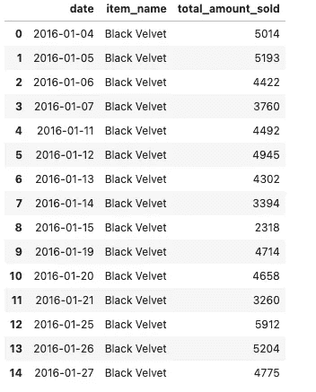

## 绘制目标酒类产品的销售历史

将训练数据保存到`dfhistorical`熊猫数据框:

```
**%%**bigquery dfhistorical **--**project $PROJECT_IDSELECT*****FROMbqmlforecast.training_dataQuery complete after 0.01s: 100%|██████████| 1/1 [00:00<00:00, 307.03query/s]                          
Downloading: 100%|██████████| 1692/1692 [00:01<00:00, 1193.01rows/s]
```

使用培训数据，绘制目标酒类产品的销售历史:

[11]:

```
itemslist **=** list(dfhistorical.item_name.unique())**for** item **in** itemslist:datah **=** dfhistorical[dfhistorical.item_name**==**item]plot_historical_and_forecast(input_timeseries **=** datah,timestamp_col_name **=** "date",data_col_name **=** "total_amount_sold",forecast_output **=** **None**,actual **=** **None**,title **=** item)
```

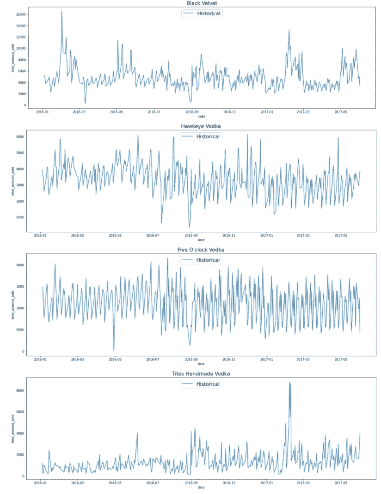

## 训练模型

因为您是在单个模型创建语句中针对多个产品训练模型，所以您必须为 [TIME_SERIES_ID_COL](https://cloud.google.com/bigquery-ml/docs/reference/standard-sql/bigqueryml-syntax-create-time-series#time_series_id_col) 参数指定`item_name`列。如果您只预测一个项目，那么您就不需要指定`TIME_SERIES_ID_COL`。有关更多信息，请参见 [BigQuery ML 时间序列模型创建文档](https://cloud.google.com/bigquery-ml/docs/reference/standard-sql/bigqueryml-syntax-create-time-series#create_model_syntax)。

在 BigQuery ML 中进行时间序列建模时，还可以考虑假日效应。默认情况下，禁用假日效果建模。但是由于这个数据来自美国，并且该数据包含了一年的每日数据，所以您还可以指定一个可选的`HOLIDAY_REGION`。启用假日效果后，假日期间出现的峰值和谷值将不再被视为异常。假日地区的完整列表可在[假日地区文档](https://cloud.google.com/bigquery-ml/docs/reference/standard-sql/bigqueryml-syntax-create-time-series#holiday_region)中找到。

```
**%%**bigquery **--**project $PROJECT_IDCREATE OR REPLACE MODEL bqmlforecast.arima_modelOPTIONS(MODEL_TYPE**=**'ARIMA',TIME_SERIES_TIMESTAMP_COL**=**'date',TIME_SERIES_DATA_COL**=**'total_amount_sold',TIME_SERIES_ID_COL**=**'item_name',HOLIDAY_REGION**=**'US') ASSELECTdate,item_name,total_amount_soldFROMbqmlforecast.training_dataQuery complete after 0.00s: 100%|██████████| 3/3 [00:00<00:00, 1222.24query/s]
```

## 评估模型

使用[毫升。评估](https://cloud.google.com/bigquery-ml/docs/reference/standard-sql/bigqueryml-syntax-evaluate)功能，查看所有创建模型的评估指标。

`non_seasonal_` { `p`、`d`、`q` }和`has_drift`列定义时间序列模型。`log_likelihood`、`AIC`和`variance`栏与模型拟合过程相关。拟合过程通过使用[自动确定最佳模型。ARIMA 算法](https://cloud.google.com/bigquery-ml/docs/reference/standard-sql/bigqueryml-syntax-create-time-series#auto_arima)，每个时间序列一个。

```
**%%**bigquery **--**project $PROJECT_IDSELECT*****FROMML.EVALUATE(MODEL bqmlforecast.arima_model)Query complete after 0.00s: 100%|██████████| 3/3 [00:00<00:00, 1132.98query/s]                        
Downloading: 100%|██████████| 5/5 [00:01<00:00,  3.60rows/s]
```

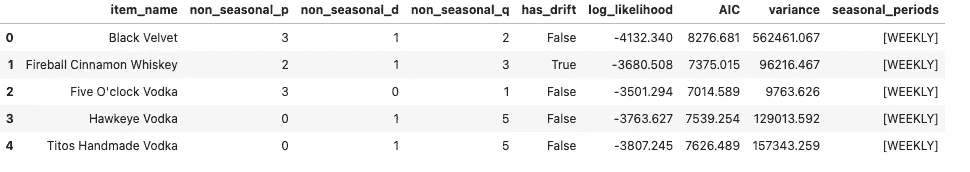

您可以看到训练了五个模型，每个模型对应于`item_name`列中的一种产品。每个模型都有自己的`p,d,q`超参数，这五个模型检测到的季节性是`WEEKLY`。

## 使用模型进行预测

使用 [ML 进行预测。预测](https://cloud.google.com/bigquery-ml/docs/reference/standard-sql/bigqueryml-syntax-forecast)，预测下一个 *n* 值，如`horizon`参数中所指定。您还可以选择更改`confidence_level`参数，以更改落在预测区间内的未来值的百分比。将预测数据保存到`dfforecast`数据帧，以便在后续步骤中绘制。

```
**%%**bigquery dfforecast **--**project $PROJECT_IDDECLARE HORIZON STRING DEFAULT "30"; *#number of values to forecast*DECLARE CONFIDENCE_LEVEL STRING DEFAULT "0.90";EXECUTE IMMEDIATE format("""SELECT*FROMML.FORECAST(MODEL bqmlforecast.arima_model,STRUCT(%s AS horizon,%s AS confidence_level))""",HORIZON,CONFIDENCE_LEVEL)dfforecast.head()
```

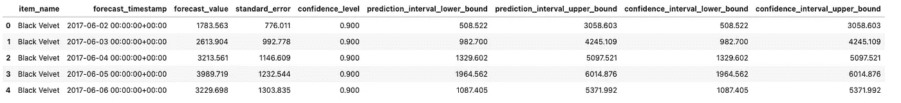

由于`horizon`设置为 30，因此结果为 30 x(项目数)，每个预测值占一行:

```
print(f"Number of rows: {dfforecast.shape[0]}")Number of rows: 150
```

**检查模型系数**

您可以使用 [ML 查看每个时间序列模型的系数。ARIMA 系数](https://cloud.google.com/bigquery-ml/docs/reference/standard-sql/bigqueryml-syntax-arima-coefficients)。

对于每个模型，`ar_coefficients`值显示时间序列模型的自回归(AR)部分的模型系数。类似地，`ma_coefficients`值显示了模型的移动平均(MA)部分的模型系数。这两个值都是数组，长度分别等于`non_seasonal_p`和`non_seasonal_q`。`intercept_or_drift`值是时间序列模型中的常数项。

```
**%%**bigquery **--**project $PROJECT_IDSELECT*FROMML.ARIMA_COEFFICIENTS(MODEL bqmlforecast.arima_model)
```

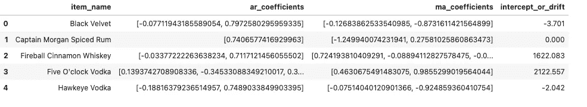

## 对照历史数据绘制预测图

使用包含用于训练的历史数据的`dfhistorical`数据框和包含预测数据的`dfforecast`数据框绘制预测:

```
itemslist **=** list(dfhistorical.item_name.unique())**for** item **in** itemslist:datah **=** dfhistorical[dfhistorical.item_name**==**item]dataf **=** dfforecast[dfforecast.item_name**==**item]plot_historical_and_forecast(input_timeseries **=** datah,timestamp_col_name **=** "date",data_col_name **=** "total_amount_sold",forecast_output **=** dataf,actual **=** **None**,title **=** item,plotstartdate **=** "2017-01-01")
```

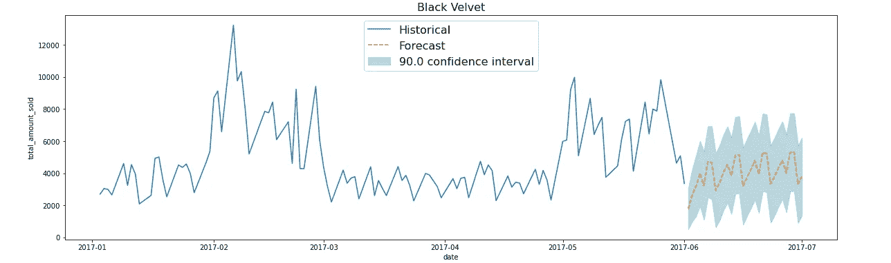

## 根据实际数据绘制预测图

将实际销售数据保存到`dfactual`熊猫数据框:

```
**%%**bigquery dfactual **--**params $ARIMA_PARAMS **--**project $PROJECT_IDDECLARE HORIZON STRING DEFAULT "30"; *#number of values to forecast*SELECTdate,item_description AS item_name,SUM(bottles_sold) AS total_amount_soldFROM`bigquery**-**public**-**data.iowa_liquor_sales.sales`GROUP BYdate, item_nameHAVINGdate BETWEEN DATE_ADD(**@**TRAININGDATA_ENDDATE,INTERVAL 1 DAY)AND DATE_ADD(**@**TRAININGDATA_ENDDATE,INTERVAL 1**+**CAST(HORIZON AS INT64) DAY)ORDER BYdate;dfactual.head()
```

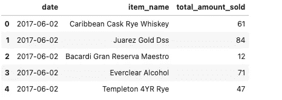

使用包含历史数据的`dfhistorical`数据框、包含预测数据的`dfforecast`数据框和包含实际销售数据的`dfactual`数据框，根据训练数据和实际值绘制预测:

```
itemslist **=** list(dfhistorical.item_name.unique())**for** item **in** itemslist:datah **=** dfhistorical[dfhistorical.item_name**==**item].sort_values('date')dataf **=** dfforecast[dfforecast.item_name**==**item].sort_values(['forecast_timestamp'])dataa **=** dfactual[dfactual.item_name**==**item].sort_values('date')plot_historical_and_forecast(input_timeseries **=** datah,timestamp_col_name **=** "date",data_col_name **=** "total_amount_sold",forecast_output **=** dataf,actual **=** dataa,title **=** item,plotstartdate **=** "2017-01-01")
```

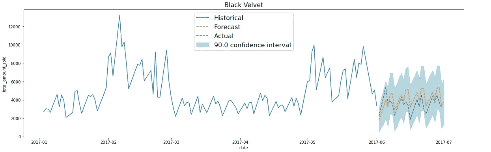

## 使用 Data Studio 创建仪表板

按照本节中的步骤，使用 Data Studio 创建一个交互式、可共享的预测数据仪表板。

## 创建包含仪表板数据的视图

创建连接历史数据和预测数据的视图。在`UNION ALL`子句之前的 SQL 选择历史数据。`UNION ALL`子句后的 SQL 使用`ML.FORECAST`来生成预测值和预测间隔。该查询对`history_value`和`forecasted_value`使用不同的字段，以便您可以在接下来的步骤中用不同的颜色绘制它们。

```
**%%**bigquery **--**params $ARIMA_PARAMS  **--**project $PROJECT_IDCREATE OR REPLACE VIEW bqmlforecast.outputdata_datastudio AS (SELECTdate AS timestamp,item_name,total_amount_sold AS history_value,NULL AS forecast_value,NULL AS prediction_interval_lower_bound,NULL AS prediction_interval_upper_boundFROMbqmlforecast.training_dataUNION ALLSELECTEXTRACT(DATEFROMforecast_timestamp) AS timestamp,item_name,NULL AS history_value,forecast_value,prediction_interval_lower_bound,prediction_interval_upper_boundFROMML.FORECAST(MODEL bqmlforecast.arima_model,STRUCT(30 AS horizon, 0.9 AS confidence_level))ORDER BY timestamp)Query complete after 0.00s: 100%|██████████| 1/1 [00:00<00:00, 617.08query/s]
```

为了帮助零售商提供更简单、更灵活的需求规划解决方案，谷歌云发布了一个[智能分析参考模式](https://services.google.com/fh/files/misc/smart_analytics_reference_patterns_demand_forecasting_one_sheet.pdf)，用于使用自回归综合移动平均(ARIMA)作为基础，使用 BigQuery ML 执行时间序列预测。这个 ARIMA 模型遵循 BigQuery ML 低代码设计原则，允许在没有时间序列模型高级知识的情况下进行准确预测。此外，BigQuery ML ARIMA 模型在许多人熟悉的原始 ARIMA 模型上提供了几项创新，包括捕捉多个季节模式的能力、自动化模型选择、无争议的预处理管道，以及最重要的是，只需几行 SQL 语句，即可轻松生成数千个大规模预测。


# 参考

*   [GitHub:kasi arun/analytics-componented-patterns](https://github.com/kasiarun/analytics-componentized-patterns)
*   博客:[零售商在 BigQuery ML](https://cloud.google.com/blog/products/data-analytics/get-started-with-data-analytics-demand-forecasting-with-ml-models) 中发现灵活的需求预测模型
*   了解 [BigQuery 定价](https://cloud.google.com/bigquery/pricing)、 [BigQuery ML 定价](https://cloud.google.com/bigquery-ml/pricing)，并使用[定价计算器](https://cloud.google.com/products/calculator/)根据您的预计使用量生成成本估算。

[](/mlearning-ai/mlearning-ai-submission-suggestions-b51e2b130bfb) [## Mlearning.ai 提交建议

### 如何成为 Mlearning.ai 上的作家

medium.com](/mlearning-ai/mlearning-ai-submission-suggestions-b51e2b130bfb)