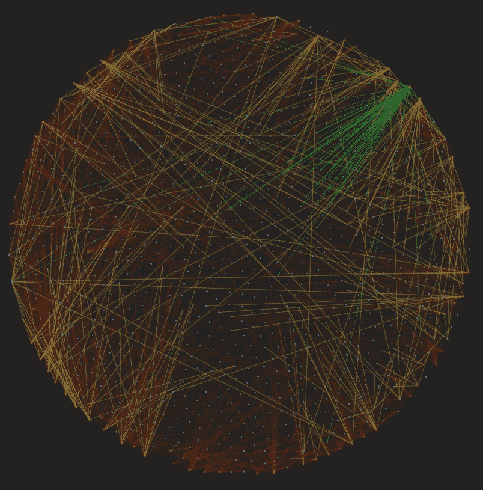

# 使用 BERT Transformer 构建求职知识图

> 原文：<https://medium.com/mlearning-ai/building-a-knowledge-graph-for-job-search-using-bert-transformer-8677c8b3a2e7?source=collection_archive---------0----------------------->

## 如何使用 NER 和关系提取创建知识图的指南

Knowledge Graph Network

# 简介:

虽然 NLP 领域在过去两年中一直以指数速度增长，但由于基于传输的模型的发展，它们的应用范围受到了限制…