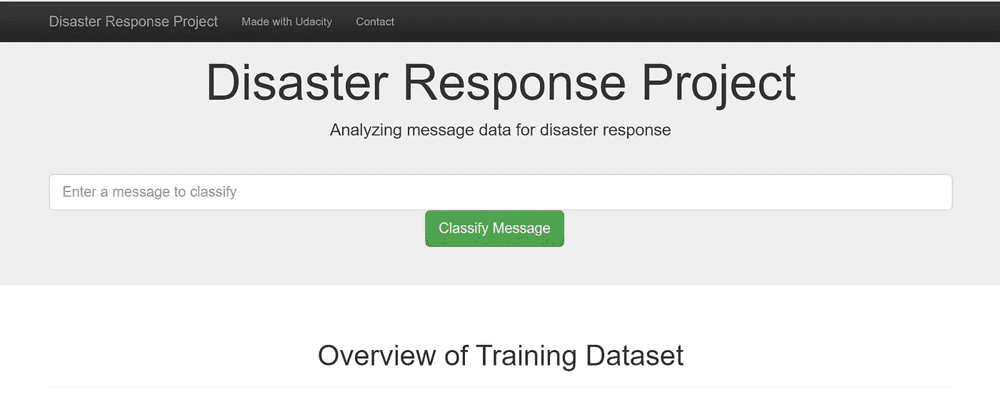

# 如何构建 ML 管道以实现更高效的灾难响应

> 原文：<https://medium.com/mlearning-ai/building-a-ml-pipeline-for-more-efficient-disaster-response-226350cdbff8?source=collection_archive---------3----------------------->

## 我在乌达城数据科学之旅的下一个项目


Photo by [苏 静斋](https://unsplash.com/@karosu?utm_source=unsplash&utm_medium=referral&utm_content=creditCopyText) on [Unsplash](https://unsplash.com/s/photos/pipeline?utm_source=unsplash&utm_medium=referral&utm_content=creditCopyText)

## **简介**

想象一下，有一场环境灾难影响了世界上许多人居住的地方。他们中的一些人确实需要药物、食物、机器等形式的帮助。为了吸引注意力，他们可能会发送紧急信息，希望信息能被阅读，并采取正确的行动。该项目提供了一个引擎，可以将这些灾难消息分类到不同的类别中，以使为那些真正需要帮助的人组织帮助的过程尽可能高效。

以下项目为[乌达城](https://www.udacity.com/)数据科学家[纳米度](https://www.udacity.com/course/data-scientist-nanodegree--nd025)的一部分，数据由[图八](https://appen.com/)提供。该项目可分为三个不同的部分:

1.  创建一个 ETL 管道，接收两个 csv 文件，合并并清理它们，并将结果存储在一个 SQLite 数据库中。
2.  创建一个从数据库中获取数据、处理文本并执行多输出分类的 ML 管道。该脚本使用 NLTK，即 scikit-learn 和 GridSearchCV 的管道。
3.  在 Flask web 应用程序中使用经过训练的模型，在该应用程序中，新消息可以被分类为不同的类别。

## 提取、转换和加载(ETL)

为了获得对该项目的机器学习部分有用的数据，有必要使数据具有正确的形状和尺寸。这个过程最初是在 Jupiter 笔记本上完成的，然后被转换成 Python 脚本。

提供的数据由两个 csv 文件组成:消息数据和类别数据。对于熊猫 *read_csv* ，我们只需将它们读入笔记本，并对其进行进一步研究。

```
# load messages/categories dataset
messages = pd.read_csv('../data/disaster_messages.csv')
categories = pd.read_csv('../data/disaster_categories.csv')
```

此时，可以进行以下观察:

*   两个数据帧中没有丢失数据。
*   数据帧可以通过属性“id”连接起来。
*   类别基本上形成良好，但需要额外处理才能变成二元(0 或 1)。

首先，类别数据必须采用正确的形式。要定义类别为真或假，我们必须减少列，并将结果声明为整数:

ETL-Pipeline Transformation

由于“相关”类别由几个输出(0、1、2)组成，2 必须转换为 1，使其成为二进制(这是一种处理方式，另一种是忽略行):

```
df['related'] = df['related'].replace(2,1)
```

其次，我们需要通过公共特征“id”连接两个数据帧:

```
df = pd.concat([df, categories_df], axis=1)
```

最后，我们需要从数据框中删除重复项:

```
df = df.drop_duplicates()
```

产生的数据帧 df 现在已准备好用于下面的 ML 管道。为此，我们将其存储在 SQLite 数据库中。

```
engine = create_engine('sqlite:///DisasterResponse.db')
df.to_sql('disaster_respond', engine, if_exists='replace',index=False)
```

## 机器学习管道

在运行 ETL 管道之后，是时候在提供的数据库上训练一个功能模型了。首先，我们需要在之前创建的数据库上导入数据框。基本上，我们希望用消息数据来拟合一个模型，以将其分类到不同的类别中。

为了获得适用于 ML 模型的数据，我们对消息数据执行以下转换:

*   计数矢量器(tokenize=tokenizer*)
*   TfidfTransformer()

*以下函数用于将文本输入转换为规范化和词条化字符的符号。

ML-Pipeline Tokenizer

因此，在这个函数的基础上，我们首先用 CountVectorizer 进行转换，用 TfidfTransformer 进行输出。两个变压器的顺序应用具有这样的优点，即我们可以根据加权输入来训练我们的模型。关于这两款变压器的更多信息可以在[这里](https://scikit-learn.org/stable/modules/generated/sklearn.feature_extraction.text.TfidfTransformer.html)找到。

在转换之后，我们现在添加第三个估计器，即多输出分类器。这一步是必要的，因为我们的目标不仅是分类二进制，而是 36 个不同的类别。对于最终分类，使用了 RandomForestClassifier。

ML-Pipeline Build Model

为了改进我们的分类，我们使用 GridSearchCV 进行了参数调整。现在，训练模型所需的时间比以前长得多。为了获得额外的速度，我们使用“ *n_jobs=-1”在所有可用的处理器之间分配工作。*

为了评估模型，我们对预测变量“y_pred”使用“分类 _ 报告”。你可以在这里找到更多关于报告[的信息](https://scikit-learn.org/stable/modules/generated/sklearn.metrics.classification_report.html)。

ML-Pipeline Evaluate Model

管道的最后一部分是将模型保存在 pickle 文件中:

```
with open(model_filepath, 'wb') as f:
    pickle.dump(model, f)
```

## 结果

您可以在这里找到相应的 GitHub 资源库:

[https://github.com/jonastheiler/disaster-respond-pipeline](https://github.com/jonastheiler/disaster-respond-pipeline)

如前所述，这个项目的成果是一个网络应用程序，可用于将事件分为不同的类别，以便将信息转发给相关的救灾机构。



Screenshot Disaster Response Web App

我对结果和功能齐全的 web 应用程序感到满意。尽管一切正常，但仍有足够的改进空间:

*   测试不同的估计量以优化分类(本项目中使用了 RandomForestClassifier())。
*   为 GridSearchCV 设置扩展的参数列表以优化模型(长性能时间问题)
*   使用 FeatureUnion 通过其他转换来扩展管道，以获得更好的结果。例如，在 NLP 中可以使用不同的转换。
*   此外，web 应用程序可能已经部署到 Heroku(或类似的提供商)以便于访问结果。

## 结论

该模型具有良好的准确性和精度。使用 GridSearchCV 进行优化是对分类器的一个很好的补充，使管道更加稳定。一般来说，管道有能力一步一步地不断重复这个过程。创建 ETL/ML 管道是练习一些基本 Python 技能和学习处理数据的正确方法的好机会。

此外，我要感谢 Udacity 团队的大力支持和强大的纳米学位项目。

[](/mlearning-ai/mlearning-ai-submission-suggestions-b51e2b130bfb) [## Mlearning.ai 提交建议

### 如何成为 Mlearning.ai 上的作家

medium.com](/mlearning-ai/mlearning-ai-submission-suggestions-b51e2b130bfb)