# 从头开始构建神经网络动物园:前馈神经网络

> 原文：<https://medium.com/mlearning-ai/building-a-neural-network-zoo-from-scratch-feed-forward-neural-networks-f754cc88eca2?source=collection_archive---------3----------------------->

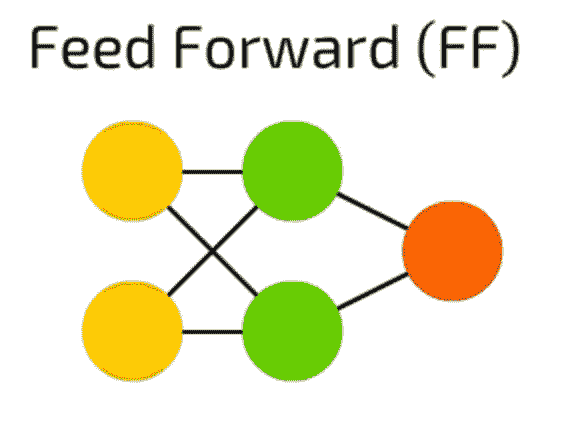

Visualization of a Feed Forward Neural Network from the [Asimov Institute](https://www.asimovinstitute.org/neural-network-zoo/).

[前馈神经网络](https://en.wikipedia.org/wiki/Feedforward_neural_network)是一大类神经网络，包括任何正向移动的网络(即大多数网络)。因此，出于本文的目的，我们将主要关注其中最简单的:多层感知器。

如果你还没有读过我的[上一篇关于单层感知器的文章](/mlearning-ai/building-a-neural-network-zoo-from-scratch-the-perceptron-335759f48089)，我强烈建议你在继续之前先读一读。

70 年代被称为人工智能的“黑暗时代”是有原因的:自从弗兰克·罗森布拉特(Frank Rosenblatt)在 1958 年发表论文以来，神经网络几乎没有取得任何进展，神经网络的前景已经成为认知研究界的一个笑话，有些人甚至提供了神经网络永远无法工作的正式证明。然而，1985 年，在最初的论文发表 27 年后，加州大学圣地亚哥分校的一个小型研究小组向[提交了这篇](https://apps.dtic.mil/dtic/tr/fulltext/u2/a164453.pdf)论文，并且永远地改变了人工智能的世界。

## 单层感知器与多层感知器

说实话，“多层感知器”有点用词不当。这是因为这个研究小组提出的关键问题(单层感知器和多层感知器之间的真正区别)不是感知器的数量，而是它们之间的非线性。

非线性就是它听起来的样子:一个图形不是直线的函数。现在有许多非线性激活函数，但研究小组最初提出的一个被称为 sigmoid。

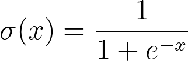

The formula for the sigmoid function.

[Graph of the sigmoid function](https://en.wikipedia.org/wiki/Sigmoid_function).

如果你还记得在我以前的文章中，我将单层感知器比作一条线的方程，并解释了当试图分离像 XOR 这样的函数时，这是如何出现问题的。多层感知器通过在层间添加类似 sigmoid 的非线性激活函数来扭曲“感知器线”来解决这个问题。

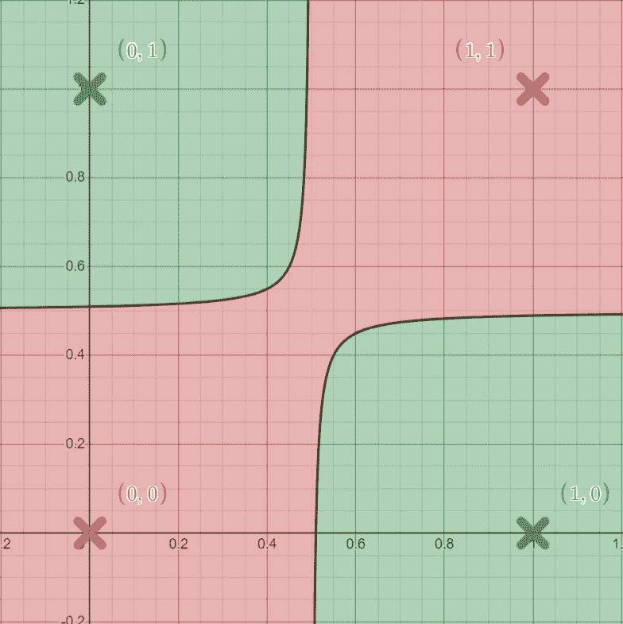

One possible seperation performed by a Multilayer Perceptron on the XOR graph.

与单层感知器不同，多层感知器今天仍然被用于像[情绪分析](https://en.wikipedia.org/wiki/Sentiment_analysis)这样的任务，天气预报甚至基本的图像识别，这是我们将在本教程中涉及的。这部分是由于所谓的[通用逼近定理](https://en.wikipedia.org/wiki/Universal_approximation_theorem)，该定理指出任何足够大的神经网络都可以逼近任何连续函数 *f(x)* 。这意味着，由于这些非线性，给定足够的时间和足够的*精确的*数据，神经网络几乎可以学习**任何东西*。*

## *好吧，那它是怎么工作的？*

*像感知器一样，多层感知器有一个向前传递和一个向后传递。这两个网络之间的前向传递保持相对不变，尽管由于多层而变得更长。*

*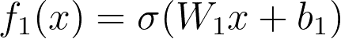*

*Layer 1 function.*

*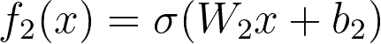*

*Layer 2 function.*

*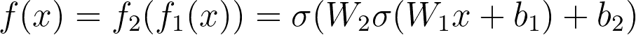*

*Total network function.*

*由于网络的两层是相同的，除了 *w* 和 *b* 之外，我们可以想象网络被分成两个独立的“感知器功能”，如上图所示。*

*由于这些附加的非线性，反向传递变得更加复杂。出于这个原因，我们也将把我们的计算图分成两部分。*

*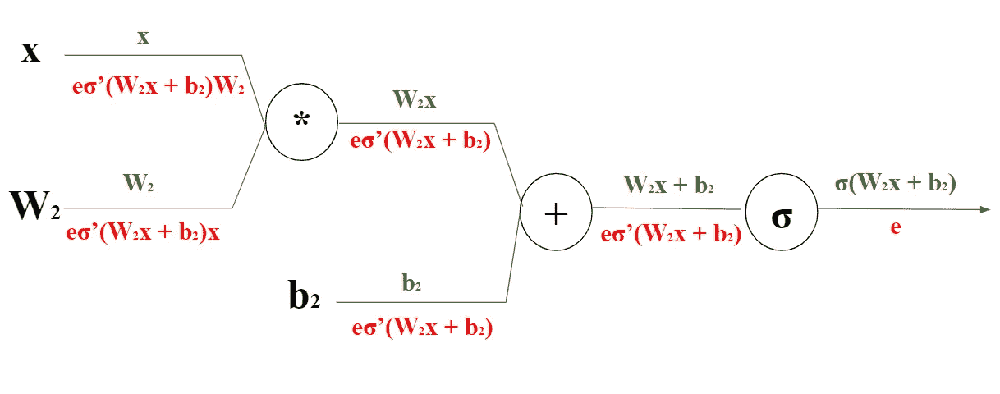*

*Computational graph of layer 2.*

*和以前一样，我们将每个变量放在图上，并在绿色连接上方的每一步向前传播当前函数。然后，从右边开始，我们用红色反向传播我们的误差:最后一个误差将总是 *e* 并且每隔一个误差将是上游误差(右边的误差)乘以上游函数(右边的函数)相对于当前函数(连接上面的函数)的导数。*

*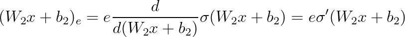*

*Error of W2x+b2.*

*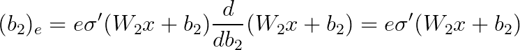*

*Error of b2.*

*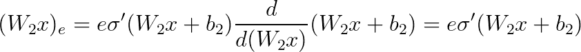*

*Error of W2x.*

*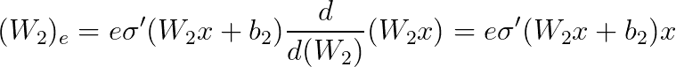*

*Error W2.*

*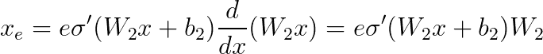*

*Error x.*

*注意，由于这是网络的第二层， *x* 将真正是第一层的输出。这也意味着我们通过第一层反向传播的误差，即 *e* 值，将是我们在第二层发现的 *x* 的误差。接下来，为了找到第一层的误差，我们只需获得第二层的误差，并用我们的误差 *x.* 替换 *e**

*这让我们跳过了 wx + b、wx 等等的中间步骤。*

*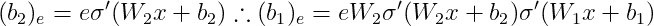*

*Error of b1.*

*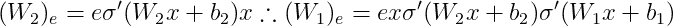*

*Error of W1.*

*毫无疑问，这一开始会令人困惑，但是就像任何事情一样，熟能生巧。如果你还在纠结，我会再次提醒你注意斯坦福大学的这个视频。*

## *数学算够了，让我们编码吧！*

*正如我在上一篇文章中提到的，为了清楚起见，我将只使用 NumPy 来实现这些网络的结构。然而，在本教程中，我还将使用 Matplotlib 来可视化网络输入。因此，继续导入 NumPy 和 Matplotlib。*

*Import NumPy & Matplotlib.*

*这一次我们的代码增加了一个新的激活函数 sigmoid。*

*Activation function.*

*该函数有两个输入:`input`和`derivative`，默认设置为`False`。`input`将是我们实际的数学输入，而`derivative`将是一个布尔值，它告诉我们的函数是返回输入的 sigmoid 还是它的导数( *σ(x)* 或 *σ'(x)* )。如果你想知道 sigmoid 函数的导数是如何推导出来的，[这个](https://hausetutorials.netlify.app/posts/2019-12-01-neural-networks-deriving-the-sigmoid-derivative/#:~:text=The%20derivative%20of%20the%20sigmoid%20function%20%CF%83(x)%20is%20the,1%E2%88%92%CF%83(x).)是一个很好的起点，但是对于我们的目的来说，它是一个可以忽略的细节。*

*Multilayer Perceptron class.*

*接下来我们可以定义我们的多层感知器类，它有 5 个输入。`input_size`是我们输入的长度，`hidden_size`是我们希望我们的层有多大，`output_size`是我们输出的长度，`num_epochs`和`learning_rate`是我们的超参数，它们分别改变我们学习的时间长度和速度。在我们的初始化函数中，我们还创建了网络的层，其中`w1`和`b1`是第一层的权重和偏差，`w2`和`b2`是第二层的权重和偏差。*

*Forward propagation function.*

*如前所述，`forward()`函数非常简单:我们的`layer1_output`是 *W1x + b1，* `activation1_output`是那个的 sigmoid，`layer2_output`是 *W2x + b2* ，其中 *x* 是`activation1_output`，而`activation2_output`是`layer2_output`的 sigmoid。注意，我们使用类变量来存储这些值，而不是从函数中返回它们。这使得我们的网络类更加简洁，因为我们将需要这些变量中的每一个来进行反向传播。*

*Backpropagation function.*

*现在进行反向传播。我们的`backward()`函数取`error`和`input`，分别是网络和原始网络输入的最终误差。`error2`是 *b2* 的误差，是网络的误差乘以第二层输出的 sigmoid 导数。`dw2`为第二层权重的误差，等于 *b2* 的误差乘以第二层的输入。然后`dw1`和`error1`是第一层的权重和偏差的误差，如上所示计算。注意，所有额外的操作仅用于固定矩阵的大小，以执行必要的计算；`.T`转置矩阵，`.flatten()`将一个 *(1，n)* 二维矩阵变为一个 *n* 长度的数组。*

*Train & test functions.*

*多层感知器的`train()`功能与单层感知器相同，因此无需解释。两个感知器之间的`test()`功能也非常相似，迭代输入并向前传播以获得预测。不同的是，这次我们将使用 Matplotlib 来可视化我们的输入，并手动确定我们的网络是否准确。*

*Multilayer Perceptron initialization and utilization.*

*最后初始化我们的网络。我们的`input_size`设置为 30，因为我们的网络正在 5x6 图像上进行训练。这些图像可以在下面看到。*

*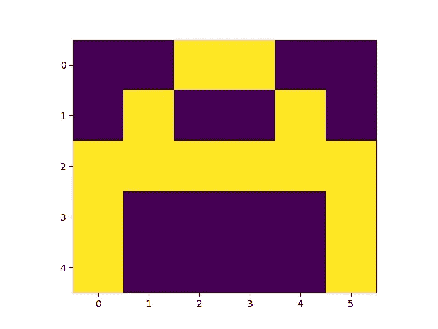**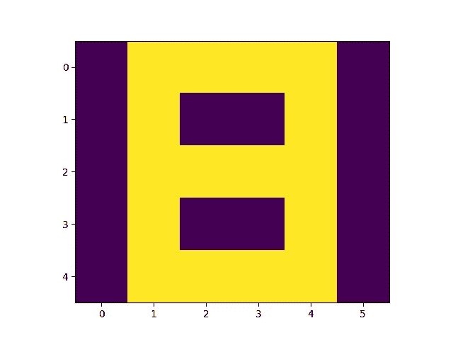**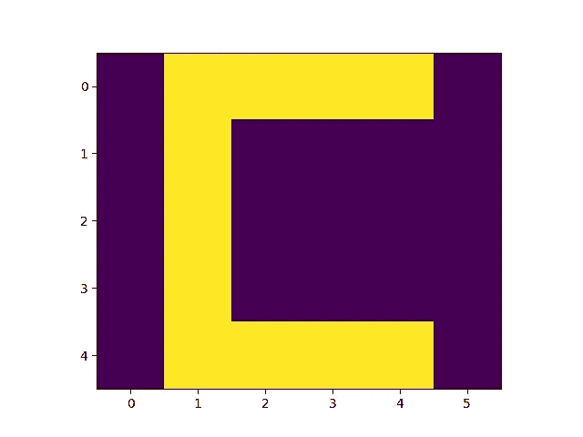*

*Inputs for our network.*

*我们的`hidden_size`被设置为 5，(和往常一样，我会建议摆弄这些数字，看看它如何影响网络的训练，尽管一个好的经验法则是网络的隐藏大小在输入和输出大小之间)，`output_size`被设置为 3，因为每个输入有三个可能的分类，`num_epochs`和`learning_rate`被设置为 1000 和 0.1，再次是任意的。*

*这就把我们带到了本系列第二篇文章的结尾。我希望您觉得这很有用，或者至少很有趣。请随意与你的朋友和同事分享这篇文章，并关注我的下一篇文章。这篇文章的完整代码可以在[这里](https://github.com/CallMeTwitch/Neural-Network-Zoo/blob/main/MultilayerPerceptron.py)找到。*

*非常感谢[艾米丽·赫尔](https://medium.com/u/5732f22c71f9?source=post_page-----f754cc88eca2--------------------------------)的剪辑。*

* [## Mlearning.ai 提交建议

### 如何成为 Mlearning.ai 上的作家

medium.com](/mlearning-ai/mlearning-ai-submission-suggestions-b51e2b130bfb)*