# 从头开始构建神经网络动物园:感知器

> 原文：<https://medium.com/mlearning-ai/building-a-neural-network-zoo-from-scratch-the-perceptron-335759f48089?source=collection_archive---------3----------------------->

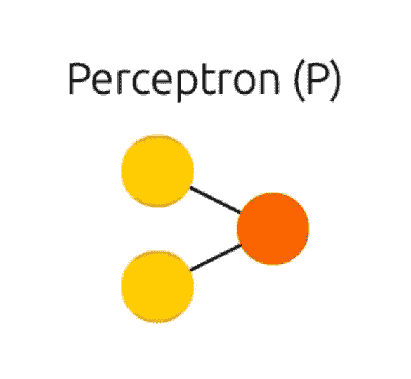

Visualization of the Perceptron from the [Asimov Institute](https://www.asimovinstitute.org/neural-network-zoo/).

被广泛认为是第一个神经网络的感知机最初是由康奈尔大学的心理学家弗兰克·罗森布拉特在 1958 年展示的。最初被认为是早期人工智能的救星，人们很快发现，感知机只能识别最基本的模式，像[和盖茨](https://en.wikipedia.org/wiki/AND_gate)。直到很多年以后，多层感知器才被发明出来，永远改变了机器学习和 AI 的历程。

# 那么，什么是感知机呢？

简单来说，感知器是一种功能，我们可以随着时间的推移进行微调，以给出我们想要的结果。

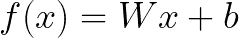

如果你回想一下你高中的数学课，这个函数应该看起来很熟悉——它是一条线的方程。这就是为什么感知器被认为是线性二进制分类器:它是图上可以区分两组的直线。

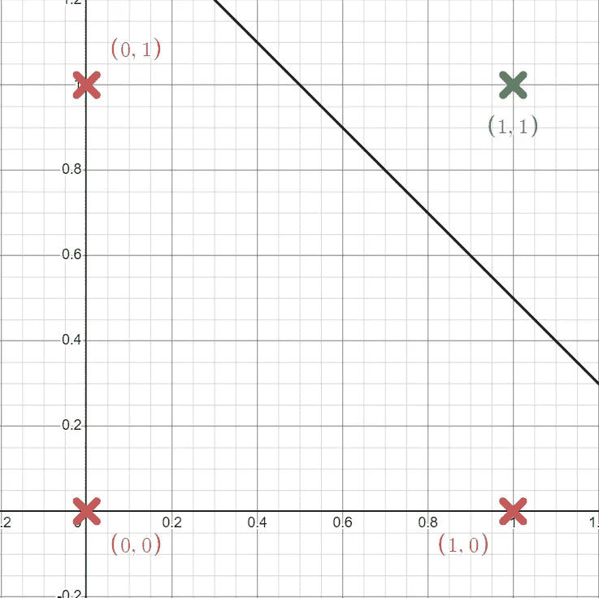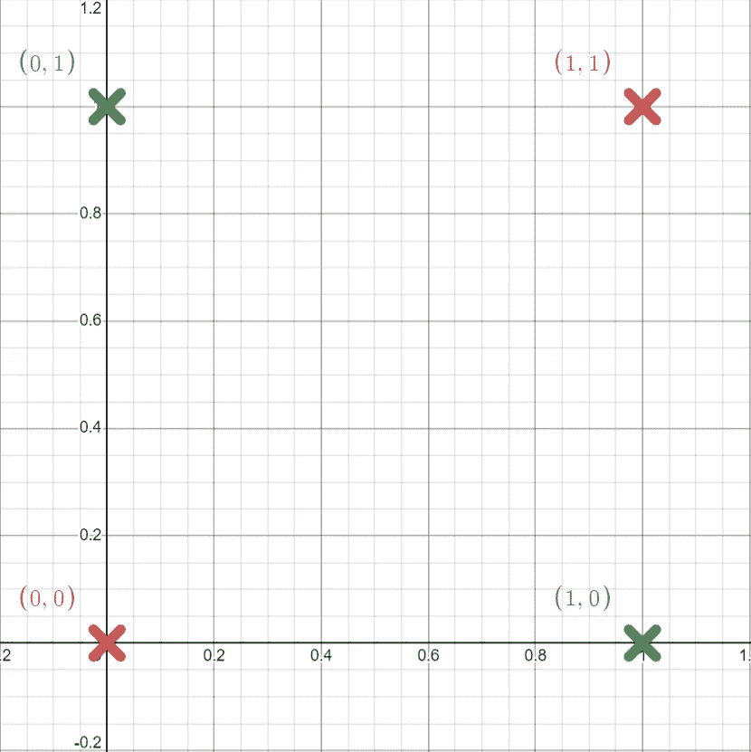

AND function (left) seperated by a potential Perceptron line & XOR function (right) which cannot be seperated by Perceptron line.

这就是感知机的问题所在:它只能区分可以被一条*直线*分开的事物。AND 函数(显示在左边)可以很容易地分开；另一方面，XOR 函数不能。不可能画一条一边是绿色的 X，另一边是红色的直线。

# 感知器是如何工作的？

感知器有两个步骤:向前传递和向后传递。在训练阶段，感知器“函数”被调用任意次数(前向传递)，每次调用时，我们将得到的输出与我们想要的输出进行比较，稍微改变函数，以获得更接近我们正在寻找的答案(后向传递)。

这种反向传递被称为[反向传播](https://en.wikipedia.org/wiki/Backpropagation)，通常是每个新的人工智能爱好者的祸根。反向传播是一堆高维矩阵和多元微积分，但理解它最简单的方法是用[计算图](https://www.youtube.com/watch?v=d14TUNcbn1k)。

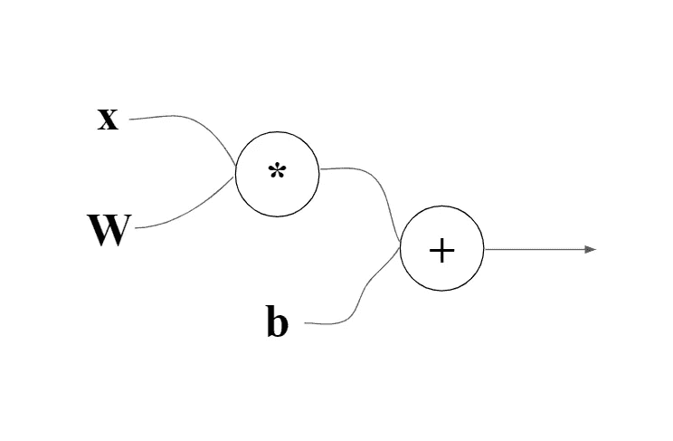

Step 1 of the computational graph for the Perceptron.

计算图形非常容易制作:从左到右阅读，每个圆代表一个函数(在这种情况下是乘法和加法)，每个进入圆的变量都是前面提到的函数的输入，任何来自圆的线都是函数的输出。这个特殊的图形代表了我们的感知器，因为它首先将 *x* 和 *W* 相乘，然后将 *b* 加到结果上。

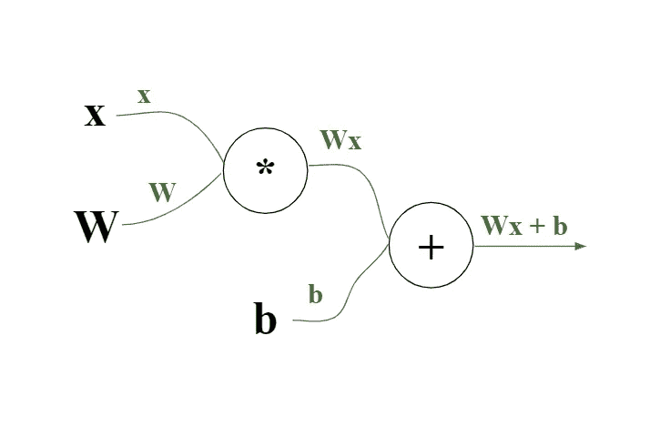

Step 2 of the computational graph of the Perceptron.

接下来，我们将把当前函数放在绿线上方的每个连接处，以便于理解。

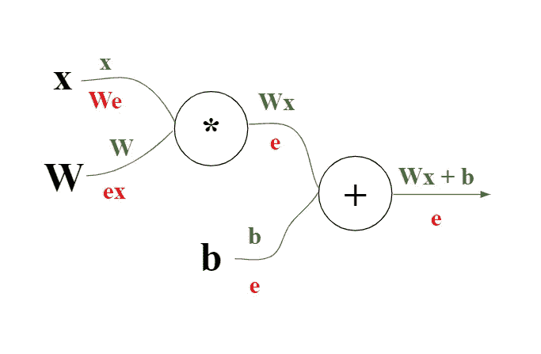

Step 3 for the computational graph of the Perceptron.

最后一步是最难的。从最右边的*连接(箭头来自加法功能)开始，*错误*将写在下面。任何一步的误差都可以计算如下:*

1.  最后一个连接将是代表错误的 *e* 。
2.  任何其他连接的误差将是上游误差(直接在右侧的误差)乘以上游函数(直接在右侧的函数)相对于您正在计算的连接的导数。

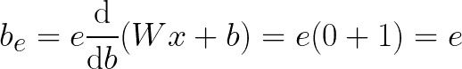

Error of *b*.

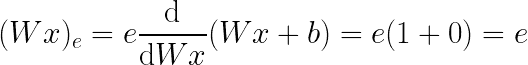

Error of Wx.

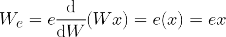

Error of W.

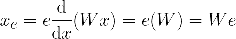

Error of x.

如果这些你都不理解，我建议你看一下这个视频，它会更详细地介绍构建和理解计算图的过程。你需要熟悉这个过程来理解神经网络。

# 数学够了…给我看看代码！

首先，导入 NumPy。这将是我们在本教程中使用的唯一一个库，这样你可以深入了解感知器幕后发生的事情。

Import NumPy.

我们将使用一个类来表示我们的感知器，以保持一切有组织，但你可以随意实现它。

Perceptron class.

我们的类会取三个输入:`input_size`，就是我们的输入会有多大；`num_epochs`，这是我们希望更新函数的次数(一般来说，越多的历元意味着越准确！);和`learning_rate`，这是一个额外的常数，它将改变我们的感知机如何快速学习。

我们还需要初始化我们的网络。`self.weights`是我们的 *W，*它将被设置为一个与我们的输入大小相同的零矩阵。`self.bias`是我们的 *b* 它也会被设置为零来启动。

Forward propagation function.

接下来是我们的`forward()`函数，它会调用我们的感知器函数 *f(x)* 。它接受一个名为`input`的输入，将它与我们的`self.weights`变量( *W* )相乘，并将`self.bias` ( *b* )加到它上面。对于不熟悉 NumPy 的人来说，下一行可能看起来有点复杂，但我向您保证它很简单。因为我们试图对一个二元函数进行分类，我们希望我们的输出要么是 1，要么是 0，所以如果`layer_output`大于 0，那么`np.where(layer_output > 0, 1, 0)`将返回 1，否则将返回 0。

Backpropagation function.

接下来是大家最喜欢的反向传播函数。使用我们的计算图，我们知道`self.weights` ( *W* )的误差将会是 *ex* ，或者我们的误差乘以我们的输入，`self.bias`的误差简单来说就是 *e* 。如前所述，你还应该使用一个学习率来控制你的网络学习的速度。这将通过将我们的误差乘以学习率来计算。

Train & test functions.

最后是`train()`和`test()`功能。`train()`功能将接受两个输入:`inputs`和`labels`。这些是我们感知器功能的输入列表和它们相应的期望输出。使用`zip()`函数，我们遍历每一对，用我们的输入调用我们的`forward()`函数，用我们的误差调用`backward()`，误差是我们想要的输出和预测的输出之间的差。如果还不清楚为什么这就是我们计算误差的方式，这里有一个表格可以更清楚地显示出来。

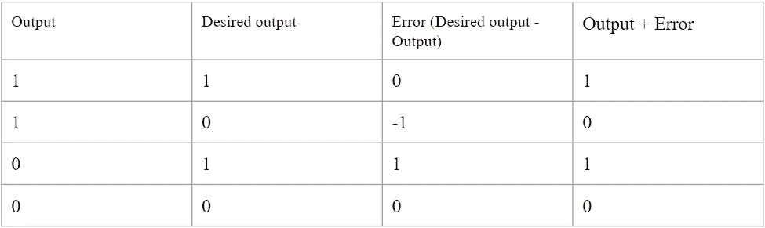

Table of our output, desired output, error and the output + the error.

现在你看到了:当`error`和`prediction`相加时，我们得到了我们想要的输出。这就是为什么我们*在反向传播函数中把误差*加到权重和偏差上:以得到更接近我们想要的输出。

Perceptron initialization & utilization.

最后初始化我们的感知机，训练它，并测试它。在这个例子中，我使用了 1000 个历元(或训练步数)和 0.01 的学习率，但是我强烈建议您亲自试验这些超参数，感受一下它们为什么在那里。

本系列的第一篇文章到此结束。最终，我希望写一篇文章来解释阿西莫夫研究所的神经网络动物园中的每一个网络。这篇文章的完整代码可以在[这里](https://github.com/CallMeTwitch/Neural-Network-Zoo/blob/main/Perceptron.py)找到。下一个关于前馈神经网络的教程可以在这里找到[。](/@CallMeTwitch/building-a-neural-network-zoo-from-scratch-feed-forward-neural-networks-f754cc88eca2)

感谢[艾米莉·赫尔](https://medium.com/u/5732f22c71f9?source=post_page-----335759f48089--------------------------------)的剪辑！

 [## Mlearning.ai 提交建议

### 如何成为 Mlearning.ai 上的作家

medium.com](/mlearning-ai/mlearning-ai-submission-suggestions-b51e2b130bfb)