# 用偏最小二乘回归(PLS)建立稳健模型

> 原文：<https://medium.com/mlearning-ai/building-a-robust-model-with-partial-least-squares-regression-pls-39fc5c47c843?source=collection_archive---------1----------------------->

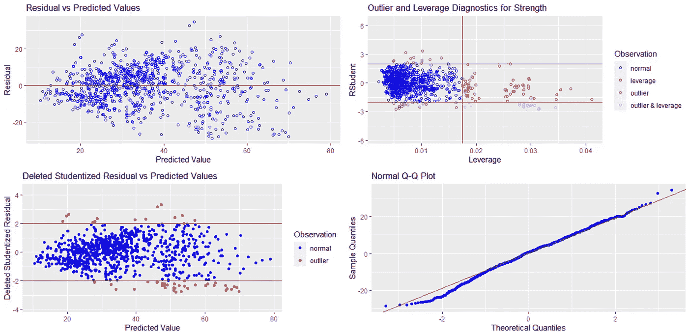

稳健是每个数据科学家在为分类或回归任务建立机器学习模型时想到的东西，我们所说的稳健是指他们的模型是否能够生成新的预测，这些预测可以推广到模型以前没有训练过的其他样本。换句话说，为了使线性回归有效，必须检查一些假设，并进行一些分析。在接下来的内容中，我们将处理 R 中的一个简单数据集，以了解如何检查这些假设的有效性，如何处理违反假设的情况，以及偏最小二乘回归如何帮助建立一个稳健的模型。

# 目录

*   [数据集](#0ac8)
*   [关联](#8f88)
*   [线性度](#52d2)
*   [残差的同方差](#5545)
*   [残差的独立性](#f21a)
*   [残差的正态性](#b090)
*   [有影响的值(杠杆和异常值)](#760c)
*   [回归变量的多重共线性](#3368)
*   [拟合偏最小二乘回归](#e0b5)

# 资料组

Photo by [Elvir K](https://unsplash.com/@elvir?utm_source=medium&utm_medium=referral) on [Unsplash](https://unsplash.com?utm_source=medium&utm_medium=referral)

我们将使用混凝土强度数据集；你可以从 [**这里**](https://www.kaggle.com/prathamtripathi/regression-with-neural-networking) 下载。

所有数据集回归量都是连续的:

*   水泥
*   高炉矿渣
*   飞灰
*   水
*   超塑化剂
*   粗骨料
*   细集料
*   年龄

目标变量也是连续的:

*   水泥的强度

现在，让我们在 R 中加载数据集:

# 相互关系

Photo by [Georgy Rudakov](https://unsplash.com/@rudakov_g?utm_source=medium&utm_medium=referral) on [Unsplash](https://unsplash.com?utm_source=medium&utm_medium=referral)

在确定变量之间的关系时，相关矩阵非常方便，它有助于发现回归变量之间的潜在共线性，并向我们显示响应变量如何与其他变量相关。现在让我们看看如何制作数据的相关矩阵，并使用 R:

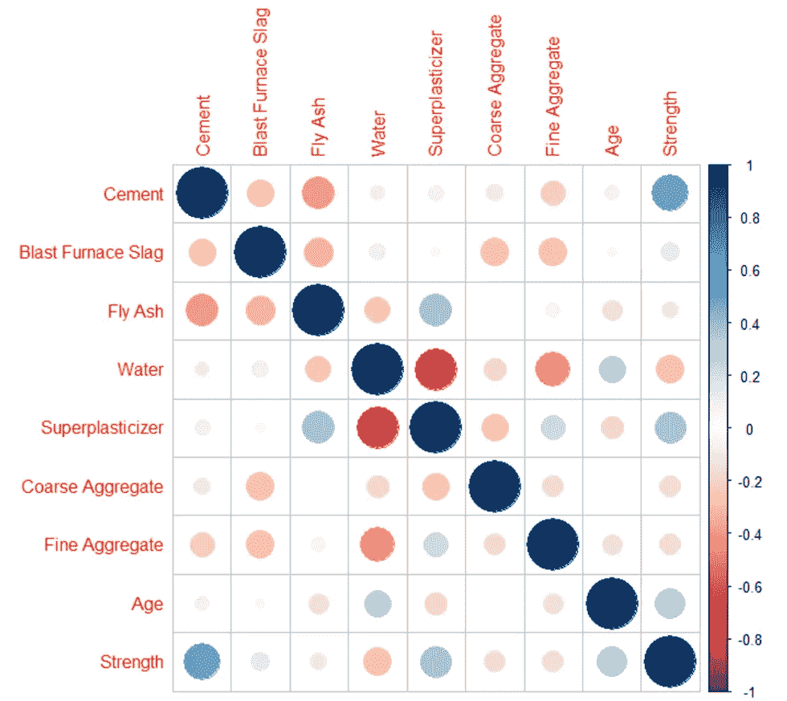

我们可以看到，超塑化剂和水是高度相关的，这表明调查回归之间的潜在共线性。目标可变强度与水泥、矿渣、减水剂、龄期呈正相关，与粉煤灰、水、粗骨料、细骨料呈负相关。

接下来，我们将对我们的数据拟合一个普通的最小二乘模型，以获得关于它的更多信息:

*   f 统计=204.3，p 值< 0.05，因此我们可以拒绝所有参数的零假设。
*   r 平方=0.6155，因此该模型解释了 61%的响应变量在其均值附近的变化。
*   截距、粗骨料和细骨料不显著，p 值> 0.05
*   粉煤灰、粗骨料和细骨料的系数为正，但这些变量与目标变量强度负相关。

# 线性

Photo by [Sunrise King](https://unsplash.com/@sunriseking?utm_source=medium&utm_medium=referral) on [Unsplash](https://unsplash.com?utm_source=medium&utm_medium=referral)

我们必须检查的基本假设是数据的线性。因此，让我们检查残差与拟合图:

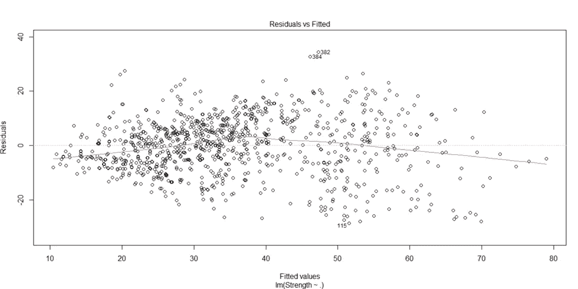

残差图显示，没有拟合的模式表明我们的数据是线性的。

## 如何处理非线性的情况？

在非线性的情况下，我们使用回归量的非线性变换，如 X 和 log(X)…

# 残差的同方差

Photo by [Pritesh Sudra](https://unsplash.com/@pritesh557?utm_source=medium&utm_medium=referral) on [Unsplash](https://unsplash.com?utm_source=medium&utm_medium=referral)

残差的同方差假设意味着残差的方差对于所有的观测值都是相同的。让我们用比例-位置图来检验这一假设的有效性，并用 Goldfeld-Quandt 检验来检验这一假设的有效性。

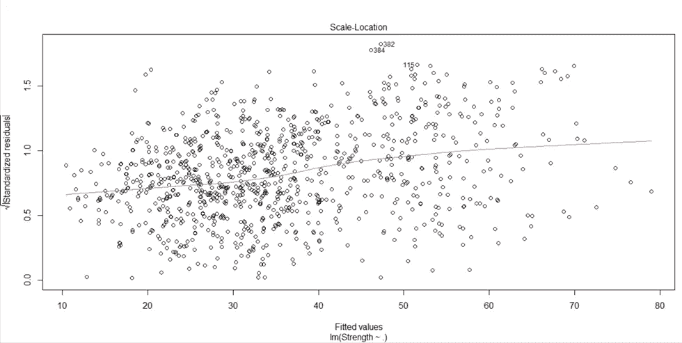

红线大约是水平的，这表示同质性。

## 戈德菲尔德-夸特试验:

Goldfeld-Quandt 检验是一种统计检验，用于检查残差的方差是否均匀。

Null (H0):存在同质性。

备选方案(H1):不存在同质性。

要了解更多关于 Goldfeld-Quandt 测试的信息，请点击此 [**链接**](https://www.r-bloggers.com/2021/11/homoscedasticity-in-regression-analysis/) 。

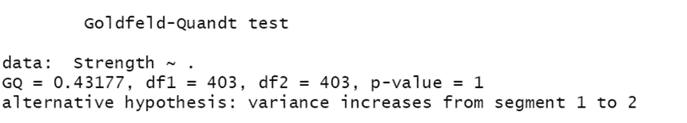

p 值大于 0.05，因此我们可以接受零假设，即残差的同方差。

## 如何处理异方差的情况？

如果违反残差的同方差假设(存在异方差)。我们可以对响应变量(Y)或因变量(Xi)进行变换，通过使用图基的权力阶梯来选择适当的变换，以拉平方差。要了解更多关于异方差以及如何处理异方差的信息，请点击 [**链接**](https://statisticsbyjim.com/regression/heteroscedasticity-regression/) 。

# 残差的独立性

Photo by [Saurav Mahto](https://unsplash.com/@sauravmahto?utm_source=medium&utm_medium=referral) on [Unsplash](https://unsplash.com?utm_source=medium&utm_medium=referral)

残差的独立性假设表明残差之间没有自相关。为了检验这个假设是否成立，我们可以使用杜宾-沃森检验。

## 德宾-沃森试验:

简而言之，Durbin-Watson 检验具有残差的自相关为 0 的零假设。

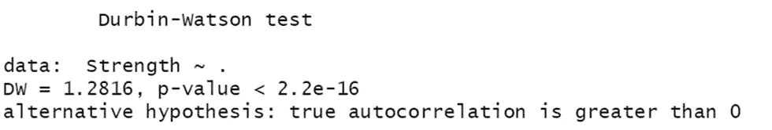

p 值< 0.05，所以拒绝零假设，所以我们可以说我们有残差的自相关。

## 如何处理残差的自相关？

在自相关的情况下，我们通过第一差分(Y[i]-Y[i-1])变换目标变量 Y。

# 残差的正态性

Photo by [Joes Valentine](https://unsplash.com/@joesvalentine?utm_source=medium&utm_medium=referral) on [Unsplash](https://unsplash.com?utm_source=medium&utm_medium=referral)

让我们用一个普通的 Q-Q 图来检验这个假设是否成立:

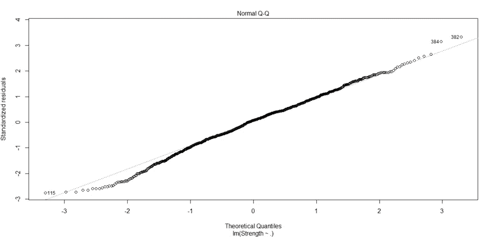

残差点遵循直虚线，因此我们可以假设残差是正态分布的。

## 如何处理残差非正态性？

我们可以通过对响应变量 y 进行 Box-Cox 变换来解决残差的非正态性。

要了解更多信息，请查看此 [**链接**](https://www.frontiersin.org/articles/10.3389/fpsyg.2018.02104/full) 。

# 有影响力的价值(杠杆和异常值)

Photo by [Will Myers](https://unsplash.com/@will_myers?utm_source=medium&utm_medium=referral) on [Unsplash](https://unsplash.com?utm_source=medium&utm_medium=referral)

当我们的观测值具有较大的残差(异常值)或残差接近于零(杠杆)时，我们称之为有影响的值，因为它们对回归分析的结果有很大的影响，因此，我们必须检测它们，以便考虑和处理它们。

## 库克的距离

对于第 I 个观察值，我们在没有该观察值的情况下重新调整回归模型，然后我们计算该回归模型的系数与已经对所有观察值进行拟合的模型的系数之间的距离，以便查看当删除第 I 个观察值时所有拟合值改变了多少。

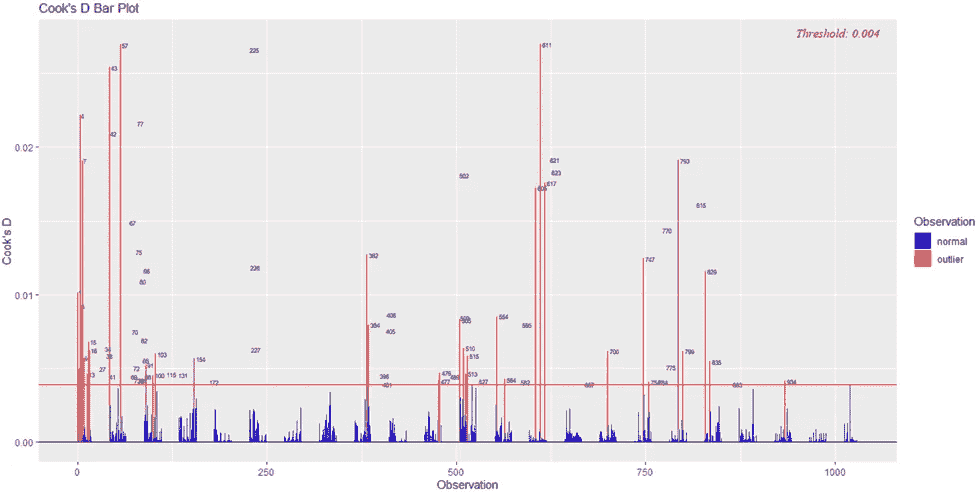

用红色突出显示的观察值是潜在的异常值。

## DFBETAS

DFBETA 测量有和没有影响点的每个变量的每个参数估计的差异。

COOKD 和 dfbeta 的联合使用:如果变量很多，我们先看有全局影响的观测值(高 COOKD)，那么对于这个观测值，是哪些变量造成了这个影响(dfbeta)。

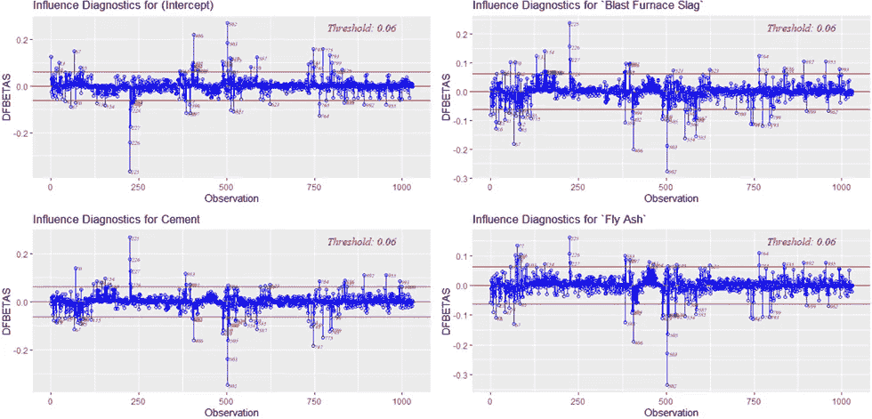

这段代码绘制了所有解释变量的 DFBETAS，但是我们将只考虑四个变量(尝试自己检查其他变量的绘图)。我们可以看到，对于每个变量，都有一些观察值被突出显示为潜在的异常值，因为它们超过了 DFBETAS 阈值，在本例中为 0.06。

## DFFITS

简而言之，DFFITS 是从完整数据获得的第 I 个拟合值和通过删除第 I 个观察值获得的第 I 个拟合值之间的比例差。

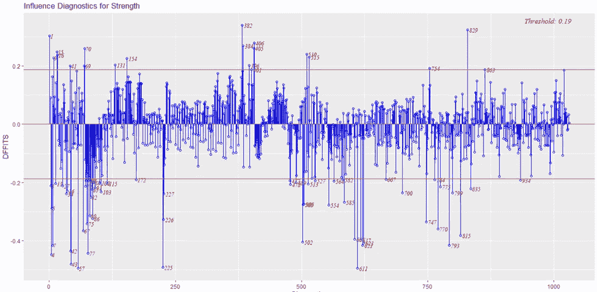

我们可以看到，有些观察值的 DFT fit 超过了阈值(在我们的例子中为 0.19)，因此它们代表了需要调查的潜在异常值。

## 用一行代码进行强大的诊断

如果您想用一行代码运行快速诊断，以便检测有影响的值并进行其他分析，该怎么办？

这段代码输出了 10 个图，但是我们只检查其中的一个(自己运行代码并分析其余的图)。

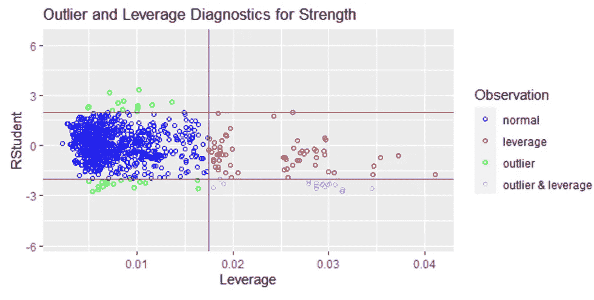

从上面的图中，我们可以看到一些观察结果被突出显示为潜在的杠杆和潜在的异常值，因此，我们需要调查这些点。

## 如何处理有影响的值(异常值和杠杆)？

调查数据是否被错误记录(如果可能，回到数据源)。

*   如果异常值不是由于转录错误造成的，那么在重新调整模型之前可能需要将其删除。
*   一般来说，应该在移除单个离群点之后重新拟合模型，因为移除一个离群点会改变拟合的模型，从而使其他点看起来与模型不太(或更多)一致。
*   将这些异常值视为缺失值，并运行模型来预测它们(K-最近邻…)

要了解更多信息，请访问此 [**链接**](https://www.maths.usyd.edu.au/u/UG/SM/STAT3022/r/current/Lecture/lecture08_2020JC.html#1) 。

# 回归变量的多重共线性

Photo by [Denny Müller](https://unsplash.com/@redaquamedia?utm_source=medium&utm_medium=referral) on [Unsplash](https://unsplash.com?utm_source=medium&utm_medium=referral)

多重共线性涉及两个以上的变量是彼此接近完美的线性组合。在多重共线性存在的情况下，回归估计是不稳定的，并且具有较高的标准误差。

## 差异通货膨胀系数(VIF)

简而言之，方差膨胀因子(VIF)测量模型中预测变量之间存在相关性时估计回归系数的方差膨胀的程度。如果值 VIF 超过 5，则存在多重共线性。

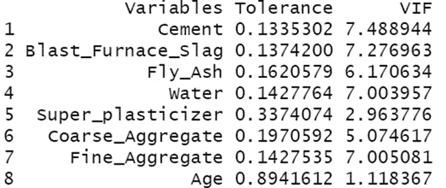

水泥(和其余变量)、高炉矿渣(和其余变量)、粉煤灰(和其余变量)、水(和其余变量)、粗骨料(和其余变量)和细骨料(和其余变量)之间存在多重共线性。

## 条件指数和方差比例

通过找到 2 个或更多具有对应于大条件指数的大比例方差(. 50 或更大)的变量来发现共线性。经验法则是将 30 或更大范围内的那些条件指数标注为大。

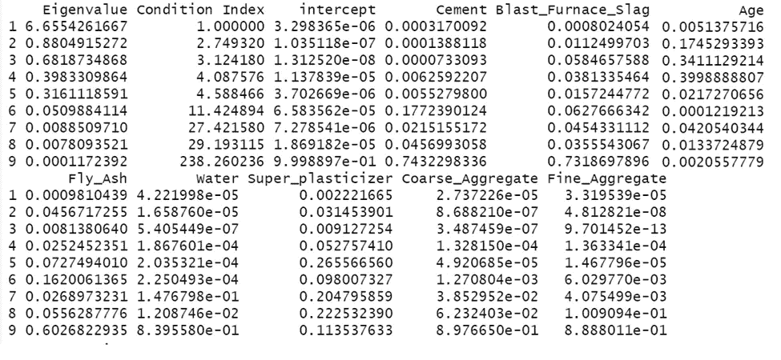

水泥和高炉渣是共线的，因为它们的变化比例大于 0.50，条件指数超过 30。

## 如何处理多重共线性？

*   删除某些回归变量，它们是共线性的主要“原因”
*   通过收集其他观察值来增加样本量
*   选择回归变量
*   使用岭回归
*   研究回归变量产生的主要成分
*   使用“套索”类型的方法
*   使用偏最小二乘回归(PLS)回归，我们将在下一节中介绍

# 拟合偏最小二乘回归

Photo by [Clay Banks](https://unsplash.com/@claybanks?utm_source=medium&utm_medium=referral) on [Unsplash](https://unsplash.com?utm_source=medium&utm_medium=referral)

偏最小二乘(PLS)回归是一种非线性模型，将待解释的变量与一组解释变量(定量或定性)相关联。PLS 回归是多元线性回归和主成分分析之间的折衷。换句话说，PLS 最大化了解释变量的方差，并且最大化了这些变量和响应变量之间的相关性。当存在大量具有**多重共线性**或缺失值的变量时，这很有用。要了解更多关于 PLS 回归的信息，请查看此 [**链接**](https://en.wikipedia.org/wiki/Partial_least_squares_regression#:~:text=Partial%20least%20squares%20regression%20(PLS,the%20predicted%20variables%20and%20the) 。

让我们将数据分为训练集和测试集。

让我们拟合我们的 PLS 回归模型。

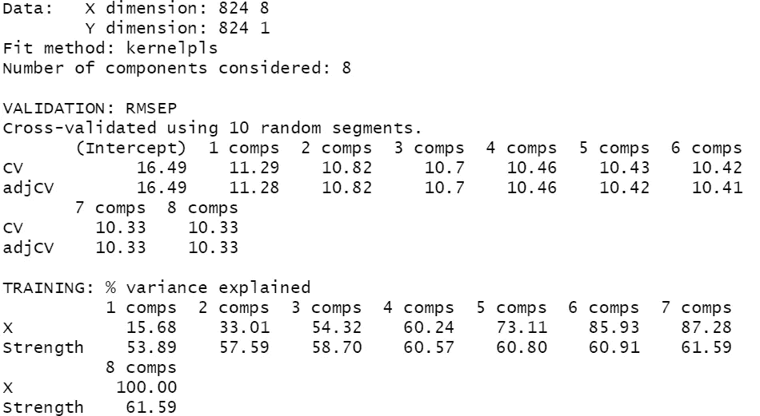

我们可以看到，在我们的 PLS 模型中有 8 个组成部分，其中解释的方差百分比在最后 3 个组成部分中最大化。但是要小心！大量组件可能导致 [**过拟合**](https://en.wikipedia.org/wiki/Overfitting) ！

## 我们如何选择正确的元件数量？

我们选择给出最小预测均方根误差或最小预测均方误差的分量数。

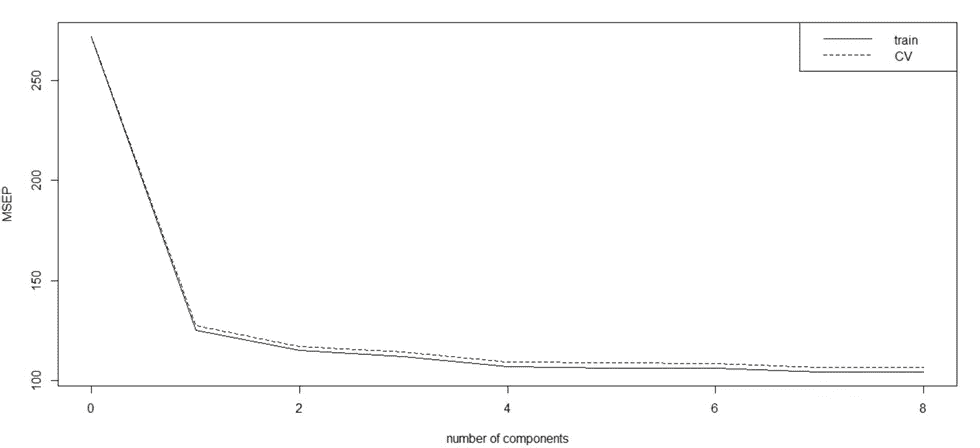

在我们的例子中，我们可以得出这样的结论:给出最小 MSEP 的分量数是 8。

## 参考

*   [https://cran . r-project . org/web/packages/ol SRR/vignettes/residual _ diagnostics . html](https://cran.r-project.org/web/packages/olsrr/vignettes/residual_diagnostics.html)
*   [https://cran . r-project . org/web/packages/ol SRR/vignettes/regression _ diagnostics . html](https://cran.r-project.org/web/packages/olsrr/vignettes/regression_diagnostics.html)
*   [https://cran . r-project . org/web/packages/ol SRR/vignettes/influence _ measures . html](https://cran.r-project.org/web/packages/olsrr/vignettes/influence_measures.html)
*   [https://cran.r-project.org/web/packages/lmtest/lmtest.pdf](https://cran.r-project.org/web/packages/lmtest/lmtest.pdf)
*   [http://www . sth da . com/English/articles/39-regression-model-diagnostics/161-linear-regression-assumptions-and-diagnostics-in-r-essentials/# influenced-values](http://www.sthda.com/english/articles/39-regression-model-diagnostics/161-linear-regression-assumptions-and-diagnostics-in-r-essentials/#influential-values)
*   [https://www . r-bloggers . com/2021/11/homoscedassity-in-regression-analysis/](https://www.r-bloggers.com/2021/11/homoscedasticity-in-regression-analysis/)
*   [https://www . maths . usyd . edu . au/u/UG/SM/stat 3022/r/current/Lecture/Lecture 08 _ 2020 JC . html # 1](https://www.maths.usyd.edu.au/u/UG/SM/STAT3022/r/current/Lecture/lecture08_2020JC.html#1)
*   [https://statistics byjim . com/regression/heteroscensity-regression/](https://statisticsbyjim.com/regression/heteroscedasticity-regression/)
*   [https://www . frontier sin . org/articles/10.3389/fpsyg . 2018.02104/full](https://www.frontiersin.org/articles/10.3389/fpsyg.2018.02104/full)
*   [https://en.wikipedia.org/wiki/Influential_observation](https://en.wikipedia.org/wiki/Influential_observation)

 [## Mlearning.ai 提交建议

### 如何成为 Mlearning.ai 上的作家

medium.com](/mlearning-ai/mlearning-ai-submission-suggestions-b51e2b130bfb)