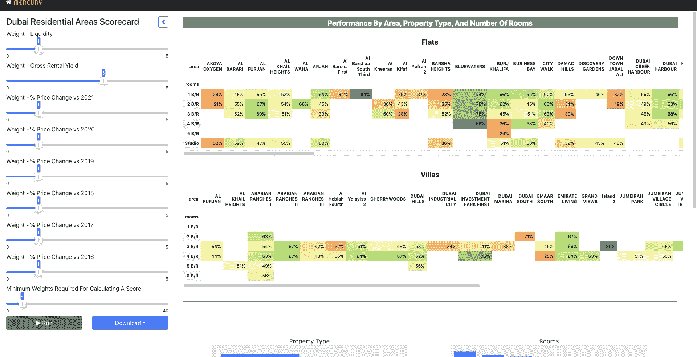

# 为迪拜住宅区构建记分卡 Web 应用程序

> 原文：<https://medium.com/mlearning-ai/building-a-scorecard-for-residential-areas-in-dubai-using-mercury-8fdd5867cc68?source=collection_archive---------5----------------------->

## Mercury 帮助您轻松地将 Jupyter 笔记本转换为网络应用程序

Image by author

## 目录

*   介绍
*   数据来源
*   在 Jupyter 笔记本中创建记分卡的代码
*   将 Jupyter 笔记本转换为…