# 构建一个 Web 应用程序来检测超声图像中的乳腺癌

> 原文：<https://medium.com/mlearning-ai/building-a-web-application-to-detect-breast-cancer-in-ultrasound-images-df391483fbd9?source=collection_archive---------1----------------------->

## 轻松在医学图像上进行目标检测的友好指南


Photo by [Priscilla Du Preez](https://unsplash.com/@priscilladupreez) on [Unsplash](https://unsplash.com/photos/gYdjZzXNWlg)

上个月被指定为粉红月，致力于提高对乳腺癌的认识，并鼓励妇女通过医疗访问进行预防。如果早期诊断，这种疾病的死亡率可以大大降低，这样就可以挽救许多生命。

检测乳腺病变最常见的方法是通过影像诊断，这可以通过不同的方法获得，如磁共振成像、乳房 x 线照相术和乳腺超声。正如你所推断的，准确识别乳腺癌是非常重要的。

在这种情况下，深度学习技术可以代表自动识别和诊断乳腺癌的有用工具。在这一领域已经进行了大量的研究，并且存在可用于解决这类任务的公共影像数据集。

在本文中，我将构建一个用 Streamlit 构建的 web 应用程序，用于从超声图像中检测乳腺癌，同时使用 Datature 的工具训练模型。我们的基准数据集称为乳腺超声图像数据集，可以在 Kaggle 上找到。

## 目录:

*   **第一部分:超声图像上的训练模型**
*   **第 2 部分:用 Streamlit 构建 Web 应用程序**

# 要求:

在继续之前，你需要在[数据公司](https://www.datature.io/)的平台上创建一个账户。之后，您可以进入您的帐户，并创建一个新的项目如下截图。特别是，您需要指定项目名称和类型，可以是对象检测或实例分割。

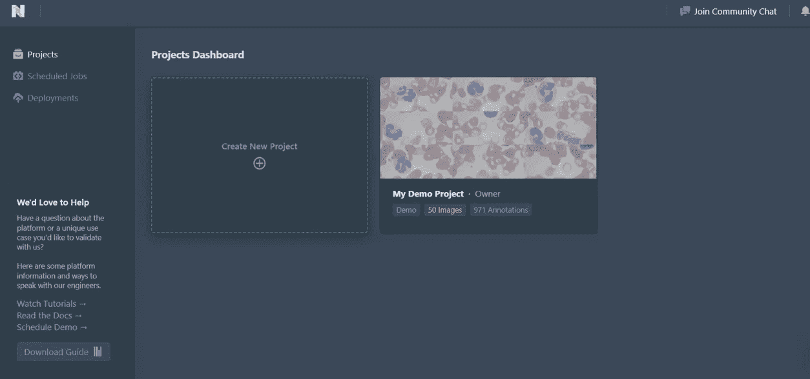

Create a New Project on Datature’s platform. GIF by Author.

在这种情况下，我们选择对象检测选项，因为我们希望在图像中找到对象，然后为它们分配正确的标签，良性或恶性。我们将处理一个包含乳房图像的数据集，这些图像可在 [Kaggle](https://www.kaggle.com/datasets/aryashah2k/breast-ultrasound-images-dataset) 上获得。

该数据集有三个不同的类别:正常、良性和恶性图像。在这个项目中，我们将只关注两类，良性和恶性。此外，数据集包括掩模图像，也称为地面真实图像，以及该类别的原始图像。

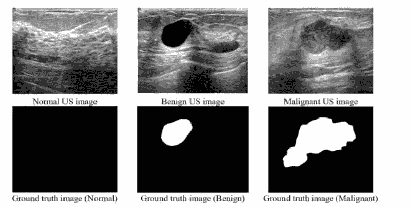

[Source](https://www.sciencedirect.com/science/article/pii/S2352340919312181)

# **第 1 部分:超声图像上的训练模型**

这部分将被分成不同的部分:

1.  上传和注释图像
2.  创建工作流
3.  可视化模型性能
4.  下载 Tensorflow 神器
5.  运行预测脚本. py

## 1.上传和注释图像

让我们通过点击上传按钮来上传良性和恶性病例的图像。


1.1 Upload Images. Illustration by Author.

由于数据集包含与平台不兼容的二进制掩码，我使用 python 脚本从这些掩码中导出边界框:

该文件具有 CSV 格式，其中每一行对应于与数据集的每个图像相关联的注释。实际上，边界框是由四个像素值定义的:x_min、y_min、width 和 height。除了这四个值，我们还有标签，可以是良性的，也可以是恶性的。

```
filename,xmin,ymin,width,height,label
benign (1).png,288,134,51,26,benign
benign (10).png,24,67,209,197,benign
benign (11).png,367,132,72,38,benign
benign (12).png,343,178,78,44,benign
benign (13).png,182,107,355,198,benign
benign (14).png,511,149,111,54,benign
```

之后，我们可以用选项“CSV 四角-边界框”导入注释，如[数据的文档](https://developers.datature.io/docs/uploading-annotations#csv-four-corner---bounding-box)所示。

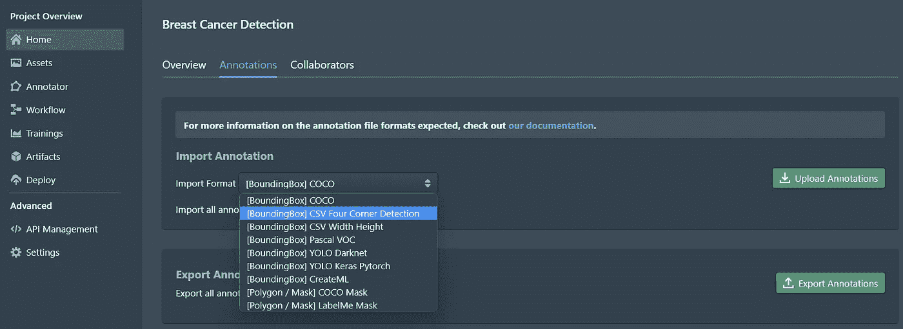

1.2 Upload Annotations. Illustration by Author.

我们可以在注释器中可视化带有相应注释的图像。是不是很神奇？我们可以对带注释的超声图像有一个完整的概述。

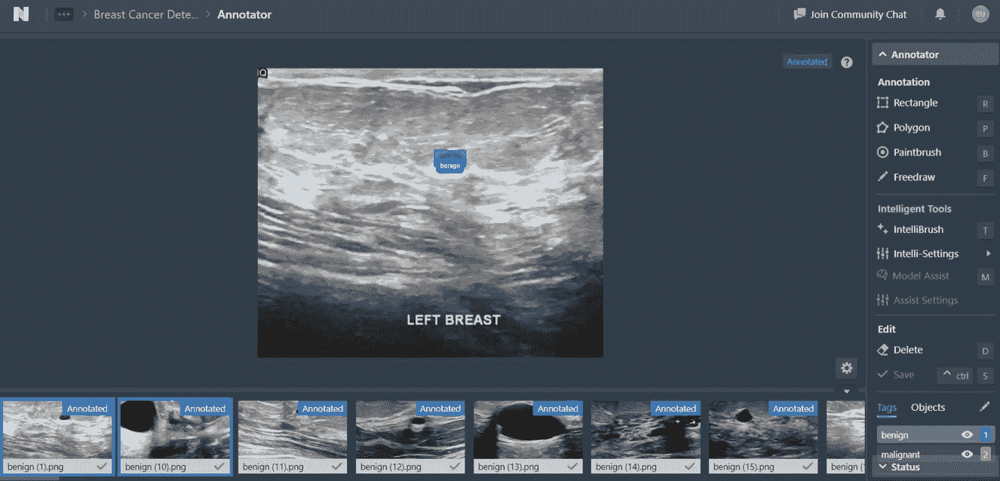

Visualize annotated images and Manually Annotation. GIF by Author.

此外，Datature 的注释器允许手动注释，以防图像没有标签和边界遮罩。在从事计算机视觉项目时，这个特性无疑是很有价值的。

## 2.创建工作流

是时候训练我们的模特了！我们通常需要编写大量代码行来导入数据集，应用数据增强技术，最后，训练深度学习模型来解决对象检测任务。Datature 通过创建工作流来简化这一过程，工作流是一种显示机器学习生命周期所有步骤的可视化方案:

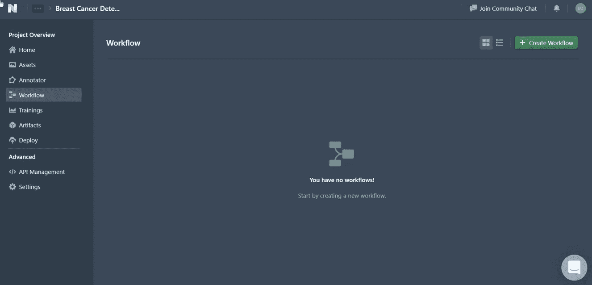

Create Workflow. Illustration by Author.

不同阶段的过程非常直观:

*   右键单击**数据集→项目数据集**，将数据集分成训练集和验证集。
*   右键点击**增强**，选择你喜欢的技术来应用图像的变换。还可以通过点击右下角的“预览增强”按钮预览增强效果。
*   右键**型号→ RetinaNet 型号→ Retina MobileNet V2 640x640** 。如果您按下创建的窗口的模式，您还可以设置批量大小和迭代次数。在这种情况下，我们只需将默认批量大小更改为 4。

在定义了工作流的步骤后，我们可以按下“运行训练”按钮，这会显示训练模型的选项，如 GPU 类型和检查点策略。

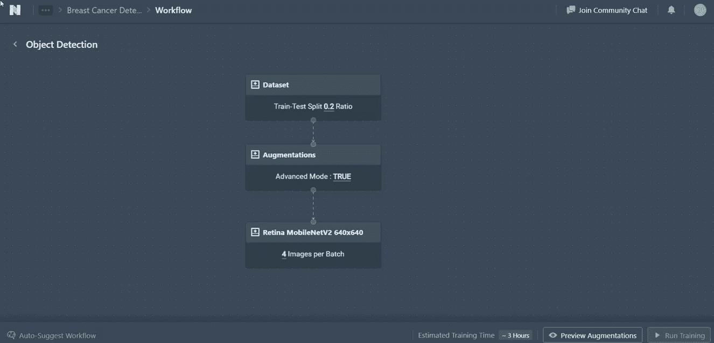

Run Training. Illustration by Author.

一旦我们选择了选项，我们可以点击“开始训练”按钮，并最终可以开始有趣的部分！休息一下，在乳腺癌图像上训练模型需要 15 到 30 分钟。

## 3.可视化模型性能

从图中，我们可以观察到，随着迭代次数的增加，训练和验证损失都在缓慢减少。此外，很明显，随着时间的推移，准确率和召回率都在提高。

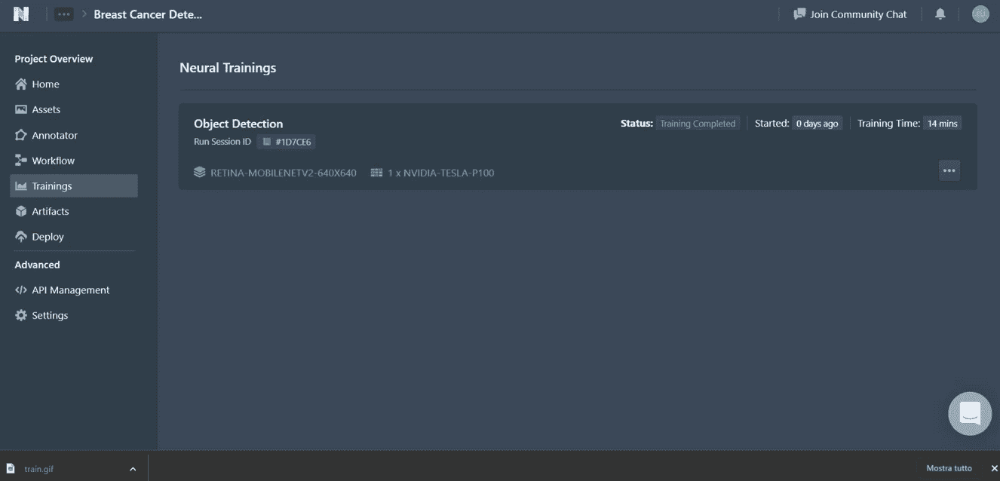

Model metrics and Advanced Evaluation. GIF by Author.

正如在许多项目中一样，只看指标不足以真正理解一个模型是如何执行的。在这个令人惊叹的平台中，有一个名为高级评估的工具，它允许将地面真相与预测的边界框进行比较。例如，如果模型将良性结节混淆为恶性结节，该功能对于理解非常重要，如下图所示。

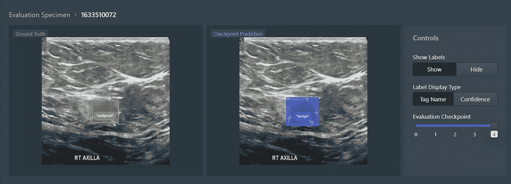

Example of Advanced Evaluation. Illustration by Author.

## 4.下载 Tensorflow 神器

在培训结束并且我们检查了最终的度量标准之后，我们最终可以导出工件。只需进入神器页面，选择神器盒子上的`…`按钮，按“导出神器”，选择“生成张量流模型”选项即可。几秒钟后，您可以单击下载。

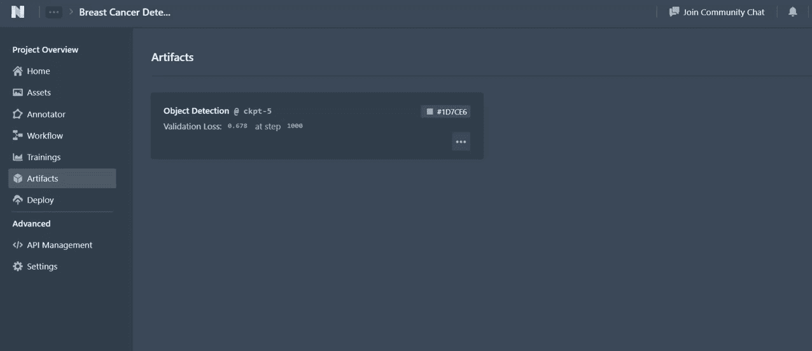

Export Artifact. GIF by Author.

该功能将允许我们使用 python 脚本在平台外对新图像进行预测。因此，我们也可以稍后创建 web 应用程序，它将访问数据的预测平台 API，称为门户。

## 运行预测脚本. py

正如我前面提到的，我们希望对其他超声图像进行预测，这些图像在训练期间没有传递给模型。为此，需要满足一些要求:

*   解压缩导出的工件。
*   从数据仓库的 [GitHub 库](https://github.com/datature/resources/tree/main/scripts/inference/tensorflow/bounding_box)下载`requirements.txt`和`[predict.py](https://github.com/datature/resources/blob/main/scripts/inference/tensorflow/bounding_box/model_architecture/retinanet/predict.py)`文件。
*   使用 3.6–3.8 之间的 Python 版本设置 Python 环境。

我们还应该有一个项目结构，就像这样:

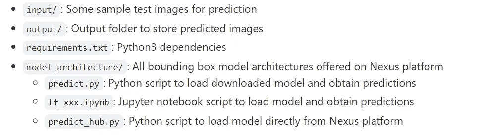

Screenshot on [Github Repository](https://github.com/datature/resources#tflite-model---bounding-box).

放心吧！`tf_xxx.ipynb`和`predict_hub.py`是兼性的，我们只需要`predict.py`。

除了引用的文件夹和文件列表，我们还需要创建一个包含测试图像的输入文件夹，以及一个存储最终预测的输出文件夹。

这是我们项目的最终结构:


Project Structure. Illustration by Author.

我们只需要在终端上用下面的命令行运行`predict.py`脚本:

```
cd model_architecture
python predict.py --input "../input" --output "../output" --width 640 --height 640 --threshold 0.7 --model "../saved_model" --label "../label_map.pbtxt"
```

输出:

```
Model loaded, took 6.812467813491821 seconds...
Predicting for ../input/malignant (90).png...
Predicting for ../input/benign (53).png...
Saving predicted images to ../output/benign (53).png...
Predicting for ../input/benign (51).png...
Saving predicted images to ../output/benign (51).png...
Predicting for ../input/malignant (71).png...
Predicting for ../input/benign (52).png...
Predicting for ../input/malignant (111).png...
Saving predicted images to ../output/malignant (111).png...
```

如前所述，`output`文件夹包含输入文件夹中包含的每个图像的模型预测。该示例显示了具有良性结节的图像，其被模型正确地识别为良性:

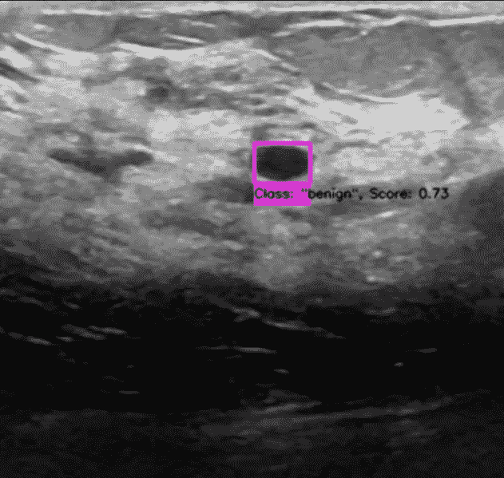

Example of Benign prediction. Illustration by Author.

我们还可以看到显示恶性结节的图像，该结节被正确地预测为恶性。

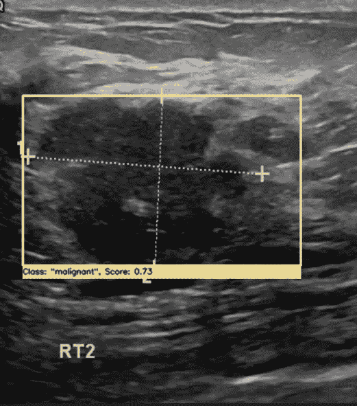

Example of Malignant Prediction. Illustration by Author.

太好了！我们能够对新图像进行预测。下一步将对 web 应用程序做同样的事情。

# **第 2 部分:使用 Streamlit 构建 Web 应用程序**

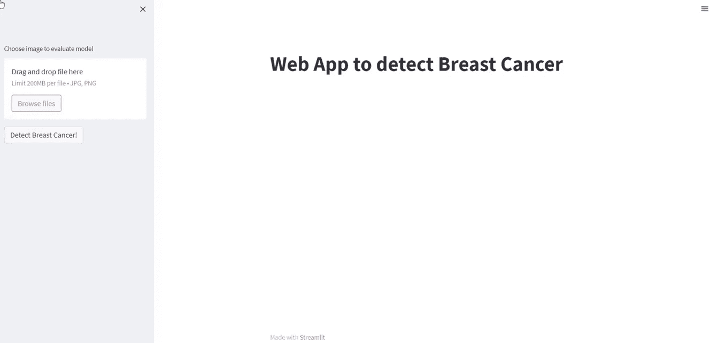

Web Application. GIF by Author.

我们最终可以构建我们的 web 应用程序来从超声图像中检测乳腺癌。Streamlit 是我们将使用几行代码创建 web 应用程序的 Python 库。我们还将包括在`predict.py`脚本中使用的函数。该应用程序的所有代码都包含在`app.py`脚本中。

这几行代码很好地总结了构建应用程序的步骤:

*   使用`argparse`库来定义默认参数，比如模型的路径和标签图的路径。
*   加载训练好的模型。
*   创建应用程序的标题。
*   上传图像，可以是`jpg`或`png`格式。
*   创建一个按钮“检测乳腺癌”。按下后，我们在 web 应用程序的右半部分可视化预测。

如果上传了文件并选择了按钮，如果有预测框，我们将在测试图像上可视化预测框，否则，有没有注释的图像。

# 最终想法:

恭喜你！您已经成功地创建了一个 web 应用程序，它利用计算机视觉的能力从超声波图像中检测乳腺癌。如果你有任何进一步的兴趣，可以从计算机视觉模型中受益， [Datature](http://datature) 可以成为一个非常广泛且易于使用的工具来帮助你实现目标。

感谢您的阅读，我希望您会受到这个项目的启发，亲自尝试计算机视觉！

查看我的 [GitHub 库](https://github.com/eugeniaring/breast_cancer_web_app)中的代码。

*免责声明:该数据集受公共领域(CC0)许可*

你喜欢我的文章吗？ [*成为会员*](https://eugenia-anello.medium.com/membership) *每天无限获取数据科学新帖！这是一种间接的支持我的方式，不会给你带来任何额外的费用。如果您已经是会员，* [*订阅*](https://eugenia-anello.medium.com/subscribe) *每当我发布新的数据科学和 python 指南时，您都会收到电子邮件！*

[](/mlearning-ai/mlearning-ai-submission-suggestions-b51e2b130bfb) [## Mlearning.ai 提交建议

### 如何成为 Mlearning.ai 上的作家

medium.com](/mlearning-ai/mlearning-ai-submission-suggestions-b51e2b130bfb)