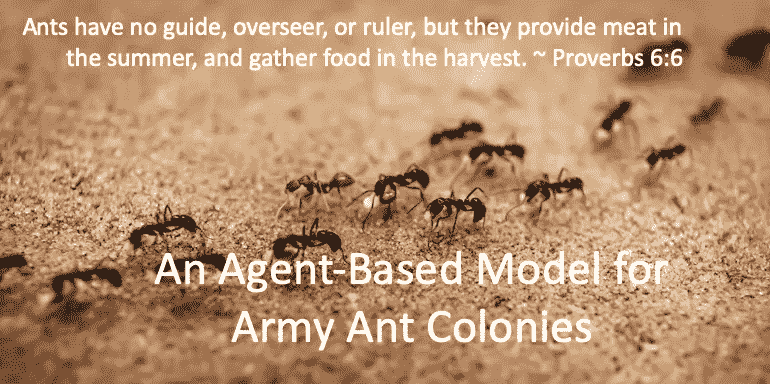

# 用 Python 构建基于代理的蚂蚁觅食模型

> 原文：<https://medium.com/mlearning-ai/building-an-agent-based-model-with-python-streamlit-for-ant-foraging-a74a41605d2c?source=collection_archive---------1----------------------->

当我们观察蚂蚁的行为时，我们会对它们的集体智慧和庞大的结构感到惊讶。非洲蚂蚁可以建造一个 6 或 7 米高的巢穴。它们的巢不仅可以是一只蚂蚁的 100 倍，它们的巢型也很复杂。它们都遵循一个宏伟的建设蓝图吗？现在我们来观察它们是如何寻找食物的。他们开始…