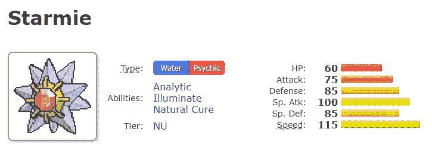
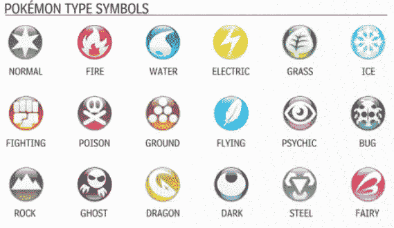
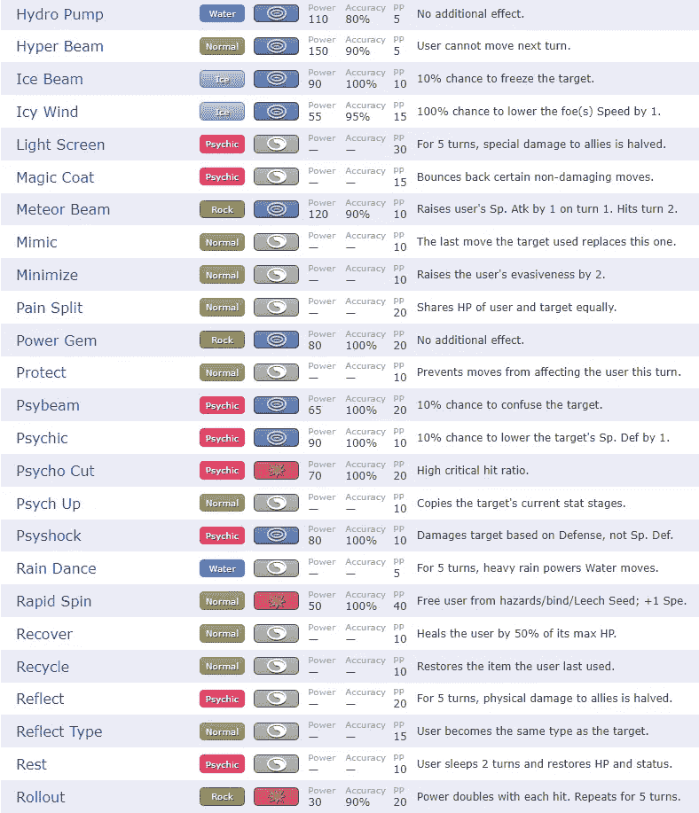
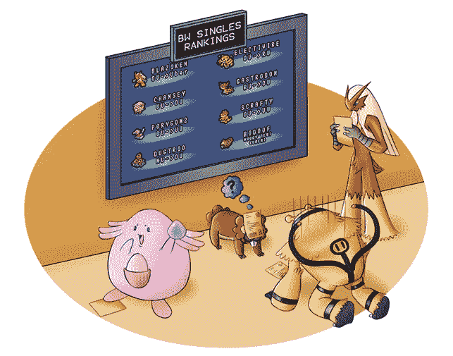
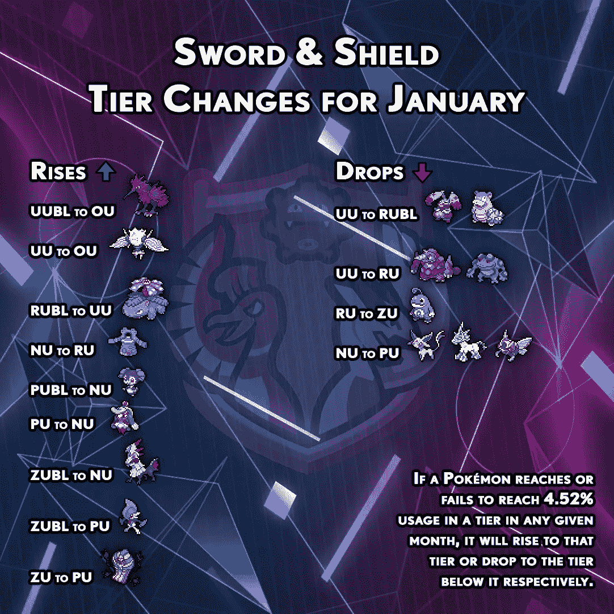

# 建立一个自动化的神奇宝贝评级机构:简介

> 原文：<https://medium.com/mlearning-ai/building-an-automated-pok%C3%A9mon-rater-introduction-a441d4f43edb?source=collection_archive---------4----------------------->

目录:
第一部分:你在这里
第二部分:[建立一个自动化的神奇宝贝评分者:性能比较和指标](/@mitchellnew_34118/building-an-automated-pokémon-rater-performance-comparisons-and-metrics-e58a4a1411e4)

随着数据科学变得越来越普遍，它不可避免地会进入视频游戏行业。我没有太多时间玩视频游戏，因为我年轻时责任更少，但神奇宝贝对我的第一个主要数据科学项目之一构成了一个随时可用的有趣的技术挑战。对我来说，神奇宝贝比大多数视频游戏更容易使用，主要有两个原因:

1.  其数据的关键定量方面(即单个神奇宝贝的统计数据)很容易通过快速的互联网搜索免费获得
2.  这是一款回合制策略游戏(幸运的是，与英雄联盟、[等实时游戏相比，它限制了游戏数据的复杂程度，然而大多数熟悉竞技神奇宝贝的人会理所当然地认为这款游戏本身就非常复杂](https://www.youtube.com/watch?v=71BG08fOEwg)

为了开始将这种复杂性降低到更易于管理的水平，我认为建立一个机器学习模型会很有趣，它可以告诉我们一个给定的神奇宝贝在竞争环境中有多强大。

事实上，神奇宝贝有点类似于国际象棋的[高度复杂版本，这并不意味着神奇宝贝更难，因为游戏对比赛双方的玩家来说都具有相同的复杂性。有竞争力的玩家与之竞争的是其他人类玩家。神奇宝贝有 898 种不同的生物(截止到《神奇宝贝传奇:阿尔宙斯》之前第 8 代的最新资料片),玩家可以从中选择加入他们的团队。此外，](https://www.youtube.com/watch?v=RbBJ_J89wso&t=54s)[每颗棋子可以走许多种棋路(与国际象棋中每颗棋子只能走几步相反)，神奇宝贝可以获得不同的状态条件来修改它们的属性，等等。为了给那些想深入研究这个项目但不熟悉游戏玩法的人一个关于神奇宝贝的充分的技术介绍，我们应该从阐明这个项目将遵守的限制以及神奇宝贝统计数据的最重要的方面开始。](https://www.youtube.com/watch?v=rhvj7CmTRkg&t=99s)

神奇宝贝的第一个重要方面，我们可以很容易地关注(因为它是静态的，即不变的)是 6 个主要的统计数据:生命，攻击，防御，Sp。atk Sp。Def 速度。

*   惠普决定了神奇宝贝在晕倒前可以承受的攻击伤害(一旦神奇宝贝晕倒，它就退出战斗)
*   攻击使用物理攻击增加神奇宝贝造成的伤害
*   防御减少神奇宝贝受到物理攻击的伤害
*   物种 Atk 使用特殊攻击增加神奇宝贝造成的伤害
*   物种防御减少神奇宝贝受到的特殊攻击的伤害
*   速度决定了每回合神奇宝贝先于对手的可能性

统计数据是决定神奇宝贝强弱的基础，所以我们制作的任何模型都可能会用到这些统计数据。

神奇宝贝类型是我们需要跟踪的另一个重要方面。你可以在上面的宝石海星图片中看到，上面用蓝色和粉色写着“水…通灵”(宝石海星有一种水通灵类型)。神奇宝贝可以有一种或两种类型，他们使用的每一种攻击也有一种类型。如果一个神奇宝贝的攻击类型与它使用的攻击类型相同，那么这个攻击会得到一个能量提升，使它对对手造成更多的伤害(这被称为刺——相同类型的攻击加成)。但是，神奇宝贝可以使用与其类型相反的攻击(也称为“招式”)；他们这样做只是放弃了动力的提升。每种类型的攻击对特定类型都是好的(意味着当它用来对付那些类型的神奇宝贝时会造成更多的伤害)，对特定类型很弱(意味着它造成更少的伤害)，对其他类型是中性的(意味着它造成正常量的伤害)。一些类型组合比其他的好得多，并且有重要的竞争优势，比如对某些攻击的免疫，许多抗性，额外的强力攻击等等。，所以我们应该考虑类型。

我们将使用的神奇宝贝的另外两个静态方面是神奇宝贝可以使用的能力和神奇宝贝可以学习的动作。上面宝石海星的统计数据的图片也有能力的例子:分析，照明和自然治疗，在宝石海星的情况下。每只神奇宝贝可以使用 1 到 4 种能力，但是在战斗中他们只能选择一种来使用。拥有更好能力的神奇宝贝有一个显著的优势，因为能力是被动的，这意味着他们在一个神奇宝贝上总是主动的，而不必在一个回合中主动使用它们。

另一方面，如上所述，在神奇宝贝战斗的每一回合中，神奇宝贝都会使用招式。一个神奇宝贝经常可以学习很多招式(100+)，这就增加了总结招式信息的难度。然而，神奇宝贝可以使用的招式从根本上决定了他们在战斗中可以做什么，他们在任何一场战斗中只能使用 4 种不同的招式(尽管他们可以在战斗中多次使用这 4 种招式)。因此，我们需要了解神奇宝贝可以使用哪些动作，并能够以某种方式衡量动作，以便准确地给神奇宝贝评级。

我还将具体针对 [Smogon 规则集](https://www.smogon.com/ingame/battle/smogon_tiers)来分析神奇宝贝(也许将来在其他规则集上做项目会很有趣，比如 VGC)。我们使用这种格式是因为它拥有迄今为止最多的可用数据，也因为我对它有些熟悉。规则集在上面突出显示的链接中有更多的解释，但简而言之，它是一个 6 对 6 神奇宝贝团队的格式，在任何给定的时间都有一个对一个神奇宝贝。它还有其他的限制，叫做[禁烟条款。](https://www.smogon.com/xy/articles/clauses)

那么给定上面的规则集和数据，预测什么是有用的呢？一个有用的东西是 Smogon 竞争分层系统。基本上，在 Smogon 分级系统中，神奇宝贝有多达七个竞争等级。如果一个神奇宝贝在竞技等级中被评为更高的等级，那么这个神奇宝贝就不能在任何更低的等级中玩(尽管它仍然可以在更高的等级中玩)。这样做是为了让竞争力不强的神奇宝贝也有机会在竞争力较弱的等级中玩。如果所有的神奇宝贝都可以在每一层玩，那么实际上只有几个神奇宝贝会被玩，因为它们比其他的更强大，游戏会变得无聊和陈旧。

在实践中，Smogon 确定哪个层中有哪些神奇宝贝的方法是使用非常以数据为中心的方法来统计给定层中神奇宝贝的使用情况。等级列表每个月进行一次小更新，每三个月进行一次大更新，以保持它们与当前统计使用情况的准确性。这种方式更准确，因为神奇宝贝可以有一个不断变化的元游戏，需要不断发展的战略。如果一个神奇宝贝在一个更高的层级中被使用得足够多，那么它将被移动到那个层级，如果它在当前层级中没有被使用得足够多，那么它可以被移动到一个更低的层级。如果一个神奇宝贝用得太多并且过度集中了元游戏，它也可以被禁止在当前层使用，这将导致它只能在更高的层使用。

BL added to a tier means that the Pokémon was on the banlist for the given tier, but not yet in standard usage for the higher tier

我将在这个项目中使用的七个等级如下(从最高到最低排序):OU(过度使用)，UU(未充分使用)，RU(很少使用)，NU(从未使用)，PU，ZU(零使用)

由于有如此多的神奇宝贝具有复杂的统计数据，并以不明显的方式相互作用，因此与国际象棋等游戏相比，人们对神奇宝贝的各个部分(即各个神奇宝贝本身)有很多兴趣。这些作品有多好？我们可以检查神奇宝贝的使用统计数据，结合他们的统计数据，并根据这些数据，反向预测神奇宝贝应该在哪个等级吗？神奇宝贝元正在发生变化，并且基于新策略的开发或计数器的使用频率而具有许多相互依赖性，因此该项目在任何给定时间都不会是层的完美衡量标准。除了高度复杂的深度学习或强化学习系统(或甚至更复杂的东西)，神奇宝贝和不断变化的元游戏之间的交互无法通过其他东西来现实地建模。给定层的大部分在大多数时候都是稳定的，因此它显然有些系统化，拥有一个比当前层提供更稳定测量的模型可能是有用的(因此我们的模型按照可能性的顺序测量更类似于“平均层潜力”，尽管有特定时间起点的偏差)。

[数据科学不是关于完美的](https://www.goodreads.com/quotes/108491-perfect-is-the-enemy-of-good)。更重要的是建立有用的预测模型。一组更合理的目标可能如下:

*   制作一个分类模型，可以预测神奇宝贝的竞争等级，具有足够的准确性，这对下一代神奇宝贝设计师来说可能是有用的。这些人包括神奇宝贝公司的员工，但也包括像 Smogon CAP 项目这样更随意的项目。只要我们知道这些神奇宝贝的属性、类型、能力和移动学习设置，我们就可以使用模型来大致预测它们将处于哪个等级，因为下一代很可能会非常相似。我们可以尝试不同的想法，我们希望神奇宝贝的功能是什么，然后看看我们是否喜欢这个模型所说的强大的结果。这将对神奇宝贝和功能的设计过程给予更多的控制，允许玩家和设计师更好地平衡或试验游戏的参数。
*   一旦我们有了这样一个模型，我们还可以检查它的系数或它的特征重要性，以了解哪些特征对于使神奇宝贝具有竞争力是最重要的，这可能比当前的等级列表更稳定，因为当前的等级列表往往会略有变化。这可能有助于有竞争力的神奇宝贝玩家更好地理解神奇宝贝的游戏，因为机器学习往往可以提供人类不明显的见解(假设我们可以有效地解释模型)。这对那些训练神奇宝贝的人也很有用，在某些情况下，这可能是一个非常耗时的过程，有大量的选择要缩小范围。如果你知道神奇宝贝的哪些功能可能更好培养，特别是当新一代还没有太多数据时，那么你就有了一个有用的指南，可以根据模型在预测更具竞争力的神奇宝贝时对哪些功能进行优先排序。

上述目标，加上其他一些重要的考虑因素，将有助于定义该项目的更多范围和约束。

*   我们将在《神奇宝贝》第八代的框架下工作。这一代人拥有最多的可用数据，拥有最多的可用神奇宝贝(也给了我们最多的可能数据)，并将比前几代人更接近任何未来的一代人。这将增加模型的准确性和适用性，尽管它不会对前几代有效(但无论如何这是不太相关的)。
*   神奇宝贝的所有非静态的、非内在的特征，如进化者、进化者、自然和物品都不会被直接考虑。这些东西与用来使它们更强大的神奇宝贝不同，而不是它们的内在能力，尽管神奇宝贝与它们的协同作用(特别是物品)可能对一些神奇宝贝产生不相称的影响。这必须在分析中加以考虑。
*   我们将只使用我提到的标准 6v6 Smogon 7 层。像“任何东西都可以”、“国家指数”和其他任何非标准的层级都不会被考虑，因为这些层级超出了规则和标准化的一致框架。这个框架对这个项目很重要，因为我们拥有的数据主要是在那些标准规则的上下文中，在它之外就失去了适用性。此外，我们很大程度上不必考虑像“Mega”和“Dynamax”这样的形式变化，这将使项目变得非常复杂，因为它们存在于第 8 代的标准 Smogon 规则之外，并且很难用机器学习模型来表示。大型表单处理我们不会考虑的项目，因为它们不是神奇宝贝的静态特征。Dynamax 对属性和移动有复杂的影响，并且只能持续几个回合。一个更先进的未来项目可能会考虑到这种形式的变化。
*   由于最低层的 ZU 并不是 Smogon 网站上的实际评级，我们需要首先决定哪些神奇宝贝属于那里。这些神奇宝贝被贴上了“未进化”的标签，但也有被贴上“NFE”(未完全进化)和“LC”(小杯子)的。NFE 和 LC 神奇宝贝不是完全进化的神奇宝贝，也不在更高的竞争等级中。因为这使得他们比所有竞争层都低，所以他们自然属于这个项目的 ZU(最低层)。它们很难相互比较，所以无论如何也不容易将它们放在各自的层中，因为层次结构并不简单。
*   Banlist Pokémon 可能不应该包括在他们当前的等级中，因为他们被认为太强大了:把他们放在上面的等级会更有意义，因为他们实际上可以在那里使用。这就是过度使用的工作方式(Ubers，最高层，是过度使用的 banlist)，这种层从 banlist 转移到下一个最高层[通常被网站](https://www.smogon.com/articles/tier-shifts)视为微不足道。
*   也可能是特征的组合，而不是单个特征，赋予了神奇宝贝竞争力，所以我们需要一个模型来很好地衡量这些特征的组合。这可能意味着类似随机森林的东西，或者可能意味着以有意义的方式将功能分组在一起的功能工程，这可能需要研究神奇宝贝扮演的不同竞争角色，以便可以设计出好的功能。

敬请关注本系列的更多文章！我计划很快再写几篇，随着更多内容的产生，我可能会用一个目录来更新这篇文章，以便更容易地在文章之间导航。下一篇文章将是我的神奇宝贝数据科学/人工智能项目与其他现有或可能存在的项目之间的比较(在性能和目标方面)。

 [## Mlearning.ai 提交建议

### 如何成为 Mlearning.ai 上的作家

medium.com](/mlearning-ai/mlearning-ai-submission-suggestions-b51e2b130bfb)