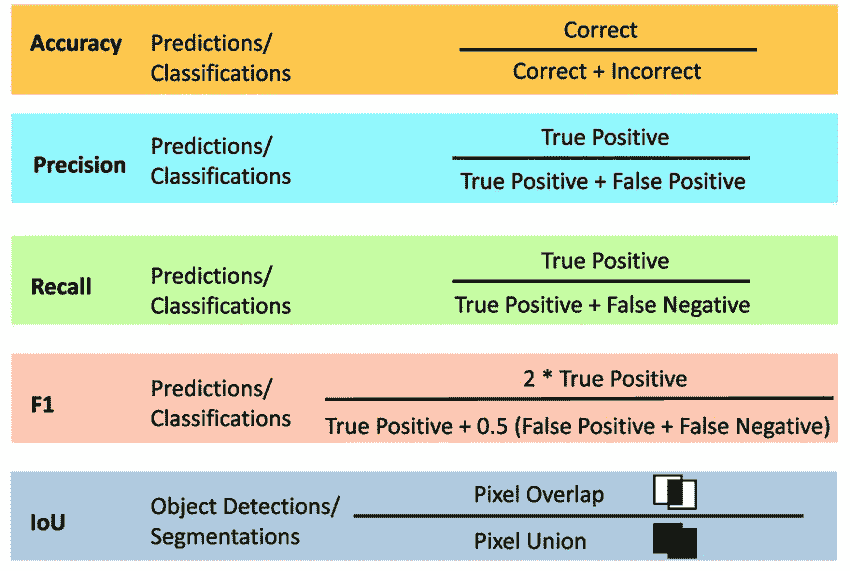
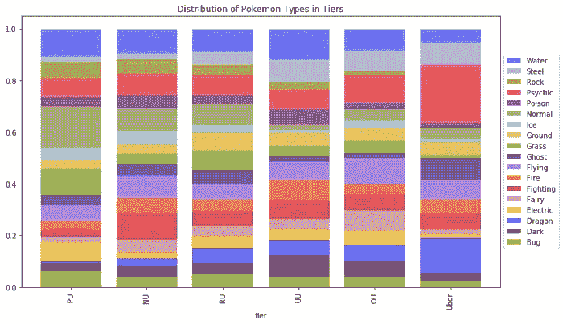
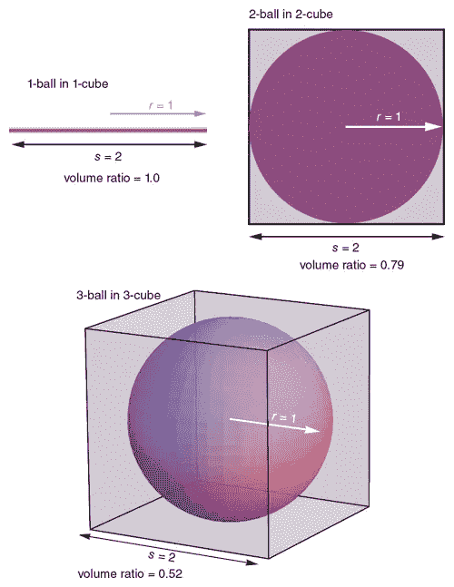
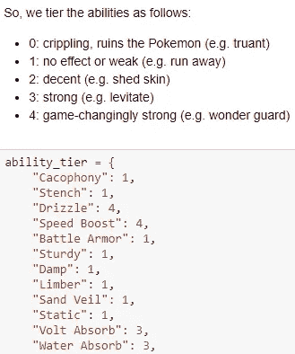
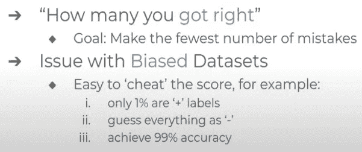
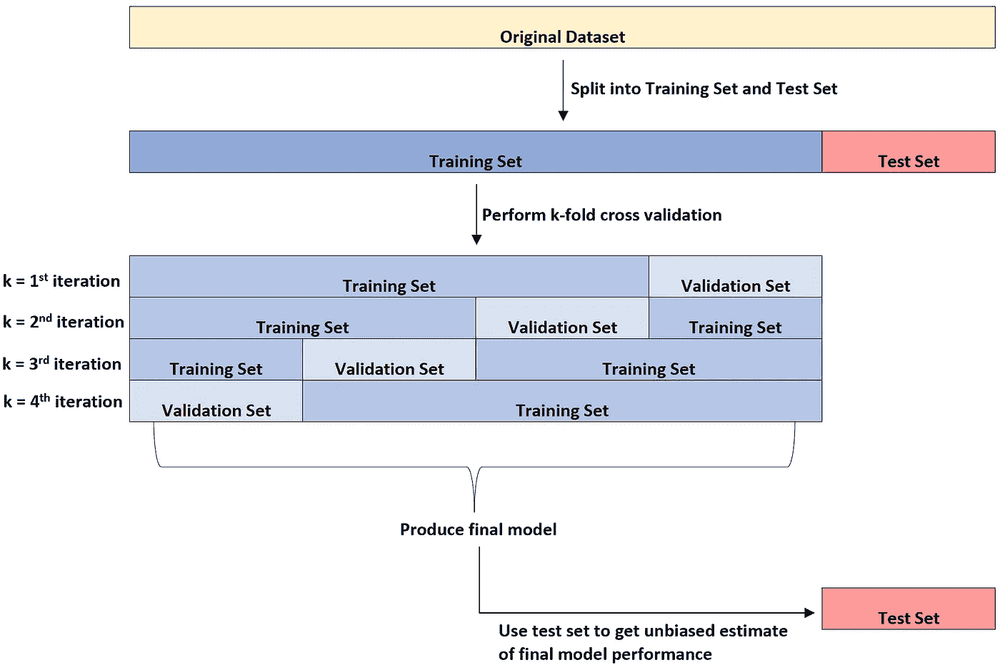
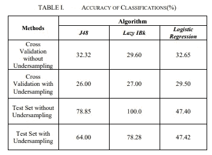
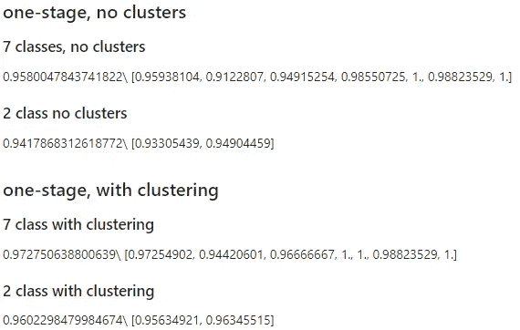

# 建立一个自动化的神奇宝贝评分者:性能比较和指标

> 原文：<https://medium.com/mlearning-ai/building-an-automated-pok%C3%A9mon-rater-performance-comparisons-and-metrics-e58a4a1411e4?source=collection_archive---------5----------------------->

目录:
第一部分:[建立一个自动化的神奇宝贝评分者:简介](/mlearning-ai/building-an-automated-pokémon-rater-introduction-a441d4f43edb)第二部分:你在这里

在本系列的第一篇文章中，我们介绍了神奇宝贝的核心方面，这些方面与构建一个预测神奇宝贝的 Smogon 竞争等级的自动化神奇宝贝评级器相关。已经完成了一次任务，相对于其他尝试和方法，我们的表现如何？这篇文章比我预想的要长，为此道歉。然而，我认为这个长度值得对整个问题进行全面的文献综述。

到目前为止，当我试图理解我的模型执行得有多好时，我遇到的这个任务只有几次尝试，这是一个迹象，表明有多少潜在的改进空间。[我遇到的第一种方法有一个可爱的页面，其中他们解释了他们在尝试我们的共同任务时学到的经验教训。](https://nicholasvadivelu.com/2018/09/06/competitive-pokemon/)

This chart belongs to [Nicholas Vadivelu](https://nicholasvadivelu.com/), I am just promoting it for illustrative purposes

这种方法有点可悲，原因我将很快解释，但尽管如此，我认为他们有一些真正令人印象深刻的见解。人们注意到，类型按层的分布(正如您在上面的图表中所看到的)具有误导性。看起来龙和通灵型神奇宝贝比其他的要强大得多，因为在优步等级(最高等级)中有这么多。然而，特别是传说中的神奇宝贝通常是通灵和/或龙的类型。由于传说中的神奇宝贝往往比一般人更强大，他们在高层出现的频率更高，如 Ubers 这就是为什么在像优步这样的高层有如此多的这类人。这说明了数据科学的两大原则:

1.  我们不应该只从表面上看我们的数据可视化，而应该把它们作为起点来学习关于我们数据的更精确的见解
2.  相关性不是因果关系！(例如，优步等级与大量灵媒和龙神奇宝贝之间的关联是**而不是** be **原因**灵媒和龙神奇宝贝本来就如此强大，但因为它们在传说中的神奇宝贝中更常见，而传说中的神奇宝贝往往更强大)

This chart belongs to [Nicholas Vadivelu](https://nicholasvadivelu.com/), I am just promoting it for illustrative purposes

他们注意到，基本属性总数可能是最重要和最明显的属性，可以近似表示神奇宝贝的实力和各层的相对实力，正如上面右图所示。在我的项目中，我还发现统计数据是判断神奇宝贝实力的最重要的方面。当然，仅仅基于统计数据的模型并不能告诉我们太多，因为我们已经可以通过统计数据对神奇宝贝进行分类，显然还有许多其他方面使它们或多或少具有竞争力。他们注意到了两件我没有注意到的事情:

1.  他们使用异常分析发现，14 个神奇宝贝的基础统计总量与其分类层的平均基础统计总量相差超过 2 个标准差。根据图表，这些似乎完全在 PU 和 NU 层(最下面和最右边的两个框，它们的上面和下面有小的异常点)，所以我认为这给出的洞察力是非常有限的。然而，像这样应用异常分析的想法是很棒的
2.  每个属性不同的箱线图可能揭示了每一层使用的不同战术。举例来说，攻击和特殊攻击在等级中的比例很好，但是在 UU 和 NU 中的防御属性比它们相邻的等级要低(表明在 UU 和 NU 中可能会有更具攻击性的打法)

我们还分享了使用堆积条形图而不是饼图的见解，因为堆积条形图在比较方面要好得多。在饼图中，很难区分大小相似的类之间的差异，但在条形图中，您可以清楚地看到哪些条形图较大，因为条形图以更有组织的并排方式进行比较，即使只有很小的差异:

Stacked Bar Chart: It’s Easy to See the Small Difference

与我的方法的另一个主要区别是，他们将任务框定为回归(根据回归的连续结果间接分类)。当我测试各种模型时，我在工作中短暂地尝试了回归，但发现结果非常不准确，与我使用的分类模型相比，系数毫无意义，所以我选择了更直接的分类方法。尽管如此，我相信他们处理回归任务的方法显示了很大的洞察力，如果有人想尝试制作一个自动化神奇宝贝评级器的回归版本，那么他们应该遵循 Vadivelu 先生概述的方法的两个主要洞察力:

1.  他们应该使用乘法 sigmoid 函数或类似函数将结果从 0 转换为 n-1(其中 n 是层集的基数)。给出同样有界的回归结果是一个聪明的想法。
2.  他们应该通过 MAE(平均绝对误差)而不是 MSE(均方误差)来测量回归误差。MSE 在更大程度上惩罚更大的错误，但这对我们的任务并不重要。层与层之间没有具体的距离概念，因为层确实是离散的，所以惩罚较大的错误可能没有意义。MAE 倾向于产生更好的分类准确性，因为它将所有错误同等地视为错误，在本例中就是这样。

然而，基于我自己在分类方面取得的更大成功，以及各层之间没有具体距离的事实(正如我在上面比较 MAE 和 MSE 时已经提到的)，我倾向于认为分类比回归更适合这项任务。尽管如此，这仍有待严格测试。

之前，我提到了这种方法的一些可悲之处，可悲之处在于这种方法在任务开始之前就放弃了！

> 最终，这个问题不适合机器学习。本质上，特征空间太大，特征之间的交互太复杂，对于给定小训练集的模型来说难以学习。换句话说，有很多神奇宝贝在他们特定的层，因为他们的类型，能力，移动和统计数据的一些独特的组合，与该层的其他神奇宝贝非常不同。

我的方法，以及其他一些研究人员的方法，能够取得值得注意的结果，所以我认为这位研究人员不幸地放弃得太早了。我认为他们正在犯的错误是通过完美主义的视角来看待数据科学(正如我在第一部分中警告的那样)。这种完美主义经常导致分析瘫痪和失败主义的态度。一个机器学习模型不可能完美地(或接近完美地)预测像神奇宝贝竞争等级这样复杂和动态的东西，这并不允许我们得出结论，这项任务不适合机器学习。我们必须尝试更有创造性和更抽象的方法，因为很明显，有竞争力的神奇宝贝玩家有一些更容易掌握的方法来衡量一个神奇宝贝相对于其他人的竞争力。我希望他们在方法上更进一步，因为理解回归模型在这项任务中的表现是有意义的。

另一位研究人员(Poortho)的这种方法能够在任务中取得进一步进展，并且也注意到了一些关键的见解。总的来说，他们取得了真正的成果，这表明他们没有屈服于与前一种方法相同的数据科学完美主义，但第二种方法在几个方面也更粗略和粗心。这限制了我们从中可以学到的东西，但也提供了一些警示故事。

Poortho 将为 Pokémon rater 开发功能的任务细分为与我们在引言中所做的完全相同的四个部分:统计(HP，攻击，防御，特殊攻击，特殊防御，速度)，打字，能力和移动。他们还采取了明智的方法，将他们使用的各种特性“正常化”。对于某些算法，尤其是那些基于距离而不是基于树的算法，重要的是对特征进行“归一化”,以使它们的值落入相同的数值范围内。如果我们不“归一化”，那么分类器会错误地将较大尺度的要素加权为比较小尺度的要素更重要(这会削弱较小要素的重要性，并导致它们被错误地忽略)。最后，Poortho 确实尝试使用了一些模型，但他们最成功的是 LinearSVC 和 SVC(支持向量分类器),它们实际上是基于距离的，所以这一标准化步骤是至关重要的。

Poortho’s Way of Summarizing Type Information for each Pokémon

起初，他们对类型进行普通编码，但 Poortho 很快意识到这种策略的荒谬性(基本上是说，有些类型在层次上比其他类型更好，没有任何理由，混淆了您制作的任何模型)。他们在处理类型时的最佳准确性发生在他们添加一些列来汇总类型信息时，如上图所示。起初，他们试图将这些类型的汇总信息作为一次性编码的列包含进来，但是同时包含所有这些信息实际上会降低准确性。这是因为维度的[诅咒](https://towardsdatascience.com/on-the-curse-of-dimensionality-b91a3a51268):在我们的数据集中包含太多的特征(即列)，如摘要和正在摘要的内容，导致模型过度拟合，从而泛化能力很差(因为特征的数量变得更接近我们数据中的观察值/行数)。这也导致模型[更难测量观察值如何聚集在一起，因为所有的观察值开始显得更加等距](https://towardsdatascience.com/the-curse-of-dimensionality-50dc6e49aa1e)。

More About This Curse of Dimensionality Problem: [https://www.americanscientist.org/article/an-adventure-in-the-nth-dimension](https://www.americanscientist.org/article/an-adventure-in-the-nth-dimension)

换句话说，我们的数据越高(观察/行比特征/列多)，我们的机器学习模型就越容易从给定的特征中学习。因此，我们必须在包含足够的信息特征和不包含增加维数灾难而不增加预测能力的非信息特征之间进行平衡。广泛的数据是我们在构建一个自动化的神奇宝贝评分者时要处理的关键问题之一。每一个神奇宝贝都有如此多的数据(近 20 种类型，100 种能力和近 1000 次移动)[如果我们不以少得多的特征来总结这些信息，那么我们将有比神奇宝贝更多的特征来分类，削弱我们的机器学习模型](https://machinelearningmastery.com/how-to-handle-big-p-little-n-p-n-in-machine-learning/)。

对于神奇宝贝类型的数据，Poortho 有一个很好的解决方案来减少数据的宽度:只包括类型摘要信息，并删除每种类型的所有杂乱的 one-hot 编码列，从而实现更好的准确性。我们会用类型做一些和 Poortho 非常相似的事情，但是 Poortho 对能力和移动的解决方案是脆弱的和不太有效的。起初，他们只是在意识到这些能力也不能正常编码后才删除它们，但后来他们决定根据作者的观点给这些能力从 0 到 4 的等级。

然后，他们可以只创建一个单一的功能(栏)，给每个神奇宝贝一个能力评级的基础上，他们最强的能力。这解决了大量数据的问题，但以一种相当随意的方式，它表明:以这种方式包括能力的准确性增加了不到 1%(几乎没有意义),尽管能力是神奇宝贝强大的关键因素。对能力进行评级似乎仍然是特性工程的一个非常聪明的策略，所以我们将采取类似的方法。然而，考虑到关于能力的竞争数据的数量，我们应该试着用一种更数据驱动的方式来评价它们，更符合 Smogon 精神。

他们处理招式的问题是他们根本就没有使用招式！

> 如前所述，在决定口袋妖怪的竞争生存能力时，口袋妖怪的移动池关系到*很多*。例如，如果一个口袋妖怪只知道溅水(它什么也不做)，他们可以在每个属性上有 200，但仍然很糟糕。不幸的是，我们当前的数据中实际上没有移动池，因此我们需要从其他地方获取数据。Smogon 确实有每个口袋妖怪的移动池的数据，但据我所知，这只是在为每个口袋妖怪指定的页面上可见。我们将不得不分别抓取每一页，导致大约 1000 个请求，这可能不是最好的主意。还有如何实际使用 movepool 的问题。正如我们在能力方面看到的，主观评定移动池可能不会非常有效。此外，移动池甚至比能力更复杂！我想不出一个好方法来将 movepools 合并到我们的数据中，因此**将把它作为一个练习留给读者**(哈！).

这个“读者练习”是我们将在接下来的几篇文章中解决的一个问题；关于神奇宝贝的移动信息对于理解其竞争生存能力至关重要，任何跳过移动信息的方法都将受到严重限制。幸运的是，收集移动信息并不像 Poortho 想象的那么困难，尽管它确实需要注意一些可能容易错过的东西(我们需要查看 Smogon“strategy dex”页面上的“查看页面源代码”,但在下一篇文章中会有更多关于这方面的内容)。

A set of Starmie’s moves from Smogon shown in the previous article

这项任务的另一个方面是我们必须决定的:我们如何构思和组织这些层？正如我在介绍中所概述的，我们将使用一个 7 层系统(我认为这是一个在拥有很多类和没有太多类之间的很好的平衡)。Poortho 一开始用了 15 个类:“LC”、“LCBL”、“NFE”、“不知疲倦”、“普”、“普布尔”、“努”、“NUBL”、“茹”、“RUBL”、“UU”、“UUBL”、“欧”、“优步”、“AG”。如你所见，他们不仅有大量的类，而且他们甚至将“BL”(banlist/borderline)层作为单独的类。问题是这些通常都很小，它们并不是真正独立的官方层级。考虑到神奇宝贝的数量已经很有限(最多不到 900 个)，而且班级规模已经非常不平衡，建立一个可以正确分类 15 个班级中大多数班级的模型很可能是不可能的。

事实上，对于 15 个类，它们的准确率低于 50%，许多较小的类几乎没有正确分类的，因为该类的示例太少，模型无法了解任何重要信息。例如，我们可以从他们的错误报告中看到，大量的神奇宝贝被错误地归类到“未分类”类别中。这是因为“未分类”类别比大多数其他类别大得多，所以如果模型只是盲目地猜测“未分类”更频繁，那么它将有更高的机会是正确的，而不必做太多的辨别。这给这个项目带来了一个更大的问题:使用**精度**作为算法性能的度量。

Definition and Problems with Accuracy

准确性是一个简单易用的度量标准，用于衡量算法的执行情况，但当数据集不平衡时，它的效果会很差。在 Poortho 使用的 15 个类中，像“LC”和“Untiered”这样的层是巨大的，有数百个例子，而像“PUBL”和“UUBL”这样的小类只有不到 20 个例子。甚至更标准的层，如“NU”和“RU ”,相对于最大的类来说也很小。因此，当构建一个模型来优化准确性时，该模型可以简单地猜测最常见的类，比它们真正出现的次数多得多，并且在大多数情况下它仍然是正确的，因为这些类比其他类包含更多的神奇宝贝。仅仅使用猜测最常见的类比它们实际出现的多得多的明显无用的策略，分类器可能具有看起来相当不错的准确性(即使分类器由于其盲目的策略而在实践中没有什么价值)。正如我提到的，在模型的错误猜测中,“Untiered”和“LC”经常出现，所以模型似乎就是这样失败的。[这个链接视频简要解释了为什么 F1 分数是一个更可靠的指标，用于我们的模型，不能基于无用的策略欺骗](https://www.youtube.com/watch?v=8d3JbbSj-I8)，所以 F1 分数是我们将在我们的项目中使用的。

Poortho 敏锐地注意到了层基数的问题，将层基数降低到了 3:“LC+NFE”，“Untiered+PU+NU+RU”，“UU+OU+优步+AG”。所以基本上他们只有 3 个等级:没有完全进化的神奇宝贝，有点弱的神奇宝贝和非常强的神奇宝贝。这大大提高了精确度，但由于以下几个原因，这不是一个充分解决方案:

1.  他们还增加了一个关于神奇宝贝是否完全进化的数据栏。由于几乎所有没有完全进化的神奇宝贝都在 LC 或 NFE 层，它们将被归类为“LC+NFE ”,而模型不必学习任何重要的东西。这给了没有任何洞察力的人为夸大的准确性。这也使得最低的类几乎没有意义，因此它基本上被转换为精度填充的 2 类问题:2 类问题基于 LC+NFE 类获得了无偿的精度优势，LC+类基本上通过数据列被告知正确的答案，而模型不必从统计、打字或能力中推断出几乎任何东西。
2.  一个 2 类问题要简单得多，代价是信息量少得多。如果我们只知道一个神奇宝贝相对较弱或相对较强，那么它不会给神奇宝贝设计师(正式或非正式)任何精确的东西来设计神奇宝贝。
3.  增加 F1 分数(或所有类别的 F1 分数的加权平均值)比增加准确度更有意义，因为准确度对于不平衡的类别来说通常是相当误导的。

尽管有这些问题，我认为 Poortho 注意到了这个项目的另一个非常有用的目标:

> 竞技游戏的一个问题是元游戏需要一段时间才能稳定下来。也就是说，当引入新的神奇宝贝时，元游戏需要一段时间来适应新神奇宝贝的存在。例如，Game Freak 刚刚发布了神奇宝贝剑与盾的附加内容，名为“盔甲之岛”，该内容将许多新的神奇宝贝引入游戏，导致竞争场景相当不稳定。像这样的工具将有助于加快这一调整期。使用这个工具，人们将能够确定一个新的神奇宝贝的相对实力将相对容易，导致一个更稳定的竞争场景和更健康的元游戏整体。

福特汉姆大学的学术研究者德文·纳瓦斯和迪伦·多诺霍提出了另一种方法。这是所有方法中最简单的一种，但是它展示了几个要点，并且有非常奇怪和容易被忽略的方面，所以我将很快介绍一下。

他们只用了 4 个特性:个体属性(技术上是 6 个特性，但只是一个概念)，基础属性总数(所有 6 个属性加起来)，类型弱点的数量，类型抗性的数量。虽然我喜欢这种方法的简单性，但我们可以很快看到它的局限性:它一直错误地将神奇宝贝归类为 Ditto、达摩狒狒-Galar 和 Mimikyu，远远低于它们应有的水平，因为它们在四个使用过的功能中不是很好。相反，是他们的能力和动作让他们变得和他们一样优秀。这非常具体地说明了为什么我们需要能力和移动信息来总结和表示到模型中。

This Pokémon obviously isn’t competitively viable because of its stats or typing!

也就是说，统计和类型信息仍然可以告诉我们很多:Fordham 模型在涉及到像 PU 这样的较低等级和像这样的最高等级时往往更加准确，因为它们更加明显，往往几乎总是对应于极高或极低的统计(但并不总是如此！).对于我们的模型，我们还将在更极端的类别中看到更好的评级(即高端的“优步”和低端的“祖”)。然而，福特汉姆的研究人员在使用准确性作为评估模型的方法时犯了与普尔托相同的错误，因为准确性对于涉及严重不平衡的类别的任务来说是不可靠的。他们也使用了精确度，但是 F 分数更理想，因为它平衡了召回率和精确度的极端情况，使得它更难被利用。

这种不平衡的等级问题由于包括了不必要的等级而进一步恶化:Ubers、过度使用(OU)、未充分使用边界(UUBL)、未充分使用(UU)、很少使用边界(RUBL)、很少使用(RU)、从未使用边界(NUBL)、从未使用(NU)和部分使用(PU)。这是 9，这不是一个不合理的数量，但它仍然包括那些“商业智能”层，这些层的例子非常少，以至于它们实际上无法通过模型以一致的方式学习(它们本身也不是有意义的元游戏)。这些类别的准确率通常很低，这是可以理解的，除了一个算法有多个可疑的结果，我们将很快讨论。

他们只用了 297 个神奇宝贝来完成这个任务。即使是 700+(正如 Poortho 和我所使用的)也不是一个大的数据集，所以我不确定他们为什么将神奇宝贝数据集的大小减少到 297。此外，他们使用的数据集也不透明，所以重复与他们的实验非常相似的东西是不可能的。

他们分别用 10 倍交叉验证和测试集来尝试策略。测试集策略似乎具有更高的准确性，这是有意义的，因为 10 倍交叉验证在这种情况下实际上不起作用。由于不到 300 个神奇宝贝和高度不平衡的职业，许多职业几乎没有实例。交叉验证对这些类几乎没有用，10 倍交叉验证得到的更差的结果支持了这一论断。如果我们使用交叉验证，我们应该使用更少的“折叠”，这样我们就可以从每个类别中获得足够大的代表性样本，从而在不同的折叠之间具有真正的一致性。

A visual example of how cross-validation and testing sets should be used together. You should not only use one or the other! Otherwise we can’t get an unbiased estimate of performance.

也很难理解为什么他们只对一些方法使用交叉验证，而对其他方法只使用一个测试集。这些策略可以很容易地一起使用:交叉验证通常在模型的训练期间使用，而测试集严格地不在训练期间使用，而是用模型以前从未见过的数据来检查性能。事实上，他们甚至没有在交叉验证的例子中使用测试集，这意味着我们不知道这些模型将如何推广到看不见的数据，这让我更加担心他们在有测试集的例子中没有正确使用测试集。

Accuracy table for the Fordham paper (with some suspicious results like 100.0…)

使用最近邻算法(Lazy IBk)和测试集，研究人员报告了 100%的准确性！如果我们相信，那么任务应该完成，因为它或多或少完美地解决了。没有理由再浪费我们的时间去研究它了。然而，就连研究者自己也不相信:

> 使用没有欠采样的测试集的运行对于 J48 和 Lazy IBk 具有最高的精确度，尽管我们认为这可能是过度拟合的结果，正如 Lazy IBk 对这个集的运行具有 100.0%的精确度所证明的那样…
> 
> Lazy IBk 在这次运行中的准确率为 100.0%，我们认为这是过度适应训练集的结果，因此我们决定认为这个结果是错误的(表 1)。

我们在机器学习中使用测试集的原因是，看看我们的模型在数据上的表现如何，这些数据是模型没有训练过的，也是从未见过的。如果我们只看到一个模型在对它已经看到的数据进行分类时表现如何，那么我们就不知道它会对看不见的数据表现如何。很容易让一个模型在训练中有很高的表现，但它却过度拟合，在测试数据上表现很差，因此毫无用处。因此，模型在训练中的表现不能被认为是模型总体表现的良好指标，机器学习研究人员通常对此非常重视。

Overfitting is what we see in the right side picture: a function is trained and grotesquely contorted to get all the training examples right, but it doesn’t approximate the true shape of the function and thus will likely perform much more poorly and unpredictably on unseen data. The “noise” overtakes the signal. We want something more like the middle picture, which prioritizes the general signal instead of perfecting replicating the “noise”.

虽然我很欣赏福特汉姆的研究人员承认他们的 100%准确率结果有些奇怪，但他们的说法在测试集通常如何用于机器学习实践方面没有意义。例如，他们要么给我们测试集的精度，要么给我们训练集的精度。如果他们在测试集上给出了精确度，那么在训练集上过度拟合不应该有问题。即使模型在训练集上过度拟合，它以前也没有见过测试集，因此测试集准确性仍然应该是其性能的有效指标(而不是错误)。如果他们给出的是训练精度，那么 100%的性能更有意义(很容易将模型与噪声相适应，这样它就可以正确地对所有训练示例进行分类)，但是它并不能告诉我们模型的真实性能。

由于他们承认这个 100%的准确性是错误的，并且它来自于过度拟合，那么他们似乎犯了一个错误，记录了模型在训练数据上的准确性，而不是它在测试数据上的准确性(或者，他们必须在测试数据上训练模型以进行过度拟合来影响结果，这也是不正确的做法)。不幸的是，对于真实的模型性能来说，这使得它们的所有准确性都不可信，因此不太能提供信息。由于他们还使用了不到 300 个神奇宝贝的精选、不透明的数据集(GitHub 存储库中也没有透明代码)来完成这项无法在实验中重复的任务，他们的结果通常不可信。

My F-Score training results for KNN. The left-most value in each row is the overall performance (don’t worry about the rest for now). As you can see, I got nearly 100% accuracy in training for one model, but this is not meaningful since the model is just overfitting to training data. The results on the test set were not so perfect.

我也在我尝试的模型(KNN 和随机森林)的训练数据上获得了 100%(或非常接近 100%)的准确性，但我认为这些训练准确性是不可靠的，并且没有报告它们代表我的模型在看不见的数据上的真实性能。[对于逻辑回归，我的模型在训练期间甚至表现得不是特别好，这就是在福特汉姆论文中发生的情况(在我链接的 Jupyter 笔记本的分数摘要和表现结果部分中显示)。所有这些相似之处进一步表明，福特汉姆的研究人员使用的是训练准确性，而不是测试准确性。](https://github.com/MZNewman/Springboard/blob/main/SecondCapstone/Modeling_LR.ipynb)

My F-Score training results for Random Forest (a decision tree ensemble model). The left-most value in each row is the overall performance (don’t worry about the rest for now). As you can see, I got nearly 100% accuracy in training for multiple models, but this is not meaningful since the model is just overfitting to training data. The results on the test set were not so perfect.

最终，我们只能通过在一个测试集上测试我们的模型的性能来知道我们的模型执行得有多好，而这个测试集是模型从来没有训练过的(所以再多的过度拟合也不能掩盖最终的性能)。尽管如此，我认为福特汉姆方法展示了一些重要的原则，这些原则将有助于我们继续前进，了解背景中的结果是很重要的。

请尽快收听一篇关于我如何为这个项目收集数据的短文！我们还将讨论关于清理它的最困难的部分，以便它可以或多或少地被容易地复制。祝你一周愉快！

 [## Mlearning.ai 提交建议

### 如何成为 Mlearning.ai 上的作家

medium.com](/mlearning-ai/mlearning-ai-submission-suggestions-b51e2b130bfb)