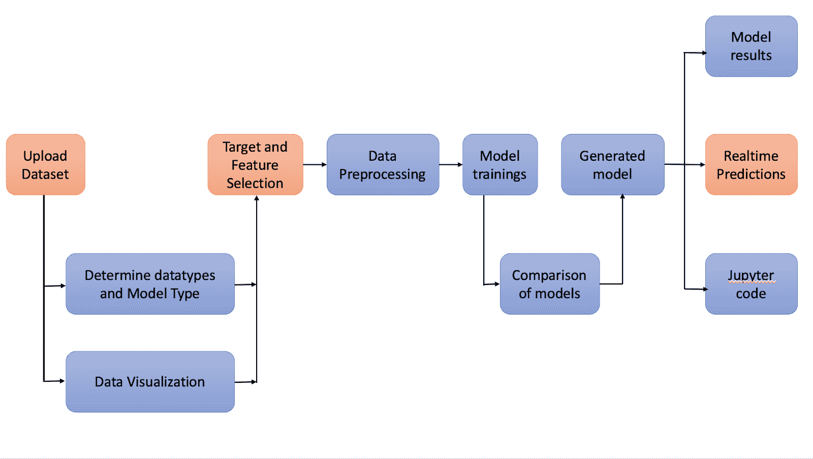
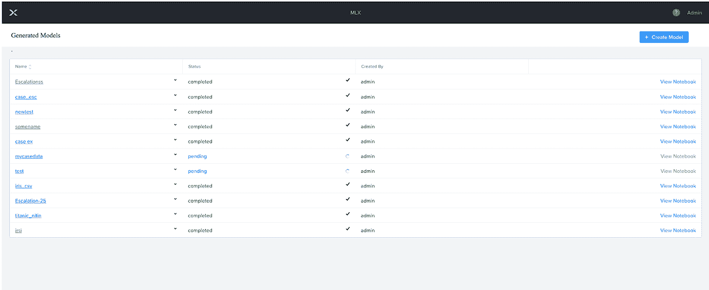
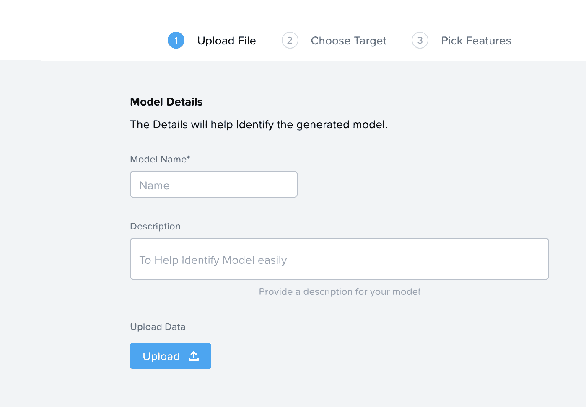
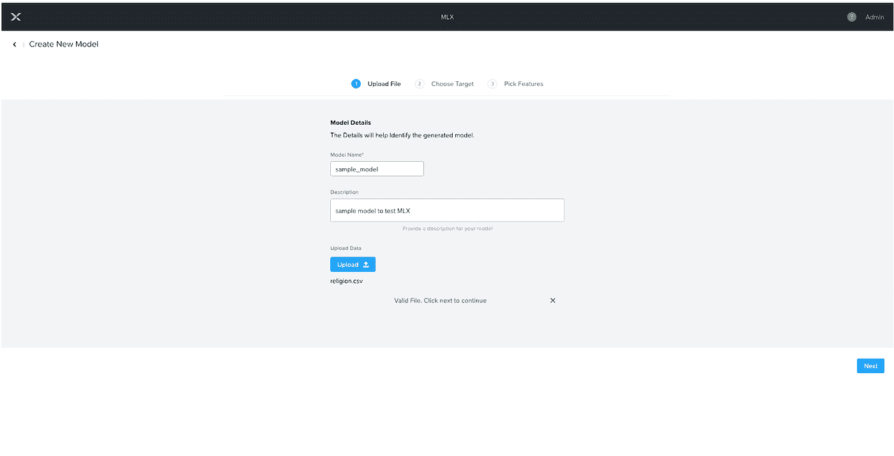
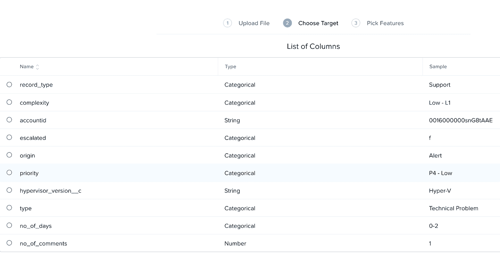
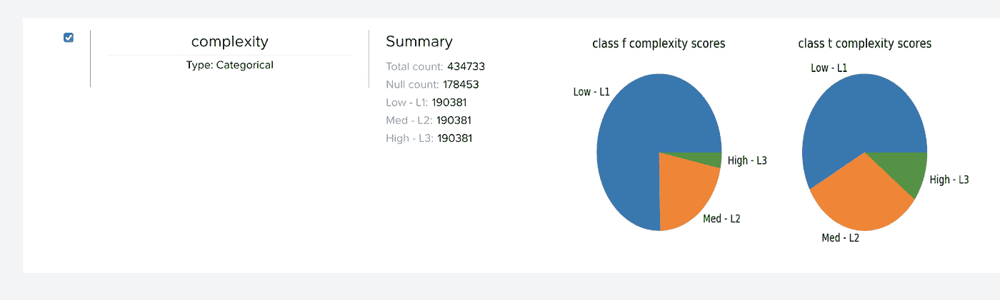
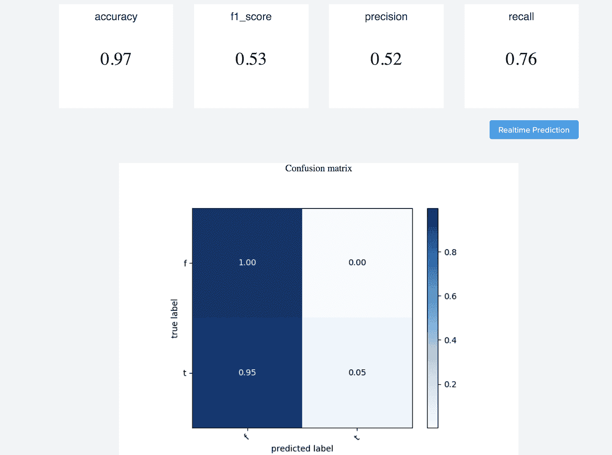

# 构建 AutoML 工具

> 原文：<https://medium.com/mlearning-ai/building-an-automl-tool-4a5435be844e?source=collection_archive---------4----------------------->

# 什么是 AutoML 工具？

这些工具旨在自动化机器学习模型开发的耗时、迭代任务。它允许数据科学家、分析师和开发人员构建具有高规模、高效率和高生产率的 ML 模型，同时保持模型质量。

# 为什么我们需要构建自己的 AutoML 工具？

现有工具有某些缺点:

1)几乎所有的 AutoML 工具都是**黑盒**。用户根据提供的数据进行预测，但永远无法理解生成的模型或训练和选择最佳模型的过程。用户没有关于模型的信息，因此无法对它们进行微调。

2)另一套工具**需要很高的机器学习专业知识**。这些要求用户选择算法，也选择超参数。超参数的选择是高度劳动密集型的，容易出现人工错误，甚至对计算机科学家来说也是困难的。

您可以构建自己的工具，以最少的努力训练高质量的定制监督机器学习模型，并且可以由任何人使用，不管他们的 ML 专业知识如何。

*   该领域的初学者可以在 ML 上快速起步，只需点击几下鼠标，就可以生成高效、准确的数据定制模型。
*   ML 专家可以使用他们的数据科学和领域知识，在工具提供的数据可视化的帮助下，手动进行特征选择。生成的代码可以提供给用户，以便他们可以改进模型并对其进行调整，从而改进预测。

# 很酷的东西！但是怎么做呢？

首先选择实现语言(最好是 Python，因为它提供了大量的 ML 库)。对于数据库，PostgreSQL 是首选，因为它是专门为处理大型数据集而设计的领先关系数据库之一。Postgres 还支持 NoSQL 数据，比如 XML、JSON 和 HStore。

*   为用户提供上传数据文件和选择目标列的功能。
    由于文件会很大，你可以使用亚马逊 S3 来存储上传的文件，并将其路径存储在你的数据库中。
*   为了向用户提供所生成模型的实际工作代码，在进行数据预处理和模型生成的同时，您可以在内存中生成他们的代码，然后保存到 [*Jupyter 笔记本*](https://jupyter.org/) 中。
*   为了决定模型类型(回归或分类)，为目标的唯一值保留一个阈值。
*   您还可以提供每个列(输入变量)相对于目标的数据可视化(条形图/饼图/散点图)、数值数据的集中趋势测量、分类数据的计数等，以帮助用户选择**。**
*   *现在到了有趣的部分，**模型生成**:你可以训练、测试和评估多个模型，以确定得分最高的模型，然后将其标记为最终生成的模型。**模型生成和超调参数**是该过程中最关键的方面。一些可以帮助你变得更聪明的算法有:*

> *网格搜索:一种优化方法，在超参数空间的指定子集中搜索所有点，以确定最佳解决方案。*
> 
> *随机搜索:这是一种有效的变体，它为超参数的随机组合建立模型，以找到最佳组合。*
> 
> *遗传编程:它基于达尔文的进化理论，机器测试简单的算法，最成功的算法在新一代中孕育。*

*   *因为模型生成是一个耗时的过程，同时，你可以让用户分析、提炼和摆弄已经生成的模型。*
*   *一旦完成，你可以将这个*最终模型*提供给用户在上面做 ***实时预测*** 。*

**

*Fig: Data flow diagram of the process*

# *模型生成的逐步指南*

*对于实际的模型训练，您可以遵循下面提到的步骤，同时将每个步骤的 Python 代码添加到 Jupyter 笔记本代码中。*

*   ***第一步:数据预处理**，涉及 [*特征缩放*](https://en.wikipedia.org/wiki/Feature_scaling) 和使用 LabelEncoder、MinMaxScaler、One-Hot 编码等的变换。*
*   ***第二步:模型选择和超调参数**数据集可以分为训练和测试数据。根据模型类型(分类或回归)，您可以在训练数据集上训练多个模型，并且可以为测试数据集评估它们的结果度量。
    最后，对于分类，在所有被评估的模型中选择具有 ***最佳*** ***精确度*** 的模型作为最终生成的模型。对于回归，选择所有被评估模型中具有最小*****均方误差*** 的模型作为最终生成的模型***

> ****分类**模型列表: *KNeighborsClassifier，LogisticRegression，DecisionTreeClassifierEntropy，RandomForestClassifier，MLPClassifier，AdaBoostClassifier，GaussianNB，SGDClassifier，xgboostClassifier***
> 
> ****回归**模型列表: *AdaBoostRegressor、BaggingRegressor、extratereregressor、GradientBoostingRegressor、RandomForestRegressor、GaussianProcessRegressor、HuberRegressor、KNeighborsRegressor、MLPRegressor、DecisionTreeRegressor、extratereregressor***

*   ****步骤 3:** 为所选模型生成完整的代码，并将其附加到 Jupyter 笔记本中。**
*   ****第四步:将结果保存到数据库**您可以将生成的模型序列化为 Pickle 文件，并将其上传到 S3 bucket。到这个生成的模型的链接和 Jupyter 笔记本链接可以与模型结果一起保存到数据库中。**
*   ****显示模型结果:**一旦模型生成完成，该工具可以在仪表板中将其标记为已完成，用户可以单击该模型来检查其结果指标。这里可以显示各种指标，如生成的最佳模型的准确度、F1 分数、精确度、召回值和混淆矩阵。**
*   ****实时预测:**您可以通过提供实时预测等功能来锦上添花，在这些功能中，用户可以为每个输入变量提供一个测试值，您的工具将根据生成的模型来预测目标值。因此，用户可以验证它自称的准确性。**
*   ****提供生成模型的工作代码:**进入最有趣的特性。您可以提供到 Jupyter 笔记本的链接，该笔记本在仪表板中有*全功能的*生成的模型代码，供用户*通过对笔记本上显示的代码进行实验来提炼*所做的预测，以改进该工具的预测。**

# **先睹为快一个示例 AutoML 工具**

*   **仪表板显示用户创建的所有已完成或待完成的 ML 实验。**

****

*   **首先，点击**“创建模型”**按钮。**
*   **这将带您进入模型详细信息页面，您可以在其中提供数据输入以及模型名称和有意义的描述(以便于以后识别您的模型)。**

****

*   **点击**“上传”**将允许您从笔记本电脑/台式机上传您的 csv 文件。在这一步，我们将验证文件，并使用警告横幅来指示有效性。**

****

*   **点击**下一步**，开始上传您的数据。我们还在这一步执行数据清理。**
*   **上传完成后，您可以从数据集中标识的属性列表中选择**目标**属性。为了方便用户，还提供了每列中的数据类型。**

****

*   **在下一步中，用户选择目标列预测所依赖的特性。**
*   **这就是**数据可视化**发挥作用的地方。在挑选特征时，该工具提供指示给定列和目标列之间的关联的可视化。**

****

*   **如果这对于用户来说似乎是一项单调乏味的工作，那么这个工具可以在这里帮上忙。用户只需点击“**全选**”，并相信该工具能够找出哪些列是有用的。**
*   **单击“ **Done** ”将使用该工具开始实验，并从一组预定义的方法中学习预测目标列的最佳方法。**
*   **一旦模型被创建，用户可以在任何时间点(甚至在他们下次访问时)查看模型。**
*   **单击您完成的任何实验，查看模型及其各种指标。**

****

**特别感谢[马尼什·库马尔](https://medium.com/u/3f3ab5c97e3d?source=user_profile---------0----------------------------)的指导。**