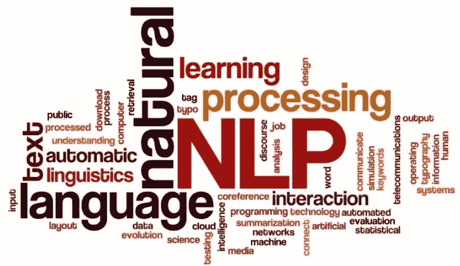
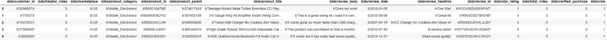
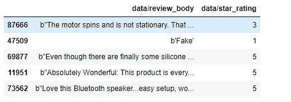
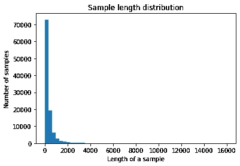
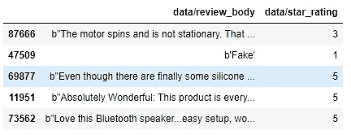
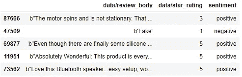
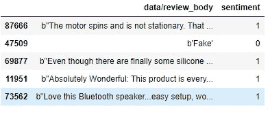
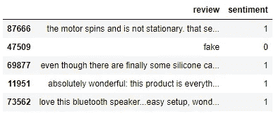
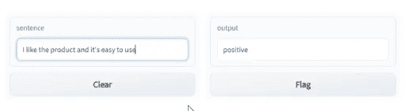

# 构建端到端的 NLP 应用——初学者友好指南

> 原文：<https://medium.com/mlearning-ai/building-an-end-to-end-nlp-application-an-overview-ef0221c4ab1f?source=collection_archive---------1----------------------->



Credit: Alamy

自然语言处理是语言学、计算机科学和机器学习的交叉领域。NLP 的主要目标是让计算机像人类一样理解语言并产生反应。NLP 的主要类别如下:

*   **语音识别**处理口语的识别及其相应的文本翻译。
*   **自然语言理解**其中计算机被训练理解人类语言。
*   **自然语言生成**，那里的计算机有望生成人类语言。

使用 NLP 可以构建各种各样的应用程序。在这篇博客中，我们将看看解决文本分类问题的一般步骤。所解决的问题是一个二元分类问题(特别是情感分析)，并让我们经历典型的机器学习(ML)生命周期的所有阶段。

*   **问题:**情感分析(监督)
*   **使用的数据集:**亚马逊产品评论
*   **建模框架:** [张量流](https://tensorflow.org)，[拥抱面](https://huggingface.co)变形金刚
*   **Demo:** [Gradio](https://gradio.app)

```
# Set the session to use GPU
import tensorflow as tf
import os
num_gpus_available = len(tf.config.experimental.list_physical_devices('GPU'))
print("Num GPUs Available: ", num_gpus_available)
assert num_gpus_available > 0

sess = tf.compat.v1.Session(config=tf.compat.v1.ConfigProto(log_device_placement=True))
os.environ["CUDA_VISIBLE_DEVICES"]='0'# Install necessary libraries
!pip install gradio
!pip install transformers
!pip install tensorflow_datasets
```

## 机器学习工作流

以下是构建任何典型的 ML 解决方案所涉及的阶段，

*   第一阶段:收集数据
*   **第二阶段:**探索数据
*   **阶段 2.5:** 选择型号
*   第三阶段:准备数据
*   第四阶段:建立、训练和评估模型
*   **阶段 5:** 细化模型
*   **阶段 6:** 部署模型

## 阶段 1:收集数据

这是解决任何有监督的 ML 问题的最重要的一步。记住，模型和你的数据一样好。对于您试图解决的问题，有时，数据可能是可用的，但在大多数真实世界的场景中，数据并不容易获得。在这种情况下，收集数据时需要记住以下几点，

*   检查是否有公共 API 可以获取数据。了解限制、定价、尝试次数等。API 的。
*   数据越多，模型就越好。
*   确保每个目标类都有足够的样本。
*   样本应该充分涵盖你的问题的可能输入空间。

```
import pandas as pd
import numpy as np
import tensorflow_datasets as tfds
import matplotlib.pyplot as plt# Load the tensorflow dataset
dataset = tfds.load('amazon_us_reviews/Mobile_Electronics_v1_00', split='train', shuffle_files=True)
```

## 阶段 2:探索数据

在尝试建立模型之前，必须了解手头的数据。了解数据的特征不仅有助于为我们试图解决的问题选择正确的建模技术，还有助于用高质量的数据构建更好的模型。

总是检查一些随机的数据样本，并获取一些关键指标，

*   可用样本总数
*   类别/目标的数量
*   每类可用样本总数
*   每个样本的字数
*   词的频率分布
*   样本长度分布

```
# Convert the dataset to pandas dataframe
dataset = tfds.as_dataframe(dataset)
dataset.head()
```



```
# Pick the relevant columns of interest
columns_of_interest = ['data/review_body', 'data/star_rating']
data = dataset[columns_of_interest]
data.head()
```



```
# Get the number of samples
print("Total number of datapoints:", data.shape[0])
```

`Total number of datapoints: 104975`

```
# Get the number of class (we will convert this the rating to sentiment in the next stage)
print("Number of classes:", data['data/star_rating'].nunique())
```

`Number of classes: 5`

```
# Get the number of samples per class
print("Number of samples per class: \n" ,data['data/star_rating'].value_counts())
```

`Number of samples per class:
5 52255
4 18088
1 17587
3 9734
2 7311
Name: data/star_rating, dtype: int64`

```
# Get the number of words per sample
print("Number of words per sample: " ,np.mean(data['data/review_body'].apply(lambda x: len(x.split()))))
```

`Number of words per sample: 63.97938556799238`

```
# Get the distribution of number of words per sample
print("Distribution of number of words per sample:")
pd.DataFrame([len(s) for s in data['data/review_body']]).value_counts()
```

`Distribution of number of words per sample:
9 550
114 534
115 523
113 522
119 518
...
2724 1
2729 1
2731 1
2732 1
16009 1
Length: 3079, dtype: int64`

```
# Plot the distribution of of sample length
def plot_sample_length_distribution(sample_texts):
    """Plots the sample length distribution.

    # Arguments
        samples_texts: list, sample texts.
    """

    plt.hist([len(s) for s in sample_texts], 50)
    plt.xlabel('Length of a sample')
    plt.ylabel('Number of samples')
    plt.title('Sample length distribution')
    plt.show()

plot_sample_length_distribution(data['data/review_body'].tolist())
```



## 阶段 2.5:选择模型

我们在前一阶段执行的数据探索有助于我们回答以下问题，

*   **选哪个型号？** —如果数据较少，并且我们对每个类别都有足够的表示，那么使用简单的 MLP 或 ML 模型就足够了。如果您有足够的数据，并且该领域没有预先训练的模型，您可以从头开始训练序列模型。如果您在某个特定领域找到了预先训练好的模型，并希望将其应用到具有足够数据的类似领域数据中，请选择迁移学习。
*   **我们如何高效地准备数据？** —根据我们选择的模型，预处理的类型会发生变化。如果我们选择一个简单的 MLP 或 ML 模型，我们在适当的预处理后使用单词包执行矢量化。对于序列模型，我们可能需要保留数据的上下文，所以我们将使用 word2vec、句子嵌入等嵌入。

## 阶段 3:准备数据

数据应该被转换成模型能够理解的形式。数据准备包括两个步骤，

1.  **特征工程:**特征工程包括从文本数据中创建或提取特征，以便将其输入模型。在提取特征时需要完成两个步骤，

*   **标记化:**将文本转换成更小的单元，如单词(标记)或 n 元语法。基于唯一标记，将创建一个字典，该字典形成给定数据集的词汇表。
*   **矢量化:**使用词汇表将文本数据转换成数字。用于向量化的一些常见技术是一键编码(基于标记的存在与否)、计数编码(基于标记出现的次数)和 Tf-idf 编码(基于分配给标记在文档中出现的频率的权重)。

**2。特征选择:**一旦创建了特征，我们可以通过一些统计测量使用特征重要性仔细选择相关的特征。在数量和质量方面使用正确的特性将有助于构建更好的模型。

## 需要记住的要点:

*   始终确保数据被混洗和采样。
*   将数据分为训练、测试和验证部分。
*   将训练数据矢量化后保存矢量化工具，并使用它来转换测试数据。

```
# Take a sample of 50% of the dataset for the purpose of demonstration
data = data.sample(frac=0.3, random_state=42)
data.head()
```



```
print("Number of datapoints after sampling:", data.shape)
```

`Number of datapoints after sampling: (31492, 2)`

```
# Convert the star rating to sentiment
data['sentiment'] = data['data/star_rating'].apply(lambda rating: "positive" if rating >= 3 else "negative")
data.head()
```



```
# One-hot encode the target label
data['sentiment'] = data['sentiment'].map({'positive':1, 'negative':0})

# Drop the rating column
data.drop(columns=['data/star_rating'], inplace=True)
data.head()
```



```
# Preprocess the reviews
data.rename(columns={'data/review_body': 'review'}, inplace=True)
data['review'] = data['review'].str.decode('utf-8')
data['review'] = data["review"].apply(str.lower)
data['review']

data.head()
```



```
# Check the samples per class
data['sentiment'].value_counts()
```

`1 24067
0 7425
Name: sentiment, dtype: int64`

```
# Balance out the classes for the purpose of demonstration
positive = data[data['sentiment'] == 1].sample(n=7425, random_state=42)
negative = data[data['sentiment'] == 0]
train_data = pd.concat([positive, negative]).sample(frac=1).reset_index(drop=True)
train_data['sentiment'].value_counts()
```

`0 7425
1 7425
Name: sentiment, dtype: int64`

```
# Sample reviews and its corresponding labels
reviews = train_data['review'].tolist()
labels = train_data['sentiment'].tolist()

print("Sample reviews:")
print(reviews[10:16])
print("Corresponding labels:")
print(labels[10:16])
```

`Sample reviews:
['does not work, waste of my money, what more can i say...requiring more words it ridiculous...four more words then and', "i ordered a black case as well as a pink. nicely packaged, but the black came very dirty and i noticed it was prone to get a lot of noticeable dust/dirt on it even if it's just sitting on my counter. the &#34;flaps&#34; covering the camera, headphone jack, and charging area are very weak and look like they could be easily broken. however, the case is water resistant and it is definitely shockproof. i drop tested this on concrete and my ipod was perfectly fine, so that's where the forth star comes in. my only real problem with this is the weak flaps and the dust, but the appearance can be fixed by just getting a lighter color.", 'great price, hits hard, clean sound. my only issue with it was when i removed one of the rca cables it pulled the grounding collar off the amp. no big deal, easy work around but i dont think that should have happened. i would buy this amp again.', 'nice', "i expected it to be bad, i mean it's 20$. the only reason i wouldn't buy it again is because it doesn't use 3.5mm jack.", 'this looked to be a nice skin but it in no way fits my ultrahd flip. it is huge, not fitted, sloppy and moves around, covers parts of lens. not something i would recommend to anyone.']
Corresponding labels:
[0, 1, 1, 1, 0, 0]`

```
# Split the data into train, test and vvalidation split
from sklearn.model_selection import train_test_split
X_train, X_test, y_train, y_test  = train_test_split(reviews, labels, test_size=.2, random_state=42)# Number of train and test data
print("Number of train data points:", len(X_train))
print("Number of train labels:", len(y_train))
print("Number of test data points:", len(X_test))
print("Number of test labels:", len(y_test))
```

`Number of train data points: 11880
Number of train labels: 11880
Number of test data points: 2970
Number of test labels: 2970`

```
# Load the tokenizer
from transformers import DistilBertTokenizerFast
MODEL_NAME = 'distilbert-base-uncased-finetuned-sst-2-english'
tokenizer = DistilBertTokenizerFast.from_pretrained(MODEL_NAME)# Sample tokenization
print("Sentence:" , X_train[0])
tokenizer(X_train[0], truncation=True, padding=True, max_length=256, return_tensors="tf")
```

`Sentence: unit sounds okay when it works but, unfortunately, it mutes itself every time and then cuts in and out whether on bluetooth or aux cable. this is regardless of which computer i connect it to, how close the speaker is to the unit, etc. noticing that other reviewers have the same problem. maybe some units are defective. if it didn't have that problem, i would have probably given it 5 stars. haven't begun the return process (will do later today), so can't comment on the customer service quality yet.

{'input_ids': <tf.Tensor: shape=(1, 113), dtype=int32, numpy=
array([[ 101, 3131, 4165, 3100, 2043, 2009, 2573, 2021, 1010,
6854, 1010, 2009, 20101, 2015, 2993, 2296, 2051, 1998,
2059, 7659, 1999, 1998, 2041, 3251, 2006, 2630, 19392,
2030, 19554, 5830, 1012, 2023, 2003, 7539, 1997, 2029,
3274, 1045, 7532, 2009, 2000, 1010, 2129, 2485, 1996,
5882, 2003, 2000, 1996, 3131, 1010, 4385, 1012, 15103,
2008, 2060, 15814, 2031, 1996, 2168, 3291, 1012, 2672,
2070, 3197, 2024, 28829, 1012, 2065, 2009, 2134, 1005,
1056, 2031, 2008, 3291, 1010, 1045, 2052, 2031, 2763,
2445, 2009, 1019, 3340, 1012, 4033, 1005, 1056, 5625,
1996, 2709, 2832, 1006, 2097, 2079, 2101, 2651, 1007,
1010, 2061, 2064, 1005, 1056, 7615, 2006, 1996, 8013,
2326, 3737, 2664, 1012, 102]], dtype=int32)>, 'attention_mask': <tf.Tensor: shape=(1, 113), dtype=int32, numpy=
array([[1, 1, 1, 1, 1, 1, 1, 1, 1, 1, 1, 1, 1, 1, 1, 1, 1, 1, 1, 1, 1, 1,
1, 1, 1, 1, 1, 1, 1, 1, 1, 1, 1, 1, 1, 1, 1, 1, 1, 1, 1, 1, 1, 1,
1, 1, 1, 1, 1, 1, 1, 1, 1, 1, 1, 1, 1, 1, 1, 1, 1, 1, 1, 1, 1, 1,
1, 1, 1, 1, 1, 1, 1, 1, 1, 1, 1, 1, 1, 1, 1, 1, 1, 1, 1, 1, 1, 1,
1, 1, 1, 1, 1, 1, 1, 1, 1, 1, 1, 1, 1, 1, 1, 1, 1, 1, 1, 1, 1, 1,
1, 1, 1]], dtype=int32)>}`

```
# Perform tokenization
MAX_LENGTH=256
train_encodings = tokenizer(X_train,
                            truncation=True, 
                            padding=True,
                            return_tensors="tf",
                            max_length=MAX_LENGTH)
test_encodings = tokenizer(X_test,
                           truncation=True, 
                           padding=True,
                           return_tensors="tf",
                           max_length=MAX_LENGTH)# Convert the tokenizer to TF object
train_dataset = tf.data.Dataset.from_tensor_slices((dict(train_encodings),
                                                    y_train))
test_dataset = tf.data.Dataset.from_tensor_slices((dict(test_encodings),
                                                   y_test))
```

## 阶段 4:构建、训练和评估模型

为了演示的目的，迁移学习被用于为手头的情感分析任务建立模型。我们将使用在 SST-2(斯坦福情感树库 v2)数据集上微调的预训练蒸馏模型。关于该模型的更多细节可以在这里找到:[https://hugging face . co/distil Bert-base-un cased-fine tuned-SST-2-English](https://huggingface.co/distilbert-base-uncased-finetuned-sst-2-english)

在我们构建任何模型之前，需要考虑以下关键参数，

*   **指标:**我们如何衡量模型的性能？正确的衡量标准应该是什么？—这里可以使用精度。
*   **损失函数:**是训练时学习到的目标函数。一个好的模型应该总是试图最小化损失函数。对于分类问题，交叉熵损失可以用作目标或损失函数。
*   **优化器:**根据损失函数的输出决定如何更新网络权重的函数。

```
# Define the model - use pretrained distilbert model and specify the label
from transformers import TFDistilBertForSequenceClassification
model = TFDistilBertForSequenceClassification.from_pretrained(
    pretrained_model_name_or_path=MODEL_NAME,
    num_labels=2
    )
```

`Some layers from the model checkpoint at distilbert-base-uncased-finetuned-sst-2-english were not used when initializing TFDistilBertForSequenceClassification: ['dropout_19']
- This IS expected if you are initializing TFDistilBertForSequenceClassification from the checkpoint of a model trained on another task or with another architecture (e.g. initializing a BertForSequenceClassification model from a BertForPreTraining model).
- This IS NOT expected if you are initializing TFDistilBertForSequenceClassification from the checkpoint of a model that you expect to be exactly identical (initializing a BertForSequenceClassification model from a BertForSequenceClassification model).
Some layers of TFDistilBertForSequenceClassification were not initialized from the model checkpoint at distilbert-base-uncased-finetuned-sst-2-english and are newly initialized: ['dropout_219']
You should probably TRAIN this model on a down-stream task to be able to use it for predictions and inference.`

```
# Specify the model optimizer
optimizer = tf.keras.optimizers.Adam(
            learning_rate=5e-5, 
        )# Specify the loss function
loss_func = tf.keras.losses.SparseCategoricalCrossentropy(from_logits=True)# Compile the model

model.compile(optimizer=optimizer, loss=loss_func, metrics=['accuracy'])# Inspect the model
model.summary()
```

`Model: "tf_distil_bert_for_sequence_classification_10"
_________________________________________________________________
Layer (type) Output Shape Param #
=================================================================
distilbert (TFDistilBertMai multiple 66362880
nLayer)
pre_classifier (Dense) multiple 590592
classifier (Dense) multiple 1538
dropout_219 (Dropout) multiple 0
=================================================================
Total params: 66,955,010
Trainable params: 66,955,010
Non-trainable params: 0
_________________________________________________________________`

```
# Define hyperparameters
BATCH_SIZE = 16
NUM_EPOCHS = 2

# Train the model
model.fit(train_dataset.shuffle(len(X_train)).batch(BATCH_SIZE),
          epochs=NUM_EPOCHS,
          batch_size=BATCH_SIZE,
          validation_data=test_dataset.shuffle(len(X_test)).batch(BATCH_SIZE)
          )
```

`Epoch 1/2
743/743 [==============================] - 338s 444ms/step - loss: 0.2718 - accuracy: 0.8890 - val_loss: 0.2726 - val_accuracy: 0.8855
Epoch 2/2
743/743 [==============================] - 330s 445ms/step - loss: 0.1659 - accuracy: 0.9385 - val_loss: 0.2430 - val_accuracy: 0.9077
<keras.callbacks.History at 0x7fd95c251210>`

```
# Save the model
model.save_pretrained("/tmp/sentiment_model")# Preprocess the unseen data
unseen_data = data.sample(frac=0.05, random_state=42)
unseen_reviews = unseen_data['review'].tolist()

unseen_encodings = tokenizer(unseen_reviews,
                            padding=True,
                            truncation=True,
                            max_length=MAX_LENGTH,
                            return_tensors="tf")

y_unseen = unseen_data['sentiment'].tolist()

unseen_encodings = tf.data.Dataset.from_tensor_slices((dict(unseen_encodings),
                                                       y_unseen
                                                      ))# Evaluate the model
model.evaluate(unseen_encodings.shuffle(len(unseen_reviews))
               .batch(BATCH_SIZE),
               return_dict=True,
               batch_size=BATCH_SIZE)
```

`99/99 [==============================] - 14s 139ms/step - loss: 0.1880 - accuracy: 0.9371
{'accuracy': 0.9371428489685059, 'loss': 0.18796877562999725}`

## 阶段 5:优化模型

一旦模型被构建和训练，结果有时可能不令人满意(我们可能无法从模型中获得预期的性能)。模型可能过拟合或欠拟合，这取决于几个因素。为了改进模型，我们可以进行超参数调整。一些超参数如下，

*   模型中的层数(隐藏层)-层数太多会导致过度拟合，层数太少会导致拟合不足。
*   每个图层的单位数-输入图层应与输入大小相匹配，隐藏图层中的单位数可根据您希望如何表示数据来决定。
*   辍学率——惩罚模型过度拟合。
*   学习率—网络收敛到最优权重值的速度。

您可以尝试超参数的不同配置，看看哪种配置最适合您的模型。

## 阶段 6:部署模型

部署模型有几种选择。您还可以使用量化方法优化训练模型，以便将其部署在资源受限的环境中。一些可用的选项是，

1.  [张量流发球](https://www.tensorflow.org/tfx/guide/serving)
2.  [Pytorch 闪电](https://pytorch-lightning.readthedocs.io/en/stable/common/production_inference.html)
3.  转换成 [ONNX](https://onnx.ai/) 格式并选择你所选择的框架
4.  使用任何 REST API 框架，如 [FastAPI](https://fastapi.tiangolo.com/) 或 [Flask with Gunicorn](https://dev.to/brandonwallace/deploy-flask-the-easy-way-with-gunicorn-and-nginx-jgc) 对您的模型进行对接和部署

你的工作不会就此结束！！

*   在生产过程中，您必须监控模型的任何性能下降和漂移(模型或数据)。定期检查。
*   通过反馈在模型生产过程中收集更多数据。
*   如果您发现模型正在退化，那么您将不得不使用从反馈中收集的数据来重新训练您的模型。

为了演示的目的，让我们看看如何使用 notebook 作为一个界面来使用 Gradio 获得预测。以下代码将在笔记本中启动一个 Gradio 应用程序。

```
import gradio as gr

def predict(sentence):
    # Load model
    loaded_model = TFDistilBertForSequenceClassification.from_pretrained("/tmp/sentiment_model")

    # Get the prediction
    predict_input = tokenizer.encode(sentence,
                                 truncation=True,
                                 padding=True,
                                 return_tensors="tf")

    tf_output = loaded_model.predict(predict_input)[0]
    tf_prediction = tf.nn.softmax(tf_output, axis=1).numpy()[0]
    return ['negative', 'positive'][np.argmax(tf_prediction)]

demo = gr.Interface(fn=predict, inputs="text", outputs="text",live=True)

demo.launch()Colab notebook detected. To show errors in colab notebook, set `debug=True` in `launch()`
Running on public URL: https://17805.gradio.app

This share link expires in 72 hours. For free permanent hosting, check out Spaces (https://huggingface.co/spaces)
```



笔记本可以从[这里](https://github.com/AbinayaM02/WiDS_Mysuru_2022/blob/main/building-an-end-to-end-nlp-application.ipynb)下载。

*   * *注:整个例子是参照* [*文本分类指南*](https://developers.google.com/machine-learning/guides/text-classification) *构建的。请仔细阅读指南，了解更多关于文本分类的详细信息。祝阅读愉快，并请分享您的反馈！*

[](/mlearning-ai/mlearning-ai-submission-suggestions-b51e2b130bfb) [## Mlearning.ai 提交建议

### 如何成为 Mlearning.ai 上的作家

medium.com](/mlearning-ai/mlearning-ai-submission-suggestions-b51e2b130bfb)