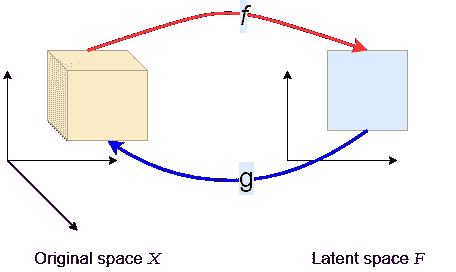
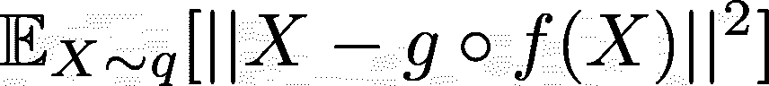
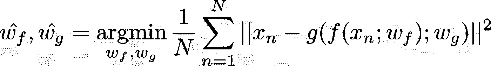
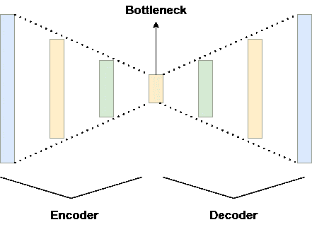

# 构建图像彩色化神经网络第 1 部分:生成模型和自动编码器

> 原文：<https://medium.com/mlearning-ai/building-an-image-colorization-neural-network-part-1-generative-models-and-autoencoders-d68f5769d484?source=collection_archive---------4----------------------->

Source: [https://github.com/PacktPublishing/Advanced-Deep-Learning-with-Keras/blob/master/chapter3-autoencoders](https://github.com/PacktPublishing/Advanced-Deep-Learning-with-Keras/blob/master/chapter3-autoencoders)

在我的人工智能研究生学习期间，我有机会非常详细地研究人工神经网络。其中一项作业是基于卷积神经网络的，我可以自由选择问题，然后提供解决方案。我过去，现在仍然对生成模型非常感兴趣，所以我选择了图像着色任务。在图像彩色化中，目标是建立一个能够将真实颜色应用于黑色和灰色图像的模型。在本文中，我将指导您创建一个生成模型的过程，该模型利用卷积神经网络对图像进行着色。

在我们开始描述实现之前，我们需要为它打下基础。因此，我们将该流程分为以下 4 个部分:

1.  **第 1 部分(当前)**:概述生成模型和*自动编码器*的基础知识。
2.  [**第二部分**](/mlearning-ai/building-an-image-colorization-neural-network-part-2-artificial-neural-networks-ac591eb180) :展示人工*神经网络*的基本概念。
3.  [**第三部分**](/mlearning-ai/building-an-image-colorization-neural-network-part-3-convolutional-neural-networks-21a45ef42dde) :介绍*卷积神经网络*的基础知识。
4.  [**第四部分**](/@geokam/building-an-image-colorization-neural-network-part-4-implementation-7e8bb74616c) :描述实际模型的实现。

> 声明:这绝不是一个教程。它提供了一些基本知识，但主要目标是展示如何构建这样一个模型。

# 生成模型

首先，让我们确保对一个模型什么时候被贴上*创成式*的标签有一个很好的理解。实际上，有两种不同类型的模型:*生成型*和*鉴别型*。辨别模型被认为是为了成功地辨别不同种类的数据样本。最常见的判别场景是二进制分类，其中每个数据样本都有一个属于两个不同类别之一的目标值。如果图像包含一只猫或一只狗，分类是一个基本的例子。然而，判别模型也可以区分两个以上的类别。根据前面的例子，如果图像包含一只猫或一只狗或一个人或任何你喜欢的东西，或者甚至是这些的组合(多标签分类)，分类也被认为是一个辨别任务。放入更正式的，一个判别模型捕捉到了条件概率 *P(Y|X)* ，可以翻译为“当已知 *X* (特征)时， *Y* (目标值)的概率是多少”。

相反，生成式模型试图生成新的数据实例。例如，基于书面提示生成图像的模型(如 DALL E)或在提供全文时生成摘要的模型(如 GPT-3)是生成模型的两个流行案例。基本上，这种模型可以根据提示创建“新”数据，当然，也可以根据它们在训练期间看到的所有数据创建“新”数据。更官方的定义是，生成模型捕获联合概率 *P(X，Y)* ，其中 *X* 是输入提示，或者在没有标签的情况下 *P(X)* 。该模型尝试学习实际数据的分布，以便“很好地”理解训练数据集是如何生成的。

有许多类型的生成模型，例如*生成对抗网络*，也称为*甘斯*，以及*变分自动编码器*等等。在图像着色任务中，我选择基于简单的*自动编码器*方法建立一个生成模型。

# 自动编码器

自动编码器的基本原理是它们由两个不同的部分组成:编码器和解码器。编码器接收输入并将其转换到一个新的空间，称为潜在空间，而解码器获得这个新的表示并将其转换回原始空间。用数学的方式来表达，编码器 *f* 将数据从空间 *X* 转换到空间 *F* ，解码器 *g* 将数据从空间 *F* 转换到空间 *X* 。

Illustration of the transformation of an Autoencoder

通常，与输入相比，潜在空间具有较低的维度，因此编码器执行维度缩减。通过这个过程，自动编码器被迫保留来自初始空间的最有价值的信息，并因此捕获必要的依赖性。但是我们如何衡量自动编码器的性能呢？一种方法是通过计算二次损失。如果 *q* 是在 *X* 上的数据分布，我们需要最小化以下项:

Reconstruction error of the Autoencoder

更具体地说，如果映射 f 和 g 具有可训练的权重，那么我们需要最小化以下损失:

# 深度自动编码器

为了解决图像着色问题，我们必须调整自动编码器，以利用*神经网络*，因为*卷积神经网络*在计算机视觉任务上工作得非常好。结果是*深度自动编码器*，其中编码器和解码器都是独立的*卷积神经网络*。编码器接收输入图像，并将其通过一系列转置卷积层。在这个过程中，输入变得越来越小，直到我们到达最终的转置层。在这个阶段，图像已经被转换到一个较低维度的空间。另一方面，解码器获得压缩的输入，并通过连续的卷积层重建初始输入。如果训练集足够大，自动编码器可以通过从潜在空间中选择数据点来学习生成新的实例。

Deep Autoencoder with multiple layers.

而在输入提示为黑灰图像的图像彩色化问题中，我们并不想严格的再造，而是在某种意义上增强。图像具有(通道、宽度、高度)的形状。输入图像只包含一个通道，但是它们的彩色版本包含三个通道:红色、绿色和蓝色。因此，自动编码器被认为总共产生 2 个通道。为了简化这一点，我们可以利用 *LAB* 格式，而不是使用 *RGB* 格式，其中 L 表示亮度，a 表示绿色和品红色之间的平衡，b 表示蓝色和黄色之间的平衡。虽然 *LAB* 使用相同数量的元素来说明一个像素，但 L 部分本质上是我们的输入图像。换句话说，通过使用 *LAB* 格式，考虑到第三个通道 L 将来自输入，自动编码器将仅生成 2 个通道 a 和 b。

本系列的第一部分到此结束。下一集，我们将看看*人工神经网络*。敬请期待！

 [## Mlearning.ai 提交建议

### 如何成为 Mlearning.ai 上的作家

medium.com](/mlearning-ai/mlearning-ai-submission-suggestions-b51e2b130bfb)