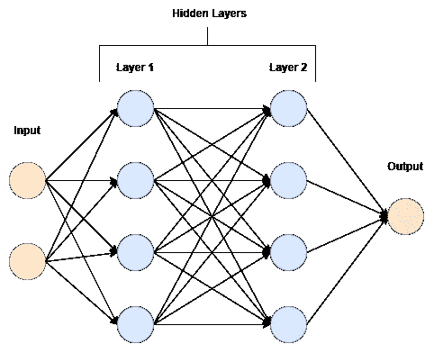
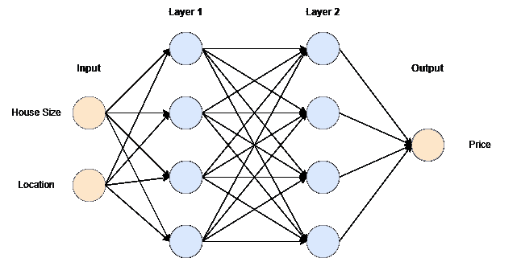
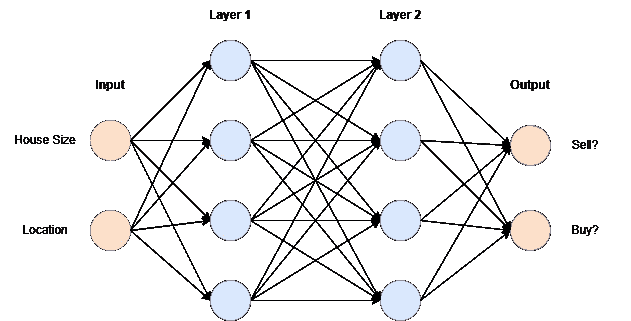
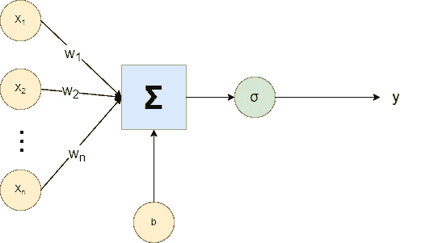

# 构建图像彩色化神经网络第 2 部分:人工神经网络

> 原文：<https://medium.com/mlearning-ai/building-an-image-colorization-neural-network-part-2-artificial-neural-networks-ac591eb180?source=collection_archive---------7----------------------->

欢迎回到本系列的第二部分，在这里我们试图建立一个能够将真实颜色应用于黑色和灰色图像的神经网络。如果您还没有检查我们描述了什么是创成式模型和自动编码器的[第一部分](/mlearning-ai/building-an-image-colorization-neural-network-part-1-generative-models-and-autoencoders-d68f5769d484)，请务必在阅读当前部分之前通读一遍。然而，如果你对生成模型和自动编码器有信心，那就继续读下去吧。

整个系列由以下 4 部分组成:

1.  [**第一部分**](/mlearning-ai/building-an-image-colorization-neural-network-part-1-generative-models-and-autoencoders-d68f5769d484) :概述生成模型和*自动编码器*的基础知识。
2.  **第 2 部分(当前)**:展示人工*神经网络*的基本概念。
3.  [**第三部分**](/mlearning-ai/building-an-image-colorization-neural-network-part-3-convolutional-neural-networks-21a45ef42dde) :介绍*卷积神经网络*的基础知识。
4.  [**第四部分**](/@geokam/building-an-image-colorization-neural-network-part-4-implementation-7e8bb74616c) :描述实际模型的实现。

> 声明:这绝不是一个教程。它提供了一些基本知识，但主要目标是展示如何构建这样一个模型。

# 人工神经网络

在前一篇文章中，我们已经提到我们的自动编码器将由两个独立的人工神经网络组成。但是，什么是人工神经网络或人工神经网络？在人工智能中，神经网络试图模仿生物神经网络的功能。这就是为什么人工神经网络是由模拟人脑中真实神经元的人工神经元组成的。每个人工神经元都可以通过称为突触的连接或链接与其他神经元相连。就像在我们的大脑中，一个神经元可以向其他神经元发送任意强度的信号。当信号足够强时，接收神经元被激活，并依次向下一个神经元发送新信号。下面是一个直观的例子，圆圈是节点，边是突触。

Basic layout of an Artificial Neural Network

请注意，神经元被分成不同的层，也称为隐藏层，信息从左向右流动。输入图层始终是数据集的要素，输出图层是提供问题最终答案的图层。在回归任务中，输出层通常只有一个节点，这基本上就是答案。在分类任务中，输出层通常具有与可用类别一样多的节点，其中每个神经元的输出显示给定样本属于给定类别的程度。这两种情况都可以在下图中描述。

Regression: predicting house prices based on size and location

Classification: predicting whether a house, given its size and location, is more profitable to sell or buy

我们如何测量信号的强度？要做到这一点，我们需要了解每个神经元都有自己的突触，每个突触都有权重和偏好。为了计算输入信号的强度，必须将输入信号乘以相应的权重，然后求和。此外，对于每个总和，我们需要加上偏差 *b* 。然而，我们还没有完成。这个值需要通过一个叫做*激活函数*的附加函数。激活函数负责确定信号是否将向前传播以及以何种强度传播。换句话说，每一个神经元或每一层都必须具有激活功能。下图展示了单个神经元的详细视图:

Single neuron with weights w1,… wn, bias b and activation function σ

正式地说，神经元的输出如下:

好吧，但是我们怎么用神经网络来解决问题呢？首先，我们必须确定网络架构。即有多少层，每层有多少个节点，应该使用什么激活函数。问题的本质通常可以给我们一些指引，但没有防弹的解决方案。事实上，人工智能中有一整个领域叫做*神经架构搜索*，或 NAS，试图处理这个问题。之后，我们需要以某种方式初始化*中的所有权重和偏差*(有一些非常复杂的方法可以做到这一点，但它们超出了本系列的范围)，将特征馈送到第一层，并在输出层等待答案。

这个过程被称为前馈传递。在训练过程中，我们以这种方式传递数据集的每个样本，并得到一个答案。最初，这个答案与期望的相差甚远，因此我们必须找到一种方法来计算误差，并以某种方式修复网络，以便更好地预测下一个样本。为了测量误差，我们必须选择一个度量，例如用于回归的*均方误差*或用于分类的*交叉熵*等等。这些是*损失函数*，可以直接指示神经网络的准确性。

好了，我们已经通过了特征，得到了答案，计算了损失。怎么才能训练出模型？为了训练模型，我们需要固定网络的权重，使其在手头的任务中更加准确。这是通过反向传播算法实现的。该算法将损耗相对于输出层的导数作为输入，并将结果向后传播，以便在损耗最小化的方向(梯度)上调整权重。测量损耗导数以定位最小值的最流行算法是梯度下降法，其中我们必须在更新网络参数之前遍历所有样本。在我们将整个数据集输入神经网络之后，我们说一个时期已经完成。普通*梯度下降*的问题是需要很多时间收敛到最优解。这可以用*随机梯度下降*绕过，它在每个样本后更新参数。最后，通过*小批量梯度下降*，可以两全其美，在一批样品通过网络后更新参数。

如果整体架构是适当的，并且特征被适当地设计，在一些时期之后，神经网络可以足够精确，并且我们可以有一个模型来提供给定问题的解决方案。这就是人工神经网络的工作原理！同样，这是对人工神经网络的一个非常基本的介绍，它将使你理解下面的部分。

所以，现在就这样吧！在下一部分，我们将看看卷积神经网络。敬请期待！

 [## Mlearning.ai 提交建议

### 如何成为 Mlearning.ai 上的作家

medium.com](/mlearning-ai/mlearning-ai-submission-suggestions-b51e2b130bfb)